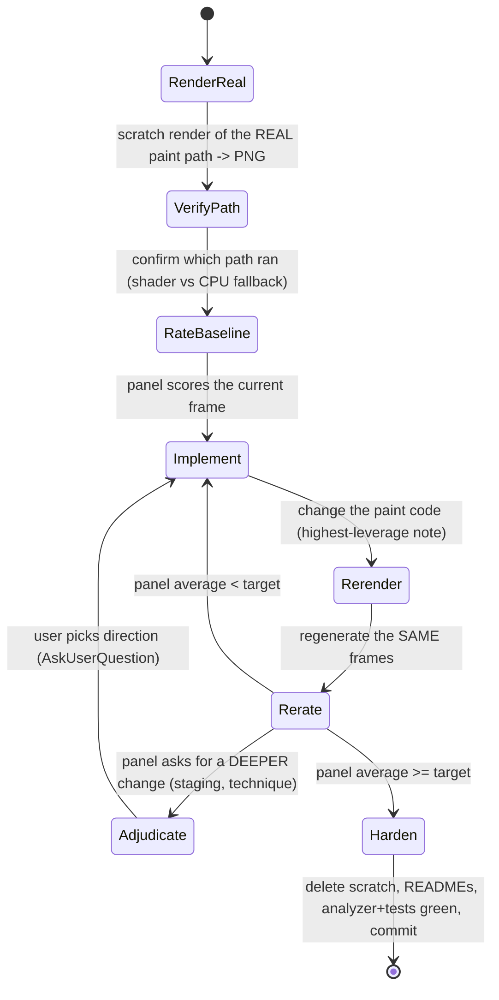

# Cinematic Render Panel

A grounded loop for polishing **rendered art** — a `CustomPainter` scene, a
character/lighting look, a layered backdrop — to a numeric cinematography target.
It is the art-world sibling of `design-review-panel`: same fan-out-and-score
mechanics, different rules.

| | `design-review-panel` | `cinematic-render-panel` |
|---|---|---|
| Subject | UI surface (screen/modal) | rendered art (scene/character/lighting) |
| Grounding | `app-screenshots` (app shell) | scratch render of the real paint path |
| Lenses | hierarchy, design-system, type | DoP, gaffer, colorist, art director, genre |
| Palette rule | design-system tokens ONLY | **raw artistic palettes allowed** (tokens are wrong here) |

The numeric target is the success condition — keep iterating until the panel
average clears the bar.

## The loop



## 1. Render the REAL paint path

The cardinal rule, learned the hard way: **judge what actually ships, never a
hardcoded stand-in.** A blob at the right position is not the cat; a fixed
`Offset(0.5, 0.8)` is not the tracked dancer foot. Build the scratch render from
the production widget composition and feed it live data through the real seams.

Write a throwaway `test/_scratch_<thing>_test.dart` (the `_scratch_` prefix marks
it disposable — **it is NEVER committed**). Render the production widget /
painters and capture via `RepaintBoundary.toImage` **inside `tester.runAsync`** so
disk images, decoded assets and `FragmentProgram.fromAsset` shaders actually
resolve before the grab.

> **Dancing-cats scene: render the generalized live path, do NOT rebuild it.**
> The production composite is the `DanceStageView` widget
> (`lib/features/character/demo/dance_stage_view.dart`) — the same one the live
> player renders. Your `tree(t)` must wrap a `DanceStageView`, driven by a real
> `DancePerformance` (`DancePerformance.fromBeatMapJson`) and a
> `DancePlaybackStepper` you `advance(perf, cues, t, dt)` per frame (preroll a
> couple of seconds first so the camera settles). Do **not** hand-assemble a
> `Stack` of `LayeredBackdrop` + `StageLightsOverlay` + `CharacterPainter` — that
> is a reconstruction that drifts from the app. The gel rig, backlights, body
> grade, haze and cast scale all live inside `DanceStageView`; passing your own
> copies is exactly the bug this refactor removed. (The offline canvas
> `DanceFrameComposer` is the fast batch path; for a faithful still, pump
> `DanceStageView` as below.)

```dart
await tester.runAsync(() async {
  final key = GlobalKey();
  Future<void> frame(String name, double t) async {
    // Pump repeatedly at this t so async loads resolve AND any follow/ease
    // converges toward the real published anchors before capture.
    for (var i = 0; i < 60; i++) {
      await tester.pumpWidget(tree(t));               // the REAL widget tree
      await Future<void>.delayed(const Duration(milliseconds: 6));
    }
    final boundary =
        key.currentContext!.findRenderObject()! as RenderRepaintBoundary;
    final img = await boundary.toImage();
    final png = await img.toByteData(format: ui.ImageByteFormat.png);
    File('$scratchDir/$name').writeAsBytesSync(png!.buffer.asUint8List());
    img.dispose();
  }
  await frame('real_a.png', 0.3);
  await frame('real_b.png', 1.1);
});
```

- Render at ≥2 times so beat-snapped colours / phases / formations differ.
- Publish live state through the production callback (e.g. `onDancerAnchors`),
  consumed one frame later exactly as the app does — do not shortcut it.
- Write PNGs to the session scratchpad, not the repo.

## 2. Verify which path actually ran (shader vs CPU fallback)

If the render has a GPU shader with a `.catchError`/CPU fallback, a `flutter
test` can **silently render the fallback** (or the shader) and you cannot tell by
looking. Confirm before you spend a panel on the wrong pixels:

- **A/B it:** render once with the real program loader and once with a
  forced-failing loader (`Future.error(...)`); compare.
- **Give each capture a UNIQUE widget key.** A `StatefulWidget` that loads its
  program in `initState` keeps `_program` across `pumpWidget`s (same tree
  position, no key) — so the second capture inherits the first's program and you
  get a **false byte-identical "match"**. A `ValueKey(loader)` forces fresh state
  per capture. (This false negative cost two review rounds once.)
- Existing `*_shaders_test.dart` that compiles via `FragmentProgram.fromAsset`
  proves shaders load in this test env at all — check it before assuming.

## 3. Run the panel

Spawn **one agent per craft lens, in parallel** (a single message with multiple
Agent calls). Each agent `Read`s the PNGs and judges only the actual pixels.
Default cinematography lenses (adapt to the subject):

- **Cinematographer (DoP)** — exposure, contrast, depth, composition, "is this a
  frame you'd put in the cut, or a tech demo?"
- **Gaffer / lighting designer** — believable light: sources, falloff, rim vs
  flood, does colour land on and separate the subject.
- **Colorist / art director** — palette cohesion, saturation, mood, grime vs
  pristine, does it read as one world.
- **Genre / domain expert** — the actual brief (music-video director, Afrobeats,
  concert planner, architectural-viz, whatever fits).

Force a crisp, comparable verdict from each:

```
SCORE: <single number 0-10, one decimal ok>     # no ranges, no hedging
TOP 3 PROBLEMS (ranked): one concrete sentence each — what's wrong and WHERE.
TOP 3 FIXES: one concrete, actionable change each.
ONE-LINE VERDICT: the single highest-leverage change toward the target.
```

- **Spawn fresh agents each round** — subagents can't be resumed once their
  transcript expires (`SendMessage` → "No transcript found").
- **Re-render the SAME frames and re-rate every round.** Never carry a score
  across rounds; grounded re-rating on fresh pixels deflates stale numbers.
- 3–5 lenses is plenty; don't burn agents re-confirming a unanimous note.

## 4. Adjudicate deeper asks with the user

The panel will eventually converge from "tune this knob" to a **deeper change**
that expands scope — restage the composition, change the technique, alter a
design premise. Those are the user's call: surface them with `AskUserQuestion`
(give a recommendation + concrete options) instead of silently grinding knobs or
unilaterally expanding scope. Cheap, in-scope fixes you just apply.

## 5. Harden once converged

- **Delete the scratch render harness.** `_scratch_*` files are never committed.
- Update the feature README(s) for the paint code you changed (architecture-first;
  diagram any real lifecycle).
- Remove any now-dead code (e.g. a shader you replaced) — do not hoard it.
- Analyzer zero-warning, formatter, targeted tests green.
- CHANGELOG only if a user actually sees it at runtime (a dev/demo surface does
  not warrant one).
- Commit with a plain message — **no Claude attribution** (no `Co-Authored-By`,
  no `Claude-Session` trailer, no "Generated with").

## Why a panel beats tuning by eye

One reviewer rationalizes; five independent lenses converge on the real blocker
and rank it. The score is a deflation check against your own optimism, and the
"highest-leverage change" line keeps each round targeting the one thing that
moves the number — not a scatter of cosmetic tweaks.

## See Also

- `scenery-art-layer-prep` for preparing generated/backdrop art into aligned
  full-frame layers before review.
- `flutter-shader-validation` for proving runtime-effect shaders compile and
  that the reviewed pixels came from the intended shader path.
- `character-motion-review-panel` when the main question is body motion,
  choreography, or animation performance rather than rendered art.
