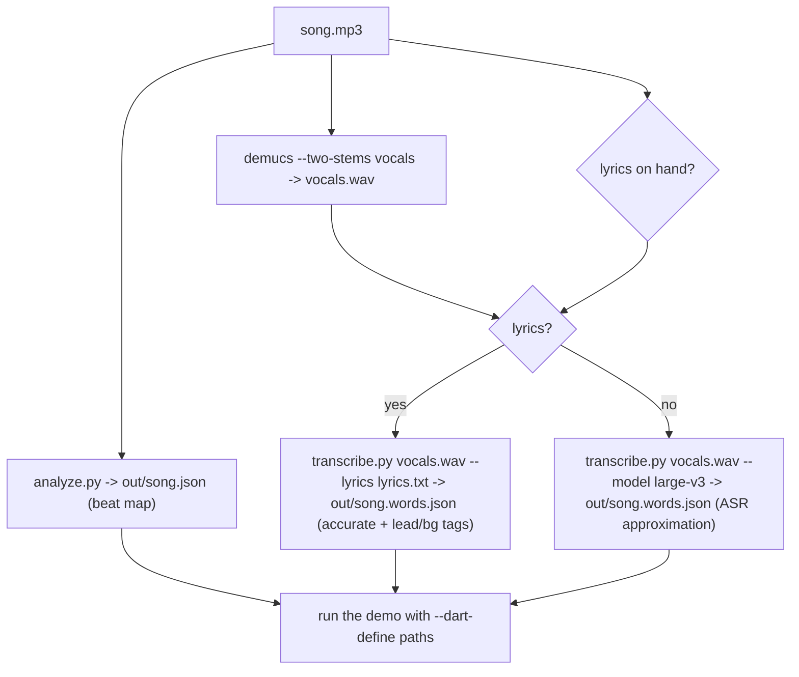

# Prepare a song for the dance demo

Offline, authoring-time pipeline that turns **a song file** into the data the
beat-synced dance demo consumes: a **beat map** (beats / downbeats / tempo /
waveform / sections) and **word-level lyric timestamps** (optionally
force-aligned to provided lyrics, with lead vs background tags). Everything is
deterministic JSON; nothing runs inside the Flutter app.

Demo it drives: `lib/features/character/demo/character_dance_to_track_demo.dart`.
Design: `docs/implementation_plans/2026-06-27_dance_audio_analysis.md`.

## Tools (all under `tools/dance_audio/`)

| Tool | Produces | Engine / license |
| --- | --- | --- |
| `analyze.py` | beat map JSON: `beats[]`, `downbeats`, `tempo`, `waveform[]`, `sections[]` | Beat This! (MIT) + librosa (ISC) |
| `transcribe.py` | word/segment timestamps JSON | WhisperX (BSD-2) |
| `transcribe.py --lyrics` | **force-aligned** provided lyrics + `voice: lead\|background` tags | WhisperX wav2vec2 alignment |
| Demucs (CLI) | a vocals-only stem (preprocess for far better transcription) | Demucs (MIT) |

### Two virtualenvs (kept separate on purpose)

- `tools/dance_audio/.venv` — beat-map stack (`analyze.py`). See `README.md`.
- `tools/dance_audio/.venv-asr` — heavy ASR/separation stack (`transcribe.py`,
  Demucs). See `TRANSCRIBE.md`. Isolated so its torch pin can't break the beat venv.

Both are gitignored. If missing, create per those docs (`make install` for the
beat venv; the `TRANSCRIBE.md` steps for `.venv-asr`).

## Pipeline



### 1. Beat map (always)

```bash
cd tools/dance_audio && . .venv/bin/activate
python analyze.py /abs/song.mp3 -o out/song.json
# rung-3 feasibility check: want regular downbeats + an "octave: ok" cross-check
```
Inspect `tempo.global_bpm`, `time_signature`, and that `downbeats_sec` are
evenly spaced (bar-correct looping needs trustworthy downbeats).

### 2. Vocal stem (recommended whenever there are vocals)

WhisperX skips vocals buried in a dense mix, leaving big caption gaps. Separating
the vocal stem first closes them (measured on the reference track: coverage
57 s → 75 s of 144 s, the ~20 s gaps gone).

```bash
. .venv-asr/bin/activate
python -m demucs --two-stems vocals -o out/sep /abs/song.mp3
# -> out/sep/htdemucs/song/vocals.wav  (same timeline as the original)
```

### 3. Lyrics → word timestamps

**Best — you have the official lyrics** (force-alignment: accurate text, only
timing is estimated):

```bash
python transcribe.py out/sep/htdemucs/song/vocals.wav \
  --lyrics out/song.lyrics.txt --language en -o out/song.words.json
```

Lyrics file format (`out/song.lyrics.txt`, plain text):
- a line wrapped in `[...]` is a **section** header (chorus / verse / bridge …),
  recorded per word;
- text inside `(...)` is tagged **background** (ad-libs / harmonies); everything
  else is **lead**.

```text
[Chorus]
lead line goes here (ad-lib)
another lead line

[Verse]
verse line one
```

**Fallback — no lyrics**: plain ASR (a hand-correctable draft; sung vocals
mishear). Use the largest model for coverage:

```bash
python transcribe.py out/sep/htdemucs/song/vocals.wav --model large-v3 -o out/song.words.json
```

### 4. Lip-sync cues (recommended — real mouth shapes)

For believable mouths, generate a Rhubarb cue track from the vocal stem (see the
`dance-lipsync` skill for the one-time Rhubarb build + details):

```bash
. .venv-asr/bin/activate
python lipsync.py out/sep/htdemucs/song/vocals.wav -o out/song.cues.json
```

The demo maps each cue to a singing viseme; the word tags (step 3) gate *which*
cat shows them. Without a cue file the mouths simply stay closed.

### 5. Run the demo on the new song

```bash
fvm flutter run -d <device> -t lib/features/character/demo/character_dance_to_track_demo.dart \
  --dart-define=DANCE_AUDIO=/abs/song.mp3 \
  --dart-define=DANCE_BEATMAP=/abs/tools/dance_audio/out/song.json \
  --dart-define=DANCE_WORDS=/abs/tools/dance_audio/out/song.words.json \
  --dart-define=DANCE_CUES=/abs/tools/dance_audio/out/song.cues.json
```

The beat map is required; words (captions + lead/background routing) and cues
(mouth shapes) are optional. The demo loops the phrase beat-locked, switches
dance/idle by section energy, shows karaoke captions, and lip-syncs the trio from
the cues — frontman on lead words, backups on `(...)` ad-libs and group hooks.

## Data contracts (what the demo reads)

- Beat map (`analyze.py`): `beats[].time_sec`, `beats[].is_downbeat`,
  `tempo.global_bpm`, `time_signature.numerator`, `waveform[]` (0..1 envelope),
  `sections[]{start_sec,end_sec,label}`. Full schema in `README.md`.
- Words (`transcribe.py`): `words[]{word,start_sec,end_sec,score}`, plus
  `voice: lead|background` and `section` when produced via `--lyrics`.
- Cues (`lipsync.py`): `cues[]{start_sec,end_sec,shape}` where `shape` is a
  Rhubarb mouth letter (A–F, G, H, X). See the `dance-lipsync` skill.

## IP / determinism rules

- **Never commit** the audio, the lyrics text, or the derived JSON — they're all
  copyrighted or derived from copyrighted artwork. `out/`, `.venv*/`, and audio
  globs are gitignored; keep new artifacts under `out/`.
- **Don't fetch song lyrics from the web** into the project — that reproduces
  copyrighted material. The user supplies the lyrics text; the tool aligns them.
- JSON outputs are deterministic (no timestamp unless `--stamp`), so re-runs diff
  cleanly.

## Reuse for a new song — checklist

1. `analyze.py song.mp3 -o out/song.json` (beat map; sanity-check downbeats/tempo).
2. `demucs --two-stems vocals` → `vocals.wav` (if vocals matter).
3. lyrics on hand → `transcribe.py vocals.wav --lyrics song.lyrics.txt`; else
   `--model large-v3`.
4. `lipsync.py vocals.wav -o out/song.cues.json` (mouth shapes; see `dance-lipsync`).
5. run the demo with the four `--dart-define` paths (audio/beatmap/words/cues).

## See Also

- `choreo-phrase-authoring` for turning the beat/downbeat map into labelled
  phrase slots, move choices, swing, and per-cat role variance.
- `character-motion-review-panel` for dance-coach review once the song data is
  driving rendered motion.
