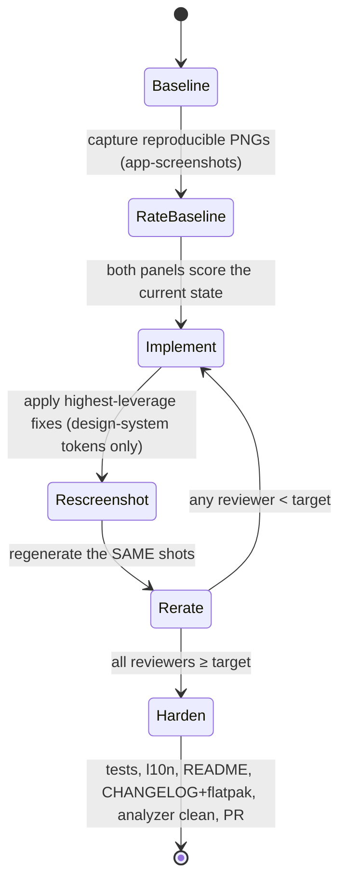

# Design Review Panel

A repeatable, grounded process for design polish and redesign work. It pairs
two parallel agent panels — **design experts** (craft dimensions) and,
optionally, **user personas** (cognitive styles) — and drives them against
**real screenshots the agents actually `Read`**, iterating to a numeric target.

This is how the user wants UI/design tasks run. The numeric target is the
success condition: keep iterating until every reviewer clears the bar.

## The loop



1. **Baseline screenshot first.** Use the `app-screenshots` skill / the
   `test/test_utils/screenshot_harness.dart` `captureInApp` harness to render
   the surface at phone **and** desktop, dark (add light + large-text shots
   when accessibility is in scope). Reproducible PNGs are mandatory — the
   panels are only as honest as the pixels they read.
2. **Rate the baseline with BOTH panels up front.** Get grounded starting
   scores before changing anything. Never carry over scores from a previous
   session — re-rate on a freshly regenerated PNG every time (grounded
   re-rating reliably deflates inflated prior numbers).
3. **Iterate with the expert panel** until experts clear the bar. Bring the
   persona panel into the loop once experts reach ≥8 so the two converge
   together. Each iteration: implement → regenerate the exact same screenshots
   → re-rate.
4. **Adjudicate genuine tradeoffs with the user** (`AskUserQuestion`) instead
   of silently picking a side — before declaring a conflict irreducible, hunt
   for a both-sides fix (one change that serves two opposed reviewers).
5. **Harden to PR-ready** once converged: tests, l10n, feature README,
   CHANGELOG + flatpak metainfo, analyzer zero-warning, formatter, PR on latest
   main.

## The two panels

### Design-expert panel (always)
One agent per craft dimension. Default lenses (adapt to the surface):
- **Visual hierarchy / IA** — what reads primary/secondary/tertiary; scent.
- **Design-system consistency** — tokens, spacing rhythm, component reuse;
  does the surface feel like ONE system or bolted-together parts.
- **Color / contrast / semantics** — palette restraint, status-by-more-than-color.
- **Typography** — ramp, weight contrast, measure, rhythm.
- **Spacing / density / rhythm** — padding, alignment, optical balance.
- **Interaction / task-flow** — taps-to-goal, affordances, dead-ends, the
  "1-tap to the common case" promise.

### User-persona panel (optional — pass `includePersonas: true`)
Different cognitive styles stress the surface as real users:
- **ADHD / clutter-sensitive** — needs "what now" instant; abandons noise.
- **Power user** — counts seconds, allergic to wasted space/steps.
- **Low-vision / low-confidence** — large text, strong contrast, fears
  irreversible taps.
- **Minimalist aesthete** — wants calm, uniform, restrained.
- **Non-technical novice / second-language** — reads copy literally; jargon
  and ambiguous labels break them.

Personas return a **verdict** (would-use / would-struggle / would-abandon) plus
blockers / frictions / delights. Experts return a **1–10 score** per surface
plus severity-tagged issues with evidence + a concrete fix.

## Grounding rules (give these to every agent verbatim)
- **`Read` every screenshot path.** Base every visual claim on actual pixels.
  Panels hallucinate failures when they don't — forbid it.
- **No invented measurements.** Don't fabricate px gaps or contrast ratios; if
  you can't measure it, describe it qualitatively and tie it to something
  visible.
- **Every issue carries evidence** — a named screenshot ("picker_desktop: …")
  or a `file:line`. Code claims (e.g. "hardcodes spacing") require Reading the
  file and citing the line.
- **Grumpy, calibrated scoring:** 10 = ship-grade, nothing to fix; 8 = good,
  only polish left; 6 = usable but rough; 4 = several real problems; ≤3 =
  broken. Do not be generous.
- **List test-rig artifacts to IGNORE** (stand-in nav bars, tofu glyphs,
  folded-hour bands) so the panel doesn't score the harness.

## Running it

Drive both panels as a `Workflow` so the agents run in parallel and return
structured scores. A parameterized reference script lives next to this file:
**`panel_workflow.js`** — pass `args` describing the surface, screenshot paths,
source files, expert lenses, personas, and `includePersonas` /
`target`. Adapt the lenses and persona prompts to the surface; keep the schema
and the iterate-to-target loop.

```
Workflow({ scriptPath: ".claude/skills/design-review-panel/panel_workflow.js", args: { ...see file header... } })
```

Read the returned synthesis, apply the must-fixes, regenerate the same
screenshots, and re-run until `finalMinAvg ≥ target`. Then delete the scratch
capture test and `test/screenshots/` (per the app-screenshots skill) unless the
user asks to keep them.

## See also
- `app-screenshots` — the reproducible capture harness this skill depends on.
- `AskUserQuestion` — for adjudicating genuine, irreducible design tradeoffs.
