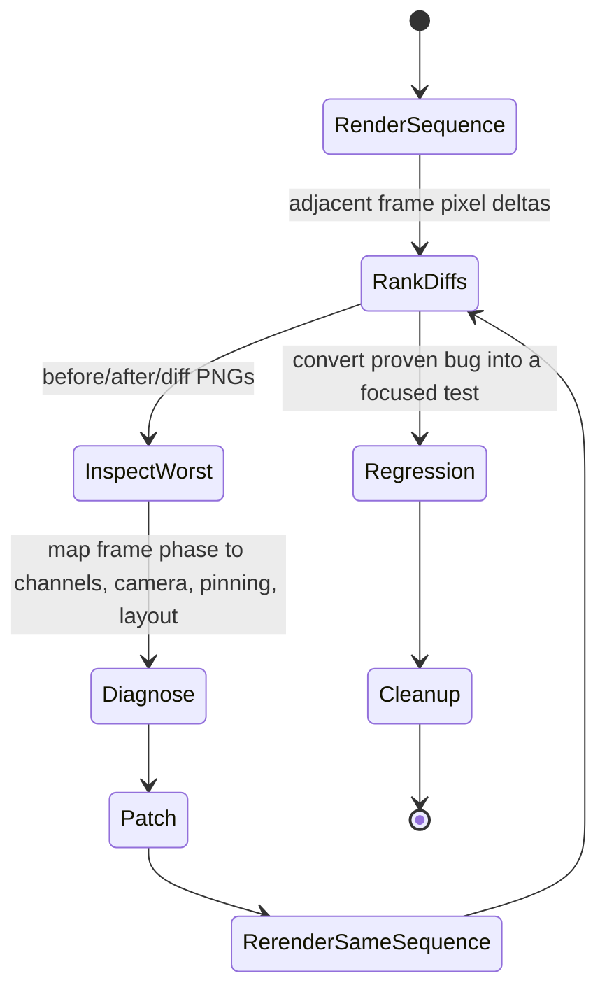

# Temporal Animation Diff

Finds animation discontinuities by rendering a dense deterministic frame
sequence, diffing each adjacent frame, and inspecting the highest-delta
transitions. This is for motion debugging, not for committed goldens.

Use this before tuning by eye when a clip feels like it snaps, teleports, pops,
or has rubbery wobble. The output should name exact frame pairs and phases
(`p=...`) so the code fix can target the real transition.

## Loop



## Workflow

1. **Render densely enough to catch snaps.** Use at least 120 frames per loop;
   use 240 when the user reports occasional jumps. Keep viewport, scale,
   camera, expression, backdrop, and timing identical across runs.

2. **Diff adjacent frames.** For each pair, compute changed pixels, mean changed
   delta, score (`changedPixels * meanDelta`), changed bounding box, and changed
   centroid. Sort descending by score.

3. **Write artifacts for the worst transitions.** Save:
   - `fNNN.png`
   - `fNNN+1.png`
   - `diff_NNN_NNN+1.png`

   Put them under `build/character_frame_diffs/<label>/` or another ignored
   build directory. Do not commit them.

4. **Inspect before patching.** Read the worst before/after/diff images. Decide
   whether the delta is a true discontinuity or just a large legitimate pose
   change. True discontinuities usually show whole-body translation, camera
   jumps, support-foot re-anchors, expression swaps, z-order pops, or limb
   teleporting.

5. **Map phase to code.** Convert frame pair to normalized phase:
   `p0 = from / frames`, `p1 = to / frames`. Check channels/keyframes/contact
   spans/camera curves that cross that phase. For character clips, also compare
   scene-level transforms against painter-level output; a bug can live after
   `frameAt`.

6. **Rerender the exact same sequence after each fix.** Report the before/after
   scores for the same frame pair. Do not say a snap is fixed unless the same
   transition has been rerendered and inspected.

7. **Keep only durable tests.** Delete scratch diff tests/scripts before commit.
   If the bug was real, add a small regression test that asserts the measured
   failure mode directly, such as max visible center delta, no support re-anchor,
   monotonic camera movement, or bounded joint displacement.

## Minimal Dart Diff Core

Use this core inside a throwaway Flutter test after rendering each frame to
`rawRgba` bytes:

```dart
_VisualDiff _diff(
  Uint8List a,
  Uint8List b,
  int width,
  int height,
  int from,
  int to,
) {
  var changedPixels = 0;
  var totalDelta = 0;
  var minX = width;
  var minY = height;
  var maxX = 0;
  var maxY = 0;
  var sumX = 0.0;
  var sumY = 0.0;

  for (var y = 0; y < height; y++) {
    for (var x = 0; x < width; x++) {
      final offset = (y * width + x) * 4;
      final delta =
          (a[offset] - b[offset]).abs() +
          (a[offset + 1] - b[offset + 1]).abs() +
          (a[offset + 2] - b[offset + 2]).abs() +
          (a[offset + 3] - b[offset + 3]).abs();
      if (delta < 36) continue;
      changedPixels++;
      totalDelta += delta;
      minX = math.min(minX, x);
      minY = math.min(minY, y);
      maxX = math.max(maxX, x);
      maxY = math.max(maxY, y);
      sumX += x;
      sumY += y;
    }
  }

  final mean = changedPixels == 0 ? 0.0 : totalDelta / changedPixels;
  return _VisualDiff(
    from: from,
    to: to,
    changedPixels: changedPixels,
    meanChangedDelta: mean,
    score: changedPixels * mean,
    minX: changedPixels == 0 ? 0 : minX,
    minY: changedPixels == 0 ? 0 : minY,
    width: changedPixels == 0 ? 0 : maxX - minX + 1,
    height: changedPixels == 0 ? 0 : maxY - minY + 1,
    cx: changedPixels == 0 ? 0 : sumX / changedPixels,
    cy: changedPixels == 0 ? 0 : sumY / changedPixels,
  );
}
```

## Reporting Format

Keep reports factual and phase-addressable:

```text
Top temporal diffs, 240-frame dance ensemble:
1. 59->60 p=0.2458-0.2500 score=36.9M box=... centroid=...
   Read: f059.png, f060.png, diff_059_060.png
   Diagnosis: whole dancer re-anchors horizontally at support handoff.
2. ...

After patch:
59->60 score 36.9M -> 24.3M; inspected diff shows no whole-body teleport,
remaining delta is pose/silhouette. New worst: ...
```

Never collapse this to "looks fixed" without the numbers and image inspection.

## Cleanup

- Scratch tests should use disposable names such as
  `test/features/character/zzz_temporal_diff_test.dart`.
- Scratch scripts can live under `tool/`, but remove them before commit unless
  the user explicitly asks to keep a maintained diagnostic.
- Diff PNGs belong in ignored build output.
- Commit only the production fix and focused regression tests.
