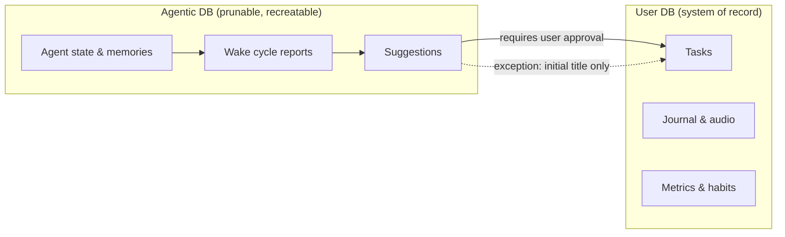

# Lotti

[](https://codecov.io/gh/matthiasn/lotti) [](https://flathub.org/en/apps/com.matthiasn.lotti) [](https://flathub.org/en/apps/com.matthiasn.lotti)

**A private, open‑source logbook with a local agentic layer that helps you get things done.**

Lotti is the system of record for the things you actually do — tasks, time recordings, voice notes, transcriptions, journal entries, habits, and health data — paired with an **agentic layer** of long‑living AI agents that observe, suggest, summarise, and nudge.

The logbook is local. The agents run on your machine. With reasoning‑capable models like **Qwen 3.6 35B A3B** (Mixture of Experts, ~3B active parameters), the model the agents call can run locally too — so, hardware permitting, your data never has to leave the device at all. You configure the provider and the model per category; anything OpenAI‑compatible plugs in directly, and other providers can be extended.


## Download

| Platform                 | Where to get it                                                                                                                                 |
|--------------------------|-------------------------------------------------------------------------------------------------------------------------------------------------|
| **Linux**                | [Flathub](https://flathub.org/en/apps/com.matthiasn.lotti) (recommended) or `tar.gz` on [Releases](https://github.com/matthiasn/lotti/releases) |
| **macOS**                | Signed + notarized DMG on [Releases](https://github.com/matthiasn/lotti/releases)                                                               |
| **iOS / iPadOS / macOS** | TestFlight (limited; invitation only)                                                                                                           |
| **Android**              | APK on [Releases](https://github.com/matthiasn/lotti/releases)                                                                                  |
| **Android**              | Play Store internal testing (limited; invitation only)                                                                                          |
| **Windows**              | Build from [source](docs/DEVELOPMENT.md) for now                                                                                                |

[](https://flathub.org/en/apps/com.matthiasn.lotti)

---

## Table of Contents

- [What is Lotti?](#what-is-lotti)
- [The Agentic Layer](#the-agentic-layer)
- [Local Execution & Data Sovereignty](#local-execution--data-sovereignty)
- [Architecture: Two Databases, Human‑in‑the‑Loop](#architecture-two-databases-human-in-the-loop)
- [Core Features](#core-features)
- [Use Cases](#use-cases)
- [Sync, Encryption, and Caveats](#sync-encryption-and-caveats)
- [Where Lotti Is Right Now](#where-lotti-is-right-now)
- [Getting Started](#getting-started)
- [Pricing & Sustainability](#pricing--sustainability)
- [Contributing](#contributing)
- [Documentation](#documentation)
- [Technical Stack](#technical-stack)
- [Philosophy](#philosophy)
- [License](#license)

---

## What is Lotti?

Lotti is two things in one application:

1. **A personal logbook** — the system of record for facts about your work and life. Time recordings, audio notes (transcribed locally with Whisper or Voxtral, or via a cloud model of your choice), journal entries, tasks, habits, and health data.
2. **An agentic layer on top of that logbook** — long‑living AI agents that read what you've recorded, think about it, and help you act on it. Entirely private if you so choose, and provide capable hardware.

The logbook side is what you'd expect from a good personal information manager: structured, durable, exportable, yours. The agentic side is where things get interesting.

---

## The Agentic Layer

Lotti's agents are **long‑living entities with memories**. They wake up when there is relevant new information, or on a cadence, look at what's happened since they last ran, and produce a report. They remember their previous reports. They have opinions. They are, by design, a little unpredictable — interesting to interact with rather than mechanical.

Crucially, **you shape them**. Their behavior and personality are not fixed. If an agent is too pushy, too verbose, or focused on the wrong things, you can tune it — and you can keep tuning it. This tuning process is formalized as 1-on-1 with the respective agent template.

### A thousand agents in your pocket

A single device (even a phone) can host **thousands of long‑living agents** without breaking a sweat. The author currently runs north of a thousand task agents on a phone, all idle most of the time and reacting only to changes in the entities they actually care about. The trick isn't a big timer loop — it's that agents subscribe to **fine‑grained entity‑change notifications**, so an agent sleeps cheaply and only wakes when something it watches actually moves.

That matters because the agentic experience scales with your life: a task agent per task that needs ongoing thought, a project agent per project, a planner per area of focus. Lotti is designed to make that fan‑out feel ordinary.

### Anatomy of an Agent: Mission, Soul, Report Directive

Every agent in Lotti is defined by three components:

- **Mission** — *what the agent is supposed to do.* The job description: "watch this category of tasks and surface what's blocked," "review my time recordings against my goals," etc.
- **Soul** — *the personality and characteristics.* How the agent talks to you, what it cares about, how forgiving or pedantic it is. A soul is reusable across templates and agent types: define a voice once, and any agent — task watcher, reviewer, journal companion — can wear it.
- **Report Directive** — *the shape of the output of a wake cycle.* When an agent wakes up and runs, the report directive defines what it shows you — the surface where the assistant says "here's what I think needs your attention."

Mission, soul, and report directive together turn a generic LLM call into something resembling a coherent collaborator (most of the time — they are still LLMs).

### Grievances and Weekly 1‑on‑1s

You can **file a grievance with an agent.** It isn't a form, and you don't have to use any particular phrase — saying "hey, I want to file a grievance about X" works, but so does just venting at the agent when it's annoying you. It picks up the grievance either way and records it. In the next **weekly 1‑on‑1 session** (or whatever cadence you set), the agent brings it up, you talk it through, and the two of you reconcile what changes. Watching that play out, and seeing the agent actually adjust, is one of the most interesting parts of the whole system.

The result is an assistant that *evolves*. You're not configuring a tool — you're managing a relationship.

### Where the agentic layer is today, and where it's going

The current focus is on **task agents** and their evolution: agents that watch tasks in your realm, reason about them, and have tools to interact with you and propose changes — new checklist items, status updates, suggested edits — every one of which still requires your approval before it lands in the user database.

Next agent types on the roadmap:

- **Day and week planners** — agents that propose how a day or week should be shaped given what's on your plate and what you've said matters.
- **Long‑term commitment monitors** — agents that watch the things you said you'd care about over months, not days, and surface drift before it becomes a problem.
- **Effort‑against‑goals balancers** — agents that look at where your time and energy actually went and weigh that against what you said you wanted.

Same building blocks (mission, soul, report directive, grievances, human‑in‑the‑loop), different jobs.

---

## Local Execution & Data Sovereignty

Most AI‑powered productivity tools require you to upload and store your personal data on their servers. Lotti doesn't. Your tasks, audio, journal entries, and time recordings live on your devices and nowhere else.

There's finally at least one local **model** good enough to drive the agents — **Qwen 3.6 35B A3B** is the one validated in daily use, and others probably work too. For a long time, the choice was "use a frontier cloud model and accept that data leaves the machine" or "use a local model and accept that the agents won't really work." Qwen 3.6 closes that gap — a 35B parameter Mixture‑of‑Experts model with only ~3B active parameters per token, which is what makes it practical to run on a personal machine while still being smart enough to drive the agentic loop.

### Hardware reality check

Running this locally is **power‑hungry**. Tested extensively on an M4 Max with 128 GB of RAM, the laptop hums audibly under sustained agent load and battery drains noticeably faster than during normal work. Think "last‑generation Intel i9 MacBook Pro on a heavy build" — that kind of fan noise. It's feasible though, and the quality is finally there.

### Hybrid is the realistic answer

The author runs Lotti **hybrid**:

- **Local model** for highly private categories — personal journaling, health, anything you'd rather not hand to a cloud provider.
- **Gemini Flash** (or your cloud provider of choice) for everything else — open‑source work, day‑to‑day task management, anything where the data isn't that sensitive. It's faster still, but much cheaper on your battery, and frees up the local machine for the categories that actually need it.

Locally available today:

- 🎙️ **Voice / transcription** — Whisper and Voxtral (Mistral) run fully offline.
- 🧠 **Thinking** — Qwen 3.6 and similar reasoning‑capable local models drive the agentic loop, not just shallow autocomplete.
- 🤝 **Per‑category provider choice** — you decide on a per‑category basis where inference happens. Same UX, different trust boundary.

When you do opt into a cloud provider, Lotti uses **your own API keys**, and your data is shared only for that specific inference call — there is no Lotti backend in the middle holding your data. For users who want options beyond US frontier cloud, **European‑hosted, no‑retention, GDPR‑compliant providers** are supported, and **Chinese providers** (Qwen via Alibaba, for instance) also work well — pick the jurisdiction and the price/performance point that fits  your specific needs.

**Image generation isn't local yet.** Cover‑art generation currently goes through a cloud provider (Nano Banana Pro on Gemini, OpenAI, or Qwen — see [Visual journaling](#visual-journaling-cover-art-for-your-life)). A reliable, local Python‑based image‑generation service following the same pattern as our local Voxtral integration is one of the **few areas where outside contributions are actively wanted** — see [Contributing](#contributing).

---

## Architecture: Two Databases, Human‑in‑the‑Loop

Lotti enforces a strict separation between *what you said/wrote* and *what an agent thinks*. They live in **different databases on disk** for a reason.

### The User Database — the system of record

This is the database we treat with care. It contains the facts: your tasks, your notes, your audio, your time recordings, your journal entries. We do not let agents write into it freely.

### The Agentic Database — agents' working memory

This is where agent state lives: agent definitions, memories, wake cycle history, internal reasoning traces, intermediate results. It's allowed to grow, and it's allowed to be **pruned**. There is no guarantee of permanence here — the agentic database can be thrown away and recreated without losing anything that matters about *you*. If it grows too large, pruning strategies will be able to trim it back in the future. The agents may lose or compress some memory; the logbook does not.

### Human‑in‑the‑Loop, by Design

The split between the two databases has one practical consequence: **anything an agent suggests must be approved by you before it lands in the user database.** Agents propose. You dispose.

There is exactly one narrow exception: **if a task has no title at all, an agent may set the initial title automatically.** Any subsequent edit to that title — or to anything else — requires your explicit approval.



The reason this matters: the rule isn't enforced by being careful in prompts, it's enforced by the storage layout. Agent‑authored content sits in a different file on disk and reaches the user database only through a code path that requires your approval. Even a misbehaving agent can't bypass that — it has nowhere to write.

---

## Core Features

Beyond the agentic layer, the logbook side covers:

### Tracking
- **Tasks** — full lifecycle (open, groomed, in progress, blocked, done, rejected), with priorities, due dates, labels, projects, and cover art
- **Audio recordings** — captured locally, transcribed by Whisper, Voxtral, or your chosen cloud model
- **Time tracking** — recorded against tasks and projects
- **Journal entries** — written reflections and documentation
- **Habits** — daily habits and routines, with three completion types (success / fail / skip)
- **Health data** — import from Apple Health and similar sources
- **Custom metrics** — track anything that matters to you

### AI‑augmented workflows
- **Smart summaries** of tasks and categories
- **Audio → checklist** conversion of rambling voice notes
- **Image cover art** for tasks and journal entries
- **Context recap** when you return to a task after a break
- **Generate Coding Prompt** skill — turns a task plus your notes into a structured Markdown 
  coding brief ready to paste into Claude Code, OpenCode, Codex, Cursor, or your AI 
  coding assistant of choice
- **Generate Design Prompt** skill — turns task context plus notes into a UI/UX exploration 
  prompt (defaults to several functional prototypes, enforces design‑system alignment when one 
  is mentioned), ready to paste into Claude Design, OpenDesign, Figma Make, or similar
- **Generate Image Prompt** and **Generate Research Prompt** skills round out the same pattern for cover‑art generation and Deep‑Research‑style briefs
- **Per‑category provider configuration** — local for personal stuff, cloud for work, your call

### Privacy & sync
- **Local‑only storage** — there is no cloud storage. Data lives on your devices, full stop.
- **End‑to‑end encrypted sync** between *your* devices via [Matrix](https://matrix.org), with **Vodozemac** providing the Megolm crypto in Rust. See [Sync, Encryption, and Caveats](#sync-encryption-and-caveats) for what is and isn't encrypted.
- **Bring your own keys** for cloud providers, if you choose to use them
- **Jurisdiction choice** — European‑hosted, no‑retention, GDPR‑compliant providers are supported, and Chinese providers (Qwen via Alibaba, etc.) also work well, alongside US frontier cloud models, and fully local
- **Portable, exportable, no vendor lock‑in** — your data stays accessible to you, independent of any subscription or service
- **No accounts (other than the Matrix one you bring), no telemetry, no lock‑in**

---

## Use Cases

Two workflows in particular are why the author keeps building this app.

### On‑the‑go dictation

You're walking in a forest, or you're driving, and the ideas show up. You don't want to stop and type, and you don't want to lose them.

You hold the record button, talk for as long as you want, and stop. Lotti transcribes the audio (locally with Voxtral or Whisper later on the desktop, or right away via your cloud provider). An agent then organizes what you said into actionable checklist items, attaches them to the right task, and surfaces the result for your approval the next time you sit down (or look at your phone, in case your chose cloud inference).

### Visual journaling: cover art for your life

Cover art for tasks isn't decoration — it's a *visual index of what your day/week/month was actually about*.

Each task can have an AI‑generated image, created with **Nano Banana Pro (Gemini)**, **OpenAI**, or **Qwen** (whichever you've configured). You're the one who guides the art, and you keep the result. Years from now, when you look back at "what was I doing in May 2026?", you don't have to read a wall of text — you will be able to scroll an Instagram‑style grid of cover art and the texture of that period of your life comes back at a glance.

This is one of the strongest arguments for keeping a logbook like this open‑source and yours: a subscription‑based product gives you a "download my data" button at best, but no tool to make that data meaningful afterward. Lotti's cover art belongs to you, in a database you can read, in a file format that will outlive any of us (JSON stored in SQLite).

---

## Sync, Encryption, and Caveats

Lotti syncs between *your own* devices over Matrix. There is no Lotti backend; homeservers (self‑hosted or public) only relay end‑to‑end encrypted payloads.

### What is encrypted

- **Sync traffic** — every sync payload (logbook entries, agent state, suggestions, attachments) is end‑to‑end encrypted using **Matrix + Vodozemac** (the Rust implementation of Olm/Megolm). Homeservers see ciphertext, never unencrypted data. Both the user database and the agentic database sync this way.
- **Cloud inference calls** — sent over TLS to whichever provider you configured, using your own API key.

### What is not (yet) encrypted

- **Local databases at rest.** The on‑device SQLite files live inside your OS user account and are not separately encrypted by Lotti today. This is a real caveat: if your device is compromised at the OS level, an attacker with that level of access can read the databases. But then again, when an attacker has OS level access, you're screwed anyway. App‑level at‑rest encryption is considered for inclusion on the roadmap; until it lands, treat Lotti's on‑device data with the same care you'd give any personal app on the same device. If this trade‑off matters for your threat model, please weigh it before adopting Lotti for the most sensitive categories.

---

## Where Lotti Is Right Now

The application is in active daily use. The agentic layer is real, working, and shipping. A few things are worth knowing if you're picking it up now:

- **Design system rollout is in progress.** Some screens follow the new design system, some don't yet, so you'll see visual inconsistencies. The path to full App Store polish is an ongoing effort.
- **The agentic layer is new.** Mission/soul/report‑directive ergonomics, grievance handling, and pruning strategies are areas of active development — feedback here is especially valuable.
- **Local image generation isn't there yet.** See the contribution call below.
- **At‑rest encryption isn't there yet.** See [Sync, Encryption, and Caveats](#sync-encryption-and-caveats).

---

## Getting Started

Three short walkthroughs live alongside the README. Pick the one that matches what you want to do:

- 🤖 [Set up AI — local (Ollama) or cloud (Gemini Flash)](GETTING_STARTED.md) — the fastest way to a working agent
- ✅ [Create your first task with cover art](docs/manual/getting-started-task-with-image.md) — the basic everyday workflow
- 🔄 [Set up sync between your devices via the Matrix provisioner](docs/manual/getting-started-sync.md) — when you have more than one device

For developers:

- Install Flutter via [FVM](https://fvm.app/) (the repo includes `.fvmrc`)
- `make deps` — install dependencies
- `make analyze` — static analysis
- `make test` — unit tests
- `make build_runner` — code generation
- `make l10n` — regenerate localizations
- `fvm flutter run -d macos` — run on macOS (or `-d <device>` for others)

**Linux only** — install emoji font support for proper rendering:
```bash
# Debian/Ubuntu: sudo apt install fonts-noto-color-emoji
# Fedora: sudo dnf install google-noto-emoji-color-fonts
# Arch:   sudo pacman -S noto-fonts-emoji
./linux/install_emoji_fonts.sh
```

See [`docs/DEVELOPMENT.md`](docs/DEVELOPMENT.md) for the full developer setup.

---

## Pricing & Sustainability

A short, honest version of where this is headed.

**Linux is and will always be free, with maximum functionality.** No paywalls, no upsells. The same promise extends to any future fully open‑source mobile operating system. The one thing this *doesn't* include is hosted sync infrastructure — running someone else's homeserver is a real cost, and that won't be free; you can either self‑host Matrix or bring your own homeserver.

**On other platforms, the basics will stay free too.** Task and journal capture, the task agent, voice transcription, the everyday loop — all free.

**More advanced agent features may eventually be in‑app purchases on platforms where IAP is the norm** (iOS/macOS, Android, Windows). The candidates: day‑ and week‑planner agents, overarching project‑management agents, longer‑horizon commitment monitors. The exact split isn't set yet.

---

## Contributing

Contributions are welcome — but with deliberate boundaries. Please read this before opening a PR.

### What's very welcome

- 🐛 **Issues and bug reports** — the best place to start. Tell us what broke and how to reproduce it.
- 🌍 **Translations** — new languages, corrections, improvements to existing locales (currently English, German, Spanish, French, Romanian, Czech). AI‑assisted translations are fine **provided you contribute from a real‑name, established GitHub profile** (not a recently created throwaway).
- 💡 **Discussion of new features** — open an issue, describe what you'd like to have and why, and let's agree on the shape before any code is written.
- 🐍 **Local image generation service** — a reliable, local Python‑based image‑gen service (following the same architecture as our local Voxtral integration) is a **specifically wanted contribution**. If you have experience in this area and want to take it on, please open an issue first so we can align on the integration shape.

### What will be rejected by default

**Unsolicited large pull requests.** This isn't gatekeeping — it's three real constraints:

1. **AI‑generated code varies wildly in quality.** A 2,000‑line PR from someone we've never spoken to is, statistically, expensive to review carefully and easy to accept incorrectly.
2. **Review capacity is limited.** Maintainer time is the binding constraint on what can land.
3. **Trust matters.** Lotti holds people's personal data on their own devices. A large unreviewed PR — well‑meant or not — is a vector for problems we can't afford to ship.

So: **for any non‑trivial feature, open an issue first.** We'll talk about it, agree on scope, and then a PR might be welcome. Small, focused PRs that fix a clear bug are also welcome without prior discussion.

See [CONTRIBUTING.md](CONTRIBUTING.md) for the formal version.

---

## Documentation

- [Getting Started with AI](GETTING_STARTED.md) — set up local Ollama or cloud Gemini
- [Manual](docs/MANUAL.md) — how to use Lotti
- [`docs/manual/`](docs/manual/) — focused getting‑started walkthroughs
- [Basic Task Management](docs/BASIC_TASK_MANAGEMENT.md) — voice‑to‑checklist workflow
- [Architecture](docs/ARCHITECTURE.md) — technical design
- [Background](docs/BACKGROUND.md) — the story behind the project
- [Privacy Policy](PRIVACY.md)
- [Contributing](CONTRIBUTING.md)

---

## Technical Stack

- **Frontend** — [Flutter](https://flutter.dev) (iOS, macOS, Android, Windows, Linux)
- **Local AI** — [Ollama](https://ollama.com) for general LLM hosting ([Qwen](https://github.com/QwenLM) 3.6 35B A3B and similar reasoning‑capable models for the agentic loop), [Whisper](https://github.com/openai/whisper) and [Voxtral](https://mistral.ai/news/voxtral) ([Mistral](https://mistral.ai)) for offline speech‑to‑text
- **Cloud AI (optional, per category)** — [OpenAI](https://openai.com), [Anthropic](https://www.anthropic.com), [Google Gemini](https://ai.google.dev) (Flash and Pro tiers, including Nano Banana Pro for image generation), [Mistral](https://mistral.ai), [Alibaba](https://www.alibabacloud.com) ([Qwen](https://github.com/QwenLM) + Wan image models), [Nebius](https://nebius.com), [OpenRouter](https://openrouter.ai), or any OpenAI‑compatible provider
- **Storage** — local [SQLite](https://sqlite.org) via [Drift](https://drift.simonbinder.eu), with strict separation between user DB (system of record) and agentic DB (working memory)
- **Sync** — end‑to‑end encrypted via [Matrix](https://matrix.org), using [**Vodozemac**](https://github.com/matrix-org/vodozemac) (Rust) for Megolm crypto. Both databases sync; homeservers only relay encrypted payloads
- **Testing** — comprehensive unit and integration tests; also a growing number of property‑based / generative tests using [Glados](https://pub.dev/packages/glados)

---

## Philosophy

1. **Your data is yours.** The user database is the system of record. No company should own your thoughts and experiences — and definitely not behind a subscription that expires.
2. **AI as a tool, not a service.** Use AI capabilities without subscriptions or vendor lock‑in. As local models improve, more of the experience moves on‑device — but cloud stays a first‑class, à‑la‑carte option for the categories where you've decided it's fine and useful.
3. **Privacy by design.** Choose exactly what to share, when, and with whom. The architecture, not the marketing copy, enforces the privacy story.
4. **Human‑in‑the‑loop.** Agents propose, you dispose. Every change to the system of record passes through you (with one narrow, documented exception).
5. **Agents you can shape.** Mission, soul, report directive, grievances, 1‑on‑1s — agents are collaborators you tune over time, not appliances you configure once.

---

## License

Lotti is open source under [LICENSE](LICENSE).

## Acknowledgments

Thanks to the [Flutter](https://flutter.dev) team, the [Qwen](https://github.com/QwenLM) and [Mistral](https://mistral.ai) teams for their open weights models, [OpenAI](https://openai.com) for the [Whisper](https://github.com/openai/whisper) open weights, the [Ollama](https://ollama.com) project, the [Matrix.org](https://matrix.org) community, the [Vodozemac](https://github.com/matrix-org/vodozemac) authors, and everyone contributing translations, issues, and ideas.

---

**Building in public** — [Substack](https://matthiasnehlsen.substack.com)
