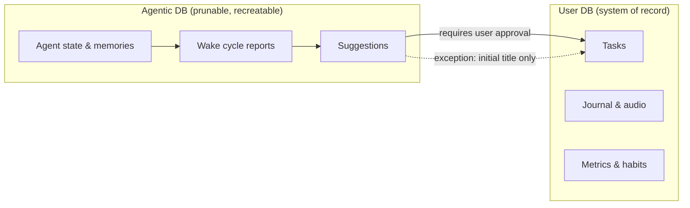

# Lotti

[](https://codecov.io/gh/matthiasn/lotti)
[](https://www.codefactor.io/repository/github/matthiasn/lotti)

**A private logbook with a local agentic layer that helps you get things done.**

Lotti is an open‑source personal logbook for the things you actually do — tasks, time recordings, voice notes, transcriptions, journal entries, habits, and health data — paired with an **agentic layer** of long‑living AI agents that observe, suggest, summarise, and nudge.

The logbook has always been local. With reasoning‑capable models like **Qwen 3.6** now usable on a personal machine, the agentic layer can run locally too — for the first time, without giving up on quality. You configure the provider and the model; anything OpenAI‑compatible plugs in directly, and other providers can be extended.

[](https://flathub.org/en/apps/com.matthiasn.lotti)

---

## Table of Contents

- [What is Lotti?](#what-is-lotti)
- [The Agentic Layer](#the-agentic-layer)
  - [Anatomy of an Agent: Mission, Soul, Report Directive](#anatomy-of-an-agent-mission-soul-report-directive)
  - [Grievances and Weekly 1‑on‑1s](#grievances-and-weekly-1-on-1s)
- [Local Execution & Data Sovereignty](#local-execution--data-sovereignty)
- [Architecture: Two Databases, Human‑in‑the‑Loop](#architecture-two-databases-human-in-the-loop)
- [Core Features](#core-features)
- [Where Lotti Is Right Now](#where-lotti-is-right-now)
- [Getting Started](#getting-started)
- [Documentation](#documentation)
- [Contributing](#contributing)
- [Technical Stack](#technical-stack)
- [Philosophy](#philosophy)
- [License](#license)

---

## What is Lotti?

Lotti is two things in one application:

1. **A personal logbook** — the system of record for facts about your work and life. Time recordings, audio notes (transcribed locally with Whisper or Voxtral, or via a cloud model of your choice — Mistral and Gemini are both excellent here), journal entries, tasks, habits, and health data.
2. **An agentic layer on top of that logbook** — long‑living AI agents that read what you've recorded, think about it, and help you act on it.

The logbook side is what you'd expect from a good personal information manager: structured, durable, exportable, yours. The agentic side is where things get interesting.


---

## The Agentic Layer

Lotti's agents are **long‑living entities with memories**. They wake up on a cadence, look at what's happened since they last ran, and produce a report. They remember their previous reports. They have opinions. They are, by design, a little unpredictable — interesting to interact with rather than mechanical.

Crucially, **you shape them**. Their behaviour and personality are not fixed. If an agent is too pushy, too verbose, or focused on the wrong things, you can tune it — and you can keep tuning it.

### Anatomy of an Agent: Mission, Soul, Report Directive

Every agent in Lotti is defined by three components:

- **Mission** — *what the agent is supposed to do.* The job description: "watch this category of tasks and surface what's blocked," "review my time recordings against my goals," etc.
- **Soul** — *the personality and characteristics.* How the agent talks to you, what it cares about, how forgiving or pedantic it is. A soul is reusable across templates and agent types: define a voice once, and any agent — task watcher, reviewer, journal companion — can wear it.
- **Report Directive** — *the shape of the output of a wake cycle.* When an agent wakes up and runs, the report directive defines what it shows you — the surface where the assistant says "here's what I think needs your attention."

Mission, soul, and report directive together turn a generic LLM call into something resembling a coherent collaborator (most of the time — they are still LLMs).

### Grievances and Weekly 1‑on‑1s

You can **file a grievance with an agent.** It isn't a form, and you don't have to use any particular phrase — saying "hey, I want to file a grievance about X" works, but so does just venting at the agent when it's annoying you. It picks up the grievance either way and records it. In the next **weekly 1‑on‑1 session** (or whatever cadence you set), the agent brings it up, you talk it through, and the two of you reconcile what changes. Watching that play out, and seeing the agent actually adjust, is one of the most interesting parts of the whole system.

The result is an assistant that *evolves*. You're not configuring a tool — you're managing a relationship.

### Where the agentic layer is today, and where it's going

The current focus is on **task agents** and their evolution: agents that watch tasks in your realm, reason about them, and have tools to interact with you and propose changes — new checklist items, status updates, suggested edits — every one of which still requires your approval before it lands in the user database. This is also where the foundations are being built: the wake cycle, the mission/soul/report‑directive model, the grievance and 1‑on‑1 loop, the suggestion‑and‑approval pipeline, the sync of agent state. Everything that comes next sits on top of these.

Next agent types on the roadmap:

- **Day and week planners** — agents that propose how a day or week should be shaped given what's on your plate and what you've said matters.
- **Long‑term commitment monitors** — agents that watch the things you said you'd care about over months, not days, and surface drift before it becomes a problem.
- **Effort‑against‑goals balancers** — agents that look at where your time and energy actually went and weigh that against what you said you wanted.

Same building blocks (mission, soul, report directive, grievances, human‑in‑the‑loop), different jobs.

---

## Local Execution & Data Sovereignty

Most AI‑powered productivity tools require you to upload and store your personal data on their servers. Lotti doesn't. The logbook in Lotti has always been local. Your tasks, audio, journal entries, and time recordings live on your devices and nowhere else. That is not new.

What *is* new is that the **agentic layer** can now run locally with quality good enough to actually use. For a long time, the choice was "use a frontier cloud model and accept that data leaves the machine" or "use a local model and accept that the agents won't really work." Models like Qwen 3.6 close that gap. The agentic loop — reasoning, tool use, multi‑step task work — runs well on a capable personal machine.

Locally available today:

- 🎙️ **Voice / transcription** — Whisper and Voxtral (Mistral) run fully offline.
- 🧠 **Thinking** — reasoning‑capable local models drive the agentic loop, not just shallow autocomplete.
- 🤝 **Per‑category provider choice** — you decide on a per‑category basis where inference happens. Working on the Lotti app itself? Cloud is fine. Personal journal? Keep it on the device. Same UX, different trust boundary.

Cloud providers are a permanent first‑class option, not a fallback — Gemini in particular makes for a smooth, snappy day‑to‑day experience without setting your laptop on fire, and it's a great choice when you've consciously decided this category of data can leave the machine. The point isn't "local everything, always." The point is **you choose, per category, with eyes open**.

When you do opt into a cloud provider, Lotti uses **your own API keys**, and your data is shared only for that specific inference call — there is no Lotti backend in the middle holding your data. Please review the respective provider's terms and privacy policy to understand how *they* handle that data. For users who want options beyond US frontier cloud, **European‑hosted, no‑retention, GDPR‑compliant providers** are supported, and **Chinese providers** (Qwen via Alibaba, for instance) also work well — pick the jurisdiction and the price/performance point that fits the category.

> 📸 *Screenshots of tasks created entirely with local models — placeholders below; replace with real captures.*
>
> 
>
> 
>
> 

> **What's not local yet:** image generation. If you want it, it currently goes through a cloud provider. A local image‑gen path — most likely a small Python service following the same pattern as the local Voxtral integration — is a great contribution opportunity if anyone wants to take it on.

---

## Architecture: Two Databases, Human‑in‑the‑Loop

Lotti enforces a strict separation between *what you said* and *what an agent thinks*. They live in **different databases on disk** for a reason.

### The User Database — the system of record

This is the database we treat with care. It contains the facts: your tasks, your notes, your audio, your time recordings, your journal entries. We do not let agents write into it freely.

### The Agentic Database — agents' working memory

This is where agent state lives: agent definitions, memories, wake cycle history, internal reasoning traces, intermediate results. It's allowed to grow, and it's allowed to be **pruned**. There is no guarantee of permanence here — the agentic database can be thrown away and recreated without losing anything that matters about *you*. If it grows too large, pruning strategies trim it back. The agents lose some memory; the logbook does not.

### Human‑in‑the‑Loop, by Design

The split between the two databases has one practical consequence: **anything an agent suggests must be approved by you before it lands in the user database.** Agents propose. You dispose.

There is exactly one narrow exception: **if a task has no title at all, an agent may set the initial title automatically.** Any subsequent edit to that title — or to anything else — requires your explicit approval.



The reason this matters: the rule isn't enforced by being careful in prompts, it's enforced by the storage layout. Agent‑authored content sits in a different file on disk and reaches the user database only through a code path that requires your approval. Even a misbehaving or jailbroken agent can't bypass that — it has nowhere to write.

---

## Core Features

Beyond the agentic layer, the logbook side covers:

### Tracking
- **Tasks** — full lifecycle (open, groomed, in progress, blocked, done, rejected)
- **Audio recordings** — captured locally, transcribed by Whisper, Voxtral, or your chosen cloud model
- **Time tracking** — recorded against tasks and projects
- **Journal entries** — written reflections and documentation
- **Habits** — daily habits and routines
- **Health data** — import from Apple Health and similar sources
- **Custom metrics** — track anything that matters to you

### AI‑augmented workflows
- **Smart summaries** of tasks and categories
- **Audio → checklist** conversion of rambling voice notes
- **Context recap** when you return to a task after a break
- **Per‑category provider configuration** — local for personal stuff, cloud for work, your call

### Privacy & sync
- **Local‑only storage** — there is no cloud storage. Data lives on your devices, full stop.
- **Encrypted sync between your devices** via [Matrix](https://matrix.org) (self‑hosted or public homeserver). Logbook entries *and* the agentic side — agent learnings, suggestions, and the agents' evolving personalities themselves — all sync between your devices. No cloud storage anywhere; the homeserver only relays end‑to‑end encrypted payloads.
- **Bring your own keys** for cloud providers, if you choose to use them — data is shared only for that specific inference call
- **Jurisdiction choice** — European‑hosted, no‑retention, GDPR‑compliant providers are supported, and Chinese providers (Qwen via Alibaba, etc.) also work well, alongside US frontier cloud and fully local
- **Portable, exportable, no vendor lock‑in** — your data stays accessible to you, independent of any subscription or service
- **No accounts (other than the Matrix one you bring), no telemetry, no lock‑in**

---

## Where Lotti Is Right Now

The application is in active daily use. The agentic layer is real, working, and shipping. A few things are worth knowing if you're picking it up now:

- **Design system rollout is in progress.** Some screens follow the new design system, some don't yet, so you'll see visual inconsistencies. The path to App Store polish is a separate, ongoing effort.
- **The agentic layer is new.** Mission/soul/report‑directive ergonomics, grievance handling, and pruning strategies are areas of active development — feedback here is especially valuable.
- **Local image generation isn't there yet.** See the note above.

---

## Getting Started

### Install

- **Linux** — [Flathub](https://flathub.org/en/apps/com.matthiasn.lotti) or `tar.gz` from [GitHub releases](https://github.com/matthiasn/lotti/releases)
- **iOS / macOS** — TestFlight (limited; broader rollout in progress) or build from source
- **Android / Windows** — build from source

### Develop

- Install Flutter via [FVM](https://fvm.app/) (the repo includes `.fvmrc`)
- `make deps` — install dependencies
- `make analyze` — static analysis (Very Good Analysis rules)
- `make test` — unit tests; `make coverage` for HTML coverage report
- `make build_runner` — code generation (freezed, riverpod, drift)
- `make l10n` — regenerate localizations
- `fvm flutter run -d macos` — run on macOS (or `-d <device>` for others)

**Linux only** — install emoji font support for proper rendering:
```bash
# Debian/Ubuntu: sudo apt install fonts-noto-color-emoji
# Fedora: sudo dnf install google-noto-emoji-color-fonts
# Arch:   sudo pacman -S noto-fonts-emoji
./linux/install_emoji_fonts.sh
```

See [`docs/DEVELOPMENT.md`](docs/DEVELOPMENT.md) for the full developer setup.

---

## Documentation

- [Getting Started with AI](GETTING_STARTED.md) — set up local Qwen, Ollama, or cloud providers
- [Basic Task Management](docs/BASIC_TASK_MANAGEMENT.md) — voice‑to‑checklist workflow
- [Manual](docs/MANUAL.md) — how to use Lotti
- [Architecture](docs/ARCHITECTURE.md) — technical design
- [Background](docs/BACKGROUND.md) — the story behind the project
- [Privacy Policy](PRIVACY.md)
- [Contributing](CONTRIBUTING.md)

There's also a [**multi‑part blog series with video walkthroughs**](https://matthiasnehlsen.substack.com/p/meet-lotti) covering the application end to end.

---

## Contributing

Contributions are welcome — but with deliberate boundaries. Please read this before opening a PR.

### What's very welcome

- 🐛 **Issues and bug reports** — the best place to start. Tell us what broke and how to reproduce it.
- 🌍 **Translations** — new languages, corrections, improvements to existing locales (EN, DE, ES, FR, RO, CS).
- 💡 **Discussion of new features** — open an issue, describe what you'd like to build and why, and let's agree on the shape before any code is written.

### What will be rejected by default

**Unsolicited large pull requests.** This isn't gatekeeping — it's three real constraints:

1. **AI‑generated code varies wildly in quality.** A 2,000‑line PR from someone we've never spoken to is, statistically, expensive to review carefully and easy to accept incorrectly.
2. **Review capacity is limited.** Maintainer time is the binding constraint on what can land.
3. **Trust matters.** Lotti holds people's personal data on their own devices. A large unreviewed PR — well‑meant or not — is a vector for problems we can't afford to ship.

So: **for any non‑trivial feature, open an issue first.** We'll talk about it, agree on scope, and then a PR is welcome. Small, focused PRs that fix a clear bug are also welcome without prior discussion.

See [CONTRIBUTING.md](CONTRIBUTING.md) for the formal version.

---

## Technical Stack

- **Frontend** — Flutter (iOS, macOS, Android, Windows, Linux)
- **Local AI** — Ollama for general LLM hosting (Qwen 3.6 and similar reasoning‑capable models for the agentic loop), Whisper and Voxtral (Mistral) for offline speech‑to‑text. A local image‑generation path is not yet available.
- **Cloud AI (optional, per category)** — OpenAI, Anthropic, Google Gemini, Mistral, or any OpenAI‑compatible provider
- **Storage** — local SQLite via Drift, with strict separation between user DB (system of record) and agentic DB (working memory)
- **Sync** — end‑to‑end encrypted via [Matrix](https://matrix.org). Both databases sync: logbook entries and the agentic state (memories, suggestions, evolving personalities). Sync happens between your devices; homeservers (self‑hosted or public) only relay encrypted payloads — no cloud storage of either user data or agent state.
- **Testing** — comprehensive unit and integration tests; analyzer must be green before any merge

---

## Philosophy

1. **Your data is yours.** The user database is the system of record. No company should own your thoughts and experiences.
2. **AI as a tool, not a service.** Use AI capabilities without subscriptions or vendor lock‑in. As local models improve, more of the experience moves on‑device — but cloud stays a first‑class, à‑la‑carte option for the categories where you've decided it's fine.
3. **Privacy by design.** Choose exactly what to share, when, and with whom. The architecture, not the marketing copy, enforces the privacy story.
4. **Human‑in‑the‑loop.** Agents propose, you dispose. Every change to the system of record passes through you (with one narrow, documented exception).
5. **Agents you can shape.** Mission, soul, report directive, grievances, 1‑on‑1s — agents are collaborators you tune over time, not appliances you configure once.

---

## License

Lotti is open source under [LICENSE](LICENSE).

## Acknowledgments

Thanks to the Flutter team, the Qwen and Mistral teams, OpenAI for the Whisper open weights, the Ollama project, the Matrix.org community, and everyone contributing translations, issues, and ideas.

---

**Building in public** — [GitHub](https://github.com/matthiasn/lotti) • [Substack](https://matthiasnehlsen.substack.com)
