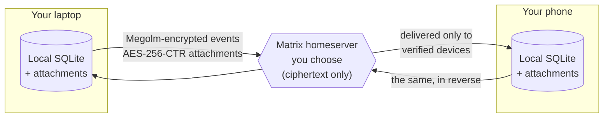
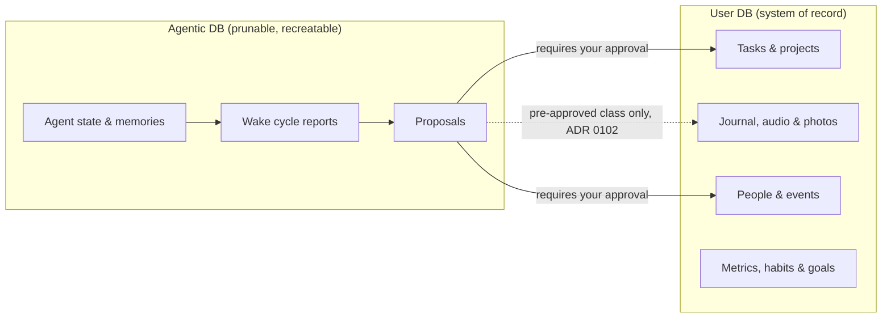

# Lotti

   

[Discord for support](https://discord.gg/uuSaa8NpY)

**A distributed system of record for your memories — kept on your devices,
and nowhere else.**

Everything you capture in Lotti is a memory: a voice note, a screenshot, a
conversation, a photo from a birthday party, an hour of focused work, the
journal entry you spoke into your phone last night. Lotti keeps those memories
on your own devices, syncs them between those devices with end-to-end
encryption, and never uploads them to a cloud. On top of that record sit
applications — tasks, relationships, goals, events, projects, a daily journal —
each looked after by a personal AI agent that reads what you recorded and
proposes what to do next. Agents propose; you decide. Your memories are not
rewritten behind your back, not even by the agents that work for you.

macOS · Linux · Windows · iOS · Android. Flutter and Dart, GPL-3.0, in
development since 2016.

I have tracked around 11,000 hours of my own work in it since 2022.

<!-- All screenshots come from the manual's deterministic fixture pipeline
     (docs-site/metadata/screenshot-cases.json), so they track the build. They
     point at the `development` channel and update when the manual regenerates;
     if a case id is ever renamed, these links need renaming with it. -->
<picture>
  <source media="(prefers-color-scheme: dark)" srcset="https://pub-3df7bcf4b8ca493fa6acea182d69d9c7.r2.dev/manual/screenshots/development/tasks/workspace/desktop-dark.webp">
  
</picture>

[Read the manual](https://matthiasn.github.io/lotti/manual/development/) ·
[Install](#install) ·
[Blog series](https://matthiasnehlsen.substack.com/p/meet-lotti)

---

## The vision: a system of record you own

Most personal software treats your life as content to be stored on someone
else's computer and mined. Lotti starts from the opposite premise: your
memories are a *record*, and a record is only worth something if it is
complete, unaltered, and yours. Three principles follow from that.

### 1. Your memories live only on your devices

There is no Lotti cloud, no Lotti account, and no server that stores your
memories. Each device holds the full record in a local SQLite database, with
audio, images and other attachments beside it on the filesystem. No telemetry,
no analytics, and nothing uploaded to Lotti — you can confirm that by reading
the source or watching the traffic.

The record is *distributed*, not centralised: every device you pair is a full
peer. A phone, a laptop and a desktop each carry the whole history, and losing
one costs you nothing as long as another survives. Your data is a file you
already have, with a documented schema, so there is no export wizard and
nothing to unlock.

### 2. Sync is end-to-end encrypted, between your own devices

Devices talk to each other through an encrypted relay rather than a storage
service. The relay is a [Matrix](https://matrix.org) homeserver (Synapse) that
you, or someone you trust, operates. It forwards ciphertext between your
devices and never holds a key that could read it.

```mermaid
flowchart LR
    subgraph D1["Your laptop"]
        L1[(Local SQLite<br/>+ attachments)]
    end
    subgraph D2["Your phone"]
        L2[(Local SQLite<br/>+ attachments)]
    end
    R{{"Matrix homeserver<br/>you choose<br/>(ciphertext only)"}}
    L1 -- "Megolm-encrypted events<br/>AES-256-CTR attachments" --> R
    R -- "delivered only to<br/>verified devices" --> L2
    L2 -- "the same, in reverse" --> R
    R --> L1
```

How it works:

- **Encryption.** Each change is sent as an event in a private, non-federated
  sync room created with Matrix's `m.megolm.v1.aes-sha2` encryption. Room
  messages are encrypted with Megolm, and the Megolm session keys are exchanged
  between devices over Olm, using the [Vodozemac](https://github.com/matrix-org/vodozemac)
  implementation of both. Audio and images are uploaded as Matrix encrypted
  attachments: AES-256-CTR with a per-file key, IV and SHA-256 hash that travel
  only inside the encrypted event.
- **Only verified devices get keys.** Keys are shared only with devices you
  have verified yourself through an emoji comparison. A device that joins the
  account without completing verification receives ciphertext it cannot read,
  and incoming events from unverified devices — or anything sent in plaintext —
  are dropped rather than applied, so whoever operates the server cannot inject
  changes into your record.
- **The server never sees plaintext.** What it can see is metadata: the account
  ID and room name, which device synced and when, IP addresses, device display
  names, and the size of events and files. Not their content.
- **The relay is not an archive.** Sync rooms carry a 30-day
  `m.room.retention` policy. Synapse only enforces that when the operator turns
  retention on (and media retention separately); the optional
  [provisioning service](services/matrix-provisioning-service/README.md) runs
  its own purge by default. Either way, the durable copy of your record is on
  your devices, not on the relay.
- **Conflicts are resolved, not overwritten.** Every entry carries a vector
  clock keyed by device, so a device that was offline for a week rejoins
  without losing writes, and genuinely concurrent edits surface as conflicts
  for you to resolve. Devices also track each other's counters and ask a peer
  to re-send anything missing.

### 3. Memories stay unaltered, with clear provenance

A system of record is worthless if it can be quietly edited. Lotti keeps *what
you said and did* and *what an agent thinks* in separate databases on disk, and
agent-authored changes reach your record through a code path that requires
your approval: an agent suggests, and nothing happens until you confirm. A
confirmed checklist change keeps an approval receipt, and the writes an agent
makes without asking are logged in its audit trail.

A small, named class of writes is pre-approved rather than proposed, because
asking every time would add friction without telling you anything new:
filling in the title and language of a task that has none, transcribing a
recording, adding an AI summary or image analysis as a *new* entry beside your
own, generating cover art, and the day planner's triage. That class is fixed by
[ADR 0102](docs/adr/0102-pre-approved-agent-changes.md) and can only grow by
another decision record. Some things are human-only by construction: an event
agent has no tool that can set an event's rating or cover photo.

Signed provenance is the next step. The cryptographic building blocks —
canonical encoding, Ed25519 signatures, and an envelope that chains each
device's entries together — [are in the codebase](knowledge/features/provenance.md)
and modelled in TLA+, so that every entry will carry a verifiable record of who
authored it: you, an agent under a consent you gave, or an agent proposal you
approved. Entries are not signed yet.

See [Two databases](#two-databases-human-in-the-loop-by-construction) for how
the separation is enforced.

---

## Applications on top of the record

The storage layer is the product's foundation; the applications are what you
use every day. Each one reads from the same record, and each can be given a
persistent AI agent with its own report, memory, wake schedule and proposal
history. Tasks and the journal are on by default; the other applications are
**Sections** you switch on under Settings → Sections. Turning a section off
only hides it — nothing you recorded is deleted.

### Tasks, with task agents and pull request tracking

Every screenshot and audio recording is a memory, attached to the work it
belongs to. A rambling voice note comes back as a task with a checklist.

A **task agent** reads everything linked to a task and keeps a living report.
It proposes changes rather than making them: a title, an estimate, a due date,
priority or status, new or ticked-off checklist items, labels, follow-up tasks,
links to related tasks, time entries. Each proposal waits for you to confirm or
dismiss it. Automatic updates decide when the agent wakes, not what it may
change.

  <picture>
    <source media="(prefers-color-scheme: dark)" srcset="https://pub-3df7bcf4b8ca493fa6acea182d69d9c7.r2.dev/manual/screenshots/development/tasks/agent-suggestions/mobile-dark.webp">
    
  </picture>

**Pull request tracking** closes the loop between what you planned and what
actually shipped. Turn it on for a task from its "+" menu, link one or more
GitHub pull requests, and Lotti keeps a summary of each — a one-liner and a
TL;DR — refreshed when you open the task or ask it to. The pull requests become
part of the task agent's context, so it can propose ticking off the checklist
items a merged PR actually covers, naming the PR as its evidence. You still
confirm each one. A personal access token, kept in the device keystore and
synced end-to-end encrypted, is only ever sent to `api.github.com`.

**Coding prompts** and other briefs are a skill you trigger: they turn a task
plus your notes into a coding, design, image or research prompt you can paste
into the tool of your choice.

### Relationships, with a relationship agent

The People section is for the relationships you want to look after. Record a
conversation, or dictate afterwards who you spoke to and what you talked about;
a check-in holds the recordings, transcripts, notes and photos.

Mark someone as important and they get a **relationship agent**. Before you
meet again it gives you a briefing: what was discussed last time, how things
have been going, suggested talking points, and what to pay attention to or
steer clear of. It reminds you when it has been too long, and it can propose up
to three tasks arising from a conversation — each waiting for your
confirmation.

### Goals, with goal agents

Define a goal — hours on a category or label, a measurement you track — and a
**goal agent** watches your actual record against it. A deterministic evaluation runs
every day at no inference cost. When you drift off track, the agent reminds
you, with an OS notification and a banner explaining what slipped; when you are
on track, it stays out of your way, its report records the progress, and you
can ask it for an encouraging nudge. If the goal itself no longer fits, it can
propose a revision, which you approve.

### Events

Track the events that matter — a trip, a birthday party, a gathering — with the
photos, recordings and notes that belong to them. An **event agent** narrates
what you captured into a short living recap. The star rating and cover photo
stay yours alone: the agent has no tool that can set them.

### Projects

A project groups the tasks that serve one outcome. A **project agent** keeps a
report on what is going on: current status, a health verdict, what is still
missing, and recommended next steps. It can propose a status change or a new
task for your approval. The project's summary also flows into every task
agent's context, so work on a single task is informed by the project it
belongs to.

### Daily journal

Speak or type a journal entry, attach photos, or let a day's recordings stand
as they are. Transcription runs locally with Whisper or Voxtral if you want it
to, and your journal can be routed to a local model — or to no model at all.
The journal is the purest form of the record: your words, kept as you said
them, on your devices — read by no model unless you route it to one.

### You choose the brain, and you can see what it cost

Lotti has no inference backend. Route each category of your life to the compute
you are willing to stand behind: a local model for the private things, a
frontier model for work, or the European option Lotti recommends. The usage
view reports tokens and requests for every cloud call, and spend, energy and
CO₂e for the providers that report them — today that means Melious. Local
inference is not measured at all, because the cost moves onto your own hardware
and grid.

<picture>
  <source media="(prefers-color-scheme: dark)" srcset="https://pub-3df7bcf4b8ca493fa6acea182d69d9c7.r2.dev/manual/screenshots/development/ai/usage/desktop-dark.webp">
  
</picture>

### The sync protocol and the agent runtime are formally verified

Keeping several devices consistent without a server in charge is a
distributed-systems problem, and it is treated as one. The parts where
concurrency and crashes could lose or duplicate your data — the sync log, how
agents are woken and recover after a crash, how a confirmed suggestion is
applied when two devices race, how synced agent state converges, the agents'
message log, pull request tracking, and the Daily OS jobs — are written down as
[50 TLA+ models](specs/tla/README.md) and model-checked with TLC every night
across 177 configurations, under crashes, injected failures, clock skew and
messages arriving in any order ([the ledger](specs/tla/LEDGER.md) keeps the
running totals). No saved change is ever declared lost, and as long as devices
keep reconnecting and a failed send is retried, every saved change reaches every
device. A double tap never applies a confirmed change twice. Checking the models
found and closed dozens of real bugs. These are statements about the design, not
a proof that every line of code matches it; [the specs](specs/tla/README.md) say
exactly what is covered and which cases remain open, and generated traces drive
the real code through the same scenarios. The code is held to them the ordinary
way, too: over 35,000 tests at 99.9% line coverage, including more than 900
property-based tests.

---

## Install

| Platform                 | Where to get it                                                                                                                                 |
|--------------------------|-------------------------------------------------------------------------------------------------------------------------------------------------|
| **Linux**                | [Flathub](https://flathub.org/en/apps/com.matthiasn.lotti) (recommended), or AppImage or `tar.gz` on [Releases](https://github.com/matthiasn/lotti/releases) |
| **Android**              | APK on [Releases](https://github.com/matthiasn/lotti/releases), or Play Store internal testing (limited; invitation only)                        |
| **macOS**                | Signed and notarized DMG on [Releases](https://github.com/matthiasn/lotti/releases)                                                             |
| **iOS / iPadOS / macOS** | TestFlight (limited; invitation only), with broader availability planned                                                                        |
| **Windows**              | Build from [source](docs/DEVELOPMENT.md) for now                                                                                                |

**AppImage (Linux, no app store):** download `Lotti-<version>-x86_64.AppImage`
from [Releases](https://github.com/matthiasn/lotti/releases), mark the
downloaded file executable (`chmod +x` on it, or your file manager's
permissions dialog) and start it. It brings its own media, keychain and
recording libraries and runs on distributions from 2022 on
(glibc 2.35 or newer: Ubuntu 22.04, Debian 12, Fedora 36 and later) that have
GTK 3 and Mesa's OpenGL ES, as any GNOME or KDE desktop does. It mounts itself
with FUSE, which desktops ship by default; where FUSE is missing, run it with
`--appimage-extract-and-run`. Unlike Flathub, it does not update itself.

---

## Features at a glance

### Capture

- **Audio recording** anywhere in the app, transcribed locally with Whisper
  (99 languages) or Voxtral, or through a cloud provider with audio support.
- **Entries**: notes, images, screenshots, measurements, and surveys, attached
  to the work, person, event or day they belong to.

### Organize and reflect

- **Tasks** with full lifecycle (open, groomed, in progress, blocked, on hold,
  done, rejected), checklists, estimates, priorities, due dates, labels, linked
  context, optional generated cover art, and linked GitHub pull requests.
- **Time tracking** recorded against the plan rather than instead of it, with
  focus ratings. A task describes the outcome you want; a time record describes
  what actually happened. Lotti keeps them as separate facts, so the record
  stays honest when the week gets noisy.
- **Time analysis** over categories, habits, and measurements.

<picture>
  <source media="(prefers-color-scheme: dark)" srcset="https://pub-3df7bcf4b8ca493fa6acea182d69d9c7.r2.dev/manual/screenshots/development/time-analysis/overview/desktop-dark.webp">
  
</picture>

- **Categories and labels** to make the boundaries that your decisions
  actually use.
- **Habits, measurables, and health data** imported from Apple Health and
  other sources.
- **Sections** you switch on under Settings → Sections: Daily OS, Projects,
  Goals, Habits, Dashboards, People and Events. They are in daily use, but ship
  switched off; expect rough edges.

### AI and automation

- **Agents for every application**: task, project, goal, relationship and event
  agents, plus a day planner. Each keeps its own report, memory and proposal
  history.
- **Providers, models, and inference profiles** as three separate layers, so
  routing is explicit and the blast radius of a change is visible before you
  make it.
- **A European route, offered rather than imposed.** Onboarding highlights
  [Melious.ai](https://melious.ai), an OpenAI-compatible EU endpoint serving
  open-weight models. You bring your own key and hold your own contract with
  whoever you pick.
- Works with everything else too: OpenAI, Anthropic, Mistral, Google, Alibaba,
  Nebius, OpenRouter, Ollama, or any OpenAI-compatible endpoint, including a
  custom base URL pointed at your own gateway.
- **Agent templates and souls**: a template defines a responsibility, a soul
  defines voice, tone bounds, coaching style, and an anti-sycophancy policy.
  Both are versioned, both are improved through reviewable 1-on-1 sessions, and
  both can be rolled back.
- **Grievances and 1-on-1s.** When an agent annoys you, say so — no form and no
  magic phrase required. It records the grievance and brings it up in the next
  1-on-1, where the two of you reconcile what changes. The result is an
  assistant that evolves rather than one you configure once.
- **Contextual skills** for work that does not need a durable agent, including
  the prompt generators described above.
- **Usage and impact**: tokens and requests by period, category and model for
  every cloud call, plus cost, energy and CO₂e wherever the provider reports
  them — currently Melious. Other providers return token counts only, so those
  columns stay empty rather than being estimated.
- Turn all of it off. Lotti is useful without any inference configured.

### Sync and data

- End-to-end encrypted sync across your devices, backed by a Synapse
  homeserver you or someone you trust operates — see
  [the vision](#2-sync-is-end-to-end-encrypted-between-your-own-devices) for
  how it works.
- The first device is set up against a homeserver with the included
  [`tools/matrix_provisioner`](tools/matrix_provisioner) CLI or the optional
  [provisioning service](services/matrix-provisioning-service/README.md), which
  create the sync account and encrypted room and produce a single-use pairing
  bundle. On Linux you can also enter an existing Matrix account directly.
- Every device after that pairs from one you already use: scan a QR code,
  compare a check code shown on both screens, then complete emoji verification.
  The pairing QR carries the sync account's credentials, so treat it like a
  password. Until verification finishes, the new device receives ciphertext it
  cannot read.
- **Your data is a file you already have.** Local SQLite with a documented
  schema, plus attachments on the filesystem.

---

## Two databases, human-in-the-loop by construction

Lotti keeps *what you said and did* and *what an agent thinks* in different
databases on disk.

The **user database** is the system of record: tasks, notes, audio, photos,
time recordings, journal entries, people, events. It is treated with care, and
agents do not write into it freely.

The **agentic database** is agent working memory: definitions, memories, wake
history, reasoning traces, reports, proposals. It may grow and it may be
pruned. It can be thrown away and rebuilt without losing anything that matters
about *you*.

```mermaid
flowchart LR
    subgraph Agentic["Agentic DB (prunable, recreatable)"]
        A[Agent state & memories]
        W[Wake cycle reports]
        S[Proposals]
    end
    subgraph User["User DB (system of record)"]
        T[Tasks & projects]
        J[Journal, audio & photos]
        P[People & events]
        M[Metrics, habits & goals]
    end
    A --> W --> S
    S -->|requires your approval| T
    S -->|requires your approval| P
    S -.->|pre-approved class only, ADR 0102| J
```

The rule matters because of how it is enforced. Agent-authored content sits in
a different file on disk and reaches the user database only through a code path
that requires your approval, or through one of the pre-approved paths listed in
[ADR 0102](docs/adr/0102-pre-approved-agent-changes.md): an empty task's title
and language, transcription, AI summaries and image analysis added as new
entries, cover art, and the day planner's triage. Every other change an agent
wants to make to your record is a proposal you confirm or dismiss. Both
databases sync between your devices the same way.

---

## Privacy, sovereignty, and where your compute happens

Three different claims get flattened into the word "private." Lotti makes all
three. They are worth separating, because they fail in different ways.

### Your record is not collected

Lotti collects nothing — the record stays on your devices, as described in
[the vision](#1-your-memories-live-only-on-your-devices). Two things do leave,
both because you configured them: ciphertext to the homeserver you chose, and
inference requests to the provider you chose (plus, if you turn on pull request
tracking, requests to the GitHub API).

*The other side of that:* there is no server-side backup and no account
recovery, because no server holds a readable or lasting copy of your data.
Sync is the redundancy story — but it is not automatic history. Pairing a
device gives it everything written *from then on*; your existing settings and
back catalogue arrive only when you run *Send settings* and *Send message
history* from the device that already has them. Until you do, the new device is
a live peer, not a backup. Do that early, and a second device means losing one
costs you nothing.

Keep an ordinary backup as well, since replication covers hardware loss and a
backup covers everything else. Your record is a SQLite database sitting on your
own disk with a documented schema, so reading it takes a query rather than
permission. Take a consistent copy with `VACUUM INTO` while the app is running,
and bring the attachments directory along with it, because audio and images
live on the filesystem rather than in the database.
<!-- TODO: link a manual page giving the database and attachment paths per
     platform. Without it, "you have access" is true and unactionable. -->
On a phone the database sits inside the app sandbox, so the practical route
there is to pair a desktop and take the copy from that peer.

Deleting works the other way round, and the order matters: delete entries *in
the app* rather than deleting the database files. Purging removes an attachment
by walking the deleted rows that still point at it, so a database removed first
leaves its audio and images orphaned on disk. Paired devices and ordinary
backups keep their own copies either way, and anything already sent to a
provider is subject to that provider's retention, not yours.

*What this does not protect against:* a compromised device. The on-device
SQLite files live inside your OS user account and are not separately encrypted
by Lotti today — and that includes the sync account's tokens and encryption
identity. App-level at-rest encryption is a candidate for the roadmap; until it
lands, give Lotti's on-device data the same care you would give any personal
app on the same machine, and weigh that before putting your most sensitive
categories in it.

### Your sync infrastructure is yours

Sync runs over Matrix with Vodozemac for end-to-end encryption, against a
Synapse homeserver you or someone you trust operates. The relay only ever
handles ciphertext, keys go only to devices you verified, and both databases
sync this way. The details are in
[the vision](#2-sync-is-end-to-end-encrypted-between-your-own-devices).

*What this does not protect against:* metadata. Whoever runs the homeserver can
observe your account, which devices synced and under what device names, from
which IP addresses, when, and roughly how much. Not what. And how long the relay
keeps ciphertext depends on whether its operator enables retention.

### Your inference is a routing decision

Lotti has no inference backend. Every AI call goes to a provider you
configured, under your own account and API key, and you choose per category
which provider that is. Work can go to a frontier model while a journal stays
on a local one. That granularity is the entire point.

**Onboarding highlights a European route.** [Melious.ai](https://melious.ai) is
a German company routing open-weight models across a network of EU
infrastructure providers, independently verified at
[staysin.eu](https://staysin.eu/api.melious.ai). They state that requests are
not used for training and that data stays under European jurisdiction. Those
are their claims, on their terms, and worth reading in full before you rely on
them.

Mistral, Google, Alibaba, OpenAI, Anthropic, OpenRouter, and any other
OpenAI-compatible endpoint work equally well. Lotti does not rank them, does
not summarise their terms, and cannot verify anyone's claims about jurisdiction,
retention, or training. Picking a provider is your decision and the due
diligence is yours.

What Lotti does instead is refuse to let the decision be invisible:

- Routing is configured per category, ahead of time, rather than negotiated in
  the moment — so which provider a given piece of work goes to is a setting you
  chose, not a prompt you clicked past. The flip side is that there is no
  just-in-time notice at the point an agent or a transcription fires; the
  onboarding and settings screens are where that decision is made and shown.
- A friendly display name is not the security boundary. The provider detail
  view shows the actual base URL, the models attached to it, and every profile
  that depends on them.
- Usage & Impact logs every request that left the machine and which model served
  it, with token counts throughout and cost, energy and CO₂e wherever the
  provider reports them.

A LAN endpoint is worth the same scrutiny. "Local" means it did not go to a
hosted provider, not that no network hop occurred.

*What this does not protect against:* a provider that does not do what its
terms say. Nothing in Lotti can verify that, and neither can anyone else from
the outside. What Lotti can do is show you every request it made, where it
went, and what it cost.

### Running it all locally

Local inference is finally good enough to drive the agents. **Qwen 3.6 35B A3B**
is the model validated in daily use here — 35B parameters with roughly 3B active
per token, which is what makes it practical on a personal machine while still
being smart enough for the agentic loop. Others probably work too.

It is power-hungry. Tested extensively on an M4 Max with 128 GB of RAM, the
laptop is audible under sustained agent load and the battery drains noticeably
faster than during normal work. Feasible, not free.

Hybrid is the realistic answer, and it is how I run it: a local model for the
private categories, a cheap cloud model such as Gemini Flash for open-source
work and everyday task management. Speech is fully offline via Whisper or
Voxtral either way. Image generation is the one thing with no local path yet —
cover art goes through Gemini or Alibaba.

### Energy is a routing decision too

Inference runs in a physical building on a specific grid. The **Usage & Impact**
view reports tokens and requests for every cloud call, broken down by category
and by model, so "what did my thinking cost" has an answer rather than a vibe.

How complete that answer is depends on the provider. Cost, energy, CO₂e and
water are recorded when the provider returns them with the response, which today
means Melious; every other provider reports token counts only, and those columns
stay empty rather than being filled with an estimate. That is a real limit on the
dashboard: route your work through a provider that discloses nothing, and the
impact of that work is not something Lotti can show you.

The route highlighted in onboarding publishes power usage effectiveness per
datacenter and carries Green Web Foundation verification, which is more than
most disclose. Running a model locally moves the cost onto your own hardware
and your own grid, which is a different trade rather than a free one, and the
dashboard does not measure it.

Choosing a renewable-powered route avoids outsourcing the health and climate
cost of fossil-powered compute, gas turbine generation in particular, to
communities with less power to refuse it. That is a reason to care where your
tokens get processed even if you do not care who reads them.

### If none of that satisfies you

Turn AI off. Configure no provider at all, or point every category at Ollama
with local Whisper for speech. Lotti is a complete task manager, time tracker,
and journal without a single inference call leaving the machine.

---

## In development

Built and documented, but not enabled in a default build. Turn it on under
Settings → Sections, and expect it to change.

- **Daily OS** turns a spoken or typed check-in into a plan for one day. It
  reconciles what you said against your real tasks, drafts an agenda against
  your actual capacity, and presents every proposed change with its old time,
  its new time, and the planner's reason. Nothing is committed until you hold
  the confirm control. Wrap-up at the end of the day separates what you
  finished from what carries forward.
  [Documentation](https://matthiasn.github.io/lotti/manual/development/plan-and-capture/daily-os)
- **Signed provenance**: every entry signed by its author and chained per
  device, so the record can prove who wrote what. The cryptographic primitives
  exist; wiring them into the record is the next phase.

Next agent types on the roadmap: week planners, long-term commitment monitors,
and effort-against-goals balancers — same building blocks, different jobs.
Designed but not yet built: learning quizzes. See the
[roadmap](https://matthiasn.github.io/lotti/manual/development/roadmap).

---

## Pricing and sustainability

**Linux is and will always be free, with maximum functionality.** No paywalls,
no upsells. The same promise extends to any future fully open-source mobile
operating system. The one thing it does not include is hosted sync
infrastructure — running a homeserver is a real cost, so you either self-host
Matrix or bring your own.

**On other platforms, the basics stay free too.** Task and journal capture, the
task agent, voice transcription, the everyday loop.

**More advanced agent features may eventually be in-app purchases on platforms
where IAP is the norm** (iOS/macOS, Android, Windows). The candidates: day- and
week-planner agents, overarching project-management agents, longer-horizon
commitment monitors. The exact split is not set yet.

---

## Documentation

- **[Manual](https://matthiasn.github.io/lotti/manual/development/)** — the
  full guide, available in 11 languages. Start with
  [the mental model](https://matthiasn.github.io/lotti/manual/development/getting-started/mental-model)
  if you want to understand the shape of the thing before installing it.
- [Connect an AI provider](https://matthiasn.github.io/lotti/manual/development/ai-and-automation/provider-setup/)
  — local Ollama or cloud Gemini, and the models and profiles around them
- [Task management and voice capture](https://matthiasn.github.io/lotti/manual/development/getting-started/first-task/)
  — the everyday voice-to-checklist workflow
- [Architecture](docs/ARCHITECTURE.md) — the two databases, vector clock sync,
  on-device inference
- [Knowledge bundle](knowledge/index.md) — how the app actually works at
  runtime, subsystem by subsystem, written for contributors and coding agents
  alike; start with [security and privacy](knowledge/architecture/security-and-privacy.md)
  and [sync](knowledge/features/sync/overview.md) for the details behind this
  page
- [Background](docs/BACKGROUND.md) — why this exists
- [Privacy policy](PRIVACY.md) · [Security policy](SECURITY.md)
- [Roadmap](https://matthiasn.github.io/lotti/manual/development/roadmap)

Building it yourself: install Flutter via [FVM](https://fvm.app/) (the repo
includes `.fvmrc`), then `make deps`, `make analyze`, `make test`,
`fvm flutter run -d <device>`. Full setup, including the Linux audio-codec and
emoji-font packages, is in [docs/DEVELOPMENT.md](docs/DEVELOPMENT.md).

---

## Status

The application is in active daily use and the agentic layer is real, working,
and shipping. Development happens in the open, and the [changelog](CHANGELOG.md)
is the honest version of what changed.

Worth knowing if you are picking it up now: the design-system rollout is
partway through, so some screens are polished and others are not. The agentic
layer is young — soul and template ergonomics, grievance handling, and pruning
strategies are all under active development, and feedback there is especially
useful. Local image generation, at-rest database encryption, and signed
provenance do not exist yet.

The manual, including every screenshot in all 11 languages, is generated from a
deterministic fixture workspace, so the documentation cannot quietly drift from
the build it documents.

**Stack**: Flutter and Dart across five platforms, local SQLite via Drift with
ObjectBox for embeddings, Whisper and Voxtral for on-device speech recognition,
Matrix and Vodozemac (Olm/Megolm) for the encrypted sync transport, Glados for
property-based tests, TLA+ and TLC for the formally verified sync protocol and
agent runtime.

---

## Contributing

Two things genuinely help, and one thing to know up front.

**Welcome:**

- **Issues and bug reports** — the best place to start. Tell me what broke and
  how to reproduce it.
- **Translations** — new languages and corrections to existing ones.
  AI-assisted translation is fine **provided you contribute from a real-name,
  established GitHub profile**. Translation PRs are the one kind that gets
  merged.

**Not accepted: code pull requests.** Review capacity is the binding
constraint, Lotti holds people's personal data on their own devices, and
AI-generated code now arrives far faster than it can be reviewed carefully. An
unsolicited code PR will be closed unmerged, with thanks and without review —
so please open an issue instead of writing the patch. It is more useful to me
and cheaper for you.

Lotti is GPL-3.0: fork it and build whatever you like on top for yourself.

[CONTRIBUTING.md](CONTRIBUTING.md) has the details, including what makes a
translation PR mergeable.

## License

GPL-3.0. See [LICENSE](LICENSE).

## Acknowledgments

Thanks to the [Flutter](https://flutter.dev) team, the
[Qwen](https://github.com/QwenLM) and [Mistral](https://mistral.ai) teams for
their open-weights models, [OpenAI](https://openai.com) for the
[Whisper](https://github.com/openai/whisper) weights, the
[Ollama](https://ollama.com) project, the [Matrix.org](https://matrix.org)
community, the [Vodozemac](https://github.com/matrix-org/vodozemac) authors, and
everyone contributing translations, issues, and ideas.

---

Built in public. [GitHub](https://github.com/matthiasn/lotti) ·
[Substack](https://matthiasnehlsen.substack.com)
