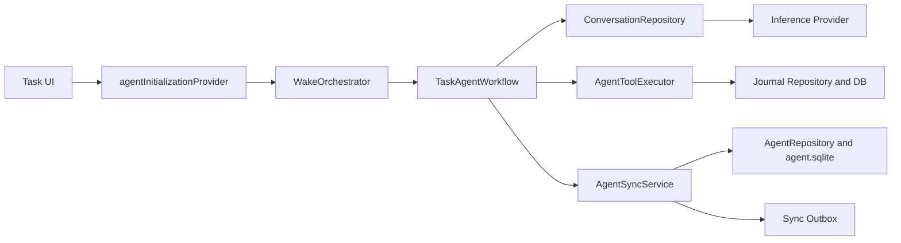
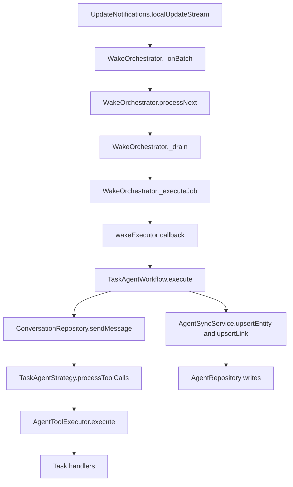
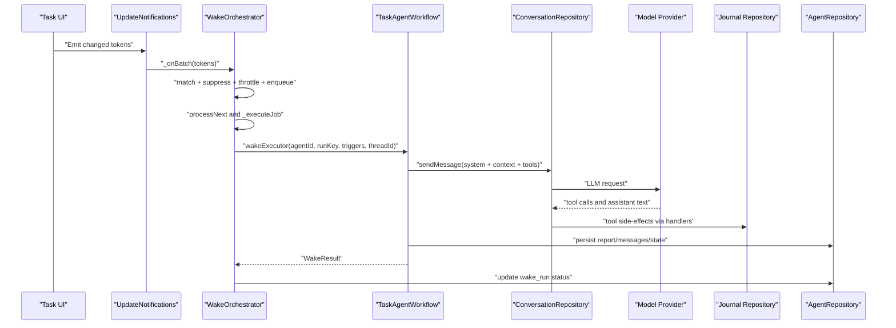

# ADR 0001: Agent Capabilities Runtime Model

- Status: Accepted
- Date: 2026-02-27

## Context

Agent Capabilities now includes persistent task agents and template evolution
sessions. The system must stay robust under app restarts, cross-device sync,
and bursty task updates while remaining testable and easy to evolve.

## Decision

1. Keep two persistence domains:
   - Journal domain (`db.sqlite`) for task/checklist source-of-truth
   - Agent domain (`agent.sqlite`) for agent identity/state/messages/reports,
     template versions, and wake runs
2. Execute task agents through a single orchestration path:
   - `WakeOrchestrator` manages subscription matching, suppression, throttling,
     and queue/drain execution
   - `TaskAgentWorkflow` owns context assembly, conversation execution, tool
     routing, and sync-aware persistence
3. Build linked-task context from linked task-agent reports:
   - Use `latestTaskAgentReport` from linked task agents
   - Strip `latestSummary` from linked task payloads before prompt submission
4. Keep state-layer wiring provider-first:
   - Riverpod providers assemble orchestrator/workflow/runtime dependencies
   - GetIt access is isolated behind dependency providers where needed

## Architecture Snapshot

## Wake Call Tree

## Wake Sequence

## Consequences

- Task-agent context reflects the latest durable agent output instead of summary
  snapshots that are being phased out.
- Wake behavior is deterministic and easier to reason about because matching,
  suppression, throttle timing, and drain execution are centralized.
- Cross-device behavior remains consistent because all agent writes flow through
  `AgentSyncService`.
- Test harnesses can override runtime wiring at provider boundaries without
  rewiring global runtime setup.

## Related

- `lib/features/agents/README.md`
- PR `#2710`
