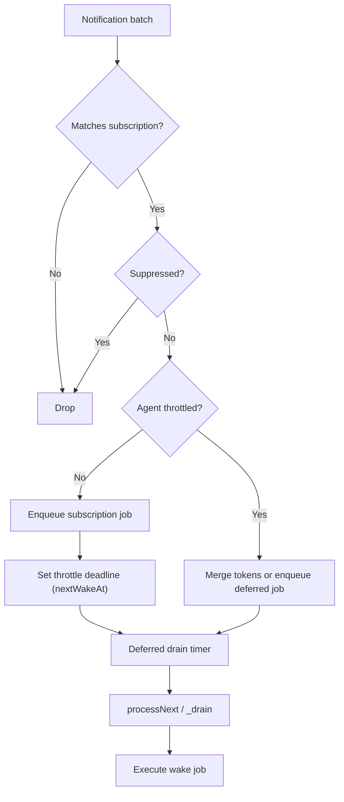
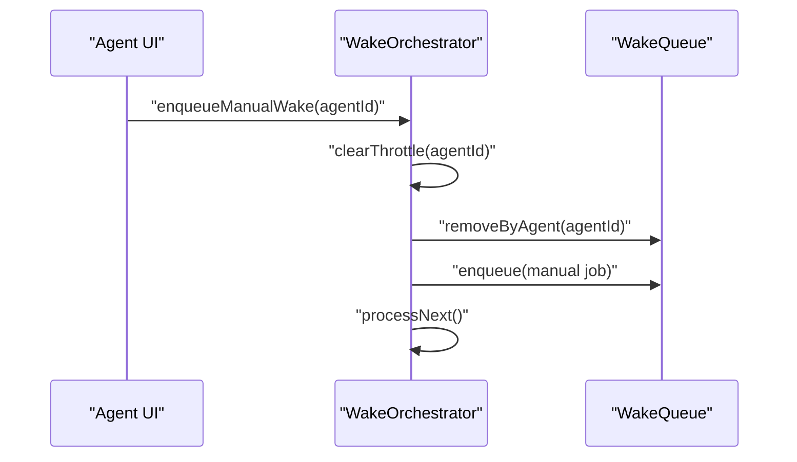

# ADR 0002: Wake Scheduling and Throttling Policy

- Status: Accepted
- Date: 2026-02-27

## Context

Task edits can arrive in bursts while a wake is already running. The runtime
needs deterministic behavior for queueing, throttling, and manual reanalysis
without double-running an agent.

## Decision

1. Use defer-first scheduling for subscription wakes:
   - First matching subscription signal enqueues a wake and starts a throttle
     window (`120s`) before drain.
2. Coalesce incoming tokens per agent while queued/throttled:
   - Merge tokens into the first queued job for that agent instead of
     creating duplicate jobs.
3. Manual wakes override queued subscription work:
   - Clear throttle for the agent.
   - Remove queued jobs for the same agent.
   - Enqueue one manual job immediately.
4. Keep drain single-flight:
   - `processNext()` is guarded so only one drain loop runs at a time.
   - New drain requests set a flag and are handled by the active loop.
5. Persist throttle state:
   - Persist `nextWakeAt` on set/clear so UI and restart behavior stay
     consistent.
6. Keep a safety net:
   - Periodic timer (`60s`) triggers drain when queue has pending jobs and
     no drain is active.

## Scheduling Flow

## Manual Wake Override

## Consequences

- Bursty edits collapse into one queued wake per agent with merged tokens.
- Manual reanalysis runs immediately and supersedes stale queued subscription
  work.
- Throttle behavior survives app restarts via persisted `nextWakeAt`.
- Drain execution remains deterministic without overlapping loops.

## Related

- `lib/features/agents/wake/wake_orchestrator.dart`
- `lib/features/agents/wake/wake_queue.dart`
- `lib/features/agents/wake/run_key_factory.dart`
