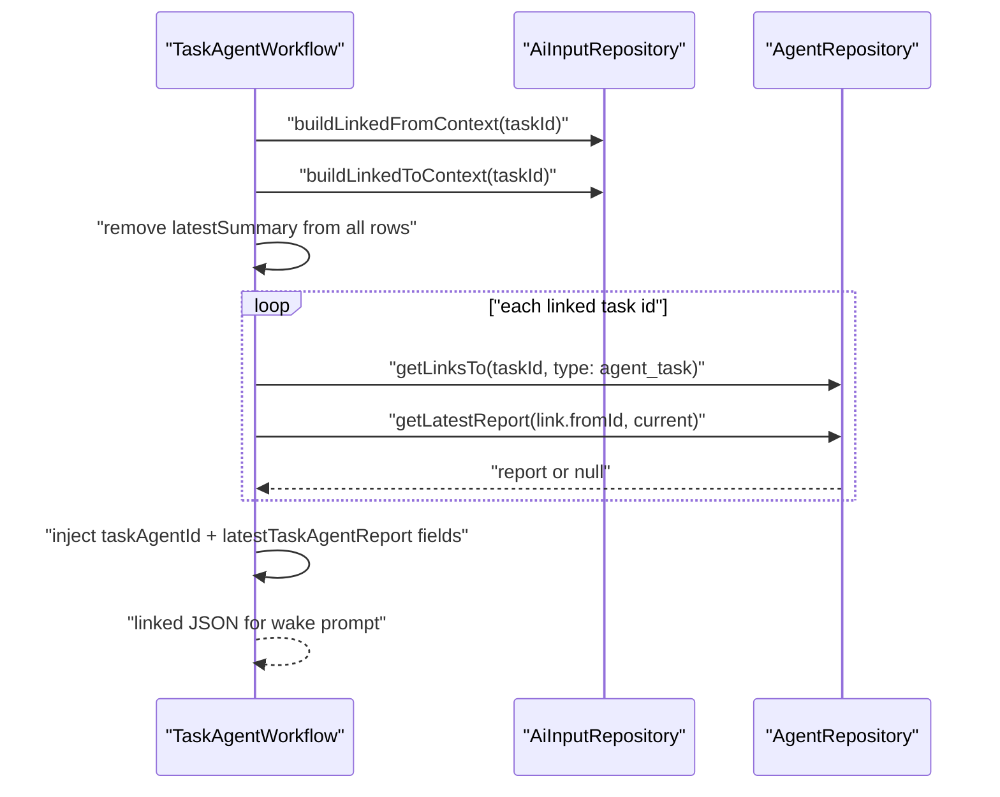
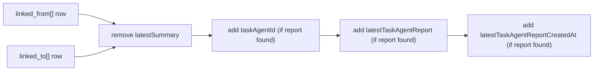

# ADR 0003: Task Agent Linked-Task Context Contract

- Status: Accepted
- Date: 2026-02-27

## Context

Task-agent wake prompts need linked-task context, but linked task summaries are
being phased out. The wake path must consume linked task-agent reports instead
and remain resilient when linked context/report resolution fails.

## Decision

1. Build linked-task context on the task-agent wake path via
   `TaskAgentWorkflow._buildLinkedTasksContextJson` (forked shape from
   `AiInputRepository.buildLinkedTasksJson`).
2. Source linked task lists from:
   - `AiInputRepository.buildLinkedFromContext(taskId)`
   - `AiInputRepository.buildLinkedToContext(taskId)`
3. Remove `latestSummary` from all linked-task rows before prompt submission.
4. Inject task-agent report fields when available:
   - `taskAgentId`
   - `latestTaskAgentReport`
   - `latestTaskAgentReportCreatedAt`
5. Resolve linked task agent by `agent_task` links sorted by:
   - primary: `createdAt` descending
   - secondary: `link.id` ascending (deterministic tie-breaker)
6. Keep failures non-fatal:
   - If linked-task context building fails, return `'{}'`.
   - If report lookup for one linked task fails, skip injection for that task.

## Context Build Sequence

## Data Shape

## Consequences

- Task-agent prompts no longer rely on task summaries.
- Linked-task report selection is deterministic under equal link timestamps.
- Linked-task context failures cannot abort wake setup.

## Related

- `lib/features/agents/workflow/task_agent_workflow.dart`
- `lib/features/ai/repository/ai_input_repository.dart`
