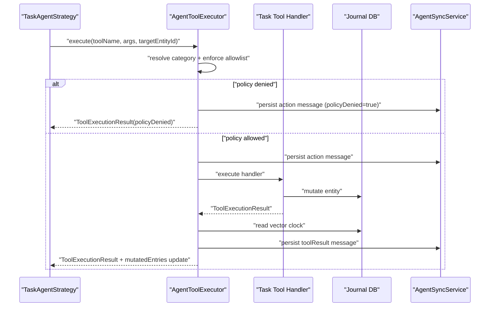

# ADR 0004: Task Agent Tool Execution Policy and Audit Trail

- Status: Accepted
- Date: 2026-02-27

## Context

Tool calls are the mutation boundary between LLM output and journal data. The
runtime needs strong policy enforcement, durable audit messages, and explicit
self-notification suppression data.

## Decision

1. Enforce category scope fail-closed in `AgentToolExecutor`:
   - Resolve target entity category before mutation.
   - Deny when category is missing or not in agent allowlist.
2. Persist action/result audit messages for each tool call:
   - Persist action message before execution.
   - Persist tool result message after execution.
   - Record policy denial metadata when denied.
3. Use deterministic operation IDs:
   - Derive `operationId` from run key + tool/action stable inputs.
4. Capture vector clocks after successful mutations:
   - Read vector clock of mutated entity.
   - Expose map of `mutatedEntries` for orchestrator suppression.
5. Keep audit write failures non-fatal where possible:
   - Do not mask policy decisions or handler outcome when audit writes fail.

## Tool Call Flow

## Consequences

- Tool scope is enforced consistently before mutations.
- Audit history is durable and tied to deterministic operation IDs.
- Orchestrator suppression gets precise post-mutation vector clocks.

## Related

- `lib/features/agents/tools/agent_tool_executor.dart`
- `lib/features/agents/workflow/task_agent_strategy.dart`
