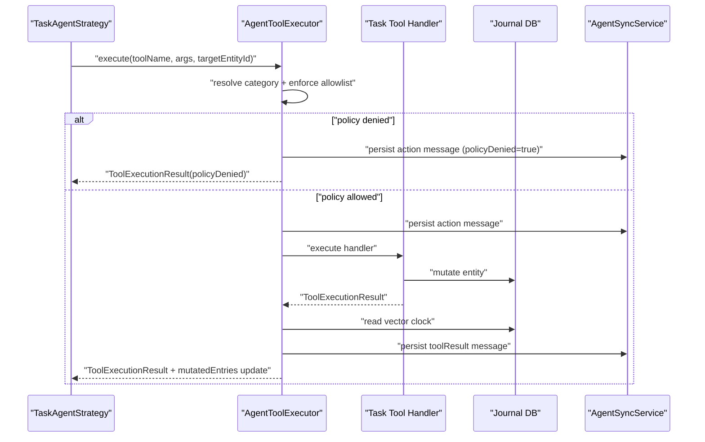

# ADR 0004: Task Agent Tool Execution Policy and Audit Trail

- Status: Accepted
- Date: 2026-02-27

## Context

Tool calls are the mutation boundary between LLM output and journal data. The
runtime needs strong policy enforcement, durable audit messages, and explicit
self-notification suppression data.

## Decision

1. Enforce category scope fail-closed in `AgentToolExecutor`:
   - Resolve target entity category before mutation.
   - Deny when category is missing or not in agent allowlist.
2. Persist action/result audit messages for each tool call:
   - Persist action message before execution.
   - Persist tool result message after execution.
   - Record policy denial metadata when denied.
3. Use deterministic operation IDs:
   - Derive `operationId` from run key + tool/action stable inputs.
4. Capture vector clocks after successful mutations:
   - Read vector clock of mutated entity.
   - Expose map of `mutatedEntries` for orchestrator suppression.
5. Keep audit write failures non-fatal where possible:
   - Do not mask policy decisions or handler outcome when audit writes fail.

## Tool Call Flow

```mermaid
sequenceDiagram
  participant S as "TaskAgentStrategy"
  participant E as "AgentToolExecutor"
  participant H as "Task Tool Handler"
  participant J as "Journal DB"
  participant A as "AgentSyncService"

  S->>E: "execute(toolName, args, targetEntityId)"
  E->>E: "resolve category + enforce allowlist"
  alt "policy denied"
    E->>A: "persist action message (policyDenied=true)"
    E-->>S: "ToolExecutionResult(policyDenied)"
  else "policy allowed"
    E->>A: "persist action message"
    E->>H: "execute handler"
    H->>J: "mutate entity"
    H-->>E: "ToolExecutionResult"
    E->>J: "read vector clock"
    E->>A: "persist toolResult message"
    E-->>S: "ToolExecutionResult + mutatedEntries update"
  end
```

## Consequences

- Tool scope is enforced consistently before mutations.
- Audit history is durable and tied to deterministic operation IDs.
- Orchestrator suppression gets precise post-mutation vector clocks.

## Addendum 2026-04-18: `retract_suggestions`

The task-agent tool surface gained `retract_suggestions`, an immediate
(non-deferred) tool that lets the agent withdraw its own previously
proposed change items without a user prompt. It fits the same execution
policy as the other immediate tools (`update_report`,
`record_observations`, `get_related_task_details`):

- Routed through `TaskAgentStrategy.processToolCalls` and dispatched via
  `SuggestionRetractionService`.
- Action + tool-result messages are persisted on the same audit path as
  any other tool call, so every retraction leaves an auditable trail.
- The mutation target is agent-side state only (`ChangeSetEntity` +
  `ChangeDecisionEntity` in `agent.sqlite`). No journal entity is touched,
  so category-scope enforcement is inherited from the owning task but
  does not require resolving a separate target entity category.
- Concurrency: `SuggestionRetractionService` writes the decision record
  first, then re-reads the parent change set before transitioning the
  item — same ordering as `ChangeSetConfirmationService.confirmItem`.
  Racing a user confirmation produces either outcome (confirmed or
  retracted) cleanly; both leave a matching decision record.

## Related

- `lib/features/agents/tools/agent_tool_executor.dart`
- `lib/features/agents/workflow/task_agent_strategy.dart`
- `lib/features/agents/service/suggestion_retraction_service.dart`
