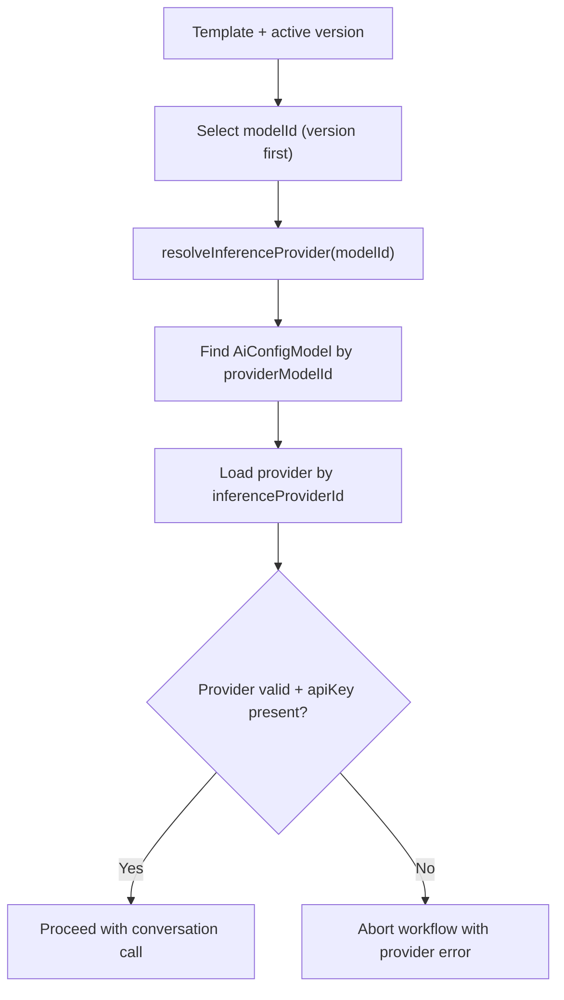
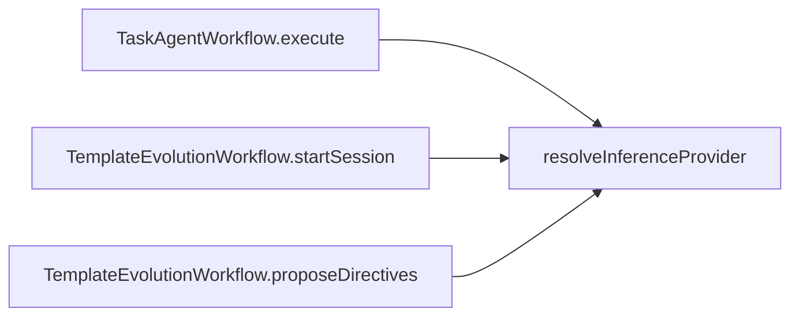

# ADR 0005: Template Model and Provider Resolution Policy

- Status: Accepted
- Date: 2026-02-27

## Context

Task-agent and template-evolution workflows both rely on template-selected
model IDs. Runtime provider selection must stay deterministic and fail clearly
when configuration is incomplete.

## Decision

1. Model selection precedence for task-agent wake:
   - Use active template version model when present.
   - Fallback to template head model when version model is null.
2. Resolve provider via configured model metadata:
   - Find `AiConfigModel` by `providerModelId`.
   - Resolve provider from the model's `inferenceProviderId`.
3. Require valid provider config:
   - Provider must be an `AiConfigInferenceProvider`.
   - Provider must have non-empty API key.
4. Abort workflow when provider cannot be resolved:
   - Task-agent wake returns failure (`No Gemini provider configured`).
   - Template evolution start/proposal operations stop early.

## Resolution Flow

## Usage Sites

## Consequences

- Model/provider routing is deterministic across agent runtime paths.
- Missing or invalid provider config fails early instead of failing during
  inference calls.
- Task-agent and template-evolution workflows share one resolver contract.

## Related

- `lib/features/agents/workflow/task_agent_workflow.dart`
- `lib/features/agents/workflow/template_evolution_workflow.dart`
- `lib/features/agents/util/inference_provider_resolver.dart`
