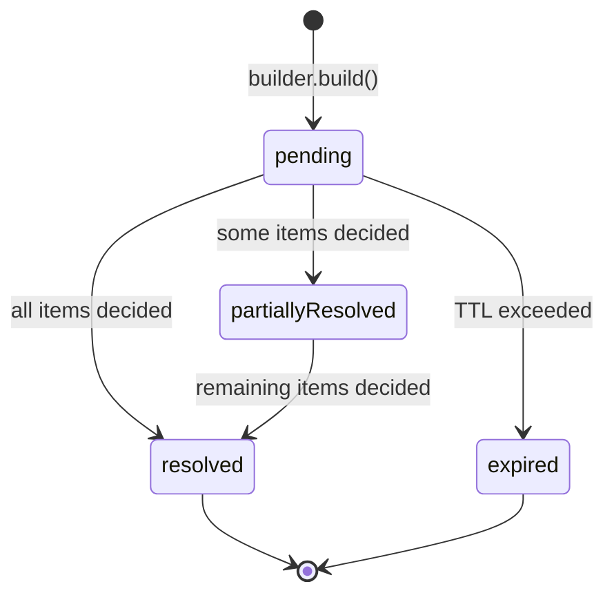
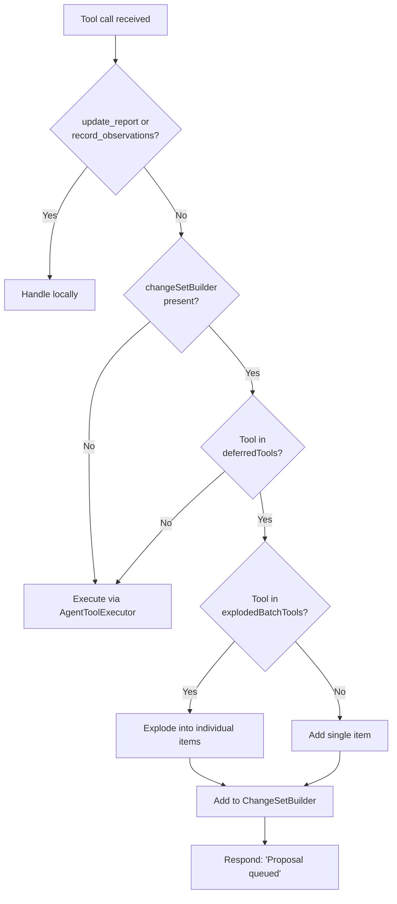

# ADR 0006: Change Set — Deferred Tool Confirmation Workflow

- Status: Accepted
- Date: 2026-02-27

## Context

The task agent can autonomously mutate journal entities (titles, estimates, due
dates, priorities, statuses, checklist items, labels) via tool calls. Some of
these mutations are high-impact or subjective — e.g., changing a task's status to
BLOCKED or adding checklist items based on inferred requirements. Users need
visibility and control over what the agent proposes before mutations are applied.

Without a confirmation step, the only recourse is to undo changes after the fact,
which erodes trust and makes the agent feel unpredictable.

## Decision

1. **Classify tools as deferred or immediate.** A static set
   (`AgentToolRegistry.deferredTools`) lists tools whose mutations require user
   confirmation. Locally-handled tools (`update_report`, `record_observations`)
   and non-deferred tools (e.g., `set_task_language`) execute immediately.

2. **Accumulate proposals in a `ChangeSetBuilder`.** When the strategy encounters
   a deferred tool and a `ChangeSetBuilder` is provided, the tool call is added
   to the builder instead of being executed. The LLM receives a
   `"Proposal queued for user review."` response and can continue its
   conversation normally.

3. **Explode batch tools into individual items.** Batch tools (e.g.,
   `add_multiple_checklist_items` with 5 items) are split into individual
   `ChangeItem` entries so each element can be independently confirmed or
   rejected. The registry maps batch tool names to their array key
   (`AgentToolRegistry.explodedBatchTools`).

4. **Persist the change set as an `AgentDomainEntity`.** At the end of the wake,
   the builder produces a `ChangeSetEntity` with status `pending`. Each item
   carries a `toolName`, `args` map, `humanSummary`, and per-item
   `ChangeItemStatus`.

5. **Record user decisions as `ChangeDecisionEntity`.** Each confirm/reject
   action creates a decision entity with `itemIndex`, `verdict`, and optional
   `rejectionReason`, enabling the agent to learn from user preferences over
   time.

6. **Generate human-readable summaries.** Each change item gets a tool-specific
   summary (e.g., `Set title to "Fix login bug"`, `Add: "Design mockup"`,
   `Set estimate to 60 minutes`) for display in the confirmation UI.

## Change Set Lifecycle

## Tool Call Routing

## Consequences

- Users see proposed changes before they are applied, building trust.
- Granular per-item confirmation allows partial acceptance of batch proposals.
- Decision history enables agent learning from user preferences.
- The `ChangeSetBuilder` is optional — callers without it get the previous
  immediate-execution behavior, maintaining backward compatibility.
- Batch tool explosion means the singular tool handler (e.g.,
  `add_checklist_item`) must exist alongside the batch variant for re-execution
  of confirmed items.

## Related

- Implementation plan: `docs/implementation_plans/2026-02-27_user_confirmation_workflow.md`
- `lib/features/agents/tools/agent_tool_registry.dart` — deferred/batch tool sets
- `lib/features/agents/workflow/change_set_builder.dart` — builder implementation
- `lib/features/agents/workflow/task_agent_strategy.dart` — routing logic
- `lib/features/agents/model/change_set.dart` — `ChangeItem` value type
- `lib/features/agents/model/agent_domain_entity.dart` — `ChangeSetEntity`, `ChangeDecisionEntity`
- ADR 0004: Tool execution policy (immediate path)
