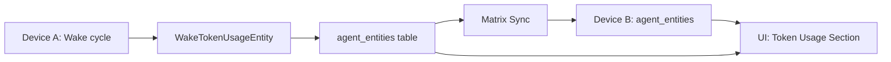

# ADR 0007: Token Usage as Synced Agent Entity

## Status

Accepted

## Context

Agents execute wake cycles that invoke LLM inference via `ConversationRepository.sendMessage()`, but token usage from these calls is currently discarded. We need to capture, persist, and display token usage data to enable cost visibility per agent template and per week — across all devices.

Three approaches were considered:

1. **Flat columns on `wake_run_log`** — Add `model_id`, `input_tokens`, etc. columns directly to `wake_run_log`. Simple SQL aggregation, but `wake_run_log` is **not synced** via Matrix. Usage would be device-local only.

2. **New `AgentDomainEntity` variant** — Create `wakeTokenUsage` as a freezed variant that flows through the existing entity sync pipeline via Matrix. Visible from any device.

3. **Separate sync mechanism** — A new table with its own sync path. Maximum flexibility but significant infrastructure overhead.

## Decision

Use a new `AgentDomainEntity.wakeTokenUsage` variant (option 2).

## Rationale

- **Cross-device visibility is required**: The user needs to see exactly what each template spent each week in the 1-on-1 evolution chat, regardless of which device ran the inference. This rules out device-local-only storage.
- **Existing sync infrastructure**: `AgentDomainEntity` variants are automatically synced via Matrix through `AgentSyncService`. Adding a new variant requires minimal incremental work — one freezed variant, one case in `AgentDbConversions`, and it syncs for free.
- **Template-level aggregation**: By storing `templateId` on the entity, we can aggregate costs per template across all agent instances and all devices.
- **Immutable audit trail**: Each wake produces exactly one `wakeTokenUsage` entity. Like `agentMessage`, these are append-only — never updated after creation.

## Sync Flow



## Entity Design

```dart
const factory AgentDomainEntity.wakeTokenUsage({
  required String id,
  required String agentId,      // the agent instance
  required String runKey,        // links back to wake_run_log
  required String threadId,      // conversation thread
  required String modelId,       // which model was used
  required DateTime createdAt,
  required VectorClock? vectorClock,
  String? templateId,
  String? templateVersionId,
  int? inputTokens,
  int? outputTokens,
  int? thoughtsTokens,
  int? cachedInputTokens,
  DateTime? deletedAt,
}) = WakeTokenUsageEntity;
```

## Consequences

- Token usage is synced across devices like all other agent entities.
- Per-instance aggregation queries fetch entities by type and group in Dart (not raw SQL `GROUP BY`). At current volumes (tens of wakes per day) this is adequate.
- Per-template aggregation uses a SQL JOIN through `agent_links` (`template_assignment` type) to collect token records across all instances in a single query (added in v0.9.882).
- The `wake_run_log` table remains unchanged — no schema migration needed.
- Future monetary cost calculation can be done by mapping `modelId` to a cost-per-token lookup.
