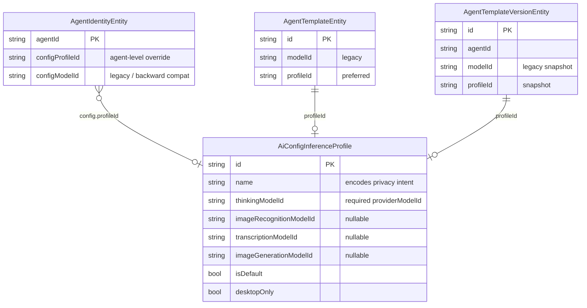
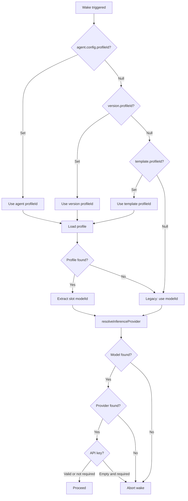
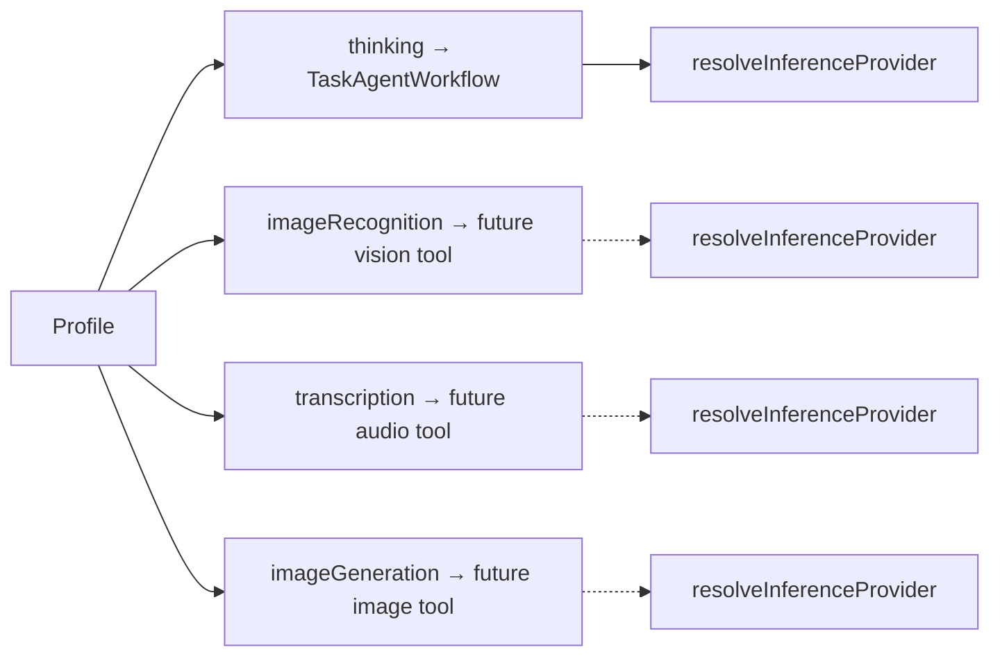
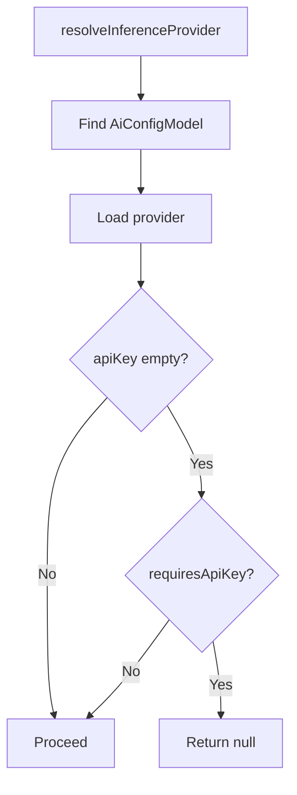
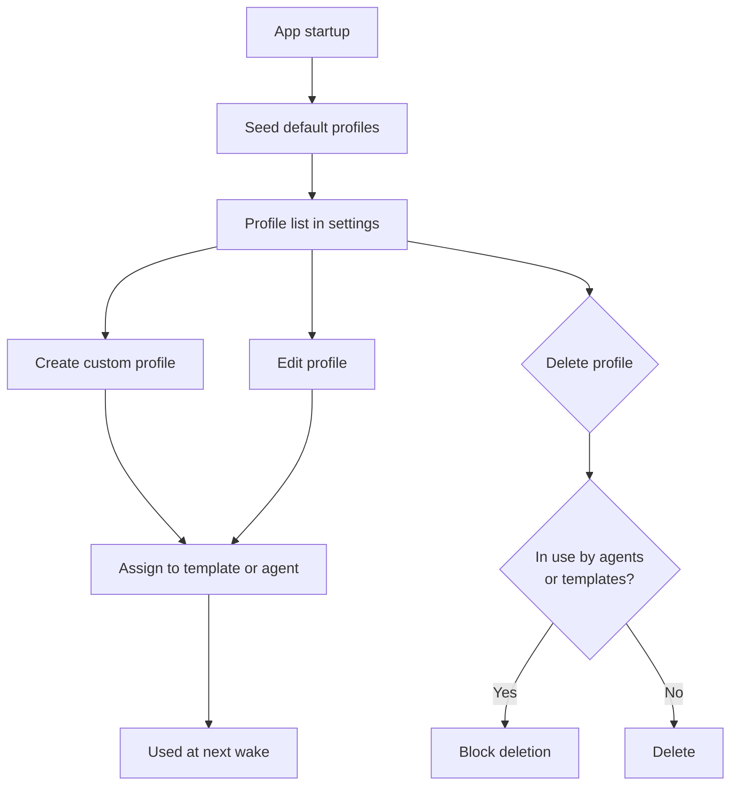

# ADR 0008: Inference Profiles — Agent-to-Provider Mapping via Profiles

- Status: Proposed
- Date: 2026-02-28
- Supersedes: [ADR 0005](./0005-template-model-resolution-policy.md) (partially — extends the resolution chain)

## Context

Agents currently reference a single `providerModelId` string on their template.
This works for the thinking slot but has several shortcomings:

- **No multi-capability support.** An agent that needs thinking, vision,
  transcription, and image generation must use the same model for all, even when
  specialized models exist.
- **No privacy grouping.** Users who want to keep data local (Ollama) or within
  the EU (Mistral) must manually pick the right model on every template. There
  is no way to express "use this set of models" as a reusable unit.
- **Provider switching is tedious.** Changing from Gemini to OpenAI means
  editing every template individually.
- **Local providers rejected.** `resolveInferenceProvider()` rejects providers
  with empty API keys, but Ollama/Voxtral/Whisper don't need keys.

### Alternatives Considered

| Alternative | Why Rejected |
|---|---|
| **A. Per-template multi-model fields** — add `imageRecognitionModelId`, `transcriptionModelId`, `imageGenerationModelId` directly on the template. | Duplicates model assignments across templates. No reusable grouping. Doesn't solve provider-switching friction. |
| **B. Provider-level default models** — each `AiConfigInferenceProvider` declares default models per capability. | Ties capability routing to the provider entity, which is a configuration concern not a routing concern. Doesn't allow mixing providers (e.g. local transcription + cloud thinking). |
| **C. Implicit privacy enum** — add an `InferenceProfilePrivacy` enum (local, regional, cloud) and enforce routing constraints. | The app cannot enforce data residency (a "local" model could proxy to cloud). False sense of security. Privacy intent is better encoded in the profile name, which the user controls. |

## Decision

Introduce **Inference Profiles** — named, user-manageable configurations that
bundle `providerModelId` strings for four capability slots:

```
Profile "Gemini Flash"
├── thinking:         models/gemini-3-flash-preview
├── imageRecognition: models/gemini-3-flash-preview
├── transcription:    models/gemini-3-flash-preview
└── imageGeneration:  models/gemini-3-pro-image-preview
```

### 1. Profile Data Model

Profiles are a new variant of the existing `AiConfig` sealed union, stored in
`ai_config.sqlite` alongside providers, models, and prompts. No schema migration
needed — the table uses a generic JSON column.



### 2. Resolution Chain

Profile assignment follows a precedence chain. The first non-null `profileId`
wins; if none is set, the legacy `modelId` path is used unchanged.



### 3. Per-Slot Capability Dispatch

Today only the **thinking** slot is used by `TaskAgentWorkflow`. The remaining
slots are plumbed through for future activation when vision, transcription, and
image generation tools are added.



### 4. API Key Handling for Local Providers

Patch `resolveInferenceProvider()` to check `ProviderConfig.requiresApiKey()`
before rejecting empty keys. This unblocks Ollama, Voxtral, and Whisper.



### 5. Profile Lifecycle



### 6. Mandatory Selection at Agent Creation

Profile selection is required when creating an agent — `createTaskAgent` takes
a non-nullable `profileId`. The selected profile is stored on
`AgentConfig.profileId` and used for all subsequent wakes. Users can reassign
the profile later from the agent detail page.

### 7. Sync

Profiles sync between devices via the existing AI config outbox
(`SyncMessage.aiConfig`). The `profileId` on agent entities syncs via
`AgentSyncService`. If a template arrives before its referenced profile, the
legacy `modelId` fallback ensures the agent can still wake.

## Consequences

- **Reusable model bundles.** Users configure models once per profile and
  assign it to any number of agents/templates.
- **Privacy intent via naming.** Profile names like "Local (Ollama)" or
  "Mistral EU" communicate data handling intent without false enforcement.
- **Backward compatible.** Existing templates with `modelId` but no `profileId`
  continue to work unchanged. Migration is opt-in.
- **Multi-capability ready.** Four slots are defined; only thinking is active
  today. Vision, transcription, and image generation activate as tools are added.
- **Local providers unblocked.** The API key fix benefits all callers, not just
  profile-based resolution.
- **Slightly more complex resolution.** The chain adds a profile lookup step
  before the existing model → provider resolution. Mitigated by clear
  precedence rules and fallback to legacy path.

## Related

- [Implementation plan](../implementation_plans/2026-02-28_agent_privacy_profiles.md)
- [ADR 0005: Template Model Resolution Policy](./0005-template-model-resolution-policy.md) (predecessor)
- `lib/features/ai/model/ai_config.dart` — `AiConfig` sealed union
- `lib/features/agents/util/inference_provider_resolver.dart` — existing resolver
- `lib/features/agents/workflow/task_agent_workflow.dart` — wake cycle
- `lib/features/ai/constants/provider_config.dart` — `noApiKeyRequired`
