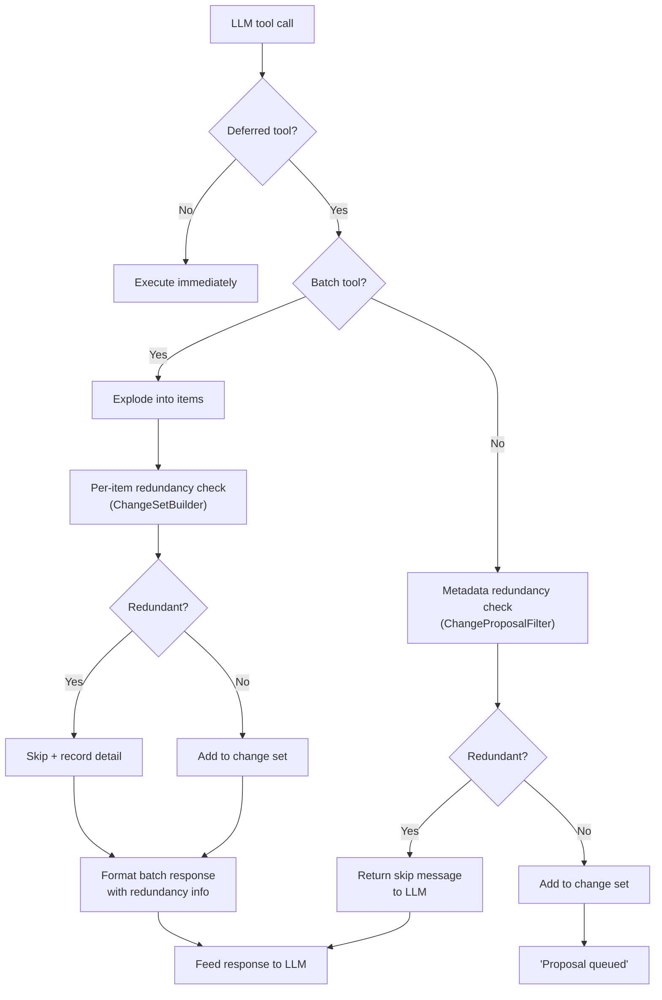
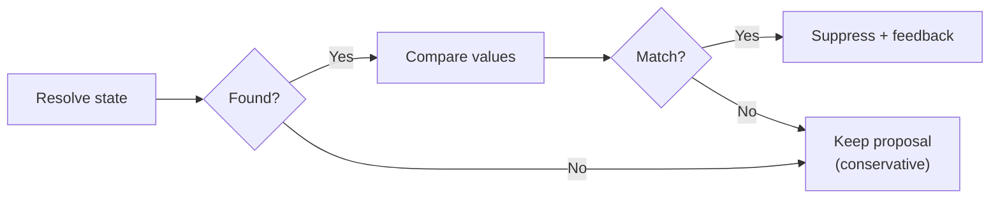

# ADR 0009: Redundant Change Proposal Suppression

- Status: Accepted
- Date: 2026-03-01

## Context

The task agent frequently proposes tool calls for changes that would be no-ops:
setting a priority to its current value, checking off an already-checked
checklist item, or setting an estimate to the value the user just set. These
redundant proposals pass through the deferred confirmation workflow (ADR 0006)
and appear as pending suggestions in the UI, making the assistant appear unaware
of the current state.

The LLM's system prompt already instructs it to check current values before
calling tools (the "no-op rule"), but models don't always follow this
instruction. A particular pain point: after a user updates an estimate, the
agent wakes and proposes reverting to the old estimate because its context still
contains the pre-update value.

Filtering at execution time (after user confirms) is insufficient — the user
shouldn't see proposals that are already satisfied.

## Decision

Filter redundant proposals at **proposal-building time** (before they enter the
change set) and feed back "already in that state" to the LLM so it can correct
its context.

### Two filtering layers



#### Layer 1: Checklist item redundancy (batch tools)

Inside `ChangeSetBuilder.addBatchItem()`, for each `update_checklist_item`
element the builder resolves the item's current state via a
`ChecklistItemStateResolver` callback. If the proposed `isChecked` matches the
current value AND no title change is proposed, the item is suppressed.

The resolver returns a record `({String? title, bool? isChecked})` — richer
than the previous title-only resolver — so the builder can compare both fields
in a single lookup.

#### Layer 2: Task metadata redundancy (non-batch tools)

In `TaskAgentStrategy._addToChangeSet()`, before calling
`csBuilder.addItem()`, the strategy resolves the current task metadata via a
`ResolveTaskMetadata` callback. `ChangeProposalFilter.checkTaskMetadataRedundancy()`
compares the proposed value against the current value for:

| Tool                     | Compared field    |
|--------------------------|-------------------|
| `update_task_estimate`   | `minutes`         |
| `update_task_priority`   | `priority`        |
| `update_task_due_date`   | `dueDate`         |
| `set_task_status`        | `status`          |
| `set_task_title`         | `title`           |

### LLM feedback loop

When proposals are suppressed, the response fed back to the LLM includes the
reason. This serves as a correction signal:

```
Proposal queued for user review (1 item(s) queued).
Skipped 2 redundant update(s): "Buy groceries" is already checked; "Walk dog" is already checked.
```

or for non-batch tools:

```
Skipped: estimate is already 120 minutes.
```

This feedback is critical: without it, the LLM would believe its tool call
succeeded and might build subsequent reasoning on that assumption.

### Conservative fallback

If the resolver is unavailable, returns `null` (item not found), or throws an
exception, the proposal is **kept** (not suppressed). This ensures we never
silently drop a legitimate change due to a transient DB error.



## File changes

| File | Role |
|------|------|
| `lib/.../change_proposal_filter.dart` | **New.** Static helpers for redundancy checks and response formatting. |
| `lib/.../change_set_builder.dart` | `ChecklistItemTitleResolver` → `ChecklistItemStateResolver`. Per-item redundancy check in `addBatchItem()`. `BatchAddResult` gains `redundant` + `redundantDetails`. |
| `lib/.../task_agent_strategy.dart` | `ResolveTaskMetadata` callback. Non-batch redundancy check in `_addToChangeSet()`. Delegates to `ChangeProposalFilter`. |
| `lib/.../task_agent_workflow.dart` | Wires resolver callbacks using `ChangeProposalFilter.resolveTaskMetadata()`. |

## Consequences

### Positive

- Users no longer see no-op proposals in the confirmation UI.
- The LLM receives corrective feedback, reducing repeated redundant proposals.
- The fix for the "reverted estimate" issue: the agent now sees "estimate is
  already X minutes" and doesn't propose a change.
- All filtering logic is in a well-tested helper class (`ChangeProposalFilter`).

### Negative

- Each deferred tool call now requires an additional DB lookup (task metadata or
  checklist item state). This is acceptable given that agent wakes are
  already I/O-heavy (LLM calls, context assembly).
- The resolver callbacks add coupling between the workflow and the DB layer.
  This is mitigated by the callback abstraction — tests inject simple lambdas.

### Neutral

- The LLM's "no-op rule" in the system prompt is still valuable as a
  first-pass filter. This ADR adds a safety net, not a replacement.
