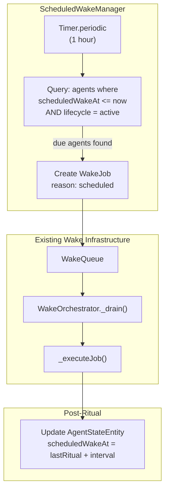

# ADR 0010: Scheduled Wake Infrastructure

- Status: Proposed
- Date: 2026-03-01

## Context

The current `WakeOrchestrator` only supports event-driven wakes: an entity change emits
tokens on `UpdateNotifications.localUpdateStream`, which are matched against agent
subscriptions. This model works well for task agents that react to user edits, but it
cannot support **time-based rituals** such as the weekly one-on-one template evolution
ceremony.

Improver agents need to wake on a schedule (e.g., every Sunday at 9 AM) regardless of
whether any entity changes occurred.

**Important**: The existing `nextWakeAt` field on `AgentStateEntity` is **already in
active use** by the subscription throttle system. `WakeOrchestrator._setThrottleDeadline`
writes the throttle expiry into `nextWakeAt`, and `TaskAgentService._hydrateThrottle`
restores it on startup. The UI also reads `nextWakeAt` to display a countdown timer.
Reusing this field for scheduled wakes would create a semantic collision — a subscription
throttle deadline could be mistaken for a scheduled ritual, and vice versa.

## Decision

1. Add a **new field** `scheduledWakeAt: DateTime?` to `AgentStateEntity` for
   time-based scheduled wakes. This keeps it cleanly separated from the existing
   `nextWakeAt` which serves the subscription throttle system.
2. Introduce a `ScheduledWakeManager` that runs a periodic check (default: every 1 hour)
   to detect agents whose `scheduledWakeAt <= now AND lifecycle == active`.
3. When a due agent is found, enqueue a `WakeJob` into the existing `WakeQueue` with
   `reason: WakeReason.scheduled`.
4. Scheduled wakes **bypass the 120-second subscription throttle** (ADR 0002) since they
   are already rate-limited by their own schedule.
5. After ritual completion, the workflow computes
   `scheduledWakeAt = lastOneOnOneAt + interval` and persists it to `AgentStateEntity`.
6. On app launch, `ScheduledWakeManager` immediately checks for any missed wakes
   (agent was due while app was closed) and fires them.
7. On mobile platforms (iOS/Android), integrate with `WorkManager` / `BGTaskScheduler`
   for background execution. On desktop, `Timer.periodic` suffices.

### Field semantics (clarification)

| Field | Owner | Purpose |
|-------|-------|---------|
| `nextWakeAt` | `WakeOrchestrator` | Subscription throttle deadline — "earliest this agent may wake from a subscription trigger." Cleared after the throttle expires. |
| `scheduledWakeAt` | `ScheduledWakeManager` | Ritual schedule — "when this agent's next scheduled ritual should fire." Updated after each ritual to `lastRitualAt + interval`. |

Both fields coexist on the same `AgentStateEntity`. Task agents (which have no scheduled
rituals) will have `scheduledWakeAt = null`. Improver agents will have both fields
populated independently.

## Architecture

## Consequences

### Positive
- Reuses existing `WakeQueue` and `WakeOrchestrator` — no parallel execution path.
- Clean separation: `scheduledWakeAt` for rituals, `nextWakeAt` for throttle. No
  semantic collision or risk of one system corrupting the other's state.
- Missed wakes are automatically recovered on app launch.
- Platform-specific background execution is isolated behind `ScheduledWakeManager`.

### Negative
- Hourly check granularity means scheduled wakes can be up to ~59 minutes late.
  This is acceptable for weekly rituals but may need refinement for higher-frequency
  schedules.
- Mobile background execution has platform-specific constraints (iOS limits background
  tasks to ~30 seconds; Android WorkManager may defer execution).
- Adding a new field to `AgentStateEntity` requires a freezed model regeneration and
  serialization migration. Since `agent.sqlite` stores entities as JSON in a
  `serialized` column, the new nullable field is backward-compatible (missing key
  defaults to `null`).

### Neutral
- `WakeReason.scheduled` is a new enum value requiring a minor schema migration
  (wake_run_log stores reason as text, so this is backward-compatible).
