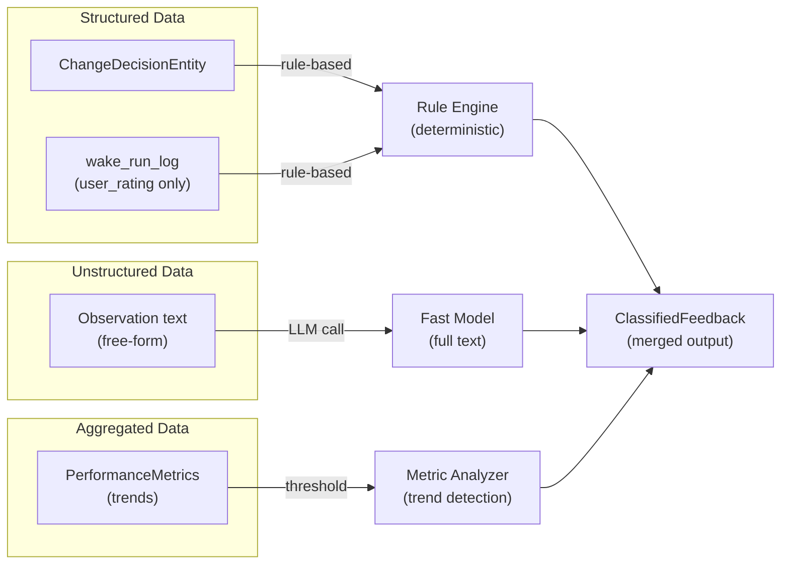

# ADR 0011: Feedback Classification Strategy

- Status: Proposed
- Date: 2026-03-01

## Context

The weekly one-on-one ritual requires the improver agent to understand **what went well
and what didn't** across all task agent instances. Today, feedback exists in several
raw forms:

1. **Decision history** (`ChangeDecisionEntity`): explicit user verdicts (confirmed,
   rejected, deferred) on agent proposals.
2. **Agent observations** (`AgentMessageEntity` with `kind: observation`): free-text
   working notes written by task agents during wakes.
3. **Wake run metrics** (`wake_run_log`): duration and user ratings. (Note: the
   `status` field only reflects whether the LLM conversation completed without
   errors — it is **not** a quality signal and should not be used for sentiment
   classification.)
4. **Agent reports** (`AgentReportEntity`): agent's self-assessment with confidence score.

These raw signals must be **classified by sentiment** (positive/negative/neutral) and
**categorized by aspect** (accuracy, communication, prioritization, tooling, timeliness)
to produce actionable input for the evolution agent.

## Decision

Use a **hybrid classification strategy**:

1. **Rule-based classification** for structured data:
   - `ChangeDecisionEntity` with `verdict: rejected` → negative sentiment
   - `ChangeDecisionEntity` with `verdict: confirmed` → positive sentiment
   - `ChangeDecisionEntity` with `verdict: deferred` → neutral sentiment
   - Category inferred from `toolName` (e.g., `set_task_estimate` → accuracy,
     `set_task_title` → communication)
   - User ratings below threshold (< 0.3) → negative, above (> 0.7) → positive

2. **LLM-based classification** for unstructured data:
   - Agent observation text → fast model (e.g., Gemini Flash) classifies sentiment
     and category
   - Prompt constrained to output structured JSON for parsing
   - No strict token budget — send full observation text when practical; the
     weekly ritual runs once, so cost is negligible

3. **Metric-based signals** derived from aggregates:
   - Declining user rating trend → negative / general
   - High rejection rate for specific tool → negative / tooling

## Consequences

### Positive
- Deterministic classification for structured data — no LLM cost, no latency,
  no non-determinism for clear-cut signals.
- LLM classification only where needed — handles nuance, sarcasm, implicit feedback
  in observation text.
- Token cost is modest (weekly ritual, using a fast model) and not budget-constrained.
- Metric-based signals catch systemic issues that individual items might miss.

### Negative
- Two classification code paths to maintain (rules + LLM prompt).
- LLM classification quality depends on the fast model's capability — may need
  prompt iteration.
- Rule-based category inference from `toolName` is heuristic and may misclassify
  edge cases.

### Neutral
- Classification results are ephemeral (computed during ritual, not persisted as
  separate entities). If persistence is needed later, the `ClassifiedFeedback` model
  can be serialized into an `AgentMessagePayloadEntity`.
