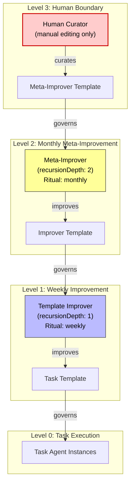

# ADR 0012: Recursive Self-Improvement Depth Policy

- Status: Proposed
- Date: 2026-03-01

## Context

The self-learning cycle is inherently recursive: an improver agent evolves a task agent
template, but the improver itself is governed by a template that could also be improved.
This creates a chain:

- **Level 0**: Task agents (governed by task template)
- **Level 1**: Template improver (governs task template, governed by improver template)
- **Level 2**: Meta-improver (governs improver template, governed by meta-improver template)
- **Level N**: ...

Without a policy, this recursion is unbounded. An unbounded chain risks:
1. **Runaway self-modification**: each level changes the level below, creating cascading
   rewrites that are difficult to audit or revert.
2. **Drift from human intent**: after enough recursive improvements, the original
   human-authored intent may be diluted.
3. **Resource waste**: each recursion level costs LLM tokens and compute.
4. **Debugging complexity**: failures in deeply nested improvers are hard to diagnose.

## Decision

1. **Fixed recursion depth cap of 2**:
   - Level 0: Task agents — improved weekly by Level 1
   - Level 1: Template improver — improved monthly by Level 2
   - Level 2: Meta-improver — its own template is **human-curated only** (no Level 3 agent)

2. **Enforcement mechanism**: each improver agent stores `recursionDepth` in its
   `AgentSlots`. The `ImproverAgentService.create()` method:
   - Reads the target template's current improver (if any) to determine depth
   - Rejects creation if the resulting depth would exceed 2
   - Stores the computed depth in the new agent's slots

3. **Frequency scaling by depth**:
   - Level 1 (template improver): weekly ritual
   - Level 2 (meta-improver): monthly ritual
   - This natural scaling prevents high-frequency cascading changes

4. **Human override**: the meta-improver's template (Level 2) can only be edited
   through the existing manual template editing UI. No agent can modify it.

## Consequences

### Positive
- Human oversight is preserved at the top of the chain — the system cannot fully
  self-modify without human involvement.
- Two levels of automated improvement provide meaningful self-learning while remaining
  auditable.
- Frequency scaling (weekly → monthly) naturally dampens cascading changes.
- Simple enforcement via slot-stored depth — no complex graph traversal needed.

### Negative
- Fixed depth may be too restrictive for future use cases (e.g., domain-specific
  improvement chains). This can be revisited if evidence warrants it.
- Monthly cadence for Level 2 means meta-improvements are slow to propagate.

### Neutral
- The depth cap is a policy decision, not a technical limitation. The infrastructure
  supports arbitrary depth — only the service layer enforces the cap.
- Level 2 meta-improver is optional — the system works with only Level 1 improvers.
  Meta-improvement is an enhancement, not a requirement.
