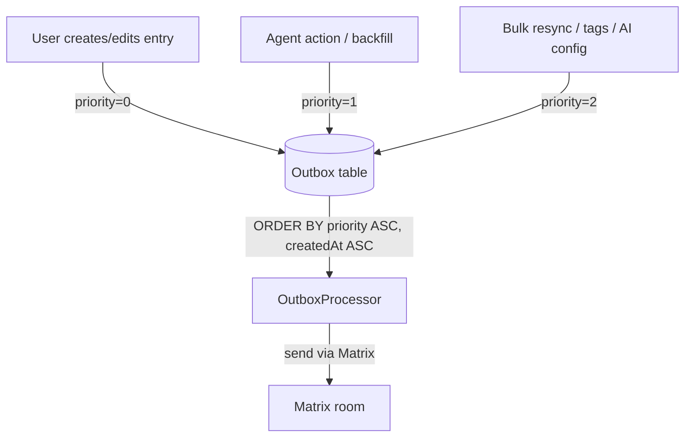
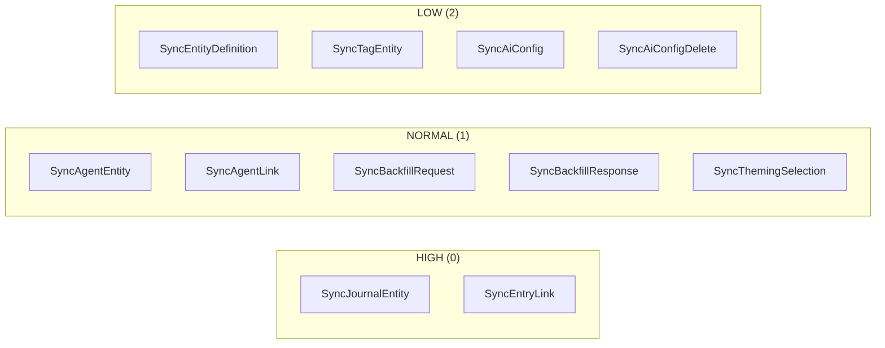
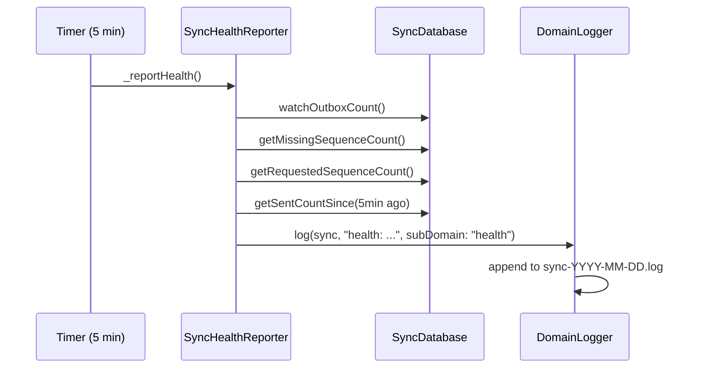

# ADR 0013: Outbox Priority Queue & Sync Observability

## Status

Accepted

## Date

2026-03-03

## Context

Two related problems surfaced during sustained multi-device usage:

1. **Priority inversion in the outbox FIFO queue.** When a user triggers a
   manual resync (or backfill generates a large batch), 10k+ low-urgency
   entries flood the outbox. Because the queue is strict FIFO, any new
   journal entry the user creates gets stuck behind the bulk backlog. The
   user perceives edits as "not syncing" even though the system is busy.

2. **Silent sync convergence failures.** Sync appeared healthy (green
   status) while 14–16k documents were missing on one device. The existing
   `LoggingService.captureEvent()` calls are scattered, inconsistently
   formatted, and lack domain-specific file sinks, making post-hoc
   diagnosis nearly impossible without manual DB queries.

These are addressed together because the priority change modifies the
outbox write-path where observability also needs improvement, and both
changes share the same migration version bump.

## Decision

### Priority queue

Add a `priority` integer column to the `Outbox` table with three levels:

| Priority | Index | Examples |
|----------|-------|---------|
| **high** | 0 | `SyncJournalEntity`, `SyncEntryLink` (user edits) |
| **normal** | 1 | `SyncAgentEntity`, `SyncAgentLink`, `SyncBackfillRequest/Response`, `SyncThemingSelection` |
| **low** | 2 | `SyncEntityDefinition`, `SyncTagEntity`, `SyncAiConfig`, `SyncAiConfigDelete` |

Queries that determine processing order (`oldestOutboxItems`,
`claimNextOutboxItem`) sort by `priority ASC, createdAt ASC`, so
high-priority items always drain before lower tiers. The UI watch query
sorts by `priority ASC, createdAt DESC` to show high-priority items at the
top, newest first within each tier.

#### Priority queue flow



#### Message type to priority mapping



#### Sync health reporting cycle



### Sync observability

Inject `DomainLogger` (already used by the agent runtime) into the key
sync components and instrument five sub-domains:

- `outbox.enqueue` / `outbox.send` / `outbox.retry`
- `ingest.receive` / `ingest.apply` / `ingest.skip` / `ingest.drop`
- `backfill.detect` / `backfill.request` / `backfill.response`
- `health` — periodic 5-minute summary

A new `SyncHealthReporter` emits a compact health line every 5 minutes
when sync domain logging is enabled:

```
health: outbox.pending=42 outbox.sent5m=128 seq.missing=3 seq.requested=7
```

All logging gates on `LogDomains.sync` which is already wired to the
`logSyncFlag` config flag. No extra flags needed.

### Schema migration

- `schemaVersion` bumps from 5 to 6.
- Migration adds the `priority` column with `DEFAULT 2` (low). Existing
  rows automatically receive the low priority, which is correct—they
  represent historical items that should not leapfrog any new work.
- SQLite `ALTER TABLE ADD COLUMN ... DEFAULT` is non-locking.

## Consequences

**Positive:**

- User-created journal entries sync within seconds even during a 10k+
  resync.
- Structured, domain-filtered log files make convergence failures
  diagnosable without manual DB queries.
- Health summary provides a quick "pulse check" for sync status.

**Negative / trade-offs:**

- Low-priority items (entity definitions, tags) take longer to sync when
  the queue is loaded. This is acceptable because they are rarely
  time-sensitive.
- Additional DomainLogger parameter on ~7 constructors increases
  constructor arity. Mitigated by making it optional with null-safe
  fallback.

## Related

- Outbox deduplication (merge logic): already in `outbox_service.dart`
- Backfill request/response flow: `backfill_request_service.dart`,
  `backfill_response_handler.dart`
- Domain logging infrastructure: `domain_logging.dart`, ADR pending
