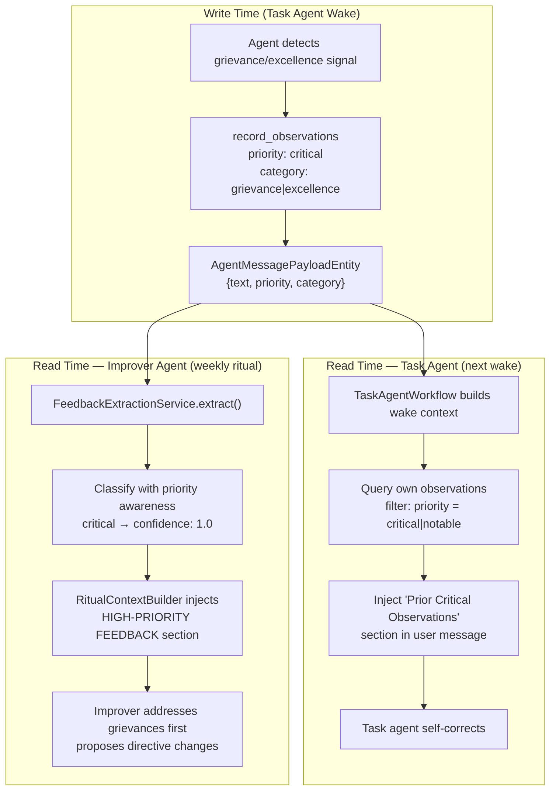

# ADR 0014: Cross-Wake Critical Observation Injection

- Status: Proposed
- Date: 2026-03-03

## Context

Agent observations are immutable log entries (`AgentMessageKind.observation`) that persist
across wakes. Today they serve as general-purpose memory — the agent can review its own past
observations when building context for a new wake. However, all observations are treated
equally: a routine operational note ("checked 3 linked tasks, no changes") has the same
visibility as a user grievance ("I asked you to change the priority and you ignored me").

A concrete incident exposed this gap: a user orally requested a priority change from P1 to
P0, the task agent failed to act, and the resulting grievance was recorded as a standard
observation. In the next wake, nothing distinguished it from dozens of routine notes. The
grievance was effectively invisible.

The existing feedback classification pipeline (ADR 0011) classifies observations
retroactively for the weekly one-on-one ritual, but that classification happens at
extraction time and only benefits the improver agent. The task agent itself — the one that
caused the grievance — has no mechanism to recognize and act on its own past failures with
appropriate urgency.

## Decision

### 1. Structured observation priority and category at write time

Observations gain two optional fields in their payload content:

- **`priority`**: `routine` | `notable` | `critical`
- **`category`**: `grievance` | `excellence` | `template_improvement` | `operational`

These are stored in the `AgentMessagePayloadEntity.content` map (not on the entity itself),
keeping the generic `AgentMessageEntity` schema clean. The `record_observations` tool schema
is updated to accept structured items alongside the legacy bare-string format.

### 2. Task agents inject their own critical observations into wake context

When building the wake context for a task agent, the workflow queries the agent's own
observations from the current feedback window and filters for `priority: critical` (or
`notable`). These are injected as a dedicated section in the user message:

```
## Prior Critical Observations (Self-Review)
The following critical observations were recorded in your previous wakes.
Review them and adjust your behavior accordingly:

### Grievances
- [2026-03-02] Full grievance text with context...

### Excellence (keep doing this)
- [2026-03-01] Full excellence text with context...
```

This section appears **before** the task data, ensuring the agent addresses it first.

### 3. Improver agents receive critical observations with elevated visibility

The ritual context builder injects a `HIGH-PRIORITY FEEDBACK` section before the general
classified feedback summary. Critical observations are shown at full length (no truncation)
and the improver's system prompt instructs it to address grievances before general analysis.

### 4. No resolution tracking — observations age out

A directive change made in response to a grievance is a hypothesis, not a confirmed fix.
Only subsequent agent behavior proves whether the grievance was truly addressed. Critical
observations naturally drop out of the feedback window (typically 7 days for task agents,
configurable for improvers). No explicit "resolved" status is tracked.

### 5. No retroactive classification

Old observations written before this change retain their bare-string format and continue
using the keyword-based heuristic classifier. Only new observations benefit from structured
priority and category. The LLM classification pass (ADR 0011 Phase 4) remains a separate
future initiative.

### 6. No immediate notifications

Critical observations do not trigger push notifications or early ritual scheduling. They
accumulate within the standard weekly cadence, preserving the structured ceremony.

### 7. No token budget cap on critical section

The high-priority feedback section has no token limit. Critical observations are rare and
important enough to always show in full. The weekly cadence naturally limits volume.



## Consequences

### Positive

- **Immediate self-correction**: Task agents see their own grievances in the very next wake
  and can adjust behavior without waiting for a directive change. This closes the feedback
  loop from weeks to hours.
- **Structured write-time encoding**: Priority and category are captured at the moment the
  agent detects the signal, preserving the full context rather than relying on post-hoc
  text classification.
- **Dual feedback path**: The same observation reaches both the task agent (for immediate
  behavior adjustment) and the improver agent (for systemic directive improvement). These
  are complementary — one is a quick fix, the other is a lasting fix.
- **Backwards compatible**: Legacy bare-string observations continue to work. The structured
  format is additive.

### Negative

- **Relies on agent compliance**: The task agent must correctly identify grievance signals
  and assign `priority: critical`. If the agent fails to recognize the grievance in the
  first place, no priority field will save it. System prompt engineering mitigates but
  does not eliminate this.
- **No guaranteed resolution**: Self-correction is best-effort. The agent sees its past
  grievance but may still fail to act on it if the underlying behavioral issue is in the
  directive itself (which only the improver can fix).
- **Payload schema is convention-based**: Priority and category live in a freeform
  `Map<String, Object?>` rather than typed entity fields. Drift queries on JSON content are
  possible but less robust than typed columns.

### Neutral

- The feedback window controls how long observations remain visible. This is configurable
  per agent and does not require a new mechanism.
- The pattern is generalizable: any agent kind that supports observations can adopt
  cross-wake critical injection by querying its own high-priority observations during
  context building.
