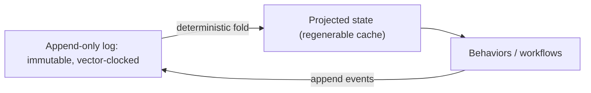

# ADR 0016: Agent-Derived State as a Projection of the Append-Only Log

- Status: Proposed
- Date: 2026-05-30

## Context

The agents feature already treats the append-only `AgentMessageEntity` log (plus
`AgentLink` edges) as durable, immutable, vector-clocked history. But some
agent-derived state — `AgentStateEntity` slots and pointers, and other mutable
rows — is persisted and synced as *authoritative* last-write-wins state. Concretely,
`agent_repository.upsertEntity` writes entities in place
(`insertOnConflictUpdate`), identities carry a mutable `currentStateId`, and
agent creation writes mutable state snapshots — so this move is a **storage
migration, not a purely additive change**.

Under concurrent multi-device edits, every authoritative mutable row is a
conflict surface: LWW can silently drop a branch, and there is no single
deterministic way to reconstruct state. The event-sourcing literature (anchor:
*The Log is the Agent*, arXiv 2605.21997) and production long-running-agent
practice (Anthropic harnesses; MemGPT tiering) converge on the same posture:
derive state from the durable log instead of trusting mutable replicated state.

## Decision

1. The append-only log (`AgentMessageEntity` + `AgentLink`, vector-clock stamped)
   is the sole source of truth for agent-derived state.
2. Agent-derived state — head pointers (`recentHeadMessageId`,
   `latestSummaryMessageId`), slots that summarize log position, the projected
   report/graph view — is a **deterministic projection recomputed from the log**,
   not an authoritative replicated row. Persisted projections are a regenerable
   cache, not ground truth.
3. Genuinely user-authored mutable documents (souls, templates) remain
   last-write-wins, but via the existing immutable `Version`/`Head` snapshot
   pattern (`SoulDocumentVersionEntity`/`Head`, `AgentTemplateVersionEntity`/
   `Head`). Generalize that pattern; do not add new in-place mutable synced rows
   for derived state.
4. The projection fold is order-stable and deterministic across devices; the
   merge/ordering rule is specified in ADR 0018.

## Projection Loop

## Consequences

- The multi-device conflict surface shrinks to conflict-free facts (immutable
  appends); derived state can no longer diverge under LWW.
- Deterministic replay and cheap forking (the anchor's guarantees) become
  available because state is a pure function of the log.
- Cost: a projection layer must be built, and existing authoritative mutable
  agent state migrated to either a derived projection or a `Version`/`Head`
  snapshot.
- Cold-start/replay cost grows with log length; mitigated by compaction
  checkpoints (ADR 0017).

## Related

- `docs/daily_os_ai_runtime_architecture.md` (§4, Move 1)
- `lib/features/agents/README.md` (Memory Model)
- `lib/features/sync/vector_clock.dart`
- ADR 0001, ADR 0017, ADR 0018
