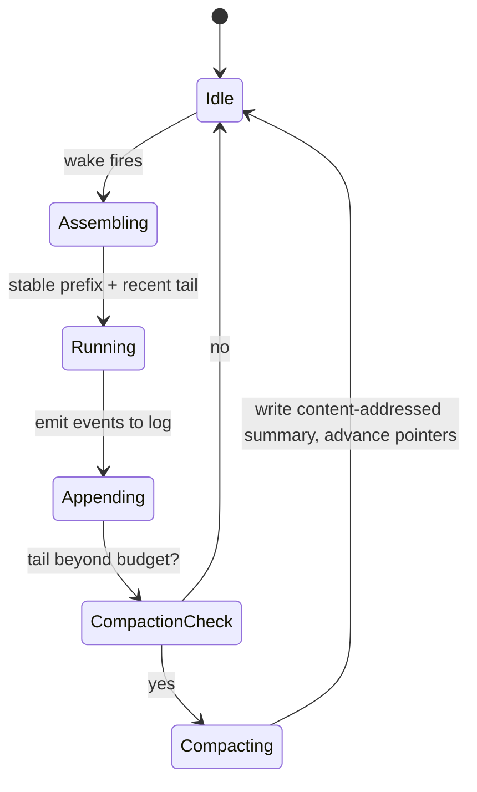

# ADR 0017: Deterministic, Content-Addressed Log Compaction

- Status: Proposed
- Date: 2026-05-30

## Context

The model already carries dormant compaction scaffolding —
`AgentMessageKind.summary`, `summaryStartMessageId`, `summaryEndMessageId`,
`summaryDepth`, `AgentStateEntity.recentHeadMessageId`, and
`latestSummaryMessageId` — that production code never writes (see the agents
README, "Memory compaction: prepared, not active").

Logs grow unbounded; long-lived agents need distilled history, and on-device
inference needs a stable summary "prefix" to keep the KV/prefix cache warm. The
anchor paper and ESAA (arXiv 2602.23193) both leave long-log compaction
explicitly open. Under multi-device sync a summary is *derived* state, so two
devices summarizing overlapping ranges could race under LWW and pick an
arbitrary winner.

## Decision

1. A background compaction behavior: when the verbatim tail past
   `recentHeadMessageId` exceeds a model-specific budget, summarize that range
   into a new `summary` message that **folds in the prior
   `latestSummaryMessageId`**, then advance both pointers.
2. Summaries are **derived projections, not destructive overwrites**: the
   immutable log remains ground truth; summarized messages are retained.
3. Summaries are **deterministic / content-addressed** — keyed by the exact
   message range (`summaryStartMessageId`/`summaryEndMessageId`) plus the prior
   summary it folds in and the summarizer config (model id, params, prompt
   version) — so concurrent summarizations of the same range converge instead of
   conflicting. The digest is computed over a **canonical serialization** (sorted
   keys, RFC 3339 UTC timestamps, normalized numbers, UTF-8 canonical JSON / JCS)
   with a **versioned hash tag** (e.g. `sha256-v1`, base64url) so independent
   devices derive identical digests. Each summary stores this digest as its
   verification/replay hash, so a wrong summary is detectable and regenerable
   from the log.
4. Compaction preserves decisions, open commitments/negotiations, and
   non-negotiables; it discards redundant tool chatter.
5. Compaction runs as a distinct background identity writing into the same log.
   Because summaries are derived and regenerable, they are auto-applied (not
   user-gated).
6. The stable prefix order for wake prompts is fixed: soul/anti-sycophancy →
   tools → rolling summary → recent tail, extending the existing stable-first
   ordering in `TaskAgentWorkflow`.

## Compaction Lifecycle

## Consequences

- Long-horizon memory for persistent agents; the dormant summary fields finally
  earn their keep.
- A long-lived, byte-stable on-device prefix yields real KV/prefix-cache reuse
  across wakes.
- Summaries converge across devices (content-addressed) rather than racing under
  LWW.
- Risks: recursive summarization can amplify hallucination at depth — mitigated
  by stored provenance + replay hash + regeneration; on-device window thresholds
  (MemGPT's 70/100/50% are cloud-tuned) need tuning for small contexts.

## Related

- `docs/daily_os_ai_runtime_architecture.md` (§6, Threads B/C)
- `lib/features/agents/README.md` (Memory compaction: prepared, not active)
- ADR 0016, ADR 0018
