# ADR 0017: Deterministic, Content-Addressed Log Compaction

- Status: Proposed
- Date: 2026-05-30

## Context

The model already carries dormant compaction scaffolding —
`AgentMessageKind.summary`, `summaryStartMessageId`, `summaryEndMessageId`,
`summaryDepth`, `AgentStateEntity.recentHeadMessageId`, and
`latestSummaryMessageId` — that production code never writes (see the agents
README, "Memory compaction: prepared, not active").

Logs grow unbounded; long-lived agents need distilled history, and on-device
inference needs a stable summary "prefix" to keep the KV/prefix cache warm. The
anchor paper and ESAA (arXiv 2602.23193) both leave long-log compaction
explicitly open. Under multi-device sync a summary is *derived* state, so two
devices summarizing overlapping ranges could race under LWW and pick an
arbitrary winner.

## Decision

1. A background compaction behavior: when the verbatim tail past the active
   checkpoint exceeds a model-specific budget, **append a `summary`/checkpoint
   event** naming the **frontier** it covers (and the prior checkpoint it folds
   in). It is an *append*, not a pointer write — the **projection** selects the
   active checkpoint/head (ADR 0016), and the persisted
   `recentHeadMessageId`/`latestSummaryMessageId` are a **local cache only**, so
   compaction adds no mutable conflict surface.
2. Summaries are **derived projections, not destructive overwrites**: the
   immutable log remains ground truth; summarized messages are retained.
3. **A content digest does not make two LLM summaries converge** (different
   content yields a different digest). Convergence comes from treating summaries
   as **candidate checkpoints over causal frontiers**, not from the lease. A
   summary covers a *frontier* — an antichain `{e : prior < e ≤ frontier}`.
   Frontiers form a join-semilattice, but with a critical caveat: the **join of
   two candidate frontiers may have no materialized summary text** (no one
   summarized that exact cut). So the **active checkpoint is the maximal complete
   materialized checkpoint**: among materialized checkpoints whose frontier is
   ancestral to (⊆) every current head, the one covering the **most history**
   (largest frontier). Context = that checkpoint's summary **+** the **uncovered
   tail**, defined as the **original, non-summary log events** not covered by it —
   *non-active summary/checkpoint events are excluded*, so the tail carries no
   derived text and nothing is double-counted. If several candidates cover the
   **same** maximal frontier (concurrent summaries of the identical region), they
   share a `frontierDigest` — it identifies *coverage*, not text — so pick the
   active one by a **separate content-level total order**: lowest
   `(contentDigest, checkpointMessageId)` (a stable `(hostId, id)` also works). If there are **multiple incomparable maxima**
   (different frontiers, neither dominates), fall back to their **meet (common
   base)** and read the whole uncovered region verbatim; a lazy **merge-summary**
   then materializes one checkpoint over the joined frontier, which becomes the
   new unique maximum — so a merge-summary always eventually becomes active. When that verbatim fallback region would exceed
   the model's context budget (deeply diverged, multiply-compacted branches), the
   merge-summary fires **eagerly** rather than lazily. Any such emergency summary
   is still a **normal compaction** — an append-only checkpoint event over a
   canonical frontier/span, selected by the same maximal-complete rule, with the
   original events **retained** (never replaced or omitted); it is *eager only in
   timing*, not a truncation. When the uncovered region is already too large
   (e.g. on reconnect), it summarizes **bounded canonical sub-frontiers
   iteratively** — each an append-only checkpoint over a canonical span, by the
   same rules — until the uncovered tail fits the budget. So the fallback stays
   inside both the on-device window and the convergence rules, without ever
   truncating. (A
   "meet of *all* checkpoints" rule would starve the merge-summary forever, since
   the collapsed branches stay incomparable ancestors.) `frontierDigest` = hash of the
   antichain's canonical id-set — it identifies **coverage only**. The summary
   *artifact* is identified, deduped, and replay-verified by a separate
   **`contentDigest`** over a **canonical serialization** of the summary text +
   folded prior checkpoint + summarizer config (sorted keys, RFC 3339 UTC
   timestamps, normalized numbers, UTF-8 canonical JSON / JCS) with a **versioned
   tag** (e.g. `sha256-v1`, base64url); the checkpoint's full key is
   `(frontierDigest, contentDigest)`, so distinct texts over the same frontier are
   never collapsed. The lease (ADR 0018) only avoids *usually* summarizing twice; it
   is not required for convergence.
4. Compaction preserves decisions, open commitments/negotiations, and
   non-negotiables; it discards redundant tool chatter.
5. Compaction runs as a distinct background identity writing into the same log.
   Because summaries are derived and regenerable, they are auto-applied (not
   user-gated).
6. The stable prefix order for wake prompts is fixed: soul/anti-sycophancy →
   tools → rolling summary → recent tail, extending the existing stable-first
   ordering in `TaskAgentWorkflow`.

## Compaction Lifecycle

```mermaid
stateDiagram-v2
  [*] --> Idle
  Idle --> Assembling: wake fires
  Assembling --> Running: stable prefix + recent tail
  Running --> Appending: emit events to log
  Appending --> CompactionCheck: tail beyond budget?
  CompactionCheck --> Compacting: yes
  CompactionCheck --> Idle: no
  Compacting --> Idle: append checkpoint event; projection selects active checkpoint
```

## Consequences

- Long-horizon memory for persistent agents; the dormant summary fields finally
  earn their keep.
- A long-lived, byte-stable on-device prefix yields real KV/prefix-cache reuse
  across wakes.
- Summaries converge across devices by selecting the **maximal complete
  materialized checkpoint** (common-base fallback for incomparable maxima) plus a
  verbatim tail of original events, collapsed later by a lazy merge-summary —
  *not* by content-addressing LLM outputs (which differ run-to-run), and not by
  selecting a single "joined" frontier whose text may be unmaterialized.
- Risks: recursive summarization can amplify hallucination at depth — mitigated
  by stored provenance + replay hash + regeneration; on-device window thresholds
  (MemGPT's 70/100/50% are cloud-tuned) need tuning for small contexts.

## Related

- `docs/daily_os_ai_runtime_architecture.md` (§6, Threads B/C)
- `lib/features/agents/README.md` (Memory compaction: prepared, not active)
- ADR 0016, ADR 0018
