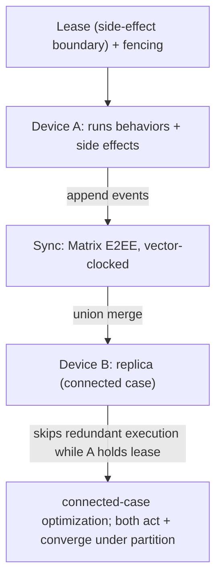

# ADR 0018: Convergent Multi-Device Execution — Lease, Fencing, and Fork Reconciliation

- Status: Proposed
- Date: 2026-05-30

## Context

Lotti syncs agent data across devices (Matrix E2EE, vector-clock stamped), so
multiple devices are concurrent writers. Pure log appends converge for free
under CRDT semantics. But *behavior execution* — LLM calls, notifications,
schedule commits, external writes — must not be replicated naively: if two
devices observe the same trigger and both run a behavior, side effects duplicate
and state diverges. The anchor paper leaves multi-agent contention over the
shared graph unresolved.

Today there is **no cross-device coordinator**: `WakeRunner` enforces
single-flight only *in-process* (an in-memory lock map), and
`sync_event_processor_agent_handlers` applies an incoming agent entity/link
unless the *local* vector clock dominates — so `concurrent` writes are applied
by arrival order. Matrix provides causal/eventual delivery, **not** a
linearizable primitive, so a hard lease cannot be assumed for free.

**The lease is secondary to convergence.** Correctness comes from the convergent
DAG projection (rules 4 and 7–10 below; ADR 0016) — branches are legal and must converge whether or not
the lease held. The lease only reduces duplicate expensive/user-visible work and
guards irreversible external effects; it is never the thing preventing
corruption.

"Vector clock + last-write-wins" must also be applied correctly. A vector clock
can detect true concurrency (which a scalar/hybrid logical clock cannot), so LWW
should apply only on the concurrent branch — and only that branch needs a
tiebreak.

## Decision

1. **Two merge laws, by entity class.** *Append-only event classes*
   (`AgentMessageEntity`, `AgentLink`, reports, observations, change decisions,
   summaries/checkpoints) converge by **set-union + a deterministic DAG fold in a
   canonical linear extension of the causal order** (a topological sort of the
   `messagePrev` parent DAG — the canonical causal graph — with ties broken by
   `hostId` then `id`; the vector clock is the consistency/conflict signal,
   *validated against* the edges and used to classify concurrency, **not** a
   second ordering input) — no LWW. *Mutable registers* (the few genuinely in-place rows — user-authored
   document *heads* via `Version`/`Head`, journal-side in-place edits) converge by
   **LWW snapshot** (rule 4). Separately, **execution** (running behaviors + side
   effects) is gated by the lease. Most agent state is the first class; the LWW
   path is the minority.
2. Side-effecting actions serialize behind a **leader lease keyed to the
   side-effect boundary** — `(agentId, behaviorKind)` for per-agent
   execution/compaction, `(userId, dayId, planner)` for the shared day planner;
   *not* per-user (too coarse) nor bare per-agent (wrong boundary). The lease
   carries a **monotonically increasing fencing token**; the resource side
   rejects any write carrying a lower token. A bare lease is insufficient — a
   paused holder can issue a stale write past expiry.
3. Exactly one device executes at a time **while connected to the lease
   coordinator**; others project the resulting events. This is **not** a free
   extension of the in-process `WakeRunner` lock — it requires a real lease
   backend (a designated-primary election with the fencing token persisted in
   synced state, or an external coordinator). **Offline the hard guarantee
   degrades:** a partitioned device cannot know it still holds the lease, so
   during a partition side effects must be **idempotent and reconciled on
   reconnect** (dedupe via content-address; reject stale fencing tokens), not
   assumed-unique. "Exactly one executes" is therefore a connected-case guarantee
   plus an offline reconciliation contract — with both represented in the backend design.
4. **For mutable-register entities only** — convergent projection rule: classify
   each pair with the vector clock (`a_gt_b`/`b_gt_a` honored by replay order;
   `concurrent` falls to a tiebreak); apply `updatedAt` LWW **only on the
   `concurrent` branch**. (Append-only event classes skip this entirely — they
   union and fold by canonical order, rule 1.) Extend the partial order to a
   single deterministic total order with a replica-independent tiebreak:
   dominance, then a stable `hostId + id` key.
5. Make the LWW comparator a genuine total order: **break equal `updatedAt` by
   a replica-independent secondary key** so identical timestamps cannot diverge
   across replicas. *Implementation note:* for the mutable-register concurrent
   branch the two versions share the same `id`, so `id` cannot discriminate;
   `agent_concurrent_resolver.dart` instead breaks equal `updatedAt` by a
   **canonical vector-clock comparison** (sorted `(hostId, counter)` entries) —
   both replicas hold both clocks, so this is stable and needs no per-entity
   authoring `hostId` column. This realizes the rule's intent (a deterministic,
   replica-independent tiebreak); a literal `hostId`-then-`id` key would require
   first persisting an authoring host on every agent row.
   This is distinct from clock skew: a fast/skewed physical clock wins a
   concurrent branch because its `updatedAt` is strictly greater (the
   equal-timestamp tiebreak never fires), so bounding *that* needs a monotonic
   hybrid logical clock (or bounded drift) on the comparator — not the tiebreak.
6. Keep the vector clock — it detects concurrency, which the human gate needs in
   order to know a real conflict exists. A hybrid logical clock may optionally
   harden the concurrent-branch tiebreak but does not replace the vector clock.
7. **The projection is multi-head tolerant; forks are legal.** Two devices waking
   the same runtime from a shared prefix create a DAG fork (concurrent
   `messagePrev` children of a shared parent — ADR 0016). This is normal, not
   corruption: context assembly reads across all current heads in the canonical
   linear extension (rule 1), so every device converges without a join.
8. **Forks heal by lazy, capped join-by-continuation** — a continuation node
   linking (`messagePrev`) to all current heads, emitted **only when ≥2 heads
   survive past one wake cycle**. Its **id is content-addressed** —
   `hash("join-v1" + sorted parent-head ids)`, a domain-tagged digest kept
   distinct from the summary coverage `frontierDigest` so the two uses can't be
   confused or collide — so two devices emitting the join concurrently write the
   *same* log entry, which set-union merges into one
   node; concurrent joins therefore can't form a new fork (no join storm). For that
   shared id to truly merge, the join's **payload must be fully deterministic** —
   the sorted set of parent-head ids plus a fixed kind, with **no wall-clock,
   `hostId`, or vector clock in the content** — so both writes are byte-identical
   under the id. Per-device **envelope metadata** (`hostId`, VC, `createdAt`) is
   canonicalized by the projection (content-addressed events merge by id; the
   envelope is reconciled deterministically, e.g. min-VC-merge / lowest `hostId`),
   so LWW cannot overwrite or diverge them — separate the deterministic event
   *identity/payload* from the per-device *envelope*. This bounds context and
   re-warms the on-device prefix; it is *not* required for correctness.
9. **Side effects carry an idempotency key** `agentId + behaviorKind +
   frontierDigest + triggerId + toolName`, where `triggerId` is a **stable,
   source-derived** identity — the source event id, the scheduled-wake *entity*
   id, or the shared (sync-replicated) trigger token — **never a per-run local
   UUID** (two devices minting local tokens for the same wake wouldn't dedup), and
   not `scheduledFor` alone (two distinct causes can collide at the same instant). The key is scoped to the **wake epoch**, not
   just the frontier — otherwise a later time-sensitive wake (a scheduled re-plan
   or reminder) over an *unchanged* frontier would be wrongly suppressed. It
   collapses *the same wake executed on two devices*; the later projection
   dedups/suppresses those duplicates
   (reuse ChangeSet dedup, ADR 0009). Truly irreversible external effects (a sent
   email, a created calendar event) cannot be undone — they stay behind the lease
   + the human gate (ADR 0019), and that set is kept minimal; where no external
   key can be stored, log both and reconcile visibly.
10. **Silent vs visible reconciliation.** Derived/internal divergence converges
    silently by canonical pick; divergent *user-facing commitments* surface as a
    `ChangeSet` ("your devices disagreed — here's the reconcile"), never silently
    overwritten.

## Execution Topology

## Consequences

- No duplicated side effects across devices **while connected to the
  coordinator**; under partition, uniqueness degrades to
  *idempotent-and-reconciled* (stale fencing tokens rejected on reconnect). The
  planner commits a schedule in one place in the connected case.
- Convergent, deterministic projection on every device. Forks are legal and
  converge with no coordination; lazy capped joins keep context and the on-device
  prefix bounded.
- Cost: lease + fencing infrastructure and lease handoff; the secondary `hostId`
  tiebreak must be added before convergence can be claimed.
- Pure log appends remain lock-free.

## Related

- `docs/daily_os_ai_runtime_architecture.md` (§8, Thread G)
- `lib/features/sync/vector_clock.dart`
- `lib/features/agents/README.md` (Wake Orchestration: vector-clock self-suppression)
- Kleppmann, "How to do distributed locking"
- ADR 0001, ADR 0016, ADR 0017, ADR 0019
