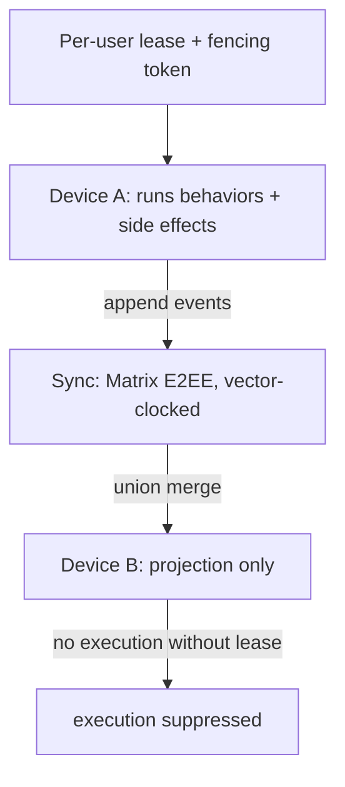

# ADR 0018: Single-Writer Execution via Per-User Lease and Fencing Tokens

- Status: Proposed
- Date: 2026-05-30

## Context

Lotti syncs agent data across devices (Matrix E2EE, vector-clock stamped), so
multiple devices are concurrent writers. Pure log appends converge for free
under CRDT semantics. But *behavior execution* — LLM calls, notifications,
schedule commits, external writes — must not be replicated naively: if two
devices observe the same trigger and both run a behavior, side effects duplicate
and state diverges. The anchor paper leaves multi-agent contention over the
shared graph unresolved.

"Vector clock + last-write-wins" must also be applied correctly. A vector clock
can detect true concurrency (which a scalar/hybrid logical clock cannot), so LWW
should apply only on the concurrent branch — and only that branch needs a
tiebreak.

## Decision

1. Separate **facts** (log appends, recorded model/tool responses — replicate
   freely, converge via CRDT semantics) from **execution** (running behaviors
   and their side effects).
2. Side-effecting actions serialize behind a **per-user leader lease + a
   monotonically increasing fencing token**; the resource side rejects any write
   carrying a lower token. A bare lease is insufficient — a paused holder can
   issue a stale write past expiry.
3. Exactly one device holds the executor lease at a time; others project the
   resulting events. This extends `WakeOrchestrator`'s existing single-flight
   execution + vector-clock self-suppression from intra-device to inter-device.
4. Convergent projection rule: classify each event pair with the vector clock
   (`a_gt_b`/`b_gt_a` honored by replay order; `concurrent` falls to a tiebreak).
   Apply `updatedAt` LWW **only on the `concurrent` branch**. Extend the partial
   order to a single deterministic total order with a replica-independent
   tiebreak: dominance, then a stable `hostId + id` key.
5. Make the LWW comparator a genuine total order: **break equal `updatedAt` by
   `hostId`**. Today equal timestamps can diverge and a merely-fast device clock
   silently wins.
6. Keep the vector clock — it detects concurrency, which the human gate needs in
   order to know a real conflict exists. A hybrid logical clock may optionally
   harden the concurrent-branch tiebreak but does not replace the vector clock.

## Execution Topology

## Consequences

- No duplicated side effects across devices; the planner commits a schedule in
  exactly one place.
- Convergent, deterministic projection on every device.
- Cost: lease + fencing infrastructure and lease handoff; the secondary `hostId`
  tiebreak must be added before convergence can be claimed.
- Pure log appends remain lock-free.

## Related

- `docs/daily_os_ai_runtime_architecture.md` (§8, Thread G)
- `lib/features/sync/vector_clock.dart`
- `lib/features/agents/README.md` (Wake Orchestration: vector-clock self-suppression)
- Kleppmann, "How to do distributed locking"
- ADR 0001, ADR 0016
