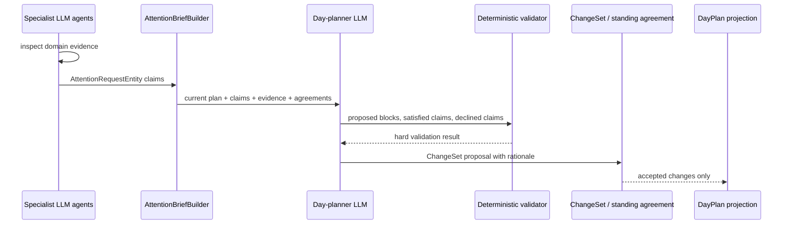

# ADR 0021: LLM-Mediated Attention Claim Weighing

- Status: Accepted
- Date: 2026-06-05

## Context

ADR 0019 introduced attention negotiation as a Contract-Net-shaped protocol:
agents emit attention requests, a planner behavior arbitrates them, and accepted
awards become day-plan changes through the existing `ChangeSet` gate.

The first implementation created useful primitives:

- `AttentionRequestEntity` and `AttentionAwardEntity` as persisted log records.
- Attention evidence, award/request, and award/plan links.

However, the product intent is not to let a fixed deterministic scoring formula
decide the user's day. Specialist agents are LLM-backed knowledge sources. They
should make high-quality, evidence-backed claims for attention. A day-planning
LLM should then weigh those claims against each other, the current plan, standing
agreements, recent outcomes, and the user's preferences.

The deterministic parts remain necessary, but they are the substrate and safety
rails: log projection, provenance, idempotency, validation, convergence, and
ChangeSet application. They are not the source of planning judgment.

## Decision

1. **Attention requests are claims, not final bids.** An
   `AttentionRequestEntity` is a specialist agent's structured claim that some
   user attention should be allocated. Fields such as `impact`, `urgency`,
   `energyFit`, windows, deadlines, and rationale are agent-stated assertions
   that the planner may accept, discount, combine, defer, or reject after reading
   the evidence.

2. **Specialist LLM agents author the claims.** Task, project, fitness, sleep,
   finance, maintenance, and other agents may emit attention requests when their
   domain model indicates that calendar time, a check-in, or a protected habit
   block matters. Claims must cite evidence references and explain why the
   request matters now.

3. **The day-planner LLM weighs claims.** The primary planning behavior consumes
   an attention brief, not just numeric scores. The brief contains the current
   day plan, pending claims, evidence summaries/snapshots, hard constraints,
   standing agreements, recent user decisions, and outcome signals. The planner
   LLM decides which claims should become proposed blocks, which claims are
   satisfied by the same block, and which claims should be declined or deferred.

4. **Deterministic code validates, records, and applies decisions.** Code still
   owns hard checks: overlapping blocks, capacity, invalid windows, missing
   evidence, stale baselines, idempotent IDs, soft deletion, ChangeSet
   application, and projection convergence. The planner LLM may propose; it does
   not directly mutate the calendar.

5. **No speculative deterministic fallback.** A deterministic utility ranker is
   not the canonical decision-maker, and it should not live in production as a
   fallback without a runtime caller. Add deterministic helper code only when a
   concrete planner path needs slot validation, candidate generation, or
   regression fixtures.

6. **Planner output must preserve claim provenance.** A planner proposal records
   which request ids it satisfies, which request ids it declines or defers, and
   a rationale for each material decision. One proposed block may satisfy
   multiple claims, for example a workout block satisfying both a strength goal
   claim and a daily-steps claim.

7. **Awards are planner proposals, not objective winners.** An
   `AttentionAwardEntity` represents the planner's proposed allocation of
   attention for one or more claims. It is evidence-linked and auditable, but it
   does not imply that a deterministic auction found an optimal winner.

8. **Standing agreements decide whether proposals need the user.** A standing
   agreement may auto-accept low-risk proposals, require explicit user approval,
   or reject proposals that violate trust boundaries. The accepted calendar
   mutation still flows through ADR 0006's `ChangeSet`/`ChangeDecision` path.

9. **Planner claim discovery must use an indexed timeframe projection, never a
   table scan or day-plan key.** `agent.sqlite` can be large, and
   `agent_entities.serialized` is a JSON payload. The planner must not discover
   claims by scanning `agent_entities` or filtering deserialized JSON in Dart.
   Claims are discovered by arbitrary planning windows such as
   `[tomorrow 00:00, next midnight)` or `[now, next Sunday 17:00)`, not by
   requiring a `dayplan-*` key to exist first. The source of truth remains the
   synced `AgentDomainEntity` log, but claim lookup uses a small derived index
   table maintained inside `agent.sqlite`, for example:

   ```text
   attention_claim_index
     request_id        TEXT PRIMARY KEY
     agent_id          TEXT NOT NULL
     status            TEXT NOT NULL
     scope_kind        TEXT NOT NULL
     visibility_start   DATETIME NOT NULL
     visibility_end     DATETIME NOT NULL
     deadline          DATETIME
     next_review_at    DATETIME
     target_id         TEXT
     target_kind       TEXT
     updated_at        DATETIME NOT NULL
     deleted_at        DATETIME
   ```

   This table is a local projection/cache, not an independently synced source of
   truth. It can be rebuilt from `agent_entities`, but normal writes update it
   transactionally with attention request/disposition writes. Querying for
   tomorrow means an overlap query against `visibility_start`/`visibility_end`,
   not a lookup by day-plan id.

10. **Claim status is a projected lifecycle, not only a field on the original
    request.** The original claim should stay auditable. Planner/user/system
    outcomes should be represented by disposition events or an equivalent
    projection so a claim can be open, proposed, satisfied, partially satisfied,
    declined, deferred, superseded, expired, or withdrawn without mutating away
    its original rationale/evidence.

## Target Flow



## Implementation Plan

1. **Flexible claim scope.** Attention requests carry arbitrary visibility
   windows, deadlines, and cadence hints so agents can express horizon claims
   such as "90 minutes before Sunday" or "3 workout sessions this week" without
   requiring a pre-existing `DayPlanEntity` or `dayplan-*` key.

2. **Indexed claim projection.** Add `attention_claim_index` (or an equivalent
   indexed projection) with indexes for active timeframe lookup, for example:

   ```sql
   CREATE INDEX idx_attention_claims_active_window
     ON attention_claim_index(status, visibility_start, visibility_end,
       next_review_at, deadline, request_id)
     WHERE deleted_at IS NULL;

   CREATE INDEX idx_attention_claims_active_deadline
     ON attention_claim_index(status, deadline, request_id)
     WHERE deleted_at IS NULL AND deadline IS NOT NULL;
   ```

   Planner reads first query this projection for request ids using interval
   overlap (`visibility_start < windowEnd AND visibility_end > windowStart`),
   then hydrate only the matching `agent_entities` rows by primary key. Query
   plans should prefer narrow indexed reads or `UNION ALL` over broad `OR`
   predicates so SQLite does not fall back to a scan.

3. **Claim disposition model.** Add disposition events/projection for proposed,
   satisfied, partially satisfied, declined, deferred, superseded, expired, and
   withdrawn states. Do not rely only on mutating
   `AttentionRequestEntity.status`.

4. **Attention brief builder.** Add a service that reads the indexed claim
   projection for an arbitrary planning window, hydrates matching `AttentionRequestEntity`
   records, resolves evidence summaries from captured agent inputs, includes the
   current `DayPlanEntity` records that already exist or lightweight draft plans
   that the planner is allowed to modify, and produces a compact planner
   context.

5. **Planner output contract.** Define the day-planner LLM response shape:
   proposed blocks, `satisfiesRequestIds`, declined/deferred requests, per-block
   rationale, baseline plan id, and explicit hard-constraint assumptions.

6. **Mechanical validator.** Validate the proposed diff before persistence:
   no overlaps, valid windows, valid evidence ids, valid request ids, sane
   durations, no stale baseline, no direct mutation outside allowed ChangeSet
   actions.

7. **Persistence bridge.** Persist planner proposals as `AttentionAwardEntity`
   records plus links to requests/evidence and concrete day plans when a block
   is proposed, then emit ChangeSet-compatible
   `add_block`/`move_block`/`drop_block` items.

8. **Standing agreements.** Implemented foundation:
   `StandingAgreementEntity` records durable user policies/goals such as
   recurring workouts, sleep wind-down blocks, task focus time, paperwork
   limits, and low-risk check-ins. `standing_agreement_index` is a local
   projection for status/scope/window lookup so planner reads do not scan
   `agent_entities`. Remaining work: consume these agreements in the planner
   brief, evaluate proposal classes against their `approvalMode` and
   `enforcement`, and route matching proposals through auto-accept/ask/reject
   policy.

9. **Decision and outcome tracking.** Record why claims were accepted, declined,
   deferred, or superseded, and feed user decisions and actual completions back
   into future agent claims.

10. **UI projection.** Build the "No Bullshit" view as a projection of the log:
   what each agent claimed, what evidence it cited, what the planner proposed,
   what was accepted/rejected, and what actually happened.

## Consequences

- The system uses LLM judgment where judgment matters: balancing health, sleep,
  work, deadlines, energy, and user preference.
- Numeric fields remain useful as claim metadata, but the planner must not treat
  them as trusted objective truth.
- Testing shifts from "score decides winner" to "brief construction, output
  validation, persistence, and ChangeSet application are correct."
- Do not keep deterministic arbitration code as speculative fallback. If a
  concrete planner service needs helper logic later, add it at that boundary
  with direct tests for that caller.
- Planner claim retrieval needs dedicated indexing. Generic
  `agent_entities(type, created_at)` or `agent_entities(agent_id, type, subtype)`
  indexes are not enough for cross-agent horizon queries over a large
  `agent.sqlite` database.
- More provenance is required: accepted blocks should explain which claims they
  satisfied, and declined claims should have a logged reason.
- The planner can express substitutions and bundles, such as one workout block
  satisfying both strength-training and daily-step claims.

## Related

- ADR 0019: Attention-Negotiation Protocol and Bid Schema — amended by this ADR.
- ADR 0006: Change-Set Deferred Tool Confirmation.
- ADR 0016: Agent State as Log Projection.
- ADR 0018: Convergent Multi-Device Execution.
- ADR 0020: Agent Input Capture.
- `lib/features/agents/model/attention_negotiation.dart`
- `lib/features/agents/model/agent_domain_entity.dart`
