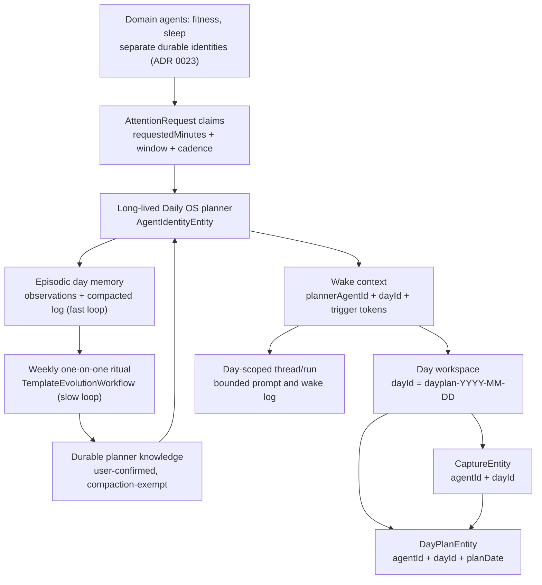

# ADR 0022: Long-Lived Daily OS Planner

- Status: Accepted
- Date: 2026-06-07

## Context

Daily OS Next currently models the planning agent as one active
`AgentIdentityEntity` per local calendar day. `DayAgentService.createDayAgent`
derives the agent identity from the day-plan id, stores that id in
`AgentSlots.activeDayId`, and routes capture, draft, refine, commit, memory, and
observations through that per-day `agentId`.

That shape is useful for task agents because each task should have a bounded
private context. It is the wrong boundary for day planning. The planner is meant
to learn across days and categories: what capacity the user actually commits
to, what gets carried over, when capture text refers to existing work, which
categories are usually under-estimated, and which interventions the user
accepts or rejects.

The current code makes those learning paths structurally weak:

- `DayAgentService.createDayAgent` permits one day-agent identity per local day.
- `DayAgentPlanService.summarizeRecentPatterns` reads recent plans by
  `agentId`, so a new day cannot see yesterday's plans under the current model.
- `DayAgentWorkflow` loads observations, captures, and compaction memory by
  `agentId`, so the memory substrate is reset at each day boundary.
- `DayAgentWorkflow.execute` derives the target day from
  `state.slots.activeDayId`, which is safe only while one agent owns one day.

At the same time, the day-plan storage model already has the right day boundary:
`DayPlanEntity` has a deterministic day-plan id, `dayId`, and `planDate`. The
day does not need to be represented as an agent identity.

Daily OS Next is still early enough that migration compatibility is not the
primary constraint. We should fix the model directly before the per-day identity
assumption becomes more expensive.

## Decision

1. **Daily OS uses one long-lived planner/shepherd identity.** There is one
   active planner `AgentIdentityEntity` for the Daily OS planning behavior. The
   persisted kind may remain `day_agent` until a broader naming cleanup is
   worth doing, but service and workflow semantics are planner-shaped, not
   date-agent-shaped.

2. **A day is an explicit workspace, not an agent identity.** The day workspace
   key remains:

   ```text
   dayId = dayPlanId(localDay(date)) // dayplan-YYYY-MM-DD
   ```

   Day-scoped records must carry or derive this workspace explicitly. The
   planner may own many day workspaces.

3. **The planner workflow MUST NOT read `AgentSlots.activeDayId`, and must stop
   deriving it.** A long-lived planner cannot read its target day from mutable
   agent state. This is stronger than "not authoritative": today `activeDayId`
   is *derived* from the per-day `AgentDayLink` by the state projection
   (`derived_agent_state.dart`) and *written back* by `reconcileAgentState` on
   every wake, so under one planner with many day links it would reconcile to a
   single most-recent day and persist it, corrupting the slot and emitting a
   permanent `activeDayId` derived-field mismatch. The refactor must therefore
   stop creating one `AgentDayLink` per day for the planner (or exclude
   `activeDayId` from derivation, reconcile write-back, and diagnostics), not
   merely stop reading the slot at execution time. Day-scoped wakes carry a
   target `dayId` through wake context and trigger tokens; the workflow fails
   fast when a day-scoped wake cannot resolve a day.

4. **Planner wakes are workspace-scoped.** Every day-scoped wake carries an
   explicit token such as:

   ```text
   planning_day:<dayId>
   drafting:<dayId>
   refine:<dayId>
   capture_submitted:<captureId>
   decided_task:<taskId>
   decided_capture_item:<parsedItemId>
   ```

   Tool calls that include `dayId` must be rejected if the requested day does
   not match the wake workspace.

5. **Captures need explicit day scope.** Captured time and planning target are
   not the same concept. `CaptureEntity` must carry the planning `dayId`
   directly or through an equivalent deterministic link. Parsed items can
   continue to derive day scope through their capture.

6. **Memory separates global planner knowledge from day workspace context.**
   The planner's long-running memory is intentional and cross-day. Raw
   day-scoped inputs, such as capture transcripts, parsed items, draft blocks,
   and refine transcripts, must be filtered to the active workspace unless they
   are deliberately summarized into global learning.

7. **Per-day threads/runs remain useful, but not as identities.** A day wake may
   run in a day-scoped thread/run for bounded prompt context, inspectability,
   retries, and debugging. Durable memory and learning belong to the
   long-lived planner identity.

8. **Provider-specific inference remains behind provider-neutral contracts.**
   Forced tool-choice behavior is required for reliable day planning, but the
   workflow contract must stay generic across Gemini, Mistral, OpenAI-compatible
   providers, and future providers.

9. **Planner learning has two loops.** The fast loop is daily and unsupervised:
   raw day-scoped inputs and planner observations accrue on the long-lived
   identity's log as episodic memory, compacted per ADR 0017. The slow loop is
   the weekly one-on-one ritual (`TemplateEvolutionWorkflow`), now bound to the
   single planner identity, which consolidates recurring daily observations into
   durable, user-approved knowledge. Nothing becomes a durable preference except
   through the weekly gate or an explicit user confirmation. Daily episodic
   memory may be aged aggressively *precisely because* anything worth keeping is
   promoted through the slow loop. This is the architectural answer to "learn
   day to day" while keeping "the weekly one-on-one".

10. **User-stated knowledge is durable and compaction-exempt.** "Memorize what I
    tell you" requires a store that LLM log compaction cannot dissolve. Routing
    user instructions through agent-inferred `record_observations` into the
    shared compaction fold (ADR 0017) silently degrades them over a long-lived
    planner's life — relocating amnesia rather than curing it. Confirmed user
    knowledge (e.g. "never schedule deep work before 10:00") is therefore a
    keyed, supersedable, user-confirmable record, excluded from the compaction
    fold and injected into the prompt as a stable standing block (cf. ADR 0014
    critical-observation injection). Agent-inferred observations stay in the
    compactable episodic stream until the slow loop or an explicit user
    confirmation promotes them. The store is specified in the implementation
    plan's "Durable Planner Knowledge" section.

11. **Domain agents are peers, not part of the planner.** Specialist agents
    (e.g. fitness, sleep) are separate durable identities. They negotiate for
    calendar time through the existing attention-claim and standing-agreement
    protocol (ADR 0019, ADR 0021); the long-lived planner is the stable
    counterparty and sole arbitrator they negotiate with. The planner weighs
    their claims and proposes plan changes through the ChangeSet gate (ADR
    0006), but does not absorb domain reasoning. This is the *inverse* of a
    planner-spawned analyst run (planner-owns-throwaway-investigator vs.
    durable-peer-petitions-planner) and is specified separately in ADR 0023.

12. **Day-scoped scheduling needs explicit workspace context, not a single
    timestamp.** A single `AgentState.scheduledWakeAt` cannot represent several
    outstanding day-scoped wakes under one planner; a second day's
    `set_next_wake` clobbers the first. Scheduled day wakes must be either
    global-only planner wakes or persisted scheduled-wake records carrying a
    workspace key and trigger tokens (ADR 0010). The self-scheduled morning
    pre-warm is day-scoped and therefore requires the latter; it must not be
    restored as a context-less wake, and "global-only scheduled wakes" must not
    silently remove it.

13. **Deep disposable analysis is deferred.** One-off, planner-spawned
    investigation runs that write a compact artifact and close are deliberately
    out of scope here. Deferring them avoids pre-committing analysis *ownership*
    before the domain-agent boundary (ADR 0023) is settled — several of the
    motivating questions ("why does this project keep displacing workouts?") are
    exactly what a durable domain agent exists to answer. They may be
    reintroduced in a later ADR, reusing the existing `AgentReportEntity` scope
    (which already carries `scope`, `confidence`, and `provenance`) rather than a
    new artifact entity.

## Target Runtime Shape



## Consequences

- Cross-day learning becomes structurally possible because plans,
  observations, memory compaction, reports, and token usage belong to one
  durable planner identity.
- Day isolation moves into explicit workspace context, validation, and filtered
  queries. This is safer than implicit isolation through agent identity because
  the boundary is visible in every wake and tool call.
- `getDayAgentForDate` cannot simply return the same agent for every date. That
  naive change would leak captures and context across days. The service API
  must be reshaped around `getOrCreatePlannerAgent` and day workspace helpers.
- Wake queue and scheduled wake semantics must become workspace-aware — across
  superseding, dedupe, **and token merge/extraction**. Current agent-wide
  `removeByAgent` superseding and `mergeTokens` merging (both keyed only by
  `agentId`), plus "first matching token wins" extraction helpers, would let one
  day's manual wake drop or contaminate another day's queued work once all days
  share one planner. This must land **with or before** the identity collapse,
  not in a later PR, or there is a live cross-day wake-cancellation and
  wrong-day-drafting window.
- All planner wakes across all days now share **one execution lease and one
  state chain** (ADR 0018). Single-flight by `agentId` therefore becomes a
  *global* planner serialization point, not the per-day sharding the old model
  accidentally provided; a slow draft for one day blocks unrelated days. This is
  acceptable for planner judgment initially, but is a property of *this* decision
  and should be revisited only with evidence.
- Scheduled wakes need either global-only semantics or persisted trigger tokens
  / workspace context. A single `AgentState.scheduledWakeAt` is not enough for
  multiple day-scoped planner wakes, and a context-less scheduled wake cannot
  drive the day-scoped morning pre-warm.
- Durable cross-day memory needs a contradiction/decay policy. Confirmed
  knowledge is revisable (recency-wins supersession) at the weekly gate or by
  explicit user retraction; daily episodic memory is recency-weighted. Without
  this, durable memory becomes stale truth — the same risk previously flagged
  only for analysis artifacts now applies to the planner's own long-lived memory.
- State reconstruction cost grows with the planner's lifetime. The projection
  loads and folds the agent's full observation/message set per wake (ADR 0016);
  collapsing N tiny per-day logs into one long-lived log removes the bound the
  old model accidentally had. Compaction (ADR 0017) bounds the rendered tail but
  not the query/fold input, so a multi-year planner needs a projection snapshot
  or incremental fold story.
- Some existing docs and tests that describe "one day-agent per calendar date"
  are superseded by this decision and must be updated during implementation.

## Related

- [ADR 0006: Change Set — Deferred Tool Confirmation Workflow](./0006-change-set-deferred-tool-confirmation.md)
- [ADR 0010: Scheduled Wake Infrastructure](./0010-scheduled-wake-infrastructure.md)
- [ADR 0014: Cross-Wake Critical Observation Injection](./0014-cross-wake-critical-observation-injection.md)
- [ADR 0016: Agent State as Log Projection](./0016-agent-state-as-log-projection.md)
- [ADR 0017: Deterministic Log Compaction](./0017-deterministic-log-compaction.md)
- [ADR 0018: Convergent Multi-Device Execution](./0018-convergent-multi-device-execution.md)
- [ADR 0019: Attention Negotiation Protocol](./0019-attention-negotiation-protocol.md)
- [ADR 0020: Agent Input Capture](./0020-agent-input-capture.md)
- [ADR 0021: LLM-Mediated Attention Claim Weighing](./0021-llm-mediated-attention-claim-weighing.md)
- [ADR 0023: Durable Domain Agents and Time Negotiation](./0023-durable-domain-agents-and-time-negotiation.md)
  — the peer fitness/sleep agents that negotiate with this planner for time.
- [Long-Lived Daily OS Planner implementation plan](../implementation_plans/2026-06-07_long_lived_daily_os_planner.md)
- Supersedes the identity-granularity decision in
  [Day Agent Layer - Implementation Plan](../implementation_plans/2026-05-25_day_agent_layer.md)
