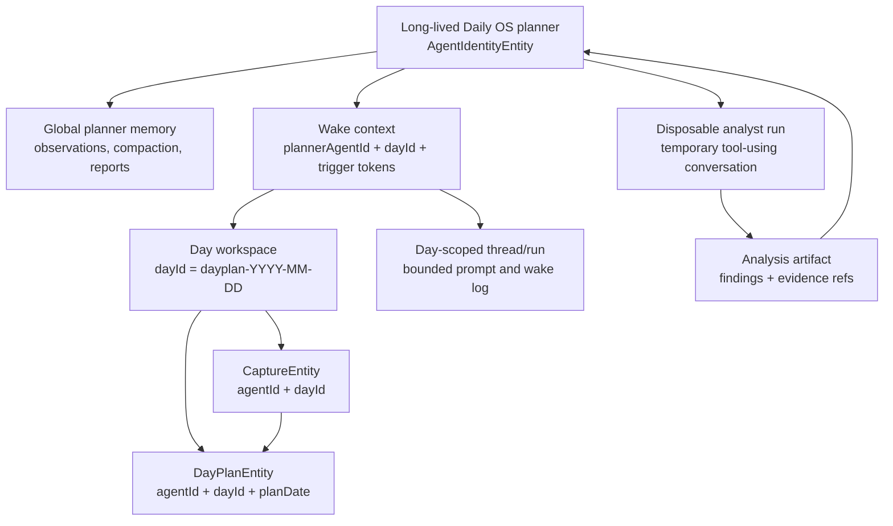

# ADR 0022: Long-Lived Daily OS Planner

- Status: Accepted
- Date: 2026-06-07

## Context

Daily OS Next currently models the planning agent as one active
`AgentIdentityEntity` per local calendar day. `DayAgentService.createDayAgent`
derives the agent identity from the day-plan id, stores that id in
`AgentSlots.activeDayId`, and routes capture, draft, refine, commit, memory, and
observations through that per-day `agentId`.

That shape is useful for task agents because each task should have a bounded
private context. It is the wrong boundary for day planning. The planner is meant
to learn across days and categories: what capacity the user actually commits
to, what gets carried over, when capture text refers to existing work, which
categories are usually under-estimated, and which interventions the user
accepts or rejects.

The current code makes those learning paths structurally weak:

- `DayAgentService.createDayAgent` permits one day-agent identity per local day.
- `DayAgentPlanService.summarizeRecentPatterns` reads recent plans by
  `agentId`, so a new day cannot see yesterday's plans under the current model.
- `DayAgentWorkflow` loads observations, captures, and compaction memory by
  `agentId`, so the memory substrate is reset at each day boundary.
- `DayAgentWorkflow.execute` derives the target day from
  `state.slots.activeDayId`, which is safe only while one agent owns one day.

At the same time, the day-plan storage model already has the right day boundary:
`DayPlanEntity` has a deterministic day-plan id, `dayId`, and `planDate`. The
day does not need to be represented as an agent identity.

Daily OS Next is still early enough that migration compatibility is not the
primary constraint. We should fix the model directly before the per-day identity
assumption becomes more expensive.

## Decision

1. **Daily OS uses one long-lived planner/shepherd identity.** There is one
   active planner `AgentIdentityEntity` for the Daily OS planning behavior. The
   persisted kind may remain `day_agent` until a broader naming cleanup is
   worth doing, but service and workflow semantics are planner-shaped, not
   date-agent-shaped.

2. **A day is an explicit workspace, not an agent identity.** The day workspace
   key remains:

   ```text
   dayId = dayPlanId(localDay(date)) // dayplan-YYYY-MM-DD
   ```

   Day-scoped records must carry or derive this workspace explicitly. The
   planner may own many day workspaces.

3. **`AgentSlots.activeDayId` is not authoritative planner context.** A
   long-lived planner cannot read its target day from mutable agent state.
   Day-scoped wakes must carry a target `dayId` through wake context, trigger
   tokens, or a captured workspace record. The workflow must fail fast when a
   day-scoped wake cannot resolve a day.

4. **Planner wakes are workspace-scoped.** Every day-scoped wake carries an
   explicit token such as:

   ```text
   planning_day:<dayId>
   drafting:<dayId>
   refine:<dayId>
   capture_submitted:<captureId>
   decided_task:<taskId>
   decided_capture_item:<parsedItemId>
   ```

   Tool calls that include `dayId` must be rejected if the requested day does
   not match the wake workspace.

5. **Captures need explicit day scope.** Captured time and planning target are
   not the same concept. `CaptureEntity` must carry the planning `dayId`
   directly or through an equivalent deterministic link. Parsed items can
   continue to derive day scope through their capture.

6. **Memory separates global planner knowledge from day workspace context.**
   The planner's long-running memory is intentional and cross-day. Raw
   day-scoped inputs, such as capture transcripts, parsed items, draft blocks,
   and refine transcripts, must be filtered to the active workspace unless they
   are deliberately summarized into global learning.

7. **Per-day threads/runs remain useful, but not as identities.** A day wake may
   run in a day-scoped thread/run for bounded prompt context, inspectability,
   retries, and debugging. Durable memory and learning belong to the
   long-lived planner identity.

8. **Provider-specific inference remains behind provider-neutral contracts.**
   Forced tool-choice behavior is required for reliable day planning, but the
   workflow contract must stay generic across Gemini, Mistral, OpenAI-compatible
   providers, and future providers.

9. **Deep analysis is delegated to disposable scoped analyst runs.** The
   long-lived planner may spawn or schedule one-off analyst conversations for
   bounded investigations such as "why did planned work spill over this week?"
   or "which project keeps displacing workouts?". These analyst runs may use
   tools, inspect a larger local corpus, and reason in their own temporary
   context. They are not durable planning identities. Their output is a compact
   analysis artifact with evidence references, findings, confidence, and
   recommendations. The planner consumes that artifact, not the analyst's raw
   transcript.

## Target Runtime Shape



## Consequences

- Cross-day learning becomes structurally possible because plans,
  observations, memory compaction, reports, and token usage belong to one
  durable planner identity.
- Day isolation moves into explicit workspace context, validation, and filtered
  queries. This is safer than implicit isolation through agent identity because
  the boundary is visible in every wake and tool call.
- `getDayAgentForDate` cannot simply return the same agent for every date. That
  naive change would leak captures and context across days. The service API
  must be reshaped around `getOrCreatePlannerAgent` and day workspace helpers.
- Wake queue and scheduled wake semantics must become workspace-aware. Current
  agent-wide dedupe/superseding would let one day's wake cancel another day's
  work once all days share one planner.
- Scheduled wakes need either global-only semantics or persisted trigger tokens
  / workspace context. A single `AgentState.scheduledWakeAt` is not enough for
  multiple day-scoped planner wakes.
- Deep analysis can happen without polluting the planner's main context. The
  planner may delegate a bounded question to a disposable analyst run, then
  retain only a compact artifact and evidence references.
- Some existing docs and tests that describe "one day-agent per calendar date"
  are superseded by this decision and must be updated during implementation.

## Related

- [ADR 0016: Agent State as Log Projection](./0016-agent-state-as-log-projection.md)
- [ADR 0017: Deterministic Log Compaction](./0017-deterministic-log-compaction.md)
- [ADR 0019: Attention Negotiation Protocol](./0019-attention-negotiation-protocol.md)
- [ADR 0020: Agent Input Capture](./0020-agent-input-capture.md)
- [ADR 0021: LLM-Mediated Attention Claim Weighing](./0021-llm-mediated-attention-claim-weighing.md)
- [Long-Lived Daily OS Planner implementation plan](../implementation_plans/2026-06-07_long_lived_daily_os_planner.md)
- Supersedes the identity-granularity decision in
  [Day Agent Layer - Implementation Plan](../implementation_plans/2026-05-25_day_agent_layer.md)
