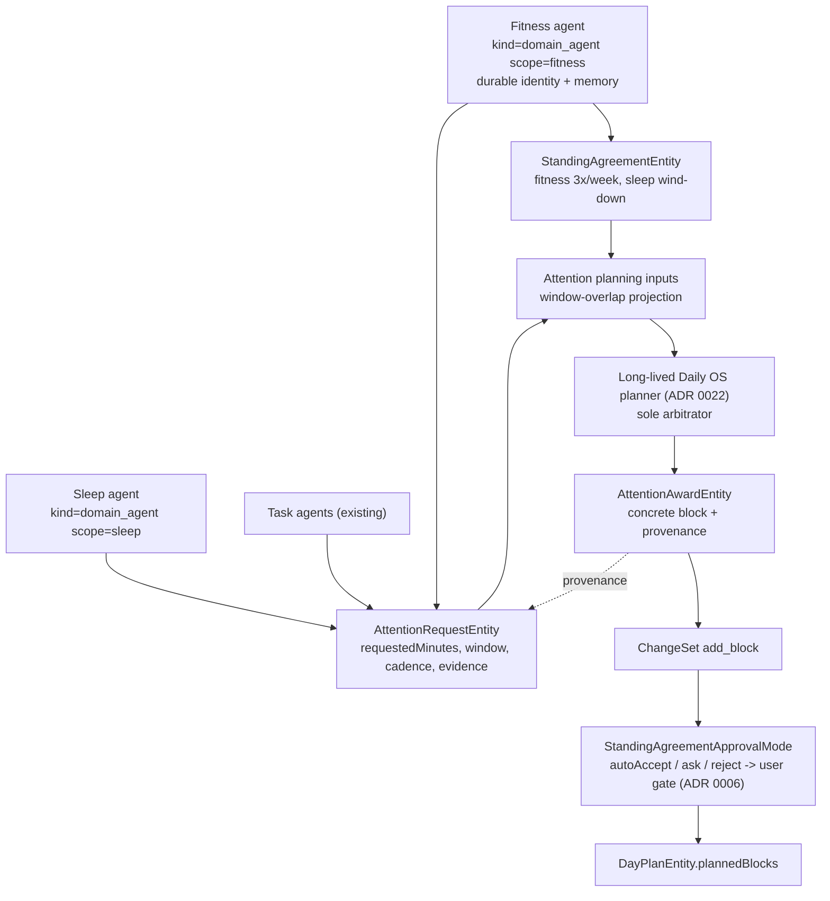

# ADR 0023: Durable Domain Agents and Time Negotiation

- Status: Proposed
- Date: 2026-06-07

## Context

The long-lived Daily OS planner (ADR 0022) is the durable identity that owns the
day plan and arbitrates what gets scheduled. But the planner is not the only mind
the product wants. The goal is a small set of **durable, domain-specific agents**
— a fitness agent, a sleep coach, later nutrition, finances, maintenance — each
with its own memory, its own goals, and its own view of how the user is doing in
that domain. These agents should **negotiate with the planner for calendar time**:
a fitness agent should be able to ask for three workout blocks this week; a sleep
coach should be able to protect a wind-down window.

This is the inverse of the "disposable analyst run" idea that ADR 0022
deliberately deferred (Decision 13). An analyst run is ephemeral, planner-spawned,
read-only, and informational. A domain agent is durable, self-owned,
self-scheduled, and *allocative* — its output is a claim on scarce time, not a
report.

Most of the negotiation substrate already exists in `lib/features/agents/`, built
by ADR 0019 (attention negotiation protocol) and ADR 0021 (LLM-mediated claim
weighing). What is missing is the **producer side**: there is no durable domain
agent that can author claims for a non-task domain.

### What already exists (verified in code)

- `AttentionRequestEntity` (`agent_domain_entity.dart`) — an event-sourced,
  immutable, evidence-backed claim that already carries `requestedMinutes`,
  `scopeKind` (`day` | `dateRange` | `deadline` | `recurrence`), `earliestStart`
  / `latestEnd` / `deadline`, `energyFit`, `impact`, `urgency`, `cadence`,
  `targetId` / `targetKind`, `rationale`, and `evidenceRefs`. It already models
  "claim 45 minutes Tuesday evening", not merely "interrupt the user".
- `AttentionClaimDispositionEntity` — projects claim lifecycle
  (`open` → `proposed` → `satisfied` / `declined` / `deferred` / `superseded`
  / `expired` / `withdrawn`) without mutating the original claim.
- `AttentionAwardEntity` — a planner proposal for a **concrete plan block**
  (`dayId`, `planId`, `blockId`, `startTime`, `endTime`, `rank`, `utilityScore`).
  It is a proposal: schedule mutation still flows through the ChangeSet gate
  (ADR 0006).
- `StandingAgreementEntity` with `StandingAgreementScope` already enumerating
  `fitness` and `sleep`, plus `cadence`, `enforcement`
  (`preference` | `target` | `nonNegotiable`), `approvalMode`
  (`autoAccept` | `ask` | `reject`), `canPreempt`, and quota fields
  (`minCount` / `maxCount` / `minMinutes` / `preferredSessionMinutes`).
- `AttentionEvidenceRef` with `AttentionEvidenceKind` already including `.health`
  and `.outcome`.
- The day planner **already reads claims and standing agreements** for the
  planning window: `day_agent_context_builder.dart` calls
  `getAttentionPlanningInputsForWindow(start, end)` and renders both into the
  planner prompt.

### What is missing (the gap)

- `AgentKinds` has only `task_agent`, `project_agent`, `day_agent`,
  `template_improver` — **no domain agent kind**.
- `request_attention` is wired only to task agents: `AttentionRequestHandler`
  hardcodes `_taskTargetKind = 'task'` and reads `task.categoryId`, so a claim
  cannot be authored for a non-task domain.
- There is no **self-scheduled producer wake** for a domain agent (e.g. a nightly
  "did the user hit 2 of 3 workouts?" check that emits or refreshes claims).
- The planner's **arbitration path** — weigh claims → emit `AttentionAwardEntity`
  → propose an `add_block` ChangeSet — is designed in ADR 0021 but not yet wired
  for the day planner.
- Claims are inherently **horizon-scoped** ("3 workouts this week"), but the
  planner's wake contract (ADR 0022) is rigidly `planning_day:<dayId>`.

## Decision

1. **Domain agents are durable, first-class identities.** Introduce a
   `domain_agent` `AgentKind`, one durable identity per life domain (initially
   `fitness` and `sleep`, mapped to `StandingAgreementScope`). They have their
   own memory substrate and learning loops, mirroring the planner's two-loop
   model (ADR 0022 Decisions 9–10), not a per-day or per-task identity. Memory
   coherence, not claim volume, sets the granularity: one durable agent per
   scope, not one per workout.

2. **Domain agents produce claims; they never write the calendar.** A domain
   agent's only path to time is to author an `AttentionRequestEntity` (and,
   for recurring commitments, a `StandingAgreementEntity`). It does **not** add,
   move, or drop `PlannedBlock`s, and it does not call the planner synchronously.
   Claims are events on the synced log, discovered by the planner through the
   existing window-overlap projection — convergence-safe across devices
   (ADR 0018), exactly as ADR 0019 Decision 2 ("bids are events, not RPCs").

3. **`request_attention` is generalized off the task-only path.** The handler
   must accept a category/target-agnostic claim so a fitness claim is not forced
   through a `Task`. `targetKind` becomes domain-shaped (e.g. `fitness`,
   `sleep`), `categoryId` is supplied by the domain agent's configuration rather
   than read from a task, and the task path becomes one caller among several.

4. **The planner is the sole arbitrator.** The planner — and only the planner —
   weighs competing claims against the current plan, standing agreements, recent
   outcomes, and durable knowledge (ADR 0021 Decision 3), then emits an
   `AttentionAwardEntity` and a corresponding `add_block` ChangeSet. The award
   records provenance (which `requestId` it satisfies; one block may satisfy
   several claims). This claim → weigh → award → ChangeSet path is the core new
   build of this ADR. Domain agents are **producers**; the planner is the single
   **consumer/arbitrator**. This asymmetry is intentional: multi-agent contention
   needs one accountable arbitrator, not N peers writing shared plan state.

5. **The user stays in control through standing agreements.** Whether an award
   is applied silently or shown for approval is governed by the matching
   `StandingAgreementApprovalMode`: `autoAccept` for low-risk recurring habit
   blocks, `ask` (default) routes through the ChangeSet / ChangeDecision gate
   (ADR 0006), `reject` blocks. `enforcement = nonNegotiable` + `canPreempt`
   let a durable commitment ("gym 3×/week") outrank a soft work block. A domain
   agent cannot silently colonize the user's evenings: every block it wins is
   either user-approved or governed by an agreement the user previously set.

6. **Domain agents are self-scheduled producers.** A domain agent wakes on its
   own cadence (e.g. nightly) to evaluate its domain model against actuals and
   emit, refresh, or withdraw claims. This is what makes it a coach with goals
   rather than a passive helper. It reuses the existing scheduled-wake
   infrastructure (ADR 0010); the new work is wiring a non-task, non-day producer
   into it.

7. **Negotiation is horizon-scoped, not day-scoped.** Because cadence claims span
   ranges ("3 workouts this week", "90 minutes before Sunday"), the planner
   gains a `planning_window:<range>` wake alongside ADR 0022's
   `planning_day:<dayId>`, so a weekly-cadence claim is weighable while drafting
   a single day. This is additive to ADR 0022's wake contract, not a
   contradiction of it.

8. **Claims carry inspectable justification.** A domain agent cites
   `evidenceRefs` of kind `health` / `outcome` (e.g. workout actuals, sleep
   actuals) plus a `rationale`. The planner reads evidence summaries in its
   brief and weighs them; it does not import the domain agent's raw memory.

## Target Runtime Shape

## Consequences

- The product gains genuine specialist coaches that compete for time on the
  user's behalf, with the planner as a single, learning, accountable arbitrator.
- No new negotiation protocol is invented: the existing attention-claim /
  standing-agreement model is reused, and "attention" is understood as
  scheduled calendar time, not push-notification interruption.
- The decoupling discipline holds: domain agents depend only on the claim /
  agreement log and never on planner internals, and the planner reads
  materialized claim projections rather than fanning out to wake producers
  synchronously during drafting.
- ADR 0022 does **not** need reopening. Domain agents live in a separate feature
  and negotiate through an already-decoupled projection read; the durable planner
  ADR 0022 creates is in fact a *prerequisite* for good arbitration (weighing
  fitness vs. work needs cross-day memory of "this project keeps displacing
  workouts").
- A cadence/recurrence verifier (ADR 0019 Decision 4's "gym 3×/week may pre-empt"
  enforcement against health actuals) is still required to turn a one-off claim
  into a durable habit guarantee; it remains the largest unbuilt enforcement
  piece.

## Non-Goals

- Letting domain agents mutate the calendar directly. They claim; the planner
  arbitrates; the ChangeSet gate applies.
- Making the planner just one peer among equals. The planner is a *privileged*
  peer — the sole arbitrator of shared day-plan state.
- Shipping every domain at once. Fitness and sleep first; nutrition, finances,
  and maintenance reuse the same machinery via `StandingAgreementScope`.
- Reintroducing disposable analyst runs (ADR 0022 Decision 13). A domain agent
  is the durable answer to most questions an analyst run would have investigated.

## Open Questions

1. Identity granularity: one durable `domain_agent` per `StandingAgreementScope`,
   or per scope + category (e.g. running vs. strength vs. recovery)?
2. How autonomous should the planner be allowed to be? The mechanism exists
   (`StandingAgreementApprovalMode`); the *policy defaults* per scope are a
   product decision (silent recurring sleep block vs. always-ask).
3. Should the cadence verifier live with the domain agent (produces/withdraws
   claims based on actuals) or the planner (refuses to retire a claim until the
   quota is met)?
4. Does `planning_window:<range>` need first-class scheduled-wake support, or can
   the planner derive the relevant horizon from the active claims it reads?
5. Do domain agents reuse the planner's durable-knowledge store (ADR 0022
   Decision 10) for their own "what the user told me" facts, or hold a per-agent
   variant?

## Related

- [ADR 0006: Change Set — Deferred Tool Confirmation Workflow](./0006-change-set-deferred-tool-confirmation.md)
- [ADR 0010: Scheduled Wake Infrastructure](./0010-scheduled-wake-infrastructure.md)
- [ADR 0018: Convergent Multi-Device Execution](./0018-convergent-multi-device-execution.md)
- [ADR 0019: Attention Negotiation Protocol](./0019-attention-negotiation-protocol.md)
- [ADR 0021: LLM-Mediated Attention Claim Weighing](./0021-llm-mediated-attention-claim-weighing.md)
- [ADR 0022: Long-Lived Daily OS Planner](./0022-long-lived-daily-os-planner.md)
  — the planner these domain agents negotiate with.
