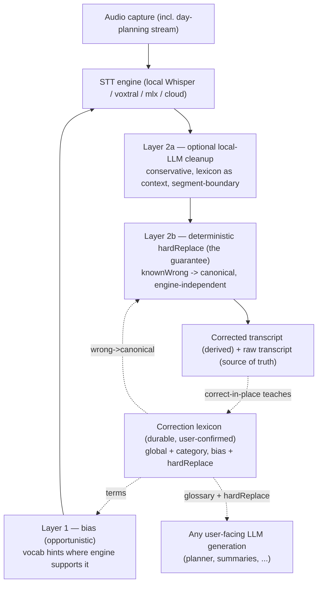

# ADR 0024: Correction Lexicon and Deterministic Transcript Correction

- Status: Proposed
- Date: 2026-06-07

## Context

Speech-to-text and LLM generation consistently mis-spell a small set of terms
that matter to the user: the app's own name (`Lotti`, which cloud models tend to
write as the more common `Lottie`), personal place names (a town STT reliably
mis-hears), and domain jargon. These are not soft preferences — they are
"never again" corrections the user wants to be applied everywhere,
deterministically.

Lotti already has the seed of a fix, but only partially:

- `CategoryDefinition.speechDictionary` (a `List<String>`) is a per-category
  vocabulary list, addable from the editor context menu
  (`speech_dictionary_service.dart`). It is consumed during transcription two
  ways: as a biasing block written into the transcription prompt
  (`prompt_builder_helper.dart` → `skill_prompt_builder.dart`), and as
  vocabulary hints to local STT (`mlx_audio_channel.dart` `dictionaryTerms`).
- `CategoryDefinition.correctionExamples` is a sibling mechanism for checklist
  correction.

Four gaps make this insufficient for the "never again" cases:

1. **Category-scoped only — no global terms.** The app name and personal place
   names apply everywhere; today they would have to be added to every category.
2. **Biasing only, and biasing is engine-dependent.** Vocabulary/dictionary
   hints work only on engines that accept them. Local Whisper does not take a
   usable vocabulary, and prompt-style biasing there is unreliable — so there is
   no guarantee exactly where it is most needed.
3. **Transcription only.** Nothing corrects general LLM *generation* output, so a
   model writing `Lottie` in a summary or plan is unaffected.
4. **Unergonomic.** Maintaining lists in category settings is clunky, and adding
   a bare *correct* term never captures the *wrong → right* mapping that a
   deterministic correction needs.

This relates to the durable-memory work in ADR 0022: a correction term is durable
user knowledge. But it is a *different class* from planner preferences — it is
app-owned, always-on, and applied deterministically, not planner-scoped, lazily
recalled, and LLM-weighed.

## Decision

1. **A correction lexicon is durable, user-confirmed memory — app-owned, not
   planner-owned.** Model correction terms on the durable `Version` / `Head`,
   propose → user-confirm pattern (as in ADR 0022 Decision 10), but as an
   app-level store that the planner, every other agent, the transcription
   pipeline, and the editor all *read*. It extends, rather than replaces, the
   existing `category.speechDictionary`.

2. **Two scopes.** Keep per-category, and add **global** (always-on, applies
   everywhere regardless of category). The app name and personal place names are
   global.

3. **Two modes per term.**
   - `bias` — the existing behavior: term added to engine vocabulary / prompt
     hint. Opportunistic; "prefer this spelling."
   - `hardReplace` — a deterministic `knownWrong[] → canonical` map. Opt-in
     per term, word-boundary aware. "This must never survive."

4. **Deterministic post-STT correction is the guarantee, and it is
   engine-independent.** A correction pass runs over the transcript *text* in the
   pipeline, after whichever engine produced it — so it works identically for
   local Whisper, voxtral, mlx, and cloud engines. Engine biasing is an
   opportunistic first layer; the post-pass is what makes "never again" actually
   hold. This pass lives at the pipeline level (`skill_transcription_runner` /
   `unified_ai_inference_repository`), not inside per-engine adapters.

5. **Apply to generation, not just transcription.** Inject the global lexicon as
   a compact glossary into user-facing LLM generation prompts, and run
   `hardReplace` on generated output — so `Lotti` is enforced when a model
   *writes*, not only when it *transcribes*.

6. **Optional local-LLM cleanup layer for fuzzy errors.** For garbled phrases the
   deterministic map cannot catch, a small **local** model may clean up
   transcript segments, given the lexicon as context. It must be conservative
   (correct transcription errors only, never paraphrase or drop content), keep
   the **raw transcript as source of truth**, and store the corrected text as a
   derived artifact with provenance. It triggers on utterance/segment boundaries
   (correcting committed segments once), **finalize-time first** — not live
   "every other sentence", which would make the on-screen transcript flicker and
   is O(n²) on context. It is **degradable**: if no local model is available, the
   deterministic pass alone still works; capture never depends on it.

7. **Learned in-place.** Correcting a term where you see it (select the wrong
   word in a transcript, type the canonical form) stores a **global**
   `wrong → canonical` pair. This becomes the primary path, replacing the
   unergonomic category-settings flow, and captures the mapping the post-pass
   needs.

8. **Always-on, not lazily recalled.** The lexicon is the explicit exception to
   the planner's two-tier lazy recall (ADR 0022 Decision 10): the terms are
   small, high-value, and unpredictable in where they apply, so they are always
   present in the relevant prompt — and applied at the first capture of a day
   with no dependency on planner context or a wake.

9. **Raw is source of truth; corrected is derived.** Keep the raw transcript;
   store corrections as a derived artifact with provenance (which terms / model /
   lexicon version applied), inspectable and reversible, so corrections do not
   become unattributable mutations across synced devices.

## Layering

## Consequences

- The "never again" guarantee no longer depends on the STT engine cooperating;
  it is enforced deterministically on output text, including for local Whisper.
- Global terms (app name, personal place names) are maintained once and applied
  everywhere — transcription and generation — rather than per category.
- The lexicon is a second, distinct durable-knowledge class alongside planner
  preferences (ADR 0022). Keeping them separate avoids leaking app-wide spelling
  rules into the planner's scoped, weighed memory.
- Corrections are auditable and reversible because the raw transcript is retained
  and the correction provenance is recorded.
- The optional local-LLM layer adds a quality bump for fuzzy errors without
  becoming a hard dependency or a privacy/network concern.

## Non-Goals

- Live "every other sentence" streaming correction in the first version. Start
  finalize-time, per committed segment; add live incremental only if long
  dictations need it.
- Aggressive LLM rewriting/paraphrasing of captures. The local-LLM layer fixes
  transcription errors only; planning captures must not have their meaning
  silently changed.
- Replacing `category.speechDictionary`. This extends it (adds global scope and
  the `hardReplace` mode) and keeps category-scoped jargon working.
- Putting correction terms in the planner's knowledge store. They are app-owned
  and always-on, not planner-scoped.

## Open Questions

1. Storage shape: a dedicated app-level `CorrectionLexiconEntity` (durable
   Version/Head), or a global counterpart to `category.speechDictionary` on a
   settings/profile entity?
2. False-positive containment for `hardReplace`: word-boundary + case rules are
   the baseline — is per-term case sensitivity worth exposing?
3. Should the optional fuzzy/phonetic match against canonical terms (to catch
   *new* garbled variants) be suggest-only, or auto-apply above a confidence
   threshold?
4. Which local model backs the cleanup layer, and is it shared with existing
   local inference (ollama / mlx) or a dedicated small model?

## Related

- [ADR 0020: Agent Input Capture](./0020-agent-input-capture.md)
- [ADR 0022: Long-Lived Daily OS Planner](./0022-long-lived-daily-os-planner.md)
  — the durable-knowledge / two-tier recall model; this lexicon is its
  always-on exception.
- `lib/features/speech/` and `lib/features/ai/` — the existing
  `category.speechDictionary` mechanism this decision extends.
