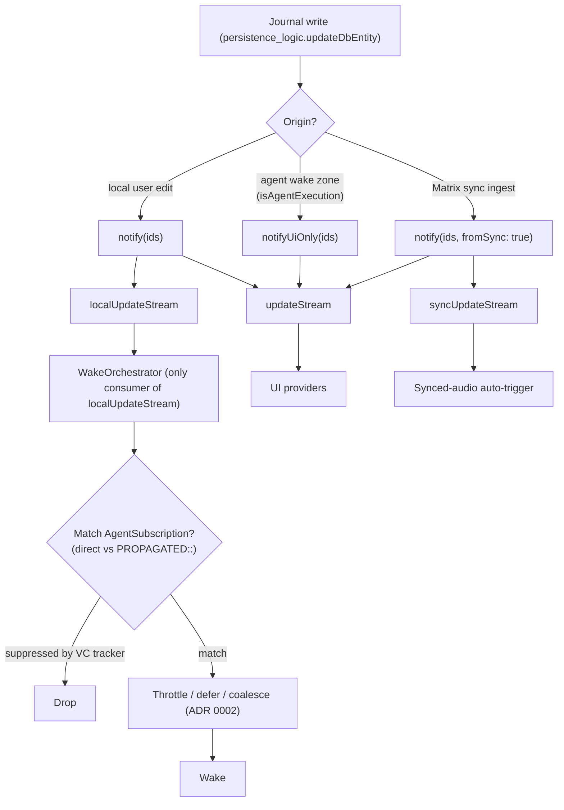
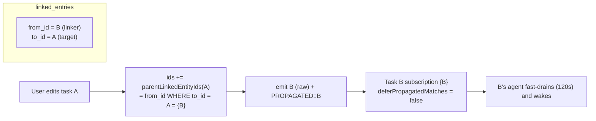

# ADR 0027: Wake Notification Propagation and Storm Prevention

- Status: Accepted
- Date: 2026-06-09

## Context

Background agents wake from database changes. That single fact creates three
failure modes that a naive "any write notifies every subscriber" design walks
straight into:

1. **Self-trigger loops** — an agent writes to the same entities it watches, so
   its own wake produces a notification that wakes it again.
2. **Cross-entity wake storms** — task B links task A; editing A should make B's
   agent reconsider, but if A's *agent* edits A and that wakes B's agent, whose
   write wakes A's agent, the system oscillates (the historically-observed
   A→B→A storm).
3. **Redundant re-execution on replicated changes** — a change that arrives via
   Matrix sync was already processed by the device that authored it; re-running
   the agent on every device would multiply work and risk divergence
   (ADR 0018).

The runtime solves all three with a **notification origin-routing model** plus a
**cross-entity fan-out graph**, composed with the throttle/queue policy of
ADR 0002 and the vector-clock self-suppression of ADR 0004. The mechanism was
built incrementally and, until now, lived only in code comments
(`lib/services/db_notification.dart`, `lib/logic/persistence_logic.dart`) and
scattered `lib/features/agents/README.md` prose. It is load-bearing for
correctness and cost, so it is captured here as a decision in its own right.
ADR 0002 governs *when* a matched wake drains (throttle/queue/single-flight);
this ADR governs *which write reaches the orchestrator at all, and on behalf of
which agents*.

## Decision

1. **Three notification streams, partitioned by origin**
   (`UpdateNotifications`, `lib/services/db_notification.dart:3-101`):
   - `updateStream` — **all** notifications (local, sync, UI-only). For UI
     widgets that must react to every change.
   - `localUpdateStream` — **locally-originated, non-agent** writes only. This
     is the **only** stream that drives agent wakes.
   - `syncUpdateStream` — **sync-originated** writes only (consumed by the
     synced-audio auto-trigger, never by the wake orchestrator).

2. **Writes are routed to streams by origin, at the write site**
   (`persistence_logic.dart:583-587`):
   - A **local user** write (`isAgentExecution == false`) calls `notify(ids)` →
     emitted on `updateStream` **and** `localUpdateStream`.
   - An **agent** write, i.e. code running inside the agent-execution zone
     (`agentExecutionZoneKey`, `db_notification.dart:134-144`; set by
     `wake_drain_engine` around executor work), calls `notifyUiOnly(ids)` →
     emitted on `updateStream` **only**. This is the primary loop-breaker: an
     agent's own journal writes are structurally invisible to the orchestrator.
   - A **sync-ingested** write calls `notify(ids, fromSync: true)` → emitted on
     `updateStream` **and** `syncUpdateStream` (never `localUpdateStream`), so a
     replicated change does not re-run the agent on the receiving device
     (ADR 0018).

3. **The wake orchestrator subscribes to `localUpdateStream` only**
   (`agent_providers.dart:386` → `WakeOrchestrator.start`). Consequence: **only
   local, user-originated, non-agent writes can wake an agent.** Layers (1)–(2)
   make "self-trigger loops" and "redundant sync re-execution" structurally
   impossible rather than throttled-after-the-fact.

4. **Cross-entity fan-out defines the wake graph.** Every journal write
   includes, in its notification id set, the entity's own affected ids **plus
   its linkers** — `parentLinkedEntityIds(id)` =
   `SELECT from_id FROM linked_entries WHERE to_id = :id`
   (`database.drift:1168-1169`), the entries that link **to** the edited entity.
   Links store `from_id` = linker, `to_id` = target
   (`persistence_logic.dart:210-241`). Because a task→task link is stored
   `from_id = B (linker), to_id = A (target)`, **editing task A surfaces B as a
   linker and notifies B's subscription** — this is the entire cross-task update
   graph. Each linker id is emitted **twice**: raw, and wrapped by
   `propagatedNotification(id)` = `PROPAGATED::<id>`
   (`db_notification.dart:164-170`, `persistence_logic.dart:576-582`).

5. **Direct vs propagated matches drive the deferral policy**
   (`wake_batch_router.dart:14-70`). A match is **direct** when the agent's own
   `matchEntityId` is present as a raw token (its own entity was edited) and
   **propagated** when only the `PROPAGATED::` form is present (a linked/child
   entity was edited). `AgentSubscription.deferPropagatedMatches` selects the
   policy:
   - **Project agents** set `true` → propagated-only matches defer to the
     scheduled daily digest, so linked-task churn under a project does not burn
     tokens on every child edit.
   - **Task agents** set `false` → propagated matches fast-drain on the normal
     120-second coalescing window, so a linked task's user-edits refresh the
     dependent task agent promptly.
   - A direct match arriving during a propagated deferral **escalates** the
     deadline to the fast throttle (`wake_batch_router.dart:117-146`).

6. **Storm prevention is the composition of five layers**, not any single guard:
   1. **Origin routing** — agent writes via `notifyUiOnly` stay off
      `localUpdateStream` (Decision 2); breaks A→B→A and self-loops at the source.
   2. **Propagated deferral** — `PROPAGATED::` + `deferPropagatedMatches`
      (Decision 5); bounds project-agent fan-in.
   3. **Throttle/coalesce** — 120-second window per agent, defer-first queueing
      (ADR 0002, `WakeThrottleCoordinator`).
   4. **Self-mutation suppression** — the orchestrator records the vector clocks
      of entities the agent mutated (`recordMutatedEntities`,
      `_preRegisterSuppression`, `WakeSuppressionTracker`,
      `wake_orchestrator.dart:321-345`; ADR 0004) and drops matching
      notifications within a TTL, closing the race between the DB write and the
      stream emission. The pre-registration uses the trigger tokens *before*
      execution, then is replaced by the actual mutated set after.
   5. **Single-flight + dedup** — one drain and one running wake per agent;
      jobs deduped by run key, tokens merged per `(agentId, workspaceKey)`
      (ADR 0002, ADR 0022).

7. **What is intentionally *not* propagated.** Agent-authored **report prose**
   is written to `agent.sqlite` (`task_agent_workflow.dart` report-head upsert),
   which emits **no** journal notification at all; and an agent's own journal
   writes use `notifyUiOnly`. Therefore **agent-origin** changes never wake
   another agent — there is deliberately no agent→agent push. A dependent task
   agent re-reads a linked task's current report at its *next* wake (driven by a
   user edit of either task), not on the linked agent's republish. This is a
   design choice in service of Decision 6, not a gap; adding agent→agent
   report-head propagation would reintroduce the storms layers (1)–(5) exist to
   prevent.

## Notification routing

## Cross-entity wake graph (why editing A wakes B)

## Consequences

- Self-trigger loops and redundant sync re-execution are eliminated
  **structurally** (origin routing), not merely throttled — the orchestrator
  never receives those notifications.
- Cross-task coordination is **real and event-driven** for the common case
  (a user editing a linked task), with the project/task deferral split tuning
  fan-in cost.
- The deliberate absence of agent→agent push means a dependent agent can hold a
  *stale* compact summary of a linked task until its next user-driven wake. This
  is accepted; the on-demand drill-down tool (ADR 0003) is the intended way to
  fetch fresher linked detail when a wake needs it.
- The five layers are interdependent: removing origin routing would make the
  throttle and VC suppression carry loops they were not sized for; removing
  propagated deferral would expose project agents to child-edit fan-in. Changes
  to any one layer must be evaluated against the whole.
- The model depends on the agent-execution zone being entered around **all**
  agent-side journal writes. A write that escapes the zone would route through
  `notify` and could wake peers — the zone boundary in `wake_drain_engine` is a
  correctness-critical invariant.

## Related

- [ADR 0002: Wake Scheduling and Throttling Policy](./0002-wake-scheduling-and-throttling-policy.md)
  — the throttle/queue/single-flight policy this ADR composes with.
- [ADR 0004: Task Agent Tool Execution Policy](./0004-task-agent-tool-execution-policy.md)
  — the post-mutation vector clocks used for self-mutation suppression.
- [ADR 0010: Scheduled Wake Infrastructure](./0010-scheduled-wake-infrastructure.md)
  — scheduled/manual wakes bypass subscription matching and this throttle path.
- [ADR 0018: Convergent Multi-Device Execution](./0018-convergent-multi-device-execution.md)
  — why sync-origin writes must not re-run agents on the receiving device.
- [ADR 0022: Long-Lived Daily OS Planner](./0022-long-lived-daily-os-planner.md)
  — `(agentId, workspaceKey)` partitioning of merge/supersede/cancel.
- Code: `lib/services/db_notification.dart`,
  `lib/logic/persistence_logic.dart:569-587`,
  `lib/database/database.drift:1168-1169` (`parentLinkedEntityIds`),
  `lib/features/agents/wake/{wake_orchestrator,wake_batch_router,wake_throttle_coordinator,wake_suppression_tracker}.dart`,
  `lib/features/agents/state/agent_providers.dart:386`.
- `lib/features/agents/README.md` (Wake Orchestration; "Why the wake design is
  this defensive").
