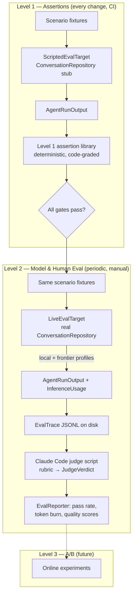
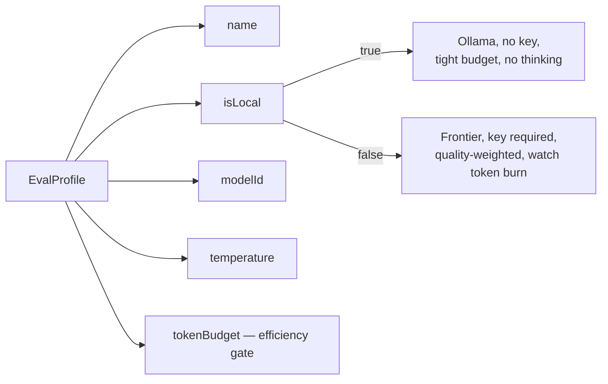

# ADR 0026: Tiered Agent Evaluation Harness

- Status: Proposed
- Date: 2026-06-09

## Context

The task agent (`TaskAgentWorkflow`) and the long-lived Daily OS planner
(`DayAgentWorkflow`, ADR 0022) are non-deterministic LLM programs. They are
exercised today only by unit/widget tests that **script** the model response
(`_ConversationHarness`, `MockConversationRepository.sendMessageDelegate`). That
proves the *plumbing* — tool dispatch, persistence, vector clocks — but says
nothing about whether a **real model** actually produces a good plan or a good
task update for a realistic app state.

We also run these agents under two very different inference regimes:

- **Local models** (Ollama — `noApiKeyRequired`, ADR 0008). Constrained context,
  weaker instruction-following, no/limited thinking budget. We must optimise for
  what the local model can actually do.
- **Frontier models** (Gemini / Mistral / OpenAI-compatible). Maximum capability,
  but we optimise for output quality *and* token burn (input/output/thoughts/
  cached, captured today as `InferenceUsage` → `WakeTokenUsageEntity`, ADR 0007).

We need a way to (a) catch regressions on every change cheaply and
deterministically, and (b) periodically measure real-model quality and cost
against curated scenarios, without adopting a heavy third-party eval platform.
The methodology we are adopting is the tiered approach popularised by Hamel
Husain: cheap assertions first, model/human grading second, online A/B last.

### Constraints that shape the design

1. **One entry point, two agents.** Both workflows expose the identical wake
   contract:

   ```dart
   Future<WakeResult> execute({
     required AgentIdentityEntity agentIdentity,
     required String runKey,
     required Set<String> triggerTokens,
     required String threadId,
   });
   ```

   `lib/features/agents/workflow/task_agent_workflow.dart` and
   `lib/features/daily_os_next/agents/workflow/day_agent_workflow.dart`.

2. **"App state" is seeded data, not a method argument.** The workflows read
   tasks (`Task`/`ChecklistItem` in the journal DB), `AgentStateEntity`, and —
   for the planner — `CaptureEntity` (the user's *"here is what I want to achieve
   today"* lands in `CaptureEntity.transcript`), `ParsedItemEntity`, and
   `DayPlanEntity`/`PlannedBlock`. A scenario is therefore a *seeding recipe*
   plus trigger tokens (`drafting:<dayId>`, `capture_submitted:<captureId>`).

3. **The model is reached through one seam.** Both workflows obtain inference via
   `ConversationRepository.sendMessage(...)`, which returns the real
   `InferenceUsage` (input/output/thoughts/cached tokens). Substituting a
   scripted vs. a live `ConversationRepository` is the only switch needed to move
   between deterministic Level 1 and live Level 2 — token accounting is identical
   on both paths because it comes from the same return type.

4. **No new runtime dependencies in `lib/`.** The harness is developer tooling.
   It must not create any `lib/ → eval/` dependency, must not require codegen,
   and must run under the existing `flutter test` binding (the only place the
   workflows can actually execute).

5. **Claude Code is the judge.** Grading runs out-of-band: the Dart harness emits
   structured trace artifacts; a Claude Code script reads them against a rubric
   and writes verdict JSON back. No grader API key is wired into the app.

## Decision

Introduce a **tiered, file-driven evaluation harness** that fits the two agents
directly rather than wrapping a third-party tool.

### Tier map



### 1. A scenario is plain data, decoupled from entity types

An `EvalScenario` describes the mocked app state (`MockTask` with status /
deadline / estimate / checklist, current `MockDayBlock`s, capacity, categories),
the simulated `UserInput` (`transcript` + trigger tokens), and optional hard
`EvalExpectations` (token budget, tool-call bounds, must/most-not-call tools).
Scenarios are plain Dart + JSON — no freezed, no `build_runner` — so the dataset
is easy to author, diff, and review. Adapters map a scenario onto the real
seeding factories (`makeTestCapture`, `makeTestDayPlan`, `makeTestState`,
journal `Task`s) at execution time; the scenario itself stays free of app types.

### 2. One execution seam, two implementations

```dart
abstract class EvalTarget {
  String get profileName;
  Future<AgentRunOutput> run(EvalScenario scenario, EvalProfile profile);
}
```

- **`ScriptedEvalTarget`** (Level 1): seeds the agent/journal DB from the
  scenario, runs the real `*.execute(...)` with a `ConversationRepository`
  subclass that returns canned tool calls + a fixed `InferenceUsage` (the proven
  `_ConversationHarness` shape). Deterministic, free, CI-safe.
- **`LiveEvalTarget`** (Level 2): identical seeding, but the workflow's
  `ConversationRepository` is the real one wired to a provider resolved via
  `resolveInferenceProvider` (ADR 0008). Selected by `EvalProfile.isLocal`:
  Ollama for local, Gemini/Mistral/OpenAI for frontier. Token usage is the real
  `InferenceUsage` returned from `sendMessage`.

Both produce the same `AgentRunOutput` (tool calls, drafted `PlannedBlock`s,
report, observations, mutated entry IDs, `InferenceUsage`, turn count,
wall-clock). The grader and the assertions never know which target ran.

### 3. `EvalProfile` encodes the local-vs-frontier optimisation target



A scenario is graded **per profile**, so the same scenario yields one trace for
`local-ollama` and one for `frontier-gemini`. The reporter contrasts them: a
plan that is excellent on a frontier model but blows the local token budget or
calls unsupported tools is a *local* failure, surfaced as such.

### 4. Level 1 — deterministic assertion library

Pure functions over `AgentRunOutput` returning `EvalCheck(name, passed, detail)`.
These are the cheap gates run on every change. Examples, grounded in real tool
contracts:

- **Shared:** wake succeeded; a report was published with non-empty
  one-liner/TLDR; no hallucinated task references (every `taskId` in a tool call
  or block exists in the scenario); token budget respected; tool-call count
  bounded; only known/allowed tools called.
- **Task agent:** `set_task_status` never sets the user-only `DONE`/`REJECTED`
  (agent-settable enum is `OPEN`/`IN PROGRESS`/`GROOMED`/`BLOCKED`/`ON HOLD`);
  `update_task_estimate` `minutes` within `1..1440`; `assign_task_labels` ≤ 3;
  no duplicate checklist titles.
- **Planner:** scheduled minutes ≤ `capacityMinutes`; no overlapping blocks;
  block `categoryId ∈ allowedCategoryIds`; capture with content yields ≥ 1
  parsed item / plan block.

The same functions run inside Level 1 tests (as `expect`s) **and** inside the
Level 2 runner (recorded on the trace), so a frontier run that violates a hard
invariant is flagged even before the judge looks at quality.

### 5. Level 2 — traces on disk, Claude Code as judge

The runner writes one `EvalTrace` JSON per `(scenario, profile)` under
`eval/runs/<runId>/`. A Claude Code script (`eval/grade_run.md`) loads each
trace, applies the agent-specific rubric (`eval/prompts/rubric_*.md`), and writes
a `JudgeVerdict { goalAttainment, quality, efficiency, pass, rationale, issues }`
back next to the trace. `EvalReporter` aggregates verdicts + traces into a
summary (Level 1 pass rate, mean tokens, judge scores) per profile. The judge
evaluates exactly the three things requested: goal attainment given the app
state, output quality/accuracy, and efficiency (token burn + unnecessary steps,
read from the recorded `InferenceUsage` and tool-call list).

### 6. Where things live

- `docs/adr/0026-*` (this), `docs/implementation_plans/2026-06-09_agent_evaluation_harness.md`.
- `eval/` (repo root, non-build): `README.md`, `prompts/`, `grade_run.md`,
  `run_level2.sh`, and `runs/` (git-ignored artifacts).
- `test/eval/harness/` (Dart support library, mirrors `test/mocks`,
  `test/helpers` convention): models, assertions, target seam, trace IO,
  reporter.
- `test/eval/scenarios/` (the dataset + the Level 1 example tests).

## Consequences

- **Cheap regression net.** Level 1 runs in `flutter test` with no keys, no
  network, deterministic time — suitable for CI on every change.
- **Honest cost/quality signal.** Level 2 measures the *real* model on the *real*
  workflow, with the *real* token accounting, separated by local vs frontier.
- **No lock-in, no `lib/` coupling.** The harness is plain Dart tooling under
  `test/` and `eval/`; deleting it changes nothing in the app.
- **The dataset is the asset.** Adding coverage means adding a plain-data
  scenario, not writing a new test harness each time.
- **Scripted ≠ live drift risk.** A `ScriptedEvalTarget` can pass while the live
  model fails; that is *intended* (Level 1 guards plumbing/invariants, Level 2
  guards behaviour). The two tiers must share scenario definitions so they never
  diverge — enforced by both targets consuming the same `EvalScenario`.
- **Judge variance.** LLM-as-judge is itself noisy; rubrics are kept explicit and
  scored 1–5 with a hard `pass` boolean, and verdicts are versioned with the run
  so re-grading is auditable. Human spot-checks remain part of Level 2.
- **Execution coupling to `flutter test`.** Because the workflows need the Flutter
  test binding, the Level 2 runner is a tagged `flutter test` entrypoint, not a
  plain `dart run` script. This is a deliberate constraint, not a limitation of
  the harness design.

## Related

- [ADR 0007: Token Usage / Wake Run Log Storage](./0007-token-usage-wake-run-log-storage.md)
- [ADR 0008: Inference Profiles — Agent-to-Provider Mapping](./0008-inference-profiles-agent-provider-mapping.md)
- [ADR 0022: Long-Lived Daily OS Planner](./0022-long-lived-daily-os-planner.md)
- [ADR 0023: Durable Domain Agents and Time Negotiation](./0023-durable-domain-agents-and-time-negotiation.md)
- [Implementation plan](../implementation_plans/2026-06-09_agent_evaluation_harness.md)
- `lib/features/ai/repository/inference_repository_interface.dart` — inference seam
- `lib/features/ai/model/inference_usage.dart` — token accounting type reused by the harness
- `lib/features/agents/workflow/wake_result.dart` — workflow return type
- `test/features/daily_os_next/agents/workflow/day_agent_workflow_test.dart` — `_ConversationHarness` scripted seam this design generalises
