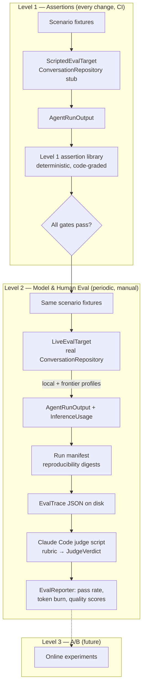
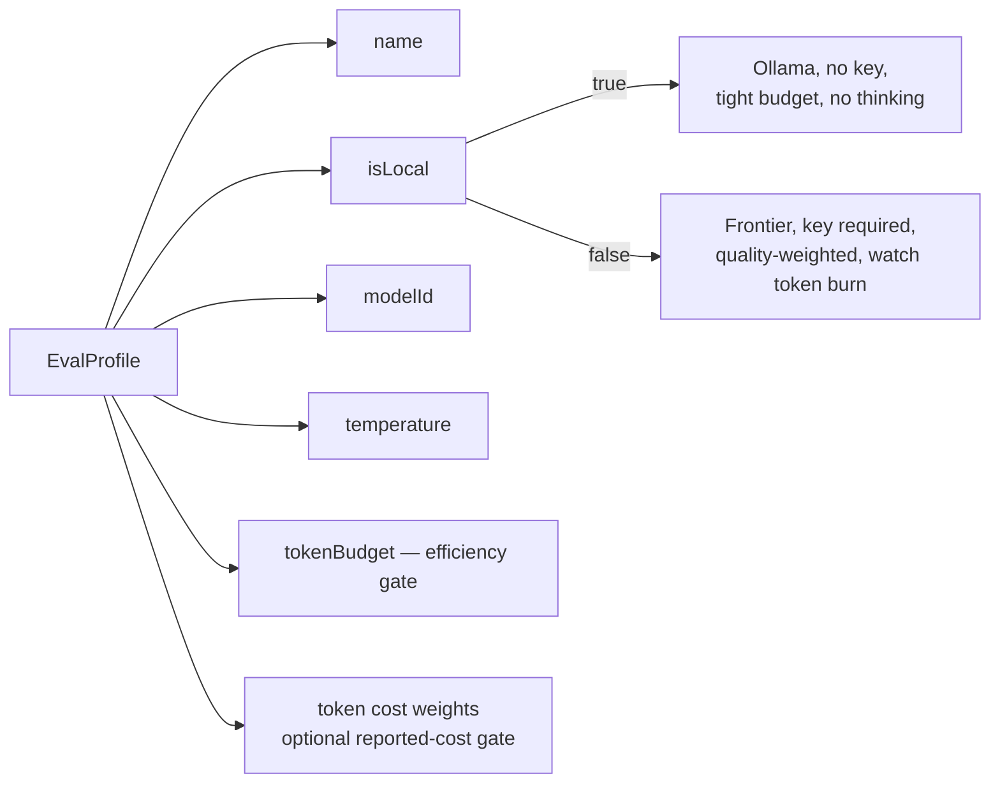

# ADR 0029: Tiered Agent Evaluation Harness

- Status: Proposed
- Date: 2026-06-09

## Context

The task agent (`TaskAgentWorkflow`) and the long-lived Daily OS planner
(`DayAgentWorkflow`, ADR 0022) are non-deterministic LLM programs. They are
exercised today only by unit/widget tests that **script** the model response
(`_ConversationHarness`, `MockConversationRepository.sendMessageDelegate`). That
proves the *plumbing* — tool dispatch, persistence, vector clocks — but says
nothing about whether a **real model** actually produces a good plan or a good
task update for a realistic app state.

We also run these agents under two very different inference regimes:

- **Local models** (Ollama — `noApiKeyRequired`, ADR 0008). Constrained context,
  weaker instruction-following, no/limited thinking budget. We must optimise for
  what the local model can actually do.
- **Frontier models** (Gemini / Mistral / OpenAI-compatible). Maximum capability,
  but we optimise for output quality *and* token burn (input/output/thoughts/
  cached, captured today as `InferenceUsage` → `WakeTokenUsageEntity`, ADR 0007).

We need a way to (a) catch regressions on every change cheaply and
deterministically, and (b) periodically measure real-model quality and cost
against curated scenarios, without adopting a heavy third-party eval platform.
The methodology we are adopting is the tiered approach popularised by Hamel
Husain: cheap assertions first, model/human grading second, online A/B last.

### Constraints that shape the design

1. **One entry point, two agents.** Both workflows expose the identical wake
   contract:

   ```dart
   Future<WakeResult> execute({
     required AgentIdentityEntity agentIdentity,
     required String runKey,
     required Set<String> triggerTokens,
     required String threadId,
   });
   ```

   `lib/features/agents/workflow/task_agent_workflow.dart` and
   `lib/features/daily_os_next/agents/workflow/day_agent_workflow.dart`.

2. **"App state" is seeded data, not a method argument.** The workflows read
   tasks (`Task`/`ChecklistItem` in the journal DB), `AgentStateEntity`, and —
   for the planner — `CaptureEntity` (the user's *"here is what I want to achieve
   today"* lands in `CaptureEntity.transcript`), `ParsedItemEntity`, and
   `DayPlanEntity`/`PlannedBlock`. A scenario is therefore a *seeding recipe*
   plus trigger tokens (`drafting:<dayId>`, `capture_submitted:<captureId>`).

3. **The model is reached through one seam.** Both workflows obtain inference via
   `ConversationRepository.sendMessage(...)`, which returns the real
   `InferenceUsage` (input/output/thoughts/cached tokens). Substituting a
   scripted vs. a live `ConversationRepository` is the only switch needed to move
   between deterministic Level 1 and live Level 2 — token accounting is identical
   on both paths because it comes from the same return type.

4. **No new runtime dependencies in `lib/`.** The harness is developer tooling.
   It must not create any `lib/ → eval/` dependency, must not require codegen,
   and must run under the existing `flutter test` binding (the only place the
   workflows can actually execute).

5. **Claude Code is the judge.** Grading runs out-of-band: the Dart harness emits
   structured trace artifacts; a Claude Code script reads them against a rubric
   and writes verdict JSON back. No grader API key is wired into the app.

## Decision

Introduce a **tiered, file-driven evaluation harness** that fits the two agents
directly rather than wrapping a third-party tool.

### Tier map



### 1. A scenario is plain data, decoupled from entity types

An `EvalScenario` describes the mocked app state (`MockTask` with status /
deadline / estimate / checklist, planner captures with parsed items, current
`MockDayBlock`s, capacity, categories), the simulated `UserInput` (`transcript`
and trigger tokens such as `decided_task:<taskId>`), and optional hard
`EvalExpectations` (token budget, tool-call bounds, must/most-not-call tools,
and tightly bounded named tool-result failures for explicit recovery stress
cases).
It also carries `EvalScenarioMetadata`: capability ids, split
(`development`/`holdout`/`canary`), source, adversarial flag, tags, and
optional non-secret human review metadata. Review metadata records the review
status, reviewer, review time, rationale, optional source provenance, and a
`subjectDigest` over the scenario JSON with the review block omitted, so editing
scenario state,
expectations, tags, or triggers stales the review. The first capability id is
the primary reporting denominator; secondary ids are filtering/context
metadata. Scenarios are plain Dart + JSON — no freezed, no `build_runner` — so
the dataset is easy to author, diff, and review. Adapters map a scenario onto
the real seeding factories (`CaptureEntity`,
`ParsedItemEntity`, `DayPlanEntity`, `makeTestState`, journal `Task`s) at
execution time; task-agent adapters derive the active task slot from the
decided-task trigger when present, and the scenario itself stays free of app
types.

### 2. One execution seam, two implementations

```dart
abstract class EvalTarget {
  String get profileName;
  Future<AgentRunOutput> run(
    EvalScenario scenario,
    EvalProfile profile, {
    EvalTargetRunContext context = EvalTargetRunContext.direct,
  });
}
```

- **`ScriptedEvalTarget`** (Level 1): seeds the agent/journal DB from the
  scenario, runs the real `*.execute(...)` with a `ConversationRepository`
  subclass that returns canned tool calls + a fixed `InferenceUsage` (the proven
  `_ConversationHarness` shape). Deterministic, free, CI-safe.
- **`LiveEvalTarget`** (Level 2): identical seeding, but the workflow's
  `ConversationRepository` is the real one wired to a provider resolved via
  `resolveInferenceProvider` (ADR 0008). Selected by `EvalProfile.isLocal`:
  Ollama for local, Gemini/Mistral/OpenAI for frontier. Token usage is the real
  `InferenceUsage` returned from `sendMessage`.

Both produce the same `AgentRunOutput` (tool calls, persisted tool results,
drafted `PlannedBlock`s, persisted parsed capture items, persisted
report/observations, final-state persisted confirmable proposals from
`ChangeSetEntity` items, resolved model/provider provenance, mutated entry IDs,
provider-decision evidence with candidate/decoy/legacy row IDs and non-secret
environment-key presence, workflow run/thread provenance, observed
`ConversationRepository.sendMessage` model invocations with provider/model,
tool, forced-tool, and runtime prompt/tool fingerprints as hashes, observed
provider requests inside those sends with message/tool-schema hashes and
turn/request indexes, observed provider responses with provider-reported model
ids/fingerprints/provider names/service tiers where authoritative and explicit
unavailable reasons otherwise, persisted planner capacity when available,
`InferenceUsage`, turn count, wall-clock). The grader and the assertions never
know which target ran.

`EvalMatrixRunner` sits above the target seam. It runs every
`scenario × profile × prompt variant × trialIndex` cell, passes an
`EvalTargetRunContext` with the run id, scenario id, profile name, prompt
variant, and trial index into the target,
recomputes Level 1 checks, writes one trace per cell, and records target
exceptions as failed traces so a model/API failure is auditable instead of
becoming a missing matrix row. Failed exception payloads are sanitized before
serialization to redact obvious API keys, bearer tokens, private local paths,
and prompt-like fields. Scripted real-workflow targets already derive
workflow run keys and thread IDs from this context and record them in the trace;
live targets must use the same context when deriving run keys, thread IDs, cache
keys, or random seeds so repeated-trial reliability is measuring independent
attempts.

### 3. `EvalProfile` encodes the local-vs-frontier optimisation target



A scenario is graded **per profile**, so the same scenario yields one trace per
`(profile, trialIndex)`. The reporter contrasts them: a plan that is excellent
on a frontier model but blows the local token budget or calls unsupported tools
is a *local* failure, surfaced as such. It also reports scenario-level
`pass^k` reliability across repeated trials, so a model that succeeds once and
fails on retries is treated as unstable rather than averaged into a misleading
trace-level pass rate.

Profiles may also carry optional non-secret integer token cost weights for
reported input, output, cached-input, and thought tokens. Defaults are omitted
from profile JSON and preserve legacy token-ratio behavior. When either side of
a candidate-vs-baseline comparison opts into explicit weights, promotion uses a
weighted reported-cost ratio instead of raw `input + output` token ratio; missing
core token counts or required cached/thought dimensions block promotion rather
than being treated as free. These weights are profile/run provenance, not live
provider pricing, so changing them is a new model-selection claim.

### 4. Level 1 — deterministic assertion library

Pure functions over `AgentRunOutput` returning `EvalCheck(name, passed, detail)`.
These are the cheap gates run on every change. Examples, grounded in real tool
contracts:

- **Shared:** wake succeeded; a report was published with non-empty
  one-liner/TLDR; no hallucinated task references (every `taskId` in a tool call
  or block exists in the scenario); token budget respected; tool-call count
  bounded; only known model-facing tools called; persisted proposal items use
  known normalized durable proposal tool names, not raw batch tool names;
  production tool-result rows contain no unexpected validation errors; recovery
  stress scenarios may explicitly allow a bounded count of named failed tool
  results; optional `ExpectedDurableState` matchers assert scenario-specific
  required/forbidden
  persisted proposals, planned blocks, parsed capture items, optional
  report/observation text anchors, allowed/required/forbidden mutated entry
  IDs, accepted `anyOf` alternatives, scoped min/max/exact count checks,
  parsed-capture confidence bands, and distinct required matches so one actual
  persisted record cannot satisfy two expected outcomes. Report/summary text
  anchors are smoke checks only; subjective prose quality is judged in Level 2
  through LLM/human comparison, quorum, and recorded A/B artifacts. Scenario
  validation cross-checks trigger, fixture, proposal-history, and expectation
  references before run verification accepts a Level 2 matrix.
- **Task agent:** `set_task_status` never sets the user-only `DONE`/`REJECTED`
  (agent-settable enum is `OPEN`/`IN PROGRESS`/`GROOMED`/`BLOCKED`/`ON HOLD`);
  `update_task_estimate` `minutes` within `1..1440`; `assign_task_labels` ≤ 3;
  persisted label proposals are new, active, in-scope, unsuppressed labels; no
  duplicate checklist titles.
- **Planner:** scheduled minutes ≤ `capacityMinutes`; no overlapping blocks;
  persisted plan capacity matches the scenario capacity when recorded; block
  `categoryId ∈ allowedCategoryIds`; drafting captures with content yield a
  parsed item / plan block, and capture-only wakes must persist parsed items for
  the submitted capture ID.

The same functions run inside Level 1 tests (as `expect`s) **and** inside the
Level 2 runner (recorded on the trace), so a frontier run that violates a hard
invariant is flagged even before the judge looks at quality.

### 5. Level 2 — traces on disk, Claude Code as judge

`EvalMatrixRunner` writes `<runsRoot>/<runId>/manifest.json` first, then one
`EvalTrace` JSON per `(scenario, profile, trialIndex)` under
`<runsRoot>/<runId>/`. Cascade sidecar runners may write one trace per wake,
but those traces carry explicit `cascadeWake` metadata while preserving the real
`trialIndex`. The manifest records the target name/kind, trace schema
version, sanitized command/environment-key presence, git revision, dirty-state
digest, scenario/profile set digests, prompt/rubric digest, tool-schema digest,
`profileExecutionBindings`/`profileBindingSetDigest`, and a non-secret
scenario-catalog evidence block. Profile execution bindings map each stable
profile label to the concrete non-secret provider id/type, provider-native
model id, model/profile config ids, normalized endpoint origin, base URL digest,
and effective provider request temperature used for that run. The profile set
can come from the built-in profile catalog or an external `EVAL_PROFILES` JSON
catalog, so local/frontier model-class comparisons can be changed without
editing Dart code. Scenario catalog evidence binds the run to the merged
public-plus-external scenario set via `scenarioSetDigest`, external catalog
digest/id/basename/counts when present, the protected-holdout assertion, and
protected holdout scenario ids; it intentionally avoids absolute local paths or
raw scenario text. Trace schema 10 includes a `provenance` block with
deterministic `sha256:` digests for the embedded scenario payload, profile
payload, eval prompt/rubric files, tool schema, code revision, and the manifest
hash that binds the trace to the run-level artifact set, plus optional
`cascadeWake { cascadeId, wakeIndex, wakeCount }`, model-invocation,
provider-request, and provider-response records for workflow-backed traces.
A Claude Code script
(`eval/grade_run.md`) loads each trace, applies the agent-specific rubric
(`eval/prompts/rubric_*.md`), and writes a
`JudgeVerdict { schemaVersion, traceDigest, judge, goalAttainment, quality,
efficiency, pass, rationale, issues }` back next to the trace. The nested
`judge` block records the non-secret judge runner/model, prompt digest,
calibration set version, and whether profile/model identity was visible.
Subjective A/B review uses separate `EvalPairwisePreferenceVote` records, not
`JudgeVerdict` fields. Each vote binds two trace refs for the same run,
scenario, trial, cascade wake, agent kind, and capability through trace,
scenario, and profile digests; records reviewer/protocol blinding metadata; and
is summarized by quorum as `optionAWins`, `optionBWins`, `tie`, `noConsensus`,
`incomplete`, or `invalid`. These records are diagnostic human/LLM preference
evidence unless a future pre-registered promotion policy explicitly opts them
in. Preference votes are stored as one `<safeVoteId>.preference.json` file per
reviewer vote and are read only by the explicit preference reader/report path;
`TraceWriter.readRun`, verification, readiness, calibration, and promotion do
not depend on them. The preference reader recomputes referenced trace digests
and rejects stale or orphaned bindings.
`TraceWriter.readRun` rejects missing, stale, or
tampered manifests and traces bound to a different manifest before reporting.
`EvalRunVerifier` rejects traces whose embedded scenario/profile payload drifts
from the canonical catalog, recomputes provenance against the canonical
catalog/profile and current prompt/tool files, then recomputes Level 1 against
the canonical scenario/profile, validates workflow run/thread provenance when a
target records it, validates runtime prompt/tool digest shape, validates every
recorded model invocation against the trace's `providerDecision` and manifest
profile binding, requires provider request provenance for live traces with
recorded model invocations, validates every recorded provider request against
both the trace's `providerDecision`, its owning `ModelInvocationRecord`, and the
manifest profile binding, checks effective request temperature against the
current `ConversationRepository` policy (`openAi` -> `1.0`, other provider
types -> profile temperature), requires one provider response metadata record
per live provider request, rejects provider-reported response model drift
against the request and manifest binding, requires response models for OpenAI,
Mistral, and Ollama traces, and validates resolved model provenance against
both the trace's `providerDecision` and the manifest profile binding. These
checks include provider id/type, provider-native model id, endpoint origin, and
base URL digest. The provider decision must match the canonical profile
id/model-config id and model class, include the seeded candidate, decoy, and
legacy rows, and reject selected decoy/legacy rows; live provider overrides are
therefore verifiable without storing API keys or raw prompt text. Trace reads
reject non-current
`EvalTrace.schemaVersion` and `JudgeVerdict.schemaVersion` values, requires
full SHA-256 digest shape, and rejects mixed judge provenance within a verified
run before reporting. `EvalReporter` aggregates
verdicts + traces into a summary (Level 1 pass rate, repeated-trial `pass^k`
reliability, mean tokens, judge scores) per profile, by primary capability, and
by split/model-class/primary-capability with explicit profile, scenario,
scenario-profile, expected-trial, trace, judged-trace, and coverage
denominators. Slice scenario-profile and expected-trial denominators are based
on the scenario x profile cross-product, not only observed cells. In report
mode, `EvalReportContext` supplies the canonical scenario/profile matrix and
the reporter validates it against the run manifest digests before using it for
authoritative coverage; a completely absent expected profile, scenario, split,
or capability therefore renders as zero-trace coverage instead of disappearing.
Observed-only `EvalReporter.render(traces)` remains available for ad hoc
debugging. `pass^k` is counted only for scenario groups with exact trial indexes
`0..trialCount-1`, and missing verdicts keep judge reliability at zero. Profile
and capability rendered rows show scenario, complete-scenario, trace,
judged-trace, judged-coverage, and `pass^k` denominators next to trace pass
rates. Cascade wake traces are diagnostic by default: reporters exclude them
from repeated-trial reliability and promotion evidence, while provider
request/cache diagnostics still render them.
Summary Wilson 95% confidence intervals cluster repeated trials at the scenario
or scenario-profile-cell level by default; explicit trace-level intervals remain
available only as diagnostics. Paired profile comparisons report Level 1/judge
pass deltas plus judge-score deltas only over scenarios where both profiles have
complete trial sets; missing verdicts, profile-only scenarios, and
incomplete/ambiguous scenario groups are counted separately. This keeps
model-class tuning from treating partial overlap or noisy runs as a clean
head-to-head result. The rendered report labels zero overlap as `not comparable`
and fewer than eight paired scenarios as `low n`.
Promotion is a separate decision API, not an implication of the rendered table:
`EvalReporter.evaluateProfilePromotion` compares an explicit candidate against
an explicit baseline, orients all deltas as `candidate - baseline`, and defaults
to requiring a tuning-ready run, at least 12 paired judged scenarios, no missing
judge verdicts, observed and conservative Wilson-bound judge-pass improvement,
enough discordant paired judge outcomes, a supplemental one-sided exact sign
test over candidate-only vs. baseline-only scenario wins, no
Level 1/goal/quality regression, bounded efficiency regression, and a maximum
25% paired-token regression. The sign test is computed over scenario-level
matched disagreements, not individual trials, and supplements the Wilson gate
rather than adding independent evidence. If missing judge verdicts are allowed
for an exploratory policy, the discordance and sign-test gates still run over
the judged paired subset instead of being skipped. If either profile has
explicit token cost weights, the same resource gate is applied to weighted
reported cost instead of raw token count, and the report renders both ratios plus
weighted/default mode for each side. Candidate-only or baseline-only scenario
overlap, missing default token evidence, and missing weighted-cost evidence
block promotion rather than being treated as harmless context. It returns
`promote`, `reject`, `inconclusive`, or `blocked`, which keeps model-selection
claims from being made from low-n, unready, profile-asymmetric, partially judged,
low-discordance, cost-incomplete, or materially more expensive evidence.
The decision also carries a planning-only evidence estimate: when the observed
judge-pass effect is policy-positive and the paired verdict matrix is complete,
it searches for the additional paired judged scenarios needed to satisfy the
same Wilson lower-bound and paired discordant sign-test gates under observed
pass and candidate-only/baseline-only win rates. This is deliberately not a
power calculation, and it is suppressed for missing verdicts, incomplete trial
sets, weak observed effects, or hard quality/cost rejections. Any additional
scenarios must come from a pre-registered readiness catalog, especially
protected holdouts, before the run results are known.
`eval/run_level2.sh report` can render the same comparison when both
`EVAL_PROMOTION_CANDIDATE_PROFILE` and
`EVAL_PROMOTION_BASELINE_PROFILE` are set; these are eval profile names, not
provider-native model ids. Promotion claims use `EVAL_PROMOTION_PLAN=<json>`, a
pre-registered non-secret artifact created before judged outcomes are known.
The plan records `schemaVersion`, `planId`, candidate and baseline profile
names, `scenarioSetDigest`, `profileSetDigest`, the canonical
`policyDigest` of `EvalReporter.promotionPolicyJson(ProfilePromotionPolicy)`,
whose payload is schema-versioned, required `manifestDigest`, and optional
`createdAt` and `notes`. A draft plan can omit `manifestDigest` during
`eval/run_level2.sh run`; the run manifest records non-secret promotion-plan
evidence including the plan id, profile names, scenario/profile/policy digests,
and a subject digest over the selection-critical plan fields. Report
verification loads the same run manifest it uses for trace binding, validates
the plan's scenario/profile digests against that manifest, validates the policy
digest against the current fixed promotion policy, validates `manifestDigest`
against the verified run manifest, and requires the final plan's subject digest
to match the evidence recorded during `run`. Adding only `manifestDigest` after
the run is expected; changing candidate, baseline, scenario set, profile set, or
policy fails closed. This prevents accidental post-hoc model-selection claims,
but it is not a cryptographic anti-fraud mechanism. The command keeps policy
thresholds fixed, prints the threshold values used, and exits non-zero unless
the decision is `promote` only when a manifest-bound plan is supplied. Direct
candidate/baseline env vars remain useful for exploratory reports, but if they
are supplied with a plan they must match it; they are not enough evidence for a
model-selection claim by themselves.
`EvalTuningReadiness` is a separate policy layer above artifact verification:
the development-smoke policy can pass a small complete matrix, while the
model-class tuning policy requires a live manifest, canonical
scenario/profile-set digests, required profile names and model classes,
multi-trial coverage, complete verdict coverage, calibrated judge verdicts,
a completed human calibration label set whose derived report satisfies
evaluated-label coverage, judge/human agreement, and human-human reliability
gates, manifest-bound protected holdout evidence, minimum agent/capability/split
coverage, adversarial coverage by agent/capability, required adversarial
failure-mode tags, and protected production-replay holdout depth. The default
model-class policy also requires
completed, digest-current scenario review metadata before adversarial,
synthetic, production-replay holdout, or protected holdout scenarios can count
as tuning-ready evidence. Synthetic and protected evidence also requires a
review `sourceDigest`, and protected holdout `sourceDigest` values must be
unique, so generated/private scenarios cannot count with only a rubber-stamp
review and duplicated production-replay records cannot inflate protected
holdout depth. Catalogs without that review metadata may still load and run,
but they remain development-smoke evidence. The default
stress taxonomy for model-class tuning is `ambiguous-reference`,
`scope-boundary`, `stale-state`, and `tool-recovery` from
`kDefaultAdversarialStressTags`; catalog validation and run verification reject
adversarial scenarios that lack one of those canonical stress tags. Readiness
counts only scenarios whose canonical `isAdversarial` flag is true. Public
adversarial workflow scenarios are development/regression stress evidence: they
must carry concrete durable-state oracles and scripted real-workflow coverage,
but they remain tune-visible and cannot replace protected production-replay
holdouts. Calibration
readiness recomputes `JudgeCalibrationReport` from the raw completed
`JudgeCalibrationSet`; precomputed aggregate reports are display artifacts and
cannot satisfy tuning gates. The derived report compares evaluated-label
coverage over judged traces, evaluated-label minimums overall and per required
model class/capability, pass/score agreement rates and Wilson lower bounds,
false-pass/false-fail limits, exact judge calibration provenance, optional human
gold-label version, stale/missing/mismatched label counts, and model-identity
blinding; the default model-class tuning policy also rejects unblinded judge
verdicts where exact provider/model identity was visible during grading.
`eval/run_level2.sh blind` creates a separate model-identity-redacted review
packet with opaque trace filenames, shuffled profile/prompt aliases, blinded
review payload digests, and a private key that maps back to raw trace/verdict
filenames, raw manifest fingerprints, and raw trace digests. Until
blinded-verdict import/provenance is wired into the verifier, readiness still
treats the verdict flag plus retained private export key as audit evidence
rather than cryptographic proof.
Protected holdout evidence is accepted only from an external catalog
envelope that declares `protectedHoldout: true`, has a `catalogId`, contains
enough unique `holdout` scenarios sourced from `productionReplay`, distributes
them across required agent kinds, and whose evidence matches the run manifest.
Before spending live model calls, `eval/run_level2.sh catalog` can apply those
scenario-only gates to the currently configured `EVAL_SCENARIOS` catalog. It is
intentionally labeled `catalog-ready` rather than `tuning-ready` because it does
not evaluate traces, verdicts, provider provenance, model performance, or human
calibration labels. It also checks that the planned profile set satisfies the
model-class/trial-count portion of the policy, rejects protected catalog files
inside the repo, and redacts protected scenario ids in rendered output.
This keeps `EvalRunVerifier` focused on artifact integrity while preventing a
verified cherry-picked subset from being presented as tuning-ready evidence. The
readiness report renders the evidence
counts behind those gates so reviewers can see corpus shape, model-class
profile coverage, adversarial/stress-tag coverage, production-replay holdout
depth, protected holdout distribution, duplicate protected evidence ids, and
required/completed/missing/incomplete/stale scenario-review counts before
reading the failure list.
`EvalJudgeCalibration` compares a versioned, non-secret human-label set against
graded traces. The human gold-label `version` is separate from
`judgeCalibrationSetVersion`, which records the `judge.calibrationSetVersion`
expected on the verdicts being audited; this allows the first gold set to audit
explicitly `uncalibrated` judge verdicts without pretending the judge was already
calibrated. Labels key by `(scenarioId, profileName, trialIndex)` plus optional
`cascadeWake` identity, bind the
reviewed artifact to `scenarioDigest`, `profileDigest`, and optionally
`JudgeVerdict.traceDigest` plus an optional digest of the parsed `JudgeVerdict`
JSON when constructed in memory; completed calibration files require both
artifact-binding digests plus non-empty reviewer provenance. They record
expected pass plus inclusive human score bands for goal/quality/efficiency.
Stale labels are reported separately and do not count as judge disagreement.
For multiple human reviewers, the completed file still contains exactly one
gold label per trace; pre-adjudication votes live inside that label as
`independentReviews`. The report derives pairwise human pass agreement, ordinal
score agreement, Wilson intervals, and unresolved human-disagreement findings
from those raw votes, and it records whether each reviewer was blind to the
judge verdict, exact model identity, and peer votes. Inter-rater reliability
and review-protocol evidence therefore cannot be supplied as precomputed
aggregates.
The harness can generate a separate `labelTemplates` JSON
skeleton from a verified judged run; templates include trace keys and digests,
derive `judgeCalibrationSetVersion` from the verdicts, leave human pass/score
fields null, and are rejected by the completed calibration-set parser until a
human fills them and clears `needs_review`. Template generation can optionally
write a deterministic bounded review queue: it validates the full judged run
first, then selects rows to cover marginal strata for agent kind, model class,
judge pass/fail, protected vs. non-protected traces, and primary capability, and
records aggregate coverage/cross-cell counts plus candidate/selected-key
digests without storing raw trace content or protected catalog metadata. This is
calibration planning only; the completed label set must still pass the normal
coverage/agreement readiness gates. The report tracks gold-label
coverage, pass agreement, score agreement, Wilson intervals,
false-pass/false-fail counts, human-human agreement, duplicate labels, stale
labels, missing traces, missing verdicts, unlabeled judged traces, verdicts
graded under a different judge calibration-set version, unblinded verdicts where
the judge saw exact provider/model identity, and slices by primary capability
and model class.
The judge evaluates exactly the three things requested: goal attainment given
the app state, output quality/accuracy, and efficiency (token burn +
unnecessary steps, read from the recorded `InferenceUsage` and tool-call list).

### 6. Where things live

- `docs/adr/0027-*` (this), `docs/implementation_plans/2026-06-09_agent_evaluation_harness.md`.
- `eval/` (repo root, non-build): `README.md`, `prompts/`,
  `calibration/README.md`, `grade_run.md`, `run_level2.sh`, and `runs/`
  (git-ignored artifacts).
- `test/eval/harness/` (Dart support library, mirrors `test/mocks`,
  `test/helpers` convention): models, assertions, target seam, trace IO,
  reporter, judge calibration.
- `test/eval/scenarios/` (the dataset + the Level 1 example tests).

## Consequences

- **Cheap regression net.** Level 1 runs in `flutter test` with no keys, no
  network, deterministic time — suitable for CI on every change.
- **Honest cost/quality signal.** Level 2 measures the *real* model on the *real*
  workflow, with the *real* token accounting, separated by local vs frontier.
- **No lock-in, no `lib/` coupling.** The harness is plain Dart tooling under
  `test/` and `eval/`; deleting it changes nothing in the app.
- **The dataset is the asset.** Adding coverage means adding a plain-data
  scenario, not writing a new test harness each time.
- **Scripted ≠ live drift risk.** A `ScriptedEvalTarget` can pass while the live
  model fails; that is *intended* (Level 1 guards plumbing/invariants, Level 2
  guards behaviour). The two tiers must share scenario definitions so they never
  diverge — enforced by both targets consuming the same `EvalScenario`.
- **Judge variance.** LLM-as-judge is itself noisy; rubrics are kept explicit and
  scored 1–5 with a hard `pass` boolean, verdicts are versioned with the run, and
  human-label calibration reports measure judge agreement by capability and model
  class while separating stale labels, false passes, false fails, and unblinded
  verdicts. Human review still remains part of Level 2 because a calibration set
  can go stale.
- **Governance metadata is not a real private holdout.** Split/source/capability
  fields make reports harder to misread, but a committed `holdout` scenario is
  not private. True holdout and judge-calibration processes still have to exist
  outside the public scenario catalog. Protected traces contain the raw scenario
  payload required for judging, so protected runs must use an artifact root
  outside the repository or explicitly acknowledge that local trace files contain
  private scenario data.
- **Execution coupling to `flutter test`.** Because the workflows need the Flutter
  test binding, the Level 2 runner is a tagged `flutter test` entrypoint, not a
  plain `dart run` script. This is a deliberate constraint, not a limitation of
  the harness design.

## Related

- [ADR 0007: Token Usage / Wake Run Log Storage](./0007-token-usage-wake-run-log-storage.md)
- [ADR 0008: Inference Profiles — Agent-to-Provider Mapping](./0008-inference-profiles-agent-provider-mapping.md)
- [ADR 0022: Long-Lived Daily OS Planner](./0022-long-lived-daily-os-planner.md)
- [ADR 0023: Durable Domain Agents and Time Negotiation](./0023-durable-domain-agents-and-time-negotiation.md)
- [Implementation plan](../implementation_plans/2026-06-09_agent_evaluation_harness.md)
- `lib/features/ai/repository/inference_repository_interface.dart` — inference seam
- `lib/features/ai/model/inference_usage.dart` — token accounting type reused by the harness
- `lib/features/agents/workflow/wake_result.dart` — workflow return type
- `test/features/daily_os_next/agents/workflow/day_agent_workflow_test.dart` — `_ConversationHarness` scripted seam this design generalises
