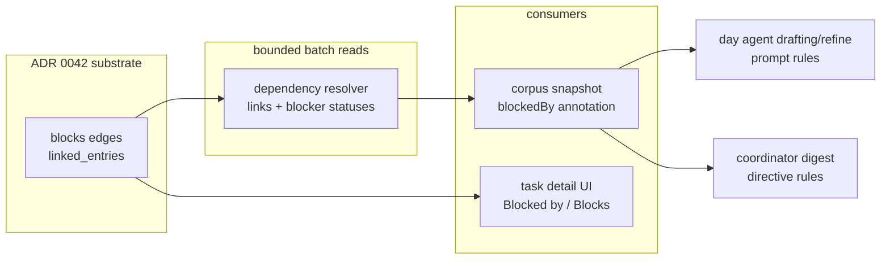

# ADR 0043: Dependency-Aware Planning (Ready Frontier)

## Status

Proposed (depends on ADR 0042)

## Date

2026-07-23

## Context

### The planning agents see tasks as a flat list

The day-agent task corpus (`DayAgentCorpusService.buildTaskCorpusSnapshot`)
assembles open tasks plus overdue/due-today tasks into a bounded snapshot
(≤200 rows: taskId, title, status, categoryId, due, estimateMinutes,
priority) that capture parsing matches against and drafting places from.
The coordinator's digest (ADR 0032) distills commitments into per-day
directives from the same flat view. Nothing in either context expresses
that one task waits on another, so today:

- Drafting can place a blocked task into a plan while the blocker sits
  unscheduled — the plan is executable on paper and stuck in practice.
- A directive can commit minutes to work that cannot start, burning one of
  the ≤12 bounded commitment slots on a no-op.
- The agent cannot give the genuinely useful advice — "schedule the
  blocker first" — because the dependency is invisible.

ADR 0042 adds the missing substrate: typed `blocks` edges between tasks
and a derived, one-hop readiness rule (no live blocker whose task is not
`DONE`/`REJECTED`). This ADR decides how planning consumes it.

### Constraint: the corpus serves two masters

The corpus is not only a planning input — capture matching
(`match_to_corpus`) resolves spoken phrases against it. A blocked task must
still be *matchable* ("I talked to legal about the contract review" must
link to the blocked contract-review task). Any design that removes blocked
tasks from the corpus breaks capture attribution.

## Decision

### 1. Annotate, never exclude

Blocked tasks stay in the corpus. Rows for blocked tasks gain one field:

```json
{
  "taskId": "…", "title": "…", "status": "OPEN", "…": "…",
  "blockedBy": [{"taskId": "…", "title": "Fix the blocker", "status": "IN PROGRESS"}]
}
```

Ready tasks carry no `blockedBy` key at all (absence means ready), so the
common case adds zero tokens and the snapshot stays byte-stable for
prompt-prefix caching except where a dependency genuinely exists.

### 2. A batch dependency resolver, one hop, bounded

A dependency-resolution seam (extending the corpus/journal read layer)
answers "which of these task ids are blocked, and by what" in two bounded
queries: one type-scoped link fetch (`to_id IN (…) AND type = <blocks>`,
served by the existing `(to_id, type)` index), one batch task-status load
for the distinct blocker ids. No transitive closure — readiness is one hop
by ADR 0042 decision 4 — and no per-task fan-out (the same
batch-read discipline as `getEntitiesByIds` in the week-context service).

### 3. Prompt contract: schedule blockers, don't schedule blocked work

Drafting/refine rules (day agents):

- Do not place a task carrying `blockedBy` unless the plan also places (or
  the day log shows completed) work on its blocker; placing blocked work
  deliberately requires the block's `reason` to name the blocker.
- When a decided/committed task is blocked, prefer placing the blocker and
  say so in the reason.

Digest rules (coordinator, extends the ADR 0032 digest ritual):

- Directive commitments should reference ready work. A commitment on a
  blocked task must either target the blocker instead or name the blocker
  in an attention note, so the per-day agent inherits the dependency
  context inside the directive itself.

These are prompt-contract rules in `day_agent_prompt_builder.dart`,
enforced the same way the binding-directive contract is: by instruction and
by review, not by hard validation — the LLM may still have good reasons
(a blocked task's independent subtask, a deadline forcing parallel prep).

### 4. UI: blockedness is visible where tasks are

- Task detail: a "Blocked by …" affordance (and the inverse "Blocks …")
  rendered from typed links, tappable to the other task, alongside the
  existing linked-tasks section; follow-ups, duplicates, fixes, and
  supersedes render as labeled groups in the same surface.
- Creating typed links reuses the existing link-task modal
  (`link_task_modal.dart`) with a relationship picker.
- List-level badges (a blocked glyph on task rows) are a later polish
  step, not part of the core decision.

### 5. Non-goals

- **No topological scheduler.** Ordering a handful of same-day blocks is
  soft judgment the LLM already exercises through block `reasons`; a
  constraint solver would fight the human-in-the-loop model for marginal
  gain.
- **No automatic status writes.** Computed blockedness never mutates
  `TaskStatus` (ADR 0042 decision 4).
- **No dependency-driven wake triggers** (waking a day agent because a
  blocker closed) in the first iteration — the daily digest and normal
  planning cadence pick up released work; event-driven release
  notifications are a listed follow-up, not a commitment.

## Data flow



## Consequences

- Token cost is proportional to actual dependencies (annotation only on
  blocked rows), and the resolver adds two bounded queries per corpus
  build.
- Capture matching is unaffected — blocked tasks remain in the corpus.
- The prompt contract grows two rule blocks (drafting, digest); both are
  conditional on the dependency data existing, so pre-rollout prompts are
  byte-identical.
- Cycle tolerance is inherited from ADR 0042: mutually blocking tasks are
  all annotated as blocked, which surfaces the deadlock to the agent and
  the user rather than hiding it.
- Deferred follow-ups (explicitly out of scope until proven needed):
  blocker-closed release notifications, list-row badges, a `link_tasks`
  agent tool letting capture parsing assert dependencies ("X waits on Y"),
  and duplicate/supersede close-time suggestions (ADR 0042 decision 6's UI).

## Related

- ADR 0042 — typed task relationship links (the substrate).
- ADR 0032 — hierarchical day-agent coordination (digest/directive
  surfaces extended here).
- ADR 0003 — linked-context contract.
- Implementation plan:
  `docs/implementation_plans/2026-07-23_task_dependency_links.md`.
