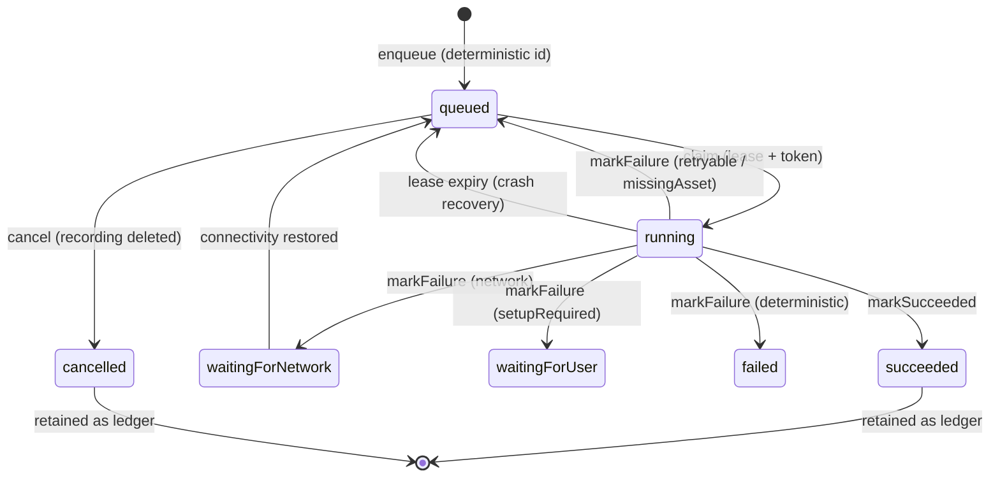

# ADR 0044: Day Processing Outbox Storage

## Status

Accepted

## Date

2026-07-24

## Context

### What the outbox is

`DayProcessingOutboxRepository` is the device-local durable record of
pending derived work for Daily OS: transcribe this recording, parse this
capture, draft this day, refine this plan. ADR 0031 introduced it for
transcription; ADR 0032 phase 1 extended it to agent jobs. It carries
deterministic job ids (`transcribe_<recordingSessionId>`,
`parse_<captureId>`, `draft_<dayId>`, `refine_<dayId>_<n>`), lease/claim
fencing, attempt counters, failure classification, and hard
`retryNotBefore` boundaries.

It has a second, deliberate role. From the class docstring: *"Jobs remain
after success as the local processing ledger consumed by Activity and
startup repair."* Terminal rows are kept on purpose —
`DayActivityRepository` (`day_activity_repository.dart:85`) and
`DayAudioReviewFence` (`day_audio_review_fence.dart:57`) both read the
whole set.

### The storage choice was never evaluated

ADR 0031 section 3 asserts the mechanism without comparing storage: *"A
checksummed, file-backed job store (deterministic job id per recording
session) with lease/claim semantics, exponential jittered backoff, hard
`retryNotBefore` boundaries, and failure classification."*

Its rejected-alternatives list contains two entries, both sound and
neither about a table:

- *"Matrix sync outbox as the job queue — the sync outbox transports
  already-durable entities; it does not represent pending inference."*
- *"In-memory wake/processing intent — an app exit must not lose the
  user's request to have a recording transcribed."*

The first argues against reusing **that** table. The second argues against
**no** durability. Neither argues against a device-local table, which was
never considered.

### What the filesystem design costs

`_readAllUnsafe()` (`day_processing_outbox_repository.dart:698`) does
`rootDirectory.listSync()` and, for every `*.json`, reads it,
JSON-decodes the envelope, verifies its SHA-256, decodes the payload, and
then sorts the whole list. It backs `claimNext` (`:447`), `getAll`
(`:417`), and `signalConnectivityRestored` (`:668`).

`DayProcessingRuntime.drainAndSchedule` (`day_processing_runtime.dart:74`)
calls `drain()` — a `claimNext` per processed job plus one idle
`claimNext` — and then `getAll()` to choose the next schedule. So one
nudge costs several full-directory scans. Nudges fire on every outbox
mutation (`runtime.dart:44` subscribes to `repository.changes`), on
connectivity restore, at startup, and on retry wakeups.

Because terminal jobs are retained as the ledger, that scan set grows for
the life of the install. Every recording adds at least two job files;
every planned day adds more. **Per-action work on the main isolate grows
linearly with app age**, and the ledger — the part that is retained on
purpose — is what grows.

The design also hand-rolls what a database provides: SHA-256 integrity
envelopes, atomic-rename writes, partial-file recovery
(`_recoverPartials`), corrupt-file quarantine (`_quarantine`), and a
tail-chained mutex (`_serialize`) to keep mutations from interleaving.

### We already learned this lesson, with numbers

`SyncDatabase` (`lib/database/sync_db.dart`) is device-local and already
runs two durable job queues in SQLite.

The `Outbox` table (`sync_db_tables.dart:85`) has `status`, `retries`,
`priority`, timestamps and a dedup key, with
`idx_outbox_status_priority_created_at ON outbox (status, priority,
created_at)` — the index shape that makes prioritized claiming an
`ORDER BY … LIMIT 1`. ADR 0013 is its decision record.

`inbound_event_queue` is a closer analogue still. Its columns map almost
one-to-one onto `DayProcessingJob`: `attempts`, `next_due_at`,
`lease_until` (*"0 = not leased; peek stamps this to `now +
leaseDuration` atomically"*), a text `status`, `committed_at`,
`last_error_reason`. Its `applied` status is documented as *"kept as an
append-only ledger for traceability"* — the same ledger role, solved with
partial indexes that exclude terminal rows from every hot query:

> Drain-path index. Partial on active statuses so the applied ledger
> (which can grow unbounded over time) is excluded from the index and the
> worker's peek query scans only the rows it can actually drain.

And the cost of *not* doing that was measured in this codebase
(`sync_db_tables.dart:287-296`):

> Without this partial the query full-scans the entire queue table on
> every worker idle tick — on a desktop mid-drain we measured 3500+ scans
> totalling 73s of DB time per hour with p95=46ms and max=2.3s.

That is the day-processing outbox's failure mode exactly: a full scan of
a ledger-bearing store on every idle tick. The sync queue fixed it with a
partial index. A directory of JSON files has no equivalent — there is no
way to index a subset of files, so the ledger and the drain path are
inseparable by construction.

## Decision

Move the day-processing outbox into a device-local Drift table.

### 1. A feature-owned database, not an existing one

A new `DayProcessingDb` under
`lib/features/daily_os_next/database/`. This matches how features own
their storage here (`features/agents/database/agent_database.dart`,
`features/ai_consumption/database/consumption_database.dart`,
`features/ai/database/ai_config_db.dart`).

Not `SyncDatabase`: ADR 0031's rejection of the sync outbox stands — that
database is the Matrix transport's domain. Not the agent database:
`agent_entities` rows sync between devices, and job state (claims,
leases, attempt counts) is strictly device-local and must never leave the
device.

### 2. Schema mirrors the existing job envelope

One row per job, primary key on the existing deterministic `id`, so
enqueue stays an idempotent upsert and the intent-conflict check is a
column comparison. The envelope columns (`status`, `day_id`, `kind`,
`created_at`, `updated_at`, `requested_at`, `next_attempt_at`,
`attempts`, `generation`, `claim_token`, `lease_until`,
`retry_not_before`, `last_failure_class`, `last_error`,
`result_transcript`, `result_entity_id`, `completed_at`) become real
columns; the kind-specific payload and `run_keys` stay serialized JSON,
as they are today.

### 3. Partial indexes separate the drain path from the ledger

Modelled directly on `inbound_event_queue`:

- Drain index over active statuses only
  (`queued`, `running`, `waitingForNetwork`), keyed on the due-time
  ordering the claim uses. Terminal ledger rows are excluded, so ledger
  growth cannot slow claiming.
- A `(day_id, …)` index for Activity, so the day view reads one day
  instead of every job ever.

### 4. Claiming becomes one conditional statement

Claim is `UPDATE … SET status='running', claim_token=?, lease_until=? …
WHERE id=? AND <due predicate>` guarded by affected-row count; fenced
mutations become `WHERE id=? AND claim_token=? AND status='running'`.
This is strictly stronger than today's read-then-write under a Dart
mutex, and `_serialize`, `_recoverPartials`, `_quarantine` and the
SHA-256 envelope all disappear — SQLite's transactions and WAL cover
them.

Job lifecycle is unchanged; only its storage moves:

### 5. Retention becomes a policy, not a rewrite

Ledger rows are retained by a documented window and pruned with a
`DELETE`. Independently of the window, partial indexes keep the ledger
off the hot path — so retention becomes a product question about how far
back Activity shows history, not a performance necessity.

### 6. Migration preserves in-flight work

1. On first run, import every job file into the table under one
   transaction. Deterministic ids make this idempotent.
2. Verify the import (row count matches imported files), then write a
   sentinel marking the directory migrated. The repository reads the
   table from that point on.
3. Leave the job files in place for one release, then delete them in a
   follow-up. They are dead weight but they are also a free rollback.
4. Startup repair — which rebuilds lost jobs from persisted `dayContext`
   provenance in the journal — is unchanged and remains the second
   safety net.

The durability guarantee from ADR 0031 is unchanged: nothing the user
recorded loses its pending transcription across the migration.

## Consequences

- Claim cost stops depending on install age; it becomes an indexed lookup
  over active rows only.
- Priority-aware claiming (the fix for head-of-line blocking, where the
  day the user is looking at waits behind unrelated days) becomes an
  `ORDER BY` over an index whose analogue is already proven in
  `idx_outbox_status_priority_created_at`.
- Activity reads one day instead of the full ledger.
- A meaningful amount of hand-rolled integrity code is deleted.
- Costs: one schema migration, one more database connection, and the loss
  of on-disk inspectability during debugging. The last is mitigated by a
  debug dump if it is ever missed in practice.
- Risk is concentrated in the migration. It is bounded by idempotent
  deterministic ids, verify-then-sentinel, retaining the files for a
  release, and the existing startup repair path.

## Rejected alternatives

- **Keep files, add pruning and an in-memory index.** This was the
  original shape of the fix. It rebuilds a database badly: the index can
  diverge from disk (sync, restore, external mutation), cold start has to
  rebuild it, there is no partial-index equivalent so the ledger cannot
  be separated from the drain path, and priority ordering stays bespoke.
  It also keeps every line of the integrity machinery.
- **Reuse `SyncDatabase`'s `Outbox` table.** ADR 0031's reasoning stands:
  that queue transports already-durable entities and does not represent
  pending inference.
- **Store jobs as agent entities.** `agent_entities` sync between
  devices; claims and leases must not.
- **Do nothing.** The cost is not static — it grows with every recording
  the user makes, and the ledger role guarantees the store only ever
  grows.

## Related

- ADR 0013 (outbox priority queue — the in-repo precedent for a
  prioritized durable queue in SQLite)
- ADR 0031 (batch-first day audio capture — introduced the file-backed
  outbox this ADR supersedes on storage; every other decision in it
  stands)
- ADR 0032 (hierarchical day agents — extended the outbox to agent jobs)
