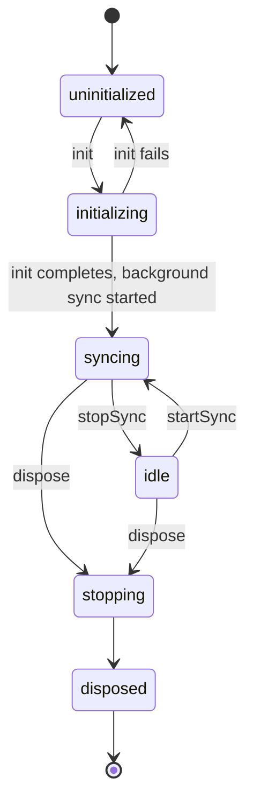

# ADR 0046: Remove the Sync Actor Isolate, and How to Rebuild It

## Status

Accepted

## Date

2026-07-29

## Context

### A complete subsystem that nothing could reach

`lib/features/sync/actor/` held 1910 lines of production code and 5498 lines
of tests implementing Matrix sync inside a dedicated worker isolate. It was
built in three phases — [#2669](https://github.com/matthiasn/lotti/pull/2669)
(minimal actor), [#2671](https://github.com/matthiasn/lotti/pull/2671) (SAS
verification), [#2672](https://github.com/matthiasn/lotti/pull/2672) (outbound
pipeline) — against a plan at
`docs/implementation_plans/2026-02-12_actor_based_sync_isolate_plan.md`.

Nothing in the app ever spawned it. `SyncActorHost.spawn` was called only from
its own unit test and one integration test. The `enable_sync_actor` config
flag existed and was seeded into every install's database, but no code read
it — the wiring that would have made it mean something (plan phase 5) never
landed, and neither did phase 4 (inbound processing and direct DB writes).

### The code was not free

Dead code that is never touched costs nothing. This was touched repeatedly.
It was carried through the Flutter 3.44 upgrade
([#3197](https://github.com/matthiasn/lotti/pull/3197)), the file-size
refactor ([#3301](https://github.com/matthiasn/lotti/pull/3301)), two
test-improvement passes ([#3283](https://github.com/matthiasn/lotti/pull/3283),
[#3286](https://github.com/matthiasn/lotti/pull/3286)), and — most tellingly —
ADR 0045's unverified-device key-sharing change
([#3619](https://github.com/matthiasn/lotti/pull/3619)), a real behavioural fix
that had to be reimplemented on a path no user could reach.

It also distorted unrelated work. The invite/room-discovery removal
([#3661](https://github.com/matthiasn/lotti/pull/3661)) had to preserve
`MatrixSdkGateway.createRoom` and relocate the `m.lotti.sync_room` marker
constant into `matrix/consts.dart` for no reason other than that the actor's
outbound queue read them.

### Finishing it had grown much larger than "two more phases"

The plan's defining constraint was isolation: *"Completely separate: no
dependencies on existing `MatrixService`, `OutboxService`, or sync pipeline
code."* That was affordable in early 2026. Since then the live receive path
gained four subsystems the actor knows nothing about:

- `queue/` — the persistent inbound queue, per-room worker, `onSync` catch-up
  bridge, and durable late-key resume floor, now **the only receive path**
- `sequence/` — `(hostId, counter)` coverage tracking and gap detection
- `backfill/` — missing-counter requests, and responses that resend, mark
  deleted, or hint unresolvable
- `media/` — self-healing attachment fetch
  ([#3648](https://github.com/matthiasn/lotti/pull/3648))

plus dequeue-time outbox bundling and the attachment index. Reaching parity
would mean either abandoning the isolation constraint or implementing all of
that a second time.

### The problem it solved is not one we currently observe

The stated goal was *"eliminate sync-induced frame drops by isolating
network/crypto/sync work from the render thread."* No such jank is being
reported or measured today. The subsystem was paying maintenance rent against
a symptom we do not have.

## Decision

**Remove `lib/features/sync/actor/`, its tests, its integration test, and the
`enable_sync_actor` flag.** Record here what was learned, so the work is
recoverable if UI-isolate jank ever makes it necessary.

This ADR is the deliverable that justifies the deletion. The value in those
lines was the design, not the code.

## Consequences

- Sync runs entirely on the UI isolate, as it already did in practice.
- ~7400 lines leave the repo; future sync changes stop needing a second,
  unreachable implementation.
- Existing installs carry a stale `enable_sync_actor` row. Flags are seeded
  with `insertFlagIfNotExists`, which never deletes, so removing the seed
  alone leaves the row in every upgraded install forever — stored, emitted by
  `watchConfigFlags`, and readable by name. It was never a *visible* toggle:
  `FlagsBody` renders only the names in its `defaultDisplayedItems` whitelist,
  and `enable_sync_actor` was never on it. `initConfigFlags` now ends by
  deleting every name in `retiredConfigFlags` — storage cleanup, and the
  mechanism to use whenever a flag is retired.
- If jank appears later, the rebuild starts from this document rather than
  from a stale branch.

## How to rebuild it, if needed

### First, confirm the premise

Rebuild only against a measured symptom. `SyncEventProcessor.process()` is the
suspect: vector clock validation, entity deserialization,
`JournalDb.updateJournalEntity()`, embedded entry-link processing, sequence-log
writes and notification dispatch, all on the UI isolate, per inbound event.
Profile that under a realistic catch-up burst before writing any code.

Note that the queue pipeline already smooths this somewhat — inbound work is
drained by a per-room worker rather than processed inline on the sync tick.
Establish that the remaining cost is still a render-thread problem.

### What proved sound

**Direct DB writes, no apply/ack protocol.** The design was for the actor to
open its own connections to the same SQLite files as the main isolate and
write through them, rather than shipping every change back over a port. SQLite
handles this: WAL mode, `busy_timeout = 5000` and `synchronous = NORMAL` are
set in `_setupDatabase()`, so readers do not block writers. This removed an
entire class of complexity from the original design and should be kept.

Be precise about how far this was actually proven, because a rebuild will
inherit the gap. **The only database the actor ever opened was
`SyncDatabase`** — `SyncActorCommandHandler` constructed it through a
`SyncDatabaseFactory`, and `OutboundQueue` claimed and updated outbox rows
through it directly. `JournalDb` and `SettingsDb` from a second isolate is
plan phase 4, which never landed (see above). So cross-isolate writes are
demonstrated for the outbox and *inferred* for the journal.

**Notification-driven UI refresh.** All sync-affected Drift `watch()` calls
were replaced with `notificationDrivenStream()` fed by `UpdateNotifications`
(see `docs/implementation_plans/2026-02-12_remove_sync_affected_drift_watch.md`).
This means a worker isolate does **not** need `markTablesUpdated()` or a
`DriftIsolate` workaround — it emits affected entity ids plus type-notification
keys, and the host calls `UpdateNotifications.notify(ids, fromSync: true)`.
That indirection is what makes cross-isolate DB writes viable, and it is
already in place.

Wire format detail worth keeping: send `List<String>`, not `Set`, because
`Set` is not a guaranteed-safe isolate transfer type.

**A flat command/event protocol over `SendPort`.** Commands carry
`{command, requestId, replyTo, ...payload}`; responses carry
`{ok, requestId, error?, errorCode?, ...result}`; events carry
`{event, ...payload}`. No priority queues or QoS. A small state model with
out-of-state commands answered `errorCode: 'INVALID_STATE'`. This was enough
for login, room join, SAS verification and send/receive, and did not need to
grow.

The states were `uninitialized`, `initializing`, `idle`, `syncing`,
`stopping`, `disposed`, but they were **not** a single linear chain, and a
rebuild that assumes one will get the valid-command table wrong:

`init` went straight to `syncing` — it started background sync as part of
initialization — so `idle` was reachable **only** by an explicit `stopSync`,
and `startSync` was rejected unless the actor was already `idle`.

**Integration-test-driven development.** The docker-backed two-client test was
the specification, and each phase extended it. That kept the actor honest
about real homeserver behaviour in a way unit tests could not.

### The trap that will bite again

**Legacy sync services self-start in their constructors.** Gating the actor
behind a flag is not a matter of skipping `MatrixService.init()`:

- `OutboxService`'s *constructor* calls `_startRunner()` (creating a
  `ClientRunner` and a watchdog timer) and subscribes to connectivity, login
  state, and `watchOutboxCount()`. **Constructing it starts sending.**
- `MatrixService`'s *constructor* subscribes to connectivity and builds the
  `MatrixStreamConsumer` pipeline object. It does **not** start that pipeline
  and does not kick off a rescan: `init()` does, via `_startQueuePipeline()`,
  and `get_it_helpers.dart` calls `init()` separately.

The invariant is: **when actor mode is active there must be exactly zero
legacy sync producers running**, and the actor is sole owner of the Matrix
client, sync loop and outbound sends. The two services need different
treatment to get there, and conflating them is what makes the problem look
harder than it is. For `MatrixService`, skipping `init()` is sufficient to
keep it inert — construction leaves an idle pipeline object and a
connectivity listener, neither of which sends or syncs. For `OutboxService`,
only preventing *construction* works, and that is what breaks consumers
resolving the singleton unconditionally (`main.dart`'s provider override, the
`beamer_app` login-gate toast, sync maintenance, and the room/stats
providers). Any rebuild should extract a `startSyncServices()` seam first and
test that the flag-on path completes startup without constructing
`OutboxService` or calling `MatrixService.init()`.

Read-only consumers of `SyncDatabase` and `JournalDb` may keep running. The
outbox monitor page also writes (`updateOutboxItem`, `deleteOutboxItemById`),
and that is the one genuine conflict: the actor's own `OutboundQueue` claimed
and updated the same outbox rows. Ownership of `SyncDatabase` has to be
settled explicitly in a rebuild — either the actor owns the outbox and the
monitor page becomes read-only, or the monitor keeps its writes and the two
coordinate through row claims. It cannot be left implicit as it was.

### What has changed since, and must be decided up front

The isolation constraint that made the original plan tractable is now the
hard part. Before writing code, decide explicitly how the actor obtains
`queue/`, `sequence/`, `backfill/` and `media/` behaviour: share those
subsystems across the isolate boundary, or accept a second implementation and
the divergence risk that comes with it. Do not start with the constraint
unexamined — that is what made the original effort unfinishable.

## References

- Removed implementation plan:
  `docs/implementation_plans/2026-02-12_actor_based_sync_isolate_plan.md`
  (deleted with this change; recoverable from git history at `3fc322b29`)
- ADR 0045 — the key-sharing change that had to be applied twice
- `docs/implementation_plans/2026-02-13_drift_wal_read_pools.md` — WAL and
  read-pool work that the direct-write design depends on
- `docs/implementation_plans/2026-02-12_remove_sync_affected_drift_watch.md` —
  the notification-driven refresh that removes the cross-isolate `watch()`
  problem
- `knowledge/features/sync/` — how sync actually works today
