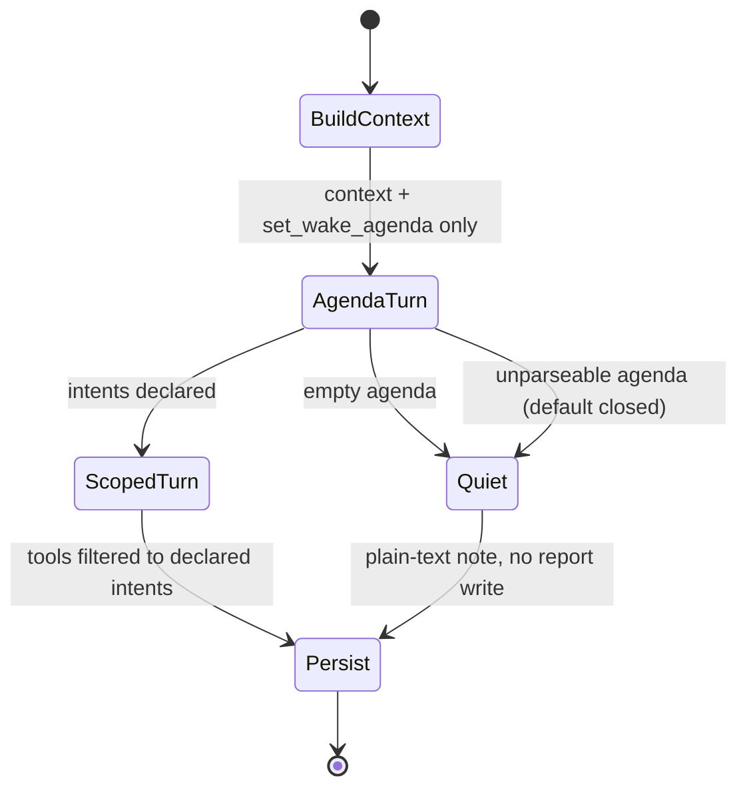

# 0051 — Agenda-gated tool exposure for task-agent wakes

## Status

Proposed

## Date

2026-08-08

## Context

Every task-agent wake today advertises the full deferred tool set — fifteen
user-gated tools plus `update_report`, `record_observations`,
`retract_suggestions` and `get_related_task_details` — in the first request,
regardless of what the wake is for. Restraint is then requested in prose: the
scaffold tells the model not to change a field whose value already matches, not
to undo the user's work, and to finish with a plain-text note when nothing
changed.

Two measurements from the 2026-08-08 real-wake suite bear on this.

**Restraint asked for in prose is not reliably delivered.** In the `noOp`
scenario — an accurate prior report, no outstanding request, a closing note
carrying no new fact — four of five models rewrote the report anyway. No model
proposed a data change, so the failure is narrow and specific: they cannot leave
a correct report alone. Only Qwen3.6 27B was consistent, at 3/3.

**Payload size moves small models.** The lean-payload probe took Qwen3.6 27B
from 10/14 to 13/14 on the fourteen-scenario suite purely by shrinking the
prompt, while GLM 5.2, Kimi K3 and Qwen3.5 397B stayed at 14/14. Tool
definitions are a large, currently unconditional share of that payload.

One measurement argues *against* over-claiming. The `pendingProposal` scenario
was expected to show models re-proposing changes already awaiting the user. It
does show three of four calling the redundant tool — but `ChangeSetBuilder`
already dedups identical proposals against still-open items and consolidates
pre-wake sets, so the user never sees the duplicate. That cost is wasted turns
and payload, not a user-visible defect. It is a reason to withhold a tool, not
evidence of harm.

## Decision

Split the wake into two phases and derive the second phase's tool set from the
first.

**Phase one — agenda, no mutation tools.** The model receives the existing wake
context (task JSON, prior report, observations, linked tasks, open proposals,
attention claims, timer) and exactly one tool: `set_wake_agenda`. It declares
what this wake is for as a set of intents drawn from a closed vocabulary
(`report`, `checklist`, `status`, `schedule`, `labels`, `time`, `split`, `link`,
`attention`), or the empty set for "nothing to do". No mutation tool is
reachable in this phase, so no mutation can occur before the wake has stated its
purpose.

**Phase two — only what the agenda named.** The tool definitions are filtered to
those the declared intents map to. An empty agenda ends the wake immediately
with a plain-text note and no second request at all.

**Default closed.** A missing, unparseable, or empty agenda exposes no mutation
tools. The failure mode is a quiet wake, never an unguarded one.

The mapping from intent to tools lives beside `AgentToolRegistry.deferredTools`
so the two cannot drift, and `update_report` is exposed in phase two only when
the agenda names `report`.

## Consequences

**What this buys.** Restraint becomes structural rather than instructed. A wake
whose agenda is empty cannot rewrite the report, because `update_report` is
never offered — which is precisely the `noOp` failure, made impossible instead
of discouraged. Phase-two payload shrinks to the tools actually in play, which
the lean-payload result predicts will help smaller models most. The agenda is
also a durable, auditable statement of intent, recordable alongside the wake's
action messages.

**What it costs.** A second round trip per wake. Qwen3.6 27B already runs 41–50s
against GLM 5.2's 13s on the mid-sized wake, so this is the main risk to the
local-model story and must be measured, not assumed — if phase one can be run at
low effort or on a smaller model, that should be evaluated too.

**What it does not fix.** An agenda step can hallucinate intents, which relocates
the problem rather than removing it: a wake that declares `report` when nothing
changed still churns. The agenda itself therefore needs a scenario, and
`noOp` becomes its primary test — the metric is whether the agenda comes back
empty.

**Prefix caching.** Prompt blocks are ordered stable-first so a prefix cache can
restore the header across wakes. A phase-two prompt whose tool list varies per
wake changes the cacheable prefix, so tool definitions must sit after the stable
blocks, and the effect on cache hit rate needs checking.

**Migration.** The phases are additive: with the agenda step disabled the wake is
byte-identical to today's, so this ships behind a flag and is evaluated
side-by-side on the existing scenarios before becoming the default.

## Evaluation plan

Run before and after on the real-wake harness
(`penguin_wake_workflow_eval_live_test.dart`), three samples per model across
GLM 5.2, Kimi K3, Qwen3.5 397B, Qwen3.6 27B and DeepSeek V4 Flash 0731:

| Scenario | Current | Target |
| --- | --- | --- |
| `noOp` | 27B 3/3; GLM 1/3; Kimi, 397B, DeepSeek 0/3 | all 3/3 via empty agenda |
| `requalification` | 3/3 for Kimi, 27B, DeepSeek; 2/3 GLM and 397B | no regression |
| `pendingProposal` | Kimi does not repeat; three others do | fewer redundant calls |

Latency per wake is recorded alongside correctness, since a second round trip
that fixes `noOp` but doubles 27B's wall clock is a trade to make deliberately
rather than discover.

`requalification` is the guard: it is the scenario where the wake genuinely has
work to do, and agenda gating must not cause a model to under-declare and miss
it. A drop there outweighs a gain on `noOp`.

## Related

- ADR 0042 — typed task relationship links (tool surface this filters)
- `knowledge/features/agents/task-agents.md` — wake flow, prompt composition,
  tool policy, proposal ledger
- `docs/evaluations/task_agent_models/README.md` — the real-wake suite and the
  measurements cited here
- PR #3851 — real-database eval harness
- PR #3852 — `noOp` and `pendingProposal` scenarios
