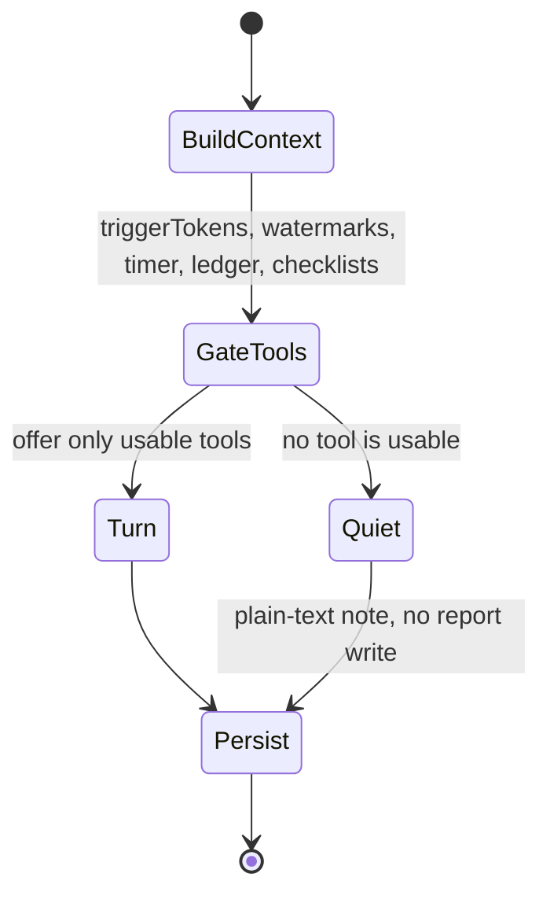

# 0051 — Gate tool exposure on what the wake already knows

## Status

Proposed

## Date

2026-08-08

## Context

Every task-agent wake advertises the full deferred tool set — fifteen user-gated
tools plus `update_report`, `record_observations`, `retract_suggestions` and
`get_related_task_details` — in the first request, regardless of what the wake
is for. `TaskAgentContextBuilder.buildToolDefinitions()` takes no arguments and
returns everything enabled. Restraint is then requested in prose.

The 2026-08-08 real-wake suite shows prose does not deliver it. In the `noOp`
scenario — accurate prior report, no outstanding request, a closing note with no
new fact — four of five models rewrote the report anyway. No model proposed a
data change, so the failure is narrow: they cannot leave a correct report alone.
Only Qwen3.6 27B was consistent, at 3/3.

The obvious response is to ask the model what the wake is for before handing it
any tools, and expose only what it names. **That was the first form of this ADR
and it does not survive its own arithmetic.**

An agenda turn sends the full wake context — 9,004 characters on the mid-sized
scenario — plus one tool. The second turn then sends the same context again with
a filtered tool list. Input roughly doubles to save the tool-definition slice,
which is a fraction of the payload. It is net *more* tokens, not fewer, which
inverts the lean-payload finding used to justify it: Qwen3.6 27B improved 10/14
to 13/14 as the prompt got **smaller**. It also adds a full round trip to a
27B wake that already takes 41–50s against GLM 5.2's 13s.

The useful idea underneath is narrower and cheaper: **do not offer a tool that
cannot legitimately be used in this wake.** Almost all of that is decidable
without asking anyone. `execute()` already receives `triggerTokens`;
`reportStaleAt`/`reportFreshAt` already track whether the report is stale; the
context builder already knows whether a timer is running, whether the task has
checklist items, whether label definitions exist, and whether the ledger holds
open proposals.

## Decision

Make `buildToolDefinitions()` a function of the wake's known state instead of a
constant, and gate each tool on the fact that makes it usable. No extra
inference call.

| Tool | Offered when |
| --- | --- |
| `update_report` | something material changed since the last report |
| `update_running_timer` | a timer is running **for this task** |
| `create_time_entry`, `update_time_entry` | the task has time records or a timer |
| `update_checklist_items` | the task has at least one checklist item |
| `assign_task_labels` | label definitions exist for the category |
| `retract_suggestions` | the ledger has open proposals |
| `resolve_attention_request` | this agent has an active claim on the task |
| `migrate_checklist_items` | a follow-up task was created this wake |
| `set_task_language` | the task has no language, or the context disagrees |

Several of these are correctness fixes independent of payload. Offering
`update_running_timer` when no timer exists invites a hallucinated timer id;
offering `resolve_attention_request` with no claims invites a fabricated claim
id. A tool that cannot succeed is an invitation to invent its arguments.

`update_report` is the one that answers `noOp` directly: when nothing changed
since the report was written, the tool is absent and the wake cannot churn it.

**The agenda turn is rejected for now**, not deferred as obviously-next. It
would only earn a round trip for decisions that genuinely need prose
comprehension the app cannot do — "does this note ask me to split the task?" —
and no measurement yet shows those failing. If it is revisited, phase one must
receive a *reduced* context (changed entries plus the current report), not the
full wake, or the arithmetic stays against it.

## Consequences

**What this buys.** Restraint becomes structural where the app has the facts:
a wake with nothing to report cannot rewrite the report. Payload strictly
shrinks — the opposite of the agenda design — which the lean-payload result
predicts helps smaller models most. Several hallucination invitations disappear.
Zero additional latency or spend.

**What it costs.** The gates are now app logic that can be wrong in a new way. A
gate that is too aggressive silently removes a capability the wake needed, and
the model cannot report a tool it was never offered. This is the main risk and
`requalification` is the guard against it.

**What it does not fix.** Anything requiring judgement about prose. If a model
declines to act on an instruction buried in a note, gating does not help — it
only ensures the tool was available.

**Prefix caching.** Prompt blocks are ordered stable-first so a prefix cache can
restore the header. A per-wake tool list perturbs the cacheable prefix, so tool
definitions must sit after the stable blocks and the hit-rate effect needs
measuring. This applies to any variable tool list, agenda or not.

**Migration.** Additive and flagged: with gating disabled the tool list is
today's, so both can be evaluated side by side before either becomes default.

## Evaluation plan

Before and after on `penguin_wake_workflow_eval_live_test.dart`, three samples
per model across GLM 5.2, Kimi K3, Qwen3.5 397B, Qwen3.6 27B and DeepSeek V4
Flash 0731:

| Scenario | Current | Target |
| --- | --- | --- |
| `noOp` | 27B 3/3; GLM 1/3; Kimi, 397B, DeepSeek 0/3 | all 3/3 — `update_report` withheld |
| `requalification` | Kimi, 27B, DeepSeek 3/3; GLM, 397B 2/3 | no regression |
| `pendingProposal` | Kimi does not repeat; three others do | unchanged (see below) |

`requalification` outweighs `noOp`: it is the scenario where the wake genuinely
has work, and a gate that makes a model miss it is worse than report churn.

Payload size per wake is recorded alongside correctness, since shrinking it is
the second reason to do this and should be shown rather than assumed.

`pendingProposal` is not a target. `ChangeSetBuilder` already dedups identical
proposals against still-open items and consolidates pre-wake sets, so a repeat
never reaches the user; it costs turns, not correctness. Gating cannot remove
`set_task_status` there either, since the status genuinely may need changing.

## Related

- ADR 0042 — typed task relationship links (part of the tool surface gated here)
- `knowledge/features/agents/task-agents.md` — wake flow, prompt composition,
  tool policy, freshness watermarks, proposal ledger
- `knowledge/features/agents/wake-orchestration.md` — the content gate, which
  applies the same principle before a wake starts at all
- `docs/evaluations/task_agent_models/README.md` — the real-wake suite
- PR #3851 — real-database eval harness
- PR #3852 — `noOp` and `pendingProposal` scenarios
