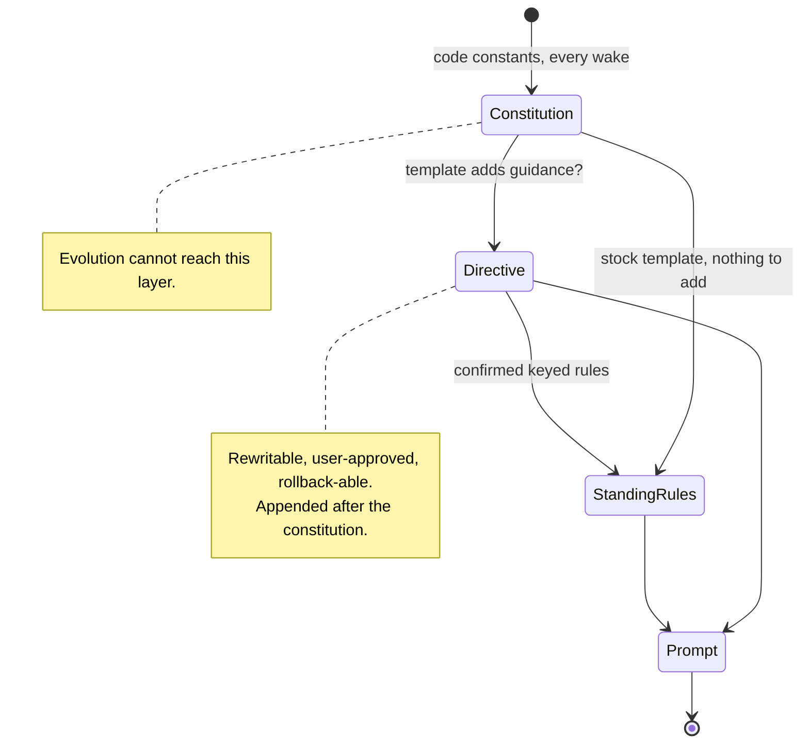

# 0052 — An agent's constitution is code, not an evolvable directive

## Status

Proposed

## Date

2026-08-08

## Context

Template evolution rewrites an agent's directives. `propose_directives` takes
`general_directive` and `report_directive` as complete strings — the session
prompt says so explicitly: *"When proposing directives, output the COMPLETE new
directives text, not a diff."* Approval writes both fields verbatim into a new
template version. The only structural validation is that at least one is
non-empty.

That shape is what this ADR is about. Two questions follow from it: which rules
may a rewrite touch, and how does an agent accumulate durable guidance without
rewriting anything?

**What is already safe.** The role, the wake-finishing contract, the job steps,
every tool definition and its authority boundaries, the evidence-synthesis
protocol and the model-tuned report contract are code-owned constants in
`TaskAgentPromptBuilder` and `AgentToolRegistry`. Evolution cannot reach them.
So "this is what you are, these are your tools" is not at risk today.

**What was mixed up.** The seeded `taskAgentGeneralDirective` restates rules the
scaffold already asserts:

| Seeded directive section | Already code-owned in the scaffold |
| --- | --- |
| never re-open a user-checked item | `**Checklist sovereignty**` — overriding needs a `reason` naming later evidence |
| never override a manual field change | the no-op rule — *"the user wins — make no call at all"* |
| never change a user-set estimate | `**Estimates**` — never adjust retroactively |
| never change a user-set title | `**Title**` — only when the task has none |
| review recent user decisions first | `**Past decisions**` — the proposal ledger |
| don't call tools speculatively | `**Confidence**` |
| never change a user-set priority or due date | **nothing** |
| handle rough transcripts, ask rather than assume | **nothing** |

So the risk was not that evolution could delete the sovereignty rules — the
scaffold keeps asserting almost all of them regardless. The real defects were
smaller and duller: **two wordings of one rule**, one of them editable, costing
payload on every wake and free to drift apart; and **two rules that lived only in
the editable copy**, which a rewrite genuinely could drop.

The compact scaffold used by the evaluated Qwen and Mistral profiles had already
resolved this for itself: it carries its own constitution (`## Authority and
Evidence`, `## Tool Discipline`) and *suppresses* a general directive that is
byte-for-byte the seeded constant, appending only a genuinely customised one.
The common scaffold never adopted that, so the same template produced a
duplicated prompt on one path and a single one on the other.

**What is missing entirely** is the additive layer. An agent has no way to
accumulate a standing rule — "this project's estimates are always in ideal
days", "never propose a due date for this recurring task" — other than by
rewriting its whole general directive. The planner already has exactly this
mechanism (ADR 0022 Decisions 9–10): `PlannerKnowledgeEntity` keyed statements
with a ≤120-character always-injected hook, a `proposed → confirmed → retracted`
lifecycle, per-key supersession and global/category/project scope, confirmed by
the user in a panel. Task agents do not read it.

## Decision

Three layers, ordered by mutability. Each layer may add to the ones above it and
may never contradict or remove them.

| Layer | Home | Who writes it | Lifetime |
| --- | --- | --- | --- |
| **Constitution** | code constants in `TaskAgentPromptBuilder` | Lotti releases | changes when the app ships |
| **Template directive** | `AgentTemplateVersionEntity.generalDirective` / `reportDirective` | evolution, user-approved | one version, rollback-able |
| **Standing rules** | keyed knowledge entries | evolution, user-confirmed per rule | per rule, retractable |

Concretely, and in this change:

1. **The constitution is complete and single-sourced.** The two rules that lived
   only in the seeded directive — user-set priority and due date are sovereign,
   and input handling — move into the code-owned scaffold. Every rule an agent
   must never lose is now a constant.
2. **The seeded general directive is no longer rendered.** `buildSystemPrompt`
   resolves it through `effectiveGeneralDirective`, which returns empty for the
   seeded value and the text verbatim for anything else — the same
   compatibility-sentinel pattern as `usesBuiltInReportContract`. Both scaffolds
   now behave the way the compact one already did. A stock wake gets one wording
   of each rule; an evolved directive is appended *after* the constitution, so it
   adds rather than replaces.
3. **The evolution session sees what is in effect.** For a stock template the
   general directive shows as *"None. This template adds nothing on top of the
   built-in task-agent constitution, which is code-owned…"*, mirroring the
   report-directive fix. Silence would invite a proposal that restates rules the
   agent already has and cannot lose.

**The constant itself does not change.** `taskAgentGeneralDirective` keeps its
exact text: templates seeded on earlier versions store it byte-for-byte and are
recognised by that match, so editing it would reclassify every one of them as
customised and start rendering it again. Its value is now its stability, exactly
as for `taskAgentReportDirective`.

**The compact scaffold text is not touched.** It already carries the
constitution, and the 27B and Mistral numbers were measured against that exact
wording. Changing a measured prompt needs an eval run, not an ADR. A test now
pins that a stock template produces the compact scaffold plus the evidence
protocol and nothing else.

## Consequences

**What this buys.** One authoritative wording per rule, owned by code, updated
by shipping the app — including for templates that have already been evolved,
which previously forked from the shipped baseline permanently
(`seedDirectiveFields` backfills only when a field is *empty*). Stock wakes get a
smaller prompt on the common scaffold. The two previously-unprotected rules
become unloseable. And the evolution session can no longer be shown a directive
the agent never received.

**What it costs.** An evolved directive that duplicates constitution rules keeps
its copy — the app cannot safely edit user-approved text — so those templates
still pay for a second wording until their next evolution session. The
`## Input Handling` and priority/due-date additions grow the common scaffold
slightly; net payload for a stock template still falls, because the seeded
directive it replaces was longer than both.

**What it does not fix.** Nothing stops an evolved directive from *contradicting*
the constitution in prose. Ordering (constitution first, template guidance last)
and the fact that only the constitution is code-owned are the mitigations; a
contradiction is still a bad proposal that the user can reject and roll back.
Making contradiction structurally impossible would mean constraining what a
directive may say, which is a larger change than this.

**Migration.** None. No stored data is rewritten and no version is created; the
change is in what gets rendered. A template whose directive was hand-edited to
something other than the seed is unaffected.

## Follow-ups

Not in this change, in the order they earn their keep:

1. **Make the report directive additive.** A custom report directive currently
   flips `usesBuiltInReportContract` to false, which permanently disables the
   model-tuned contract substitution for that template — the contract behind
   Qwen3.6 27B's 10/14 → 13/14. Normal evolution output triggers this, and the
   proposal card does not say so. An *addendum* appended after the model-tuned
   contract removes the cliff.
2. **Give task agents standing rules.** Reuse `PlannerKnowledgeEntity`: a
   `propose_knowledge` evolution tool writing one keyed rule with a hook, a
   scope and a rationale; the wake injects the confirmed Head set. Directive
   rewrites become the escape hatch rather than the default move, and the session
   prompt's contradiction between *"make the smallest directive changes"* and
   *"output the COMPLETE new directives text"* dissolves, because an additive
   proposal is a diff.
3. **Constrain the rewrite itself** — section-scoped proposals, or a check that a
   proposal does not contradict the constitution — only if 1 and 2 leave a real
   gap.

## Related

- ADR 0022 — daily-OS planner: Decisions 9–10 define the knowledge lifecycle
  this ADR proposes reusing for task agents
- ADR 0051 — agenda-gated tool exposure; the same principle applied to tools
  rather than directives
- `knowledge/features/agents/templates-souls-evolution.md` — the evolution
  ritual, version lifecycle and rollback
- `knowledge/features/agents/task-agents.md` — prompt composition and the
  directive substitution rules
