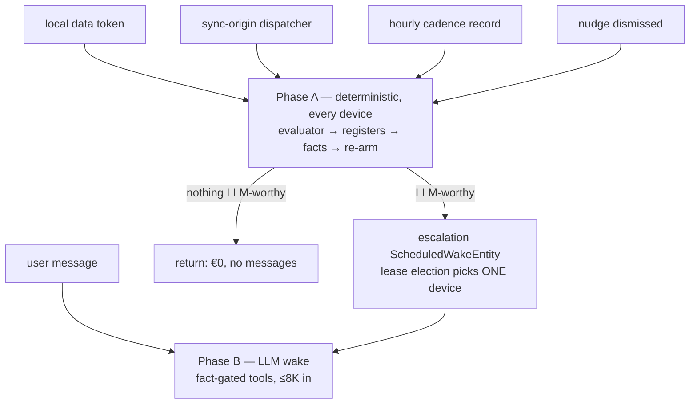

# ADR 0054: Deterministic-First Two-Tier Wakes for Goal Agents

- Status: Proposed
- Date: 2026-08-08

## Context

Task agents wake on evidence and their no-op wakes are rare. Goal agents invert that: step-count
imports, habit completions, and cadence ticks arrive many times a day, and on most of them
*nothing decision-worthy has changed*. Model evaluation showed what LLMs do with such wakes: in
the task-agent `noOp` scenario, four of five models rewrote a correct report anyway
(ADR 0051), and "a tool that cannot succeed is an invitation to invent its arguments"
(`task_agent_tool_gate.dart`). Paying an inference round-trip to conclude "nothing to do" is the
failure mode this ADR exists to prevent — for cost, energy, and correctness alike.

Two infrastructure facts constrain the design:

- `WakeOrchestrator` deliberately consumes only `updateNotifications.localUpdateStream`
  (`agent_providers.dart`), so a synced entry never wakes an agent on the receiving device.
  Health data **originates on mobile only** and is **pull-only**
  (`health_import.dart` — desktop returns `unsupportedPlatform`; deltas fire when dashboard
  charts mount, throttled to 10 minutes; no background fetch). Without new routing, a desktop
  goal agent would never learn about phone-imported steps.
- Single-device execution of scheduled work already exists: `ScheduledWakeEntity` carries
  `leaseHostId`/`leaseUntil` with a claim–settle–re-read election
  (`scheduled_wake_manager.dart`), proven by ADR 0048.

## Decision

1. **The invariant: a tick that changes nothing costs €0 and writes no messages.** No capture,
   no compaction, no agent messages, no inference — only (idempotent) register upserts.

2. **Phase A — deterministic, every wake, every device.** Each goal-agent wake first runs pure
   Dart: load the spec head, re-arm the cadence wake, run `GoalProgressEvaluator` over journal
   aggregates per criterion (steps by `dataType`, completions by `habitId`), upsert the
   `goalProgress` register for the current period, and compute `GoalWakeFacts` (status
   transition? nudge stale? user message pending? scheduled check-in due?). Registers are
   recomputed-never-accumulated, so concurrent Phase A runs on several devices converge by
   construction.

3. **Phase B — the LLM — runs only on facts, never directly from a data trigger.** When Phase A
   finds an LLM-worthy condition (status transition, nudge staleness, pending dialogue, scheduled
   check-in), it upserts an *immediate* escalation `ScheduledWakeEntity`
   (`workspaceKey: 'goal-escalation:<periodKey>'`) and nudges the manager. The existing lease
   election picks exactly one device to run Phase B; if the arming device dies, another picks it
   up within the hourly scan. User-initiated chat is Phase B directly — the typing device is
   inherently the single runner.

4. **Sync-origin signals wake Phase A on receiving devices.** A `GoalSignalSyncListener`/
   `GoalSignalSyncDispatcher` pair (modeled 1:1 on `synced_audio_inference_listener.dart` /
   `_dispatcher.dart`) listens to `syncUpdateStream`, intersects batches with goal-subscribed
   tokens, guards against self-echo via vector clocks, and enqueues Phase-A-only wakes. Phase A
   being idempotent makes this convergence, not duplication; Decision 3 keeps token spend
   single-flighted.

5. **Subscriptions are per-goal and precise.** `matchEntityIds` = the union of the criteria's
   `dataType` strings (`QuantitativeEntry.affectedIds` already emits them — e.g.
   `cumulative_step_count`), the criteria's `habitId`s (`HabitCompletionEntry.affectedIds` emits
   them; the global `HABIT_COMPLETION` sentinel is deliberately not used), and a per-agent
   nudge-dismissal token. Registered and restored by a `GoalRuntimeMaintenance` implementing
   `AgentRuntimeMaintenance`, contributed in `app_bootstrap.dart` like Daily OS's.

6. **Recurrence by re-arm, not by schema.** No recurrence field is added to
   `ScheduledWakeEntity`. Phase A re-arms the next cadence wake at a deterministic id
   (`workspaceKey: 'goal-cadence'`) at its *start* (crash-safe), and
   `GoalRuntimeMaintenance.beforeWakeScan()` self-heals any active goal agent missing a pending
   cadence record — the day-agent `set_next_wake` precedent. Hourly poll granularity is ample
   for daily/weekly goal cadences. A first-class recurrence model is deferred until a third
   agent kind needs one.

7. **The tool gate is designed in, not retrofitted.** `GoalWakeFacts` gates tool exposure from
   day one: `update_goal_report` is only offered when status transitioned or a report-worthy
   fact exists — a wake that should no-op *cannot* churn, structurally. Ad and agreement tools
   are likewise fact-gated (fresh-ad present ⇒ no `create_goal_ad`; see ADR 0055/0056).

8. **Cost is monitored, not capped.** Every Phase B call lands as an `AiConsumptionEvent`
   carrying `agentId` and `wakeRunKey` (credits and energy on Melious), so per-goal spend is a
   query; the goal UI surfaces it, and the eval harness reports cost per call plus an
   extrapolated €/goal-month with its wakes/day assumption printed — observed estimates, never
   targets. Spending caps are documented as a future option only; the efficiency guarantees are
   architectural (Phase A gating, ≤8K-token Phase B prompts with cold-prefill-sized compaction
   budgets, lease-elected single execution).

## Consequences

- Every device stays fresh (banners re-evaluate wherever the user is looking); exactly one device
  spends tokens. Worst-case remote pickup latency is one hourly scan; a rare lease-race duplicate
  costs fractions of a cent and is idempotent (LWW report head, deduped nudge creation).
- Health-data latency is bounded by the pull-only importer, not by this design; a banner channel
  tolerates that (documented in ADR 0055).
- The no-op discipline that task agents request in prose (flag-off ADR 0051) is structural here.
- An unregistered agent kind falls through to the task-agent executor **silently**
  (`agent_wiring.dart`); the runtime PR must carry a regression test asserting `goal_agent`
  resolves to its registered runner.

## Related

- [ADR 0010: Scheduled Wake Infrastructure](./0010-scheduled-wake-infrastructure.md)
- [ADR 0018: Convergent Multi-Device Execution](./0018-convergent-multi-device-execution.md)
- [ADR 0027: Wake Notification Propagation and Storm Prevention](./0027-wake-notification-propagation-and-storm-prevention.md)
- [ADR 0048: One Device Runs the Coordinator Digest](./0048-one-device-runs-the-coordinator-digest.md)
- [ADR 0051: Agenda-Gated Tool Exposure](./0051-agenda-gated-tool-exposure.md) — the measured lesson this design codifies
- [ADR 0053: Goal-Driven Agents — Per-Goal Durable Producers](./0053-goal-driven-agents-per-goal-producers.md)
