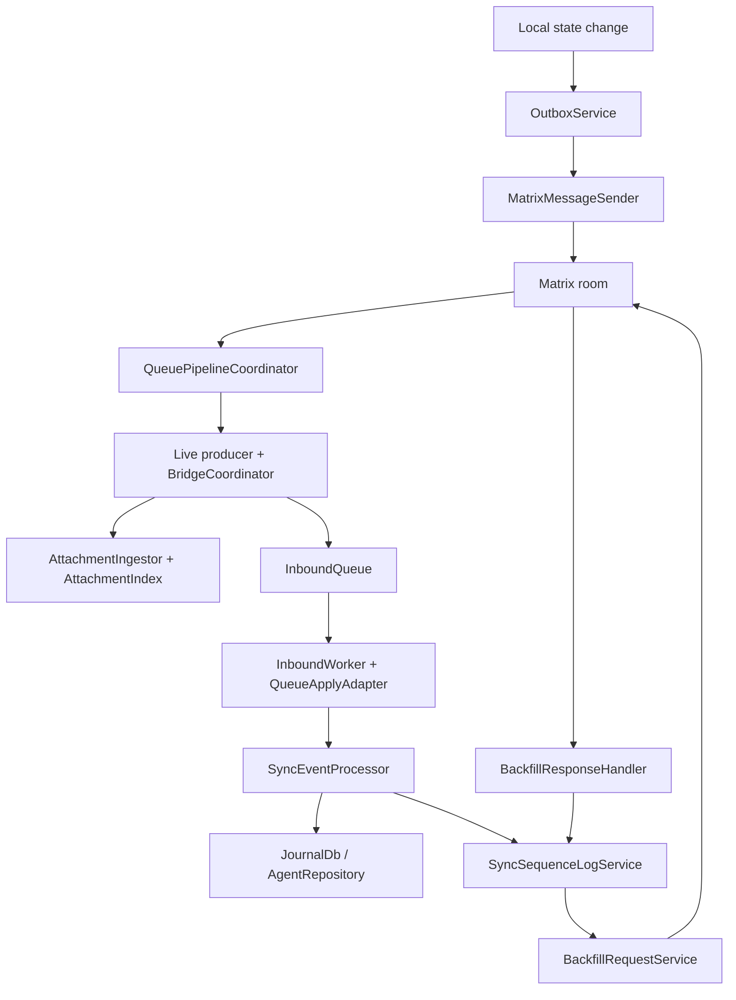
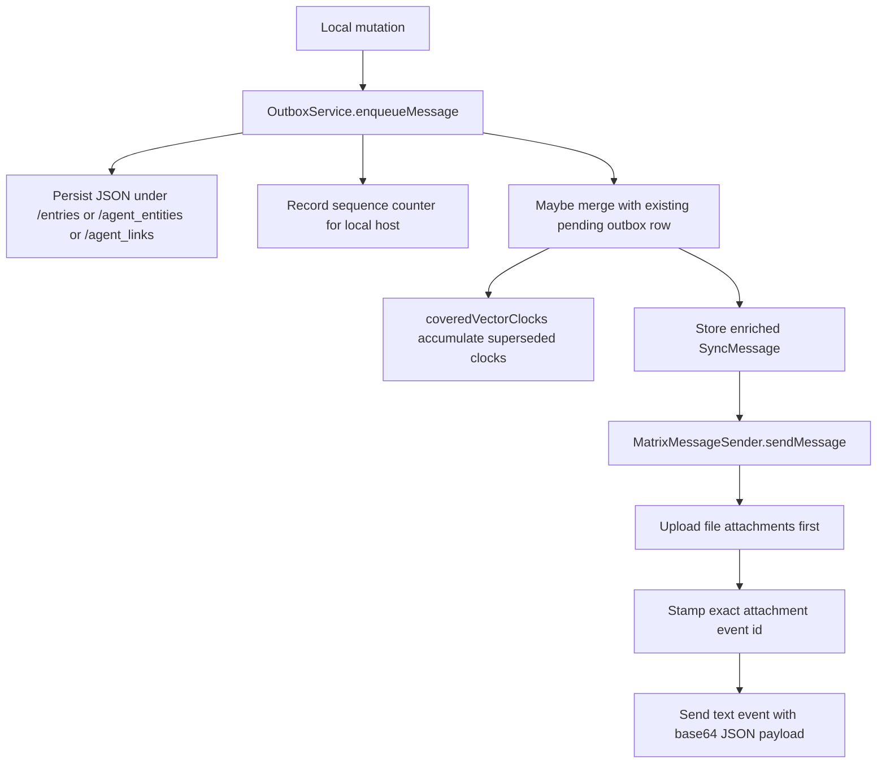
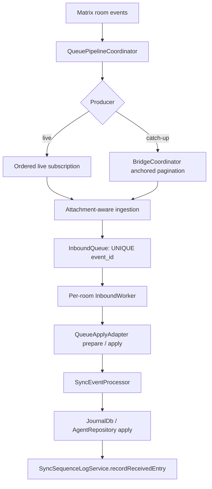
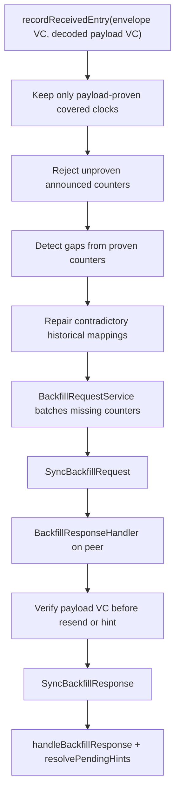
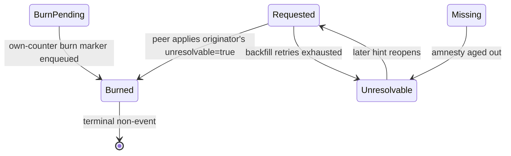
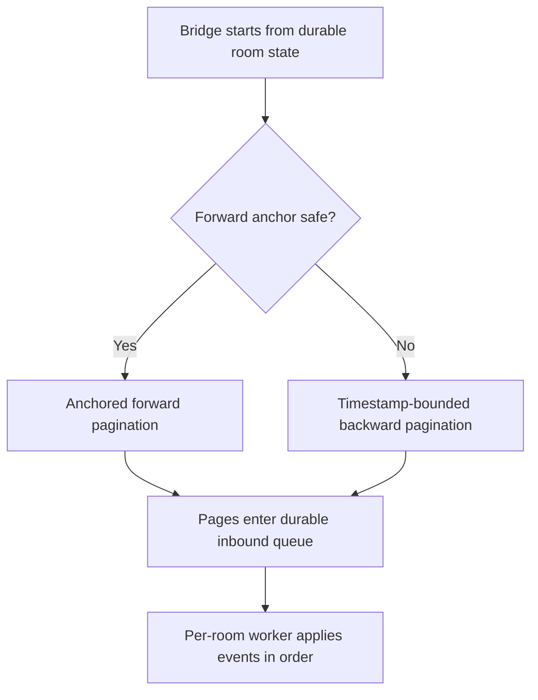
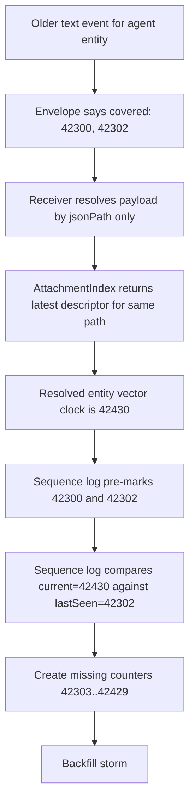
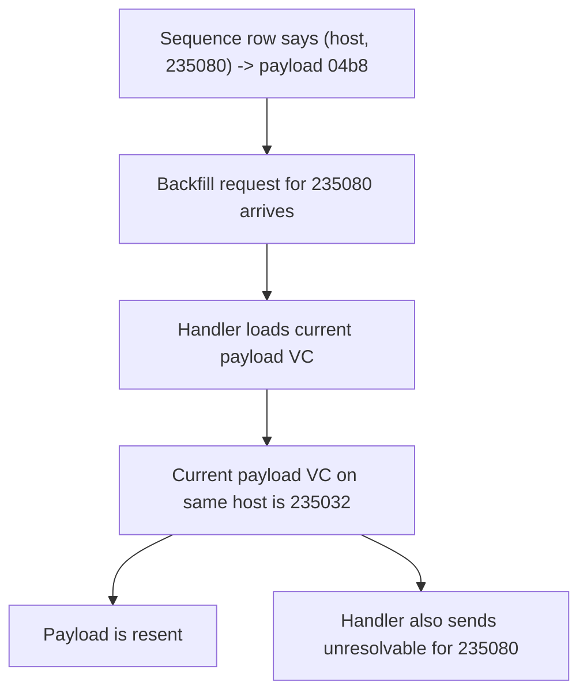

# Sync Current Architecture

## Scope

This document began as a code-and-log investigation on 2026-03-12. Its
executive diagrams, file map, core flows, and payload-generation findings were
refreshed against the queue pipeline and exact attachment protocol on
2026-08-06; sections that describe retired behavior are marked historical.

It is not a target architecture document. It is a map of the current system,
the recent fix history, and the code-backed failure surfaces that are relevant
to the investigation. The durable current receive-path map is
[Sync receive path](../../knowledge/features/sync/receive-path.md).

The user request behind this document is specific:

- desktop log volume is far too high for the amount of real work performed
- sync does eventually converge, but slowly
- some entries are reported missing or unresolvable when they should not be

The evidence used here comes from:

- `lib/features/sync/**`
- `test/features/sync/**`
- `logs/sync-2026-03-11.log`
- `logs/sync-2026-03-11_desktop.log`
- `logs/sync-2026-03-11_mobile.log`
- `logs/lotti-2026-03-12.log`
- recent sync PRs in March 2026

## Executive View

The main control loop is:

The important property is that sync is not just "send message, apply message".
It is a feedback system:

- normal sync writes sequence state
- sequence state can create missing entries
- missing entries produce backfill requests
- backfill responses can update or reopen sequence entries
- newer messages can mark older counters as covered

That makes it powerful, but also very easy to amplify mistakes.

## 2026-08-01 Sync Log Volume Update

A 17-day capture from `logs/` contained 377,795 timestamped entries and
82.55 MB of sync logs (about 22,400 entries/day). This was primarily telemetry
amplification, not a send loop:

| Category | Entries | Size | Share of bytes |
| --- | ---: | ---: | ---: |
| Outbound per-record bookkeeping | 267,789 | 65.22 MB | 79.2% |
| Gap detection and backfill | 41,497 | 7.63 MB | 9.3% |
| Inbound processing | 36,652 | 5.39 MB | 6.5% |
| Network send, retry and errors | 26,454 | 3.26 MB | 4.0% |

The five largest families were `sequence.recordSent`,
`prepare.ensureCovered`, `enqueueMessage`, `enqueue.merge` and
`outbox.enqueue`. Together they were repetitive per-record bookkeeping. They
now use counted sampling: a representative first line followed by summaries
with observed/suppressed/cumulative totals. This preserves comparisons between
enqueue inserts and merges, and between sequence writes and duplicate skips.

Two real work defects were separate from verbosity:

- Persistence and outbox bookkeeping attempted the same sequence binding
  49,406 extra times in the capture. A five-minute exact-binding LRU now skips
  the immediate duplicate database upsert while reporting it as a counted
  diagnostic.
- 213 of 223 bundle failures immediately followed `missingEntity`. The
  outbound bulk query had excluded soft-deleted journal rows, so legitimate
  tombstones looked absent and retried the whole bundle. Outbound lookup now
  includes deleted rows; a truly hard-purged child still aborts and remains
  visible through the retry/error path.

Backfill signal is intentionally retained. Actionable gaps, ranges, filtered
queued counts and request sends remain one-line-per-event. Only the repeated
no-work outcomes are counted samples (50 observations or 15 minutes), which
keeps initial-sync/backfill amplification diagnosable while removing routine
poll noise.

## Recent Fix Timeline

These PRs matter directly for the current behavior:

| PR | Date | Title | Relevant change |
| --- | --- | --- | --- |
| `#2749` | 2026-03-05 | `fix: sync hot loop & missing accounting` | added missing-accounting work, backfill cooldowns/rate limits, and agent sequence tracking |
| `#2752` | 2026-03-06 | `feat: improve population of sequence log` | population/backfill support extended to agent entities and agent links |
| `#2762` | 2026-03-07 | `feat: improve sync of agent data structures` | improved agent sync handling, startup population, self-request guard |
| `#2773` | 2026-03-09 | `fix: sync backfill issue` | old backfill requests stopped being skipped |
| `#2774` | 2026-03-09 | `fix: backfill logic & improved logging` | nearest-covering lookup, agent covered clocks, race-condition work, more logging |
| `#2784` | 2026-03-11 | `chore: sync timing tweaks` | faster request/response timing and larger backfill batches |
| `#2785` | 2026-03-11 | `refactor: improve logging` | more observability, not a behavioral change by itself |

That sequence matters. The system was recently changed in ways that:

- increased sequence-log coverage
- increased backfill aggressiveness
- increased agent sync participation in the same machinery
- deliberately re-enabled processing of historical backfill requests

## 2026-03-11 Stabilization Update

Since the first draft of this document, two targeted fixes have landed:

- exact backfill hits are now validated before resend, instead of trusting any
  `(hostId, counter) -> payloadId` row blindly
- the historical snapshot collector first replaced marker-missing full-snapshot
  replay with a bounded tail, then the queue migration removed that collector;
  current catch-up uses anchored forward or timestamp-bounded backward
  pagination into the durable inbound queue

The log evidence below is still useful because it explains why those changes
were necessary. The attachment-generation question that remained open in this
update was closed by the exact payload binding work described next.

## 2026-08-06 Payload Identity And Sequence Correctness Update

Current JSON-backed envelopes bind their text event to the Matrix event id of
the exact attachment generation uploaded for that send. The field is additive
and optional: current peers enforce it, while path-only envelopes from older
peers remain readable through the legacy compatibility path.

The correctness boundary now has four parts:

- the sender snapshots or retains the bytes claimed by the outbox row, uploads
  those bytes, and writes the returned event id into `attachmentEventId`;
- the receiver resolves that event id only, checks its declared path, and waits
  rather than falling back to a newer descriptor or mutable disk cache;
- exact journal sequence accounting accepts a mapping or covered clock only
  when the decoded payload vector clock proves the announced counter; and
- backfill validates payload existence and vector-clock coverage before a
  resend, while canonical exact payloads retire contradictory historical
  sequence bindings.

Focused regressions cover reordered generations, duplicate descriptor
observation, attachment delay, index rebuild after restart, stale event replay,
covered backfill hints, and optional-field mixed-version decoding. The detailed
runtime contracts live in the sync knowledge bundle linked from this document.

## 2026-03-12 Inbox And Logging Findings

The next log capture added a second, separate receiver-side problem: repeated
attachment work.

These facts are directly backed by `logs/lotti-2026-03-12.log` and the current
receive-path code:

- the general log reached about `124 MB` with `770045` lines
- sync-family domains accounted for `677159` lines, about `87.94%`
- `MATRIX_SYNC attachment.observe` alone contributed `244891` lines
- those observe lines covered only `7033` unique attachment event IDs, about
  `34.82` observations per attachment event on average
- `MATRIX_SYNC attachment.download` contributed `83963` lines for only `5244`
  unique paths, about `16.01` downloads per path on average
- `79123 / 83963` download lines were for `/agent_entities/...`

The relevant code path is straightforward:

- `AttachmentIngestor.process()` logged `attachment.observe` for every
  attachment event with `relativePath`
- the same method then scheduled download work immediately afterward
- `AttachmentIngestor._saveAttachment()` explicitly skipped existing-file
  dedupe for agent payload paths
- at the time of this capture, `MatrixStreamProcessor` remembered only `5000`
  recently seen event IDs for first-pass duplicate suppression, while the
  retired catch-up path could replay windows up to `10000`

That meant repeated replay waves could re-run the same attachment event's
observe/download/write path even when nothing new had arrived.

The latest stabilization pass now suppresses repeated processing for the exact
same attachment `eventId` unless the local file is missing or empty. That is a
real work reduction, not only a logging reduction. It does not yet solve the
separate stable-path causality question for different attachment events that
share the same agent payload path.

There is now also a logging-routing change:

- sync-family info logs no longer need to stay in `lotti-YYYY-MM-DD.log`
- direct domains such as `MATRIX_SYNC`, `MATRIX_SERVICE`, `OUTBOX`,
  `AGENT_SYNC`, `SYNC_SEQUENCE`, `SYNC_BACKFILL`, and logical `sync` are
  routed into `sync-YYYY-MM-DD.log`
- sync exceptions are still mirrored into the general log so failures remain
  visible outside the sync-specific file

That change is specifically about sink routing, not about reducing event
volume. The remaining work on signal coalescing and replay overlap is still
separate.

## Historical 2026-03-12 Signal Summary Diagnostics

The next receiver-side diagnostics pass changed how the retired live-scan
scheduler signals were observed.

These were facts about that pipeline at the time of the capture. They remain
useful as log-history context but do not describe the current queue receive
path:

- the receiver still has two overlapping signal sources:
  `MatrixStreamSignalBinder` listens to the client stream and also attaches
  live timeline callbacks
- the live timeline still wires all five callback types into the scheduler:
  `onNewEvent`, `onInsert`, `onChange`, `onRemove`, and `onUpdate`
- those callbacks still nudge catch-up or live-scan; the pass did not remove
  the underlying signal sources
- what changed is the logging shape:
  raw per-callback `signal.clientStream`, `signal.timeline`,
  `signal.catchup.coalesce`, and `signal.liveScan.coalesce` style lines are no
  longer the primary diagnostic surface
- `MetricsCounters` now keeps explicit counters for:
  client-stream signals, each timeline callback subtype, deferred/coalesced
  catch-up signals, deferred/coalesced live-scan signals, `signal.noTimeline`,
  and wake detections
- catch-up now logs one burst-level completion line with
  `catchup.done events=... signalSummary ...`
- live scan now logs one pass-level summary with
  `liveScan.summary afterSlice=... deduped=... processed=... latest=... signalSummary ...`
- the live-scan `signalSummary` includes:
  client-stream count, total timeline callback count, per-callback breakdown,
  deferred reasons, coalesced count, trailing-scan scheduling, and the latest
  signal-to-scan latency sample

This was a diagnostics restructuring, not a scheduler rewrite. Its purpose was
to preserve cause-and-effect data while removing hundreds of thousands of
individual callback log lines from the former hot path.

## 2026-03-12 Backfill Request Follow-up

The review of the first inbox/backfill performance pass found three concrete
regressions in the new re-request path, and all three have now been addressed.

The code-backed changes are:

- duplicate-request detection no longer looks only at `pending` outbox rows:
  `SyncDatabase.getPendingBackfillEntries()` now also includes `sending`
  entries, so a leased in-flight backfill request still suppresses a duplicate
- `processReRequest()` no longer stops when the oldest fetched page is fully
  filtered by "already queued"
- bounded automatic backfill likewise pages past a fully queued oldest page
  instead of repeatedly returning zero while newer missing rows remain behind it
- zombie-file sweep no longer concatenates untrusted `jsonPath` or derived
  agent-path strings directly onto the docs directory path
- sweep targets are now normalized and rejected if they resolve outside the
  docs directory

That means the current backfill request path has these guarantees that the
previous revision did not:

- "already queued" includes both queued and in-flight requests
- later missing/requested rows are still reachable even when the oldest page is
  saturated with already queued counters
- local zombie cleanup cannot delete arbitrary files outside the sync docs tree

## Observed Symptoms In The 2026-03-11 Logs

There are now three relevant artifacts:

- `logs/sync-2026-03-11_mobile.log`: about `409 KB`
- `logs/sync-2026-03-11_desktop.log`: about `9.5 MB`
- `logs/sync-2026-03-11.log`: combined capture, `24 MB`, `162811` lines

The combined log is the most useful one for pattern analysis because it shows
the repeated replay waves in one place.

Top combined categories observed:

- `processor.SyncEventProcessor`: `60529`
- `processor.apply`: `49134`
- `processor.resolve`: `18499`
- `backfill.response`: `10904`
- `sequence.backfillResponse`: `10014`
- `backfill.cooldownSkip`: `4702`
- `outbox.send`: `2292`
- `outbox.enqueue`: `1162`
- `backfill.found`: `995`
- `sequence.recordSent`: `946`
- `sequence.coveredClocks`: `796`
- `backfill.skipSelf`: `310`
- `sequence.gapDetected`: `268`

The asymmetry is still important:

- mobile is mostly producing work
- desktop/combined logs are dominated by processing, backfill response
  handling, and repeated sequence activity

That still points away from "sender just created too much" and toward
"receiver is doing too much with what it sees".

The biggest new symptom is that the same old event IDs are replayed in large
waves:

- `lotti-2911-1770920513575` appears at lines `95`, `32445`, `63568`,
  `91964`, `144091`
- each time it is immediately followed by
  `backfill.skipSelf: skipping own request (7 entries)`
- the next historical journal event also restarts from the same old event:
  `lotti-5479-1771763051862` at lines `97`, `32447`, `63570`, `91966`,
  `144093`

The replay batches are not small:

- lines `95..32444`: `11551` processing events
- lines `32445..63567`: `10649`
- lines `63568..91963`: `10463`
- lines `91964..144090`: `20508`
- lines `144091..end`: `7357`

That was large enough to overflow the then-current `5000`-event in-memory
dedupe in the stream processor. The queue pipeline now deduplicates durably on
the inbound queue's unique `event_id`.

## File Map

| Area | Files | Role |
| --- | --- | --- |
| Send path | `outbox/outbox_service.dart`, `matrix/matrix_message_sender.dart` | stage payloads, merge pending work, upload JSON and text events |
| Receive path | `queue/queue_pipeline_coordinator.dart`, `queue/bridge_coordinator.dart`, `queue/inbound_event_queue.dart`, `queue/inbound_worker.dart`, `queue/queue_apply_adapter.dart` | live ingestion, anchored catch-up, durable dedupe, retry, ordered processing |
| Receive diagnostics | `matrix/pipeline/matrix_stream_consumer.dart`, `matrix/pipeline/matrix_stream_processor.dart` | startup signal binding, Matrix Stats metrics, and apply-outcome diagnostics; not event ingestion |
| Attachment resolution | `matrix/pipeline/attachment_index.dart`, `matrix/pipeline/attachment_ingestor.dart` | retain exact generations by event id, preserve latest-by-path compatibility, and fetch/save payloads |
| Apply path | `matrix/sync_event_processor.dart` | decode messages, resolve payloads, upsert journal/agent state |
| Gap tracking | `sequence/sync_sequence_log_service.dart` | detect gaps, mark covered counters, resolve hints |
| Backfill request loop | `backfill/backfill_request_service.dart`, `backfill/backfill_response_handler.dart` | ask for and answer missing counters |
| Message model | `model/sync_message.dart`, `vector_clock.dart` | message schema and vector clock comparison |

## Core Flows

## 1. Send Path

### Relevant code

`OutboxService._enqueueAgentPayload()`:

- writes agent JSON to a stable path based on entity ID
- retains the serialized entity/link inline in the pending row as the claimed
  generation
- merges `coveredVectorClocks` only if the previous outbox row is still pending
- falls back to inserting a fresh row if the old row is no longer pending

`MatrixPayloadSender.enrichAndUploadAgentPayload()`:

- uploads the claimed inline JSON bytes rather than re-reading a sidecar that a
  newer enqueue may already have overwritten
- records the returned Matrix file event id as `attachmentEventId`
- for `SyncAgentEntity`, strips the inline payload after upload and keeps the
  exact event id plus `jsonPath`
- for `SyncAgentLink`, preserves the inline payload

Journal, notification, and outbox-manifest sends stamp the same exact id after
their successful uploads.

## 2. Receive Path

### Relevant code

`QueuePipelineCoordinator` subscribes to ordered live timeline events and owns
the durable queue worker. `BridgeCoordinator` runs single-flight catch-up from
the per-room marker: anchored forward pagination when the anchor is safe, or a
timestamp-bounded backward walk when it is not. Both producers append through
the same `InboundQueue`, whose unique `event_id` is the cross-producer dedupe
boundary.

`InboundWorker` drains one row at a time through `QueueApplyAdapter`, which
prepares file-backed payloads outside the writer transaction and applies them
through `SyncEventProcessor` inside the appropriate transaction.

`MatrixStreamConsumer` remains only as a startup-signal and metrics façade;
`MatrixStreamProcessor` records apply diagnostics. Neither owns ingestion.

`AttachmentIngestor.process()` records descriptors before companion payloads
are applied.

`AttachmentIndex` exposes two intentional views:

- exact `eventId -> Event` retains every observed generation for current
  envelopes
- latest `relativePath -> Event` remains for legacy path-only envelopes

An exact lookup also verifies the descriptor's normalized path. If the named
event has not arrived, prepare remains retryable and never reads a different
descriptor or the stable disk cache.

## 3. Gap Detection And Backfill

### Relevant code

For exact journal envelopes, `SyncSequenceLogService.recordReceivedEntry()`
does the work in this order:

1. update host activity
2. filter `coveredVectorClocks` against the decoded payload vector clock and
   pre-mark only proven counters
3. reject any announced counter the decoded payload cannot prove
4. detect gaps and upsert only proven `(hostId, counter)` records
5. repair historical bindings against the canonical local payload clock
6. resolve pending hints using the decoded payload clock

Legacy path-only envelopes keep the old single-clock behavior because the
receiver cannot prove which mutable sidecar generation it read.

### Terminal outcomes: `burned` vs `unresolvable` (Drift v24)

Every "we will never get a payload here" outcome used to collapse into a single
`unresolvable` status, which made the Backfill settings screen report mostly
clean vector-clock burns as if they were data loss. As of schema v24 the
terminal set is split:

- **`burned`** — the authoritative non-event. The originating host confirms one
  of its own counters carries no payload (a VC reservation released without a
  write, or a value superseded before being recorded), and a peer maps an
  incoming `unresolvable=true` backfill response to the same state because the
  originator is authoritative for its own counters. Terminal; never reopened.
- **`unresolvable`** — the receiver give-up. A `missing`/`requested` row that
  exhausted backfill retries or aged past the 7-day amnesty. Its payload may
  still exist on a peer, so it stays reopenable (`unresolvable -> requested` on
  a later hint, `unresolvable -> missing` via "ask peers again").

Both count as resolved for the contiguous-prefix watermark
(`SyncSequenceStatusX.isResolved`, mirrored as the SQL literals `IN (0, 3, 4, 5,
8)` in the watermark CTEs and the `idx_sync_sequence_log_resolved_host_counter`
partial index). The wire format is unchanged — a backfill response still carries
`unresolvable=true`; only the receiver's classification changed, so old and new
peers interoperate. See `README.md` (Sequence Log And Backfill) for the full
own-host lifecycle diagram.

The v24 migration is index-only: it does **not** reclassify the existing backlog
of `unresolvable`(5) rows, because their provenance (authoritative burn vs.
receiver give-up) was never stored, so an old burn cannot be told apart from a
genuine loss after the fact. Those rows keep status 5 — and the stats keep
bucketing them as unresolvable — until the existing "Ask peers again for
unresolvable" action (`resetAllUnresolvable`) flips them back to `missing` and
re-asks: an authoritative `unresolvable=true` answer then self-classifies as
`burned`, while a genuine loss retires back to `unresolvable`. So the burn/loss
split is exact for new traffic and settles the historical backlog only as the
user resets and the system re-converges. `burned`(8) is therefore the
"going-forward" bucket.

## Code-Backed Failure Surfaces

The sections below are not guesses without evidence. Each one is backed by
specific code and log behavior. The confidence level differs by item.

## Failure Surface 1: Room History Is Being Replayed In Large Waves

### What the code says

There are three relevant receive-side facts in the code.

#### Old backfill requests are intentionally still processed

In `sync_event_processor.dart`, startup timestamp filtering no longer skips old
backfill requests.

This change was introduced by PR `#2773` (`fix: sync backfill issue`), whose
behavioral summary is: old backfill requests are processed again instead of
being filtered out.

The tests lock this in:

- `test/features/sync/matrix/sync_event_processor_test.dart`
  contains `processes old SyncBackfillRequest even when startupTimestamp is set`

#### The legacy snapshot collector is no longer part of the receive path

The old `collectEventsForCatchUp` snapshot slicer and its
`CatchUpCollection` result type had no runtime callers and have been removed.
The queue pipeline now owns ingestion. `BridgeCoordinator` resumes from the
durable per-room marker with `collectForwardForBootstrap`; when that anchor is
unavailable or unsafe, it uses the timestamp-bounded
`collectHistoryForBootstrap` backward walk. Both paths stream pages into the
durable inbound queue instead of returning a detached timeline snapshot.

`MatrixStreamProcessor` is now a metrics and diagnostics adapter for database
apply outcomes. It no longer owns event or sync-id LRU dedupe sets.

### What the logs show

The combined log shows the same old event IDs recurring in five waves:

- `lotti-2911-1770920513575` at `95`, `32445`, `63568`, `91964`, `144091`
- `lotti-5479-1771763051862` at `97`, `32447`, `63570`, `91966`, `144093`
- `lotti-1398-1772247098914` at `2460`, `34787`, `65925`, `94321`, `118359`,
  `146433`
- `lotti-551-1772404042430` at `6337`, `38668`, `69802`, `103929`, `122236`,
  `150318`
- `lotti-1457-1772741602869` at `7228`, `39559`, `70693`, `104820`, `123127`,
  `151213`
- `lotti-2109-1772758819401` at `7258`, `39589`, `70723`, `104850`, `123157`,
  `151243`

The first event in each large wave is immediately followed by:

- `backfill.skipSelf: skipping own request (7 entries)`

The wave sizes are also much larger than the processor's `5000`-event dedupe:

- `11551`
- `10649`
- `10463`
- `20508`
- `7357` in the last partial wave

This is important because it proves the receiver is not only revisiting a few
old requests. It is replaying large slices of old room history.

**Historical note:** The removed snapshot collector first returned an entire
snapshot when its marker was missing, then used a bounded-tail fallback. The
large replay waves below describe that retired receive path and remain useful
as failure-history evidence; they do not describe the queue pipeline above.

### Why it mattered (pre-fix analysis)

The pre-fix code had a proven overhead source: when the catch-up marker was
missing, the entire snapshot was returned. The log evidence showed:

- old request traffic was intentionally still processed
- the same old event IDs were replayed in large waves (10k+)
- those waves were too large for the `5000`-entry LRU dedupe to suppress

The queue migration removed that snapshot replay mechanism entirely. Current
catch-up is bounded by the forward/backward pagination limits and streams into
the durable queue, whose ledger and monotonic marker advancement provide the
replay boundary.

### Confidence

High confidence that the retired snapshot collector caused the historical
waves. The current queue path should be evaluated through its pagination
bounds, durable ledger, and marker invariants instead.

## Failure Surface 2: Agent Payload Generation Mismatch — Resolved For Exact Envelopes

This was a strong candidate for one class of false gap storms. The mechanism
and log evidence below describe the path-only protocol before
`attachmentEventId`; they are retained as failure history, not as the current
exact-envelope contract.

### Historical mechanism

#### Stable path reuse for agent entities

`relativeAgentEntityPath()` in `lib/utils/file_utils.dart` returns:

- `/agent_entities/<id>.json`

That means repeated updates to the same agent entity reuse the same file path.

`OutboxService._enqueueAgentPayload()` writes agent payload JSON to that stable
path before enqueueing the message.

#### Agent text events can be file-only

`SyncMessage.agentEntity` has:

- `agentEntity`
- `jsonPath`
- `originatingHostId`
- `coveredVectorClocks`

It does **not** have its own top-level vector clock field.

`MatrixMessageSender._enrichAndUploadAgentPayload()` then strips inline payload
for `SyncAgentEntity`:

- uploaded file first
- returned message keeps `jsonPath`
- returned message sets `agentEntity: null`

So the receiving text event for an agent entity can carry:

- `jsonPath`
- `coveredVectorClocks`
- `originatingHostId`

but **not** the actual payload vector clock inline.

#### Receiver resolved by latest attachment for that path

`AttachmentIndex.record()` stores the last-seen attachment event for a path.

`SyncEventProcessor._fetchFromDescriptor()` looks up the descriptor only by
normalized `jsonPath`:

- `index.find(indexKey)`

There is no binding between:

- a specific text event
- and the exact attachment event that was uploaded for that text event

#### Sequence logging uses the resolved entity vector clock

For agent entities, `SyncEventProcessor` records sequence state using:

- `resolvedEntity.vectorClock`

not a vector clock from the text envelope.

That means the sequence log trusts whatever JSON version `_resolveAgentEntity()`
returned.

### What the logs show

The mobile log shows the same agent entity
`da28f3a4-050b-4516-a141-0f6296c19a72` sent three times:

- `17:00:02.625`
- `17:00:59.009`
- `17:03:22.766`

The mobile sequence log records counters for that same entity:

- `42300`
- `42302`
- `42328`
- `42430`

The desktop log shows the same entity being processed three times at matching
event times:

- text event around `17:00:02.811`
- text event around `17:00:59.181`
- text event around `17:03:22.943`

For the first desktop receive:

- `coveredVectorClocks` logged only `42300` and `42302`
- immediately after that, the receiver reports a large gap from `42302` to
  `42430`

That exact combination is only possible if the current vector clock seen by the
sequence log is already `42430` while the envelope still only covers the older
versions.

### Why this mattered

This is the exact synthetic-gap mechanism:

This is not just a vague idea. The mechanism was explicitly permitted by the
old path-only code shape.

### What the investigation proved before the fix

Proven by code:

- same agent entity path is reused across versions
- latest attachment wins in the index
- agent text events can be file-only
- sequence logging uses the resolved payload vector clock

Strongly supported by logs:

- the first receive of `da28...` behaves exactly like "old envelope + newer
  resolved payload"

Not yet proven:

- whether this is the only dominant source of false gaps across the whole log
- whether journal payloads hit a similar issue in a different form

### Current invariant

Current agent send rows retain their claimed inline bytes until upload. The
sender uploads those bytes, stamps the returned Matrix event id, and only then
strips a large entity from the text envelope. The receiver resolves that exact
event id, verifies its path, and records sequence state from the decoded entity
clock. A newer descriptor or disk sidecar at the same path is not eligible.

The old failure is therefore closed when the envelope contains
`attachmentEventId`. A legacy path-only envelope still uses latest-by-path and
disk fallback so old peers remain compatible; that compatibility path cannot
offer the new causal guarantee.

## Failure Surface 3: Attachment Latest-By-Path Identity — Split Into Exact And Legacy Views

This historical mechanism is related to Failure Surface 2 but worth separating.

### Historical mechanism

`AttachmentIngestor` treats agent payload files as legitimately mutable in
place and always re-downloads them.

Its queueing logic is also keyed by normalized relative path.

That means the attachment layer itself is optimized around "latest file for
this path", not "exact file version that belonged to this text event".

### Why it mattered

Even if the direct descriptor lookup were not enough on its own, the rest of
the attachment handling is reinforcing the same identity model:

- path identifies the payload
- latest descriptor for that path is authoritative

That is a sensible design for cache freshness, but it is dangerous if the text
event is supposed to be causally paired with one exact descriptor generation.

### Current invariant

`AttachmentIndex` now retains every valid descriptor by Matrix event id while
also keeping the newest descriptor by normalized path. Exact envelopes use only
the first view. Duplicate observation of one event id is idempotent; reordered
events at the same path remain individually addressable. After an app restart,
an exact payload whose descriptor has not yet been rebuilt stays retryable until
catch-up observes that event. It never falls through to a newer path descriptor
or existing disk cache.

Latest-by-path remains intentionally available only for legacy envelopes that
do not carry an exact id. That is the mixed-version rollout limit, not the
identity model for current peers.

## Failure Surface 4: Contradictory Backfill Answers — Resolved

### Historical mechanism

`BackfillResponseHandler._processBackfillEntry()` first does an exact lookup:

- `getEntryByHostAndCounter(hostId, counter)`

That lookup is just a direct DB read through:

- `SyncSequenceLogService.getEntryByHostAndCounter()`
- `SyncDatabase.getEntryByHostAndCounter()`

If the row exists and has an `entryId`, the handler treats it as a candidate
answer source and continues.

For agent entities, `_processAgentBackfillEntry()` then:

1. loads the payload by `payloadId`
2. enqueues that payload to send again
3. checks whether the payload's current vector clock contains the requested
   `(hostId, counter)`

If the current VC is behind the requested counter for our own host,
`_sendHintOrUnresolvable()` sends an `unresolvable` response.

### What the logs show

The combined log proves that this situation is really happening.

Concrete sequence:

- line `68`: local send recorded
  `counter=235080 entryId=04b8b458-4775-4ded-bb76-67bc8bfe6594`
- line `213`: local send recorded
  `counter=235082 entryId=09280a33-da27-4956-90d1-c8dea88f75f9`
- line `63549`: backfill exact lookup finds
  `235080 -> 04b8b458-4775-4ded-bb76-67bc8bfe6594`
- line `63550`: when resending that payload, the current exact counter on the
  same host is logged as `235032`
- line `63552`: handler logs
  `backfill.vcBehind ... counter=235080 ... vcCounter=235032`
- line `63554`: handler sends `unresolvable`
- line `63560`: exact lookup finds `235082 -> 09280a33-da27-4956-90d1-c8dea88f75f9`
- line `91957`: handler logs
  `backfill.vcBehind ... counter=235082 ... vcCounter=235079`
- line `91959`: handler sends `unresolvable`

The same pattern repeats later:

- `142913` / `142917` / `142919`
- `142923` / `142924` / `142926`

This is not only a log artifact. The combined log also shows that newer
receives are recording covered clocks for those same payload IDs:

- `60700`, `88679`, `139626`:
  `04b8b458-...` covers `{..., 6d4abd...: 235080}`
- `142893`, `142945`:
  `09280a33-...` covers `{6d4abd...: 235084}`

So there are rows in the sequence log that still map an old exact counter to a
payload whose current VC is already somewhere else.

### Why this mattered

This is a real correctness break, not only overhead.

It proves all of the following:

- the sequence log can contain `(hostId, counter) -> payloadId` mappings that
  no longer match the payload's current VC
- backfill request handling trusts those rows enough to answer from them
- the handler can then discover that its own answer source is invalid and emit
  `unresolvable`

What was not proven by the historical logs:

- whether the inconsistent row comes from stale hints being preserved too long
- whether it is downstream of the agent path/descriptor mismatch in Failure
  Surface 2
- whether there is another sequence-log update bug for agent entities

But the contradiction itself is proven.

### Current invariant

An exact sequence row is only an answer candidate after the responder loads the
payload and distinguishes three cases:

- a missing payload reaches its per-type `deleted` handling;
- a present payload with no vector clock, a missing host axis, or a counter
  behind the request is rejected before any resend; and
- a payload that proves the counter may be resent, with a hint when its clock
  is ahead because it supersedes the requested version.

For an authoritative own-host rejection, the responder sends only
`unresolvable`; it never sends the unproven payload alongside that terminal
answer. For a foreign-host rejection, it searches later resolved rows and
accepts only a candidate whose loaded payload clock covers the requested
counter. If none does, it stays silent so another peer can answer.

On the receive side, a hint arriving before its file-backed payload is stored
durably. The later exact payload resolves it only with the decoded payload
clock. Canonical exact journal apply also retires historical rows bound beyond
that clock: resolved rows become reopenable `unresolvable`, actionable rows keep
their status, and every repaired row loses the contradictory payload/path hint.

## Failure Surface 5: Duplicate And Stale Journal Sequence Churn — Bounded By Payload Proof

### Historical mechanism

`SyncEventProcessor` still calls `recordReceivedEntry()` for journal entities
in three important cases:

- stale descriptor path
- duplicate path
- normal applied/existing path

This is deliberate. The code comment says duplicates still need sequence-log
processing so `resolvePendingHints()` can run.

Inside `recordReceivedEntry()`, the sequence service still:

1. pre-marks covered clocks
2. detects gaps
3. upserts `(hostId, counter)` rows
4. resolves pending hints

So replayed duplicates are not cheap no-ops.

### What the logs show

The combined log is dominated by one old journal entity:

- `id=07b703a4-628a-55ed-9c24-de412053089c` appears `14055` times

The same covered-clock triplets repeat across replay waves:

- `190809`
- `195534`
- `204889`

Examples:

- `6106..6112`, then `7230..7287`
- `38437..38443`, then `39561..39618`
- `69571..69577`, then `70695..70752`
- `103698..103704`, then `104822..104879`
- `122005..122011`, then `123129..123186`
- `150086..150093`, then `151215..151272`

That proves the replay waves are repeatedly re-running covered-clock handling
and not merely dropping old events at the edge.

### Why this mattered

This is the bridge between Failure Surface 1 and the rest of the damage.

If large history replays only logged and returned, the system would still be
slow, but it would be much less dangerous. Instead, replayed duplicates keep
touching the sequence log, which means:

- repeated covered-clock processing
- repeated hint resolution attempts
- repeated opportunities to reopen or mutate missing/backfill state

### Current invariant

Journal duplicates still enter sequence accounting because a replay may resolve
a pending backfill hint. Exact envelopes no longer trust the announced clock by
itself, however. Covered clocks are accepted only when the decoded attachment
clock covers them, and an announced counter beyond that decoded clock is
rejected before gap detection or mapping. Replaying the same stale exact event
therefore produces no synthetic gaps; rebuilding the service after restart does
not change that result.

The canonical local journal clock also drives the historical mapping repair on
every exact apply. Duplicate repairs are idempotent because retired rows have
already lost the payload binding. Legacy path-only events retain the historical
single-clock behavior for compatibility and remain the rollout boundary.

## Implementation Note: `startupTimestamp` Is Now Misleading

This is not the main bug, but it matters because it can mislead future
debugging.

`SyncEventProcessor.startupTimestamp` is still documented as:

- "events with backfill requests older than this are skipped"

But the field is no longer used for that behavior, and the tests explicitly
assert the opposite:

- old backfill requests are still processed
- old backfill responses are still processed

### Confidence

High confidence that the comment/field contract is stale and should be cleaned
up to match reality.

## Test Coverage Map

The focused invariant coverage now includes:

- payload sender tests that prove a claimed older agent generation is uploaded
  even after the stable sidecar advances, and that the returned file-event id
  is stamped into journal, notification, agent, and bundle envelopes;
- attachment-index and processor tests for reordered generations, duplicate
  observation, exact path validation, missing-descriptor retry, and no fallback
  to a newer descriptor or disk cache;
- restart coverage showing an exact event remains pending until catch-up
  rebuilds its referenced descriptor;
- sequence/database regressions proving an unproven announced counter and its
  unproven covered clocks create no gaps or mappings, while historical
  contradictory bindings retire idempotently;
- backfill tests proving null/behind payload clocks are rejected before resend,
  verified covering candidates are used, and no payload is emitted alongside
  an authoritative `unresolvable`; and
- an integration flow where a hint arrives before its exact payload, the
  decoded payload rejects a corrupt ahead envelope clock without synthetic
  gaps, and replay remains idempotent after recreating the sequence service.

Mixed-version model tests cover every file-backed variant with and without the
optional exact id. The loader test also locks in the intentional limitation:
legacy path-only envelopes remain readable but select the current path/cache
generation rather than gaining an exact guarantee retroactively.

## Summary

The current sync system has three important truths at the same time:

1. the intended model is reasonable: ordered replication plus vector-clock
   dominance plus backfill
2. the actual implementation is a tightly coupled feedback loop where small
   causality mistakes can be amplified into missing-counter storms, so payload
   proof is enforced at each boundary
3. the investigation identified and closed four runtime hazards:
   - **Large room-history replay waves** — the legacy snapshot collector was
     first bounded and later removed when ingestion moved entirely to the
     durable queue pipeline.
   - **Mutable-path payload identity** — current file-backed envelopes name the
     exact attachment event and receivers never substitute another generation.
   - **Unproven sequence mappings** — exact journal accounting uses the decoded
     payload clock, filters covered clocks, and retires contradictory history.
   - **Contradictory backfill answers** — responders validate the loaded payload
     before resend and never pair an unproven payload with `unresolvable`.

The remaining rollout limitation is explicit rather than accidental: an older
peer omits `attachmentEventId`, so a current receiver must use the path-based
compatibility contract for that envelope. Exact causality is guaranteed only
once the sending peer emits the additive field. Current envelopes remain
decodable by older generated parsers because the field is optional/additive,
but an old receiver naturally cannot enforce a field it does not understand.
