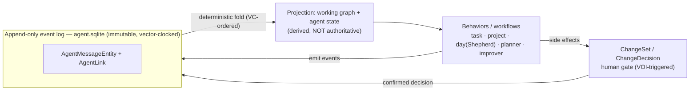
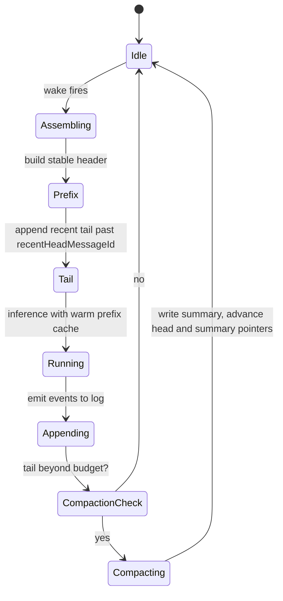
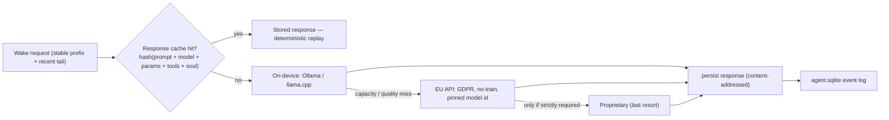
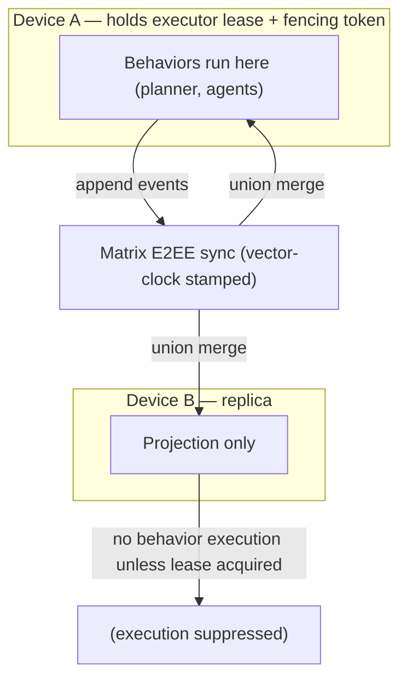

# Daily OS AI Runtime — Architecture Vision

**Status:** Draft / design proposal · **Date:** 2026-05-30 · **Scope:** the AI/agent runtime behind Daily OS (cross-cuts `features/agents`, `features/daily_os_next`, `features/sync`, `features/ai`).

> This is a vision-and-architecture document, not an implementation record. It proposes how Lotti's agent runtime evolves from independent per-entity agents into a coherent *executive-assistant* runtime that manages the user's attention over a long horizon. It is grounded in two things: (1) what the codebase actually is today, and (2) a verified literature review (see [Research & Literature](#research--literature) below). Where it proposes new structure, it names the real Lotti types it would extend.

---

## 1. The vision

An **executive assistant, not a secretary.** A secretary records and reminds. An assistant *manages your attention*: it prepares a max-impact schedule, says "no" on your behalf, holds standing agreements, and reflects reality back without flattering you — *"you said you'd do X; here's what you actually did; what are we doing about it?"*

Concretely, the target runtime should:

- Let **per-task and per-project agents negotiate with a central planner** for the user's scarce time, rather than each acting in isolation.
- Honor **standing non-negotiables** (e.g. "gym 3×/week", allowed to pre-empt other commitments) *and* day-to-day priorities, and **ask the user only when it genuinely matters**.
- Let a **project in a given phase request recurring attention on its own** (e.g. a monitoring phase asking for "15 min once a week").
- Grow a **long horizon** without babysitting: stateless agent wakes, each handed `older → summary` + `recent → verbatim`, writing onto an append-only log. *"The agent is the log."*
- Track **long-term outcomes** (fitness, hours, money) and **nudge against drift** — proactively, but never naggingly.
- Run **on-device first**, fall back to **EU-hosted GDPR-compliant inference**, and use proprietary models only if strictly required — behind a **vendor-agnostic, native-Dart** architecture.
- Keep it **simple**. The infrastructure that makes this hard is largely already built; the work is mostly *additive*.

---

## 2. The thesis

**Lotti is already the substrate that the agentic-systems literature is converging on — an event-sourced, vector-clocked, multi-device-synced, federated typed-edge graph.** The structural anchor for this claim is Nakajima's *The Log is the Agent* (arXiv [2605.21997](https://arxiv.org/abs/2605.21997), May 2026): make the append-only event log the source of truth, treat the working graph as a *deterministic projection* of that log, and let behaviors react to typed-edge changes and emit new events. Lotti's `AgentMessageEntity` log + `AgentLink`/`EntryLink` typed edges + `vector_clock.dart` are the closest production-shaped instance of exactly that design.

The paper explicitly leaves **two problems unresolved**: multi-agent contention over the shared graph, and compaction/checkpointing of long logs. **Those two gaps are precisely the work this document specifies** — and Lotti already has dormant scaffolding for one of them and a mature human-gate for the other.

The architecture gap therefore reduces to **two additive moves**:

1. **Make agent-derived state a projection of the log, not a synced mutable row.** Today some agent state (`AgentStateEntity` pointers, etc.) is stored and synced as authoritative last-write-wins rows. Treating it as a *recomputed projection* of the immutable log shrinks the multi-device conflict surface to conflict-free facts.
2. **Add negotiation / project-phase / outcome as new node+edge *types* plus a planner behavior** — reusing the existing `ChangeSet`/`ChangeDecision` human gate and `WakeOrchestrator`. No new orchestration subsystem.

Everything below is an elaboration of those two moves.

---

## 3. What exists today (this is an evolution, not a greenfield)

The useful unit of work is the *delta* from what's already shipped. The following are real and load-bearing (see [`features/agents/README.md`](../lib/features/agents/README.md) and [`features/daily_os_next/README.md`](../lib/features/daily_os_next/README.md)):

| Capability | Where it lives today | Status |
| --- | --- | --- |
| Immutable, append-only agent message log | `AgentMessageEntity` in `agent.sqlite`, with `prevMessageId` causal links | **Built** |
| Federated typed-edge graph | `EntryLink` (3 journal variants) + `AgentLink` (13 agent variants incl. `messagePrev`, `agentTask`, `agentProject`, `captureToPlan`) crossing into journal entities by stable UUID | **Built** |
| Multi-device sync | `AgentSyncService` over Matrix (E2E-encrypted), vector-clock stamped, outbox-buffered | **Built** |
| Causal ordering + conflict primitive | `vector_clock.dart` — four-way `VclockStatus` (`equal`/`concurrent`/`a_gt_b`/`b_gt_a`), element-wise-max `merge`; LWW-by-`updatedAt` for presence-style state | **Built** |
| Stable-prefix prompt assembly | `TaskAgentWorkflow` orders wake prompts "stable-first … byte-identical across wakes" so a prompt-prefix cache can restore them | **Built** |
| Human gate (propose → decide) | `ChangeSetEntity`/`ChangeDecisionEntity`, proposal ledger, agent self-retraction, confirmation service | **Built** |
| Wake orchestration | `WakeOrchestrator`: dedup, single-flight per agent, 120 s throttle, **vector-clock self-suppression**, deferred + scheduled wakes | **Built** |
| Day planning | `DayPlanEntity`/`DayPlanData`/`PlannedBlock`, `draft → agreed → committed`/`needsReview`, **capacity + energy bands**, Capture/Reconcile/Draft/Refine (`Shepherd` day agent) | **Built** |
| Provider abstraction | `ProfileResolver` resolves an inference profile per wake; same template routes through different providers (ADR 0008) | **Built** |
| Souls (personality) | `SoulDocumentEntity` with structured `voiceDirective`, `toneBounds`, `coachingStyle`, **`antiSycophancyPolicy`** | **Built** |
| Wearable / health ingestion | `HealthService` + `health_import` → synced `QuantitativeEntry`/`WorkoutEntry` (Apple Health / Google Fit: steps, workouts, HR, BMI, BP) | **Built** |
| Memory compaction | `AgentMessageKind.summary`, `summaryStart/EndMessageId`, `summaryDepth`, `recentHeadMessageId`, `latestSummaryMessageId` | **Scaffolding only — never written by production** |

**Genuinely missing — the real work:**

1. **Cross-agent negotiation / arbitration for attention.** Agents read each other's distilled reports (a task agent can consume a sibling's `tldr`; a project agent reads task-agent TLDRs) but never *bid* for the user's time or resolve conflicts. *(→ Thread A, G)*
2. **Project-phase model + recurring time-requests.** No phase concept; time budgeting is per-category/day, not "this project's monitoring phase wants 15 min weekly." *(→ Thread A, F)*
3. **The active compaction pipeline** that turns the dormant summary scaffolding into a real stable prefix and long-horizon memory. *(→ Thread B, C)*
4. **Outcome tracking / actual-vs-intended loop.** `WakeRunLog` and ratings exist, but nothing closes the "you said X, you did Y" loop. *(→ Thread E, F)*

---

## 4. The substrate: log → projection → behavior

The runtime is one loop. The **append-only event log** (`AgentMessageEntity` + `AgentLink`, vector-clock stamped) is the source of truth. The **working graph and all agent state are a deterministic projection** of that log. **Behaviors** (the existing task/project/day workflows, plus a new planner) react to projected changes and emit new events. Side-effecting outputs pass through the existing `ChangeSet` gate before they re-enter the log as committed facts.



**Move 1 — state as projection.** Today `AgentStateEntity` is a synced mutable row; under concurrent multi-device edits it is a last-write-wins conflict surface. The target is that *agent-derived* state (head pointers, slots that summarize log position) is **recomputed from the log** rather than trusted as authoritative replicated state. Genuinely *user-authored* mutable documents (souls, templates) keep last-write-wins — and Lotti already has the right pattern for them: immutable **`Version`/`Head` snapshots** (`SoulDocumentVersionEntity`/`SoulDocumentHeadEntity`, `AgentTemplateVersionEntity`/`Head`). Generalize the snapshot pattern; don't invent it. This is corroborated by Anthropic's finding that long-running-agent cold-start state is best *reconstructed from durable artifacts*, not trusted to compacted in-context state ([Effective harnesses for long-running agents](https://www.anthropic.com/engineering/effective-harnesses-for-long-running-agents)).

**Move 2 — negotiation/phase/outcome as types + a planner behavior.** New `AgentDomainEntity` variants and `AgentLink` types carry attention-requests, bids, project phases, and outcomes; a single **planner behavior** consumes them and emits a `ChangeSet`. This is structurally Hayes-Roth's *meta-level controller over a blackboard* — see §5.

---

## 5. Attention negotiation (the contention layer the anchor leaves open)

**Lotti is already a blackboard system in disguise:** the append-only log is the event source, the projected typed-edge graph is the shared blackboard, and per-task/per-project/day agents are the knowledge sources writing to it. What's missing is Hayes-Roth's separate **meta-level control mechanism** that treats *arbitration itself as a planning problem* ([A Blackboard Architecture for Control, Hayes-Roth 1985](https://www.semanticscholar.org/paper/A-Blackboard-Architecture-for-Control-Hayes-Roth/c79a41dc13c796c26388f8cbf599c67126374e39)).

Design:

- **Bids are events, not RPCs.** A task/project agent emits an `attention_request` event carrying impact, priority, deadline-slack, energy-fit, and (for recurring asks) a cadence. Modeled as new `AgentDomainEntity` + `AgentLink` variants on the existing synced graph. The message shape follows the **Contract Net Protocol** (call-for-proposals → bid → award → inform) ([CNP](https://en.wikipedia.org/wiki/Contract_Net_Protocol)).
- **No auction incentive-compatibility needed.** Every bidder is a sub-agent of *one* principal (the user), so Vickrey-style truthful-bidding machinery collapses to a **centralized utility ranking** with agents as honest preference reporters. (Auction theory — [Shoham & Leyton-Brown ch. 11](https://www.cambridge.org/core/services/aop-cambridge-core/content/view/1AFB25EC9CC4799BC455409B2EB37C43/9780511811654c11_p315-366_CBO.pdf/protocols-for-multiagent-resource-allocation-auctions.pdf) — also warns that expressive/combinatorial winner-determination is computationally hard, arguing for a *bounded heuristic* arbiter rather than optimal allocation.)
- **The planner is a behavior, and its output is a `ChangeSet`.** It projects a candidate `DayPlan` (reusing capacity + energy bands), ranks requests by utility, and routes the result through the existing human gate. The `Shepherd` day agent's `propose_plan_diff` → `ChangeSet` → accept/revert path is the existing mechanism to reuse.
- **Non-negotiables are NOT enforced by prompting.** Recent LLM-planning work shows hard constraints are "neither guaranteed nor enforced" by instruction alone and must be checked by a deterministic verifier ([U-Define, arXiv:2605.02765](https://arxiv.org/html/2605.02765v1)). So standing non-negotiables (gym 3×/week, with pre-emption) become a **declarative hard-constraint check run deterministically over the projected graph** during the `draft → agreed` transition. Soft daily priorities stay heuristic/LLM-scored.
- **"Ask when in doubt" = value-of-information.** Interrupt the user only when the expected value of their answer exceeds the cost of interrupting ([Sarne & Grosz 2013](https://link.springer.com/article/10.1007/s10458-012-9206-9)). The `DayPlan` (capacity/energy bands) is the "scheduler module" the VOI computation queries; recent `ChangeDecision` accept/reject history is the receptivity/fatigue signal. Low-VOI conflicts auto-resolve and are merely logged; high-VOI conflicts raise a `ChangeSet`.

```mermaid
sequenceDiagram
  participant Agent as Task / Project agent
  participant Log as Event log
  participant Planner as Planner behavior
  participant Verify as Non-negotiable verifier
  participant User
  Agent->>Log: emit attention_request (impact, deadline-slack, energy-fit, cadence)
  Log-->>Planner: projection updates with open requests
  Planner->>Verify: candidate DayPlan vs hard constraints
  Verify-->>Planner: violations (if any)
  Planner->>Planner: rank by utility; compute VOI
  alt VOI > interruption cost
    Planner->>User: ChangeSet (proposed schedule / conflict)
    User-->>Log: ChangeDecision (accept / reject)
  else low VOI
    Planner->>Log: auto-resolve + logged rationale
  end
  Planner->>Log: award -> PlannedBlock(s) on the DayPlan
```

### Project phases & recurring time-requests

A project gains a **phase** (e.g. `active`, `monitoring`, `paused`), modeled as project state in the graph. A phase can carry a **standing recurring request** ("monitoring → 15 min weekly"), emitted by the project agent as a recurring `attention_request`. The planner treats these like any other bid, but with a cadence the deterministic verifier can enforce as a soft floor. This is the literal mechanism for the user's "the project should ask for that itself."

---

## 6. Long-horizon memory: the compaction pipeline

The dormant scaffolding maps almost 1:1 onto the proven MemGPT/Letta mechanism ([MemGPT, arXiv:2310.08560](https://ar5iv.labs.arxiv.org/html/2310.08560)): `AgentMessageKind.summary` is the recursive-summary node; `summaryStart/EndMessageId` is provenance for the evicted range; `recentHeadMessageId` is the verbatim-tail boundary; `latestSummaryMessageId` lets a stateless wake reconstruct context as **frozen-summary + recent-tail** — the same cold-start shape Anthropic reaches via durable progress files.

The pipeline (a background behavior, not on the hot path):

1. When the tail past `recentHeadMessageId` exceeds a model-specific budget, summarize that range into a new `summary` message that **folds in the prior `latestSummaryMessageId`**.
2. Advance both pointers. Preserve decisions, open commitments/negotiations, and non-negotiables; discard redundant tool chatter (per [Anthropic context engineering](https://www.anthropic.com/engineering/effective-context-engineering-for-ai-agents): "overly aggressive compaction … loses subtle but critical context").
3. **Treat the summary as a derived projection, not a destructive overwrite.** Make it deterministic/content-addressed so two devices summarizing the same range *converge* instead of racing under LWW (see §8). Store a verification/replay hash so a bad summary is detectable and regenerable from the immutable log.



This compaction is also what makes the **on-device prefix cache** pay off (§7): the rolling summary is a long-lived stable prefix, the recent tail is the volatile suffix.

---

## 7. Inference tiers and the two caches

### Tier ladder (vendor-agnostic, behind one adapter)

On-device first (Ollama / llama.cpp today), EU-hosted GDPR-aligned API second, proprietary only if required. The EU tier has standardized on an **OpenAI-compatible surface** across Mistral, OVHcloud, Scaleway, Nebius, and IONOS, so providers are swappable behind a thin adapter — which maps directly onto Lotti's existing `ProfileResolver` / inference-profile system (ADR 0008). Because open-weight families overlap between local and cloud, the *same* model family can spill from device to EU endpoint with comparable behavior.



The remote tier sits **outside the Matrix sync trust boundary**: only the durable, vector-clocked *results* of EU calls are written to `agent.sqlite` and replicated, so provider choice never weakens the multi-device encryption model. Every message that triggered a remote call must persist the exact **provider + pinned model id + parameters** — version-pinning is load-bearing for replay (§below).

### The two caches must not be conflated

This is the distinction the user personally flagged (the "why isn't the KV cache keyed by message ID" question), and the architecture is fragile to getting it wrong:

> **The KV cache reuses computation within one forward pass and is prefix/position-bound and backend-internal; the response cache reuses whole outputs across runs and devices, is content-addressed, and is the layer Lotti implements for forkable, auditable, sync-replayable runs.**

- **(a) Application-level response memoization — the layer Lotti owns.** `hash(rendered prompt + pinned model id + decoding params + resolved tool set + soul config) → stored response`, persisted alongside the immutable log and looked up *out of order* by request hash. Provider-agnostic (identical whether Ollama or an EU endpoint), it is the **determinism boundary** for any non-local tier and the mechanism the anchor paper's deterministic replay and cheap forking depend on. This is the realizable version of "key = the request, value = the response."
- **(b) Model-level KV/prefix cache — backend-internal, not Dart-controllable beyond prompt construction.** It is prefix- and position-bound for a hard reason: a token's keys/values depend on all preceding tokens (vLLM keys blocks by `hash(prefix + block tokens)`, [vLLM APC](https://docs.vllm.ai/en/v0.7.3/design/automatic_prefix_caching.html)), and RoPE bakes absolute position into each key, so the same text at a new position yields different KV unless re-encoded ([Block-Attention, arXiv:2409.15355](https://arxiv.org/html/2409.15355)). On Lotti's actual stack (llama.cpp/Ollama), reuse is per-slot, matches the longest common prefix, and recomputes only the diverging suffix — **never keyed by message ID** ([llama.cpp #13606](https://github.com/ggml-org/llama.cpp/discussions/13606)). Position-independent reuse (Prompt Cache, CacheBlend, EPIC, Block-Attention, KVLink) requires schemas, RoPE re-encoding, trainable glue, or fine-tuning a stock-GGUF app cannot perform — **out of scope** for the model layer.

The architectural consequence: Lotti exploits the on-device KV cache *only* by keeping a **byte-stable prefix** (soul/anti-sycophancy prompt → tools → rolling summary → recent head) — which `TaskAgentWorkflow` already does, and which the compaction pipeline (§6) extends. The branching log (`prevMessageId` can fork) means only one linear path occupies the single KV slot per model, so planner and per-task agents *compete for one warm prefix per device* — a **scheduling** problem, not a correctness one. That competition is the same contention the anchor leaves open, resurfacing at the cache.

---

## 8. Multi-device convergence (the synchronizable graph)

Sync turns the anchor's "multi-agent contention" gap into a concrete distributed-systems problem — and the codebase already sits on the correct side of every line. The CRDT/local-first literature splits into two layers the anchor conflates: convergence of replicated *state* (CRDT theory) and *ordering metadata* (logical clocks).

**Vector clock vs HLC is a false choice — keep the vector clock.** A vector clock is the *only* common logical clock that can return `CONCURRENT`; a Hybrid Logical Clock is O(1) but total-ordering and **provably cannot distinguish concurrent from causally-ordered events** ([logical clocks](https://snormore.dev/blog/logical-clocks-in-distributed-systems/), [crdt.tech](https://crdt.tech/glossary)). Being able to detect true concurrency is exactly what tells the human gate that a *real* conflict (not a causal update) needs deciding. `vector_clock.dart` already implements this.

**"Vector clock + LWW" must mean: classify with the VC, LWW only on the concurrent branch.** The convergent fold uses the vector clock to classify each pair — causal order (`a_gt_b`/`b_gt_a`) is honored by replay order — and consults the `updatedAt` LWW tiebreak *only* on the `concurrent` branch. Two conditions make the projection fully deterministic:

1. Extend the partial order to a single deterministic **total order** with a replica-independent tiebreak (dominance order, then a stable `hostId + id` key) so every device linearizes concurrent events identically.
2. Make the LWW comparator a true total order with a deterministic secondary key — **break equal `updatedAt` by `hostId`**. Without this, equal timestamps diverge and a merely-fast device clock silently wins. *(The one place an HLC helps is hardening this tiebreak key — consider `updatedAt + hostId` or an HLC for the concurrent-branch tiebreak; not replacing the vector clock.)*

**Replicate facts; lease execution.** Pure log appends converge for free under CRDT semantics. But **side-effecting actions must not converge via LWW** — a committed schedule, a notification, a paid inference call, an external calendar write, and *especially the planner committing a schedule* are side effects on the user's attention. These serialize behind a **per-user leader lease + a monotonically increasing fencing token** (a bare lease is insufficient — a paused process can issue a stale write past expiry; the resource side must reject lower fencing tokens, [Kleppmann](https://martin.kleppmann.com/2016/02/08/how-to-do-distributed-locking.html)). This is *not* new machinery: `WakeOrchestrator` already does **vector-clock self-suppression** (it ignores its own echoed writes to avoid self-trigger loops) — the executor lease is that idea promoted from intra-device to inter-device. Exactly one device runs behaviors; the others project the resulting events.



---

## 9. Accountability UX and outcome tracking

### No-bullshit, without becoming a nag

The line between a respected partner and an ignored nag converges on: **default to silence, intervene only when state warrants, reflect discrepancy with calibrated honesty, and actively counter-steer the model's sycophantic grain.**

- **Anti-sycophancy is the load-bearing risk.** RLHF rewards agreement over truth; production assistants "wrongly admit mistakes when questioned … and mimic errors made by the user" ([Sharma et al., arXiv:2310.13548](https://arxiv.org/abs/2310.13548)). Any default model acting as planner will validate a stated-vs-actual gap away and flip under pushback. The **`antiSycophancyPolicy` soul field** is the exact seam, and should encode retraining-free mitigations — dynamic truth-seeking prompts, a non-sycophantic critic pass, and (where the local stack exposes logits) contrastive decoding / activation steering ([mitigations survey, arXiv:2411.15287](https://arxiv.org/html/2411.15287v1)). Caveat: small local models may need the EU fallback to clear the honesty bar.
- **Proactivity is state-gated (JITAI).** Intervene only on vulnerability/opportunity/receptivity, with a **mandatory "provide nothing" option**; persistent non-response itself becomes a tailoring variable ([Nahum-Shani et al. 2018](https://pmc.ncbi.nlm.nih.gov/articles/PMC5364076/)). The `ChangeSet` gate *is* the JITAI intervention surface — a proposal is an intervention option, silence is a legitimate one.
- **Notifications buy attention, not retention.** A notification raised next-hour app-open 3.5× but did not change time-to-disengagement ([Bell et al., JMIR mHealth 2023](https://mhealth.jmir.org/2023/1/e38342)) — reinforcing that the reflection's *value*, not its frequency, is what matters.

### Outcomes the agent can nudge against

Model long-term outcomes on the **4DX lead/lag split** ([FranklinCovey](https://www.franklincovey.com/courses/the-4-disciplines/discipline-2-act/)): a *lagging* numeric target (weight, deep-work hours) plus its decomposed *leading* indicators, which are both predictive of the lag and directly influenceable — so the agent acts on **leads, not lags**. Monitoring works, but you must monitor the specific thing you want to move: across 138 studies, monitoring the *behavior* changed the behavior but not the outcome, and vice versa ([Harkin et al. 2016](https://eprints.whiterose.ac.uk/id/eprint/91437/)).

Design: an outcome is a typed graph entity (lag target + leading indicators), linked via new `AgentLink` variants into journal entries and `DayPlan` tasks; **non-negotiables are leading indicators with hard floors**. Drift detection is an event-sourced behavior that fires when an actual-vs-intended delta on a leading indicator crosses a threshold (with a tolerant window/decay so one harmless lapse isn't a false alarm), reading actuals projected from the immutable log. **Actuals are sensor-backed, not self-reported** — Lotti already imports Apple Health / Google Fit into synced `QuantitativeEntry`/`WorkoutEntry`, so "gym 3×/week" is verified against real workout entries and steps/activity are genuine leading indicators. The nudge output is a `ChangeSet`.

---

## 10. Phased delivery (keeping it simple)

The moves are additive, so they ship incrementally — each is useful alone:

1. **Activate compaction** (§6). Pure win, already roadmapped; delivers long-horizon memory *and* the stable on-device prefix. Make summaries content-addressed/deterministic from day one (§8).
2. **State-as-projection** (Move 1). Reframe agent-derived state as recomputed; generalize the `Version`/`Head` snapshot pattern for the parts that stay user-authored.
3. **Attention requests + minimal planner** (§5). Emit `attention_request` events; a planner behavior ranks and proposes via the `Shepherd`/`DayPlan`/`ChangeSet` path. Add the deterministic non-negotiable verifier.
4. **Project phases + recurring requests** (§5).
5. **Outcome tracking + drift nudges** (§9).
6. **Cross-cutting:** executor lease + fencing for side-effecting commits; VC concurrent-branch tiebreak hardening; anti-sycophancy soul tuning.

Candidate ADRs this spawns: *attention-negotiation protocol & bid schema*; *log compaction & summary determinism*; *executor lease & fencing for side effects*; *agent state as projection*. These extend the existing ADR series (0002 wake scheduling, 0008 inference profiles, 0009 redundant-proposal suppression, 0010 scheduled wakes).

---

## 11. Open questions & contradictions

Carried forward from the verified research; these need product decisions or experimentation, not more literature:

- **Bid-for-attention vs blackboard-posting (A/G).** Is the primary abstraction a per-task agent *bidding* (needs bid/award `AgentLink` types) or knowledge sources *posting* candidate `DayPlan` changes arbitrated purely at projection time? They compose; the choice determines whether new edge types are required.
- **VOI proxies (A/E/F).** What concrete proxies stand in for "expected value of information" and "cost of interruption", and how are they weighted? JITAI receptivity leans on phone/wearable sensors — and Lotti already has them: the health pipeline (`HealthService`/`health_import` → synced `QuantitativeEntry`/`WorkoutEntry`) supplies real activity, workout, and step signals alongside day-plan utility delta, deadline slack, energy-band fit, and recent dismissal rate. The open part is signal selection and calibration, not whether the data exists.
- **Silence vs discrepancy reflection (E/F).** The mandatory "provide nothing" default tensions with discrepancy-reflection, which *requires* surfacing gaps. No source fixes how often a respected partner should break silence before it's a nag — needs in-product experimentation. It is also unproven that *agent*-witnessed commitments retain the effect sizes measured for *human*-witnessed ones.
- **On-device thresholds (B/C).** MemGPT's 70/100/50% thresholds are tuned for large cloud windows; the right equivalents for small, variable on-device contexts (and token- vs message-count triggers) are unknown.
- **Summary correctness under sync (B/G).** Recursive summarization can amplify hallucination at depth; each summary should store provenance *and* a replay hash. If two devices summarize overlapping ranges, summaries must be deterministic/content-addressed to converge — Automerge/Yjs do not yet solve history compaction cleanly.
- **Numeric increments under merge (F/G).** A continuously-incrementing measurement (gym sessions this week) is unsafe under element-wise-max + `updatedAt`-LWW, which can silently drop a concurrent increment. Counter-style outcomes likely need a **CRDT counter**, not an LWW register — unresolved against the current sync model.
- **EU tier verification (D).** Whether Zero-Data-Retention is contractual-by-default vs enterprise-only, whether model version tags are immutable or silently rotated (load-bearing for cache determinism), and whether JSON-schema/function-calling fidelity is consistent across the OpenAI-compatible facade — all need benchmarking. The most sovereign tiers (IONOS native, Aleph Alpha on-prem) may need provider-specific code paths that strain the single-adapter goal.
- **Leader line-drawing (A/G).** Which actions are side-effecting (notifications, external calendar writes, paid LLM calls) vs purely log-appending determines how much lease+fencing machinery is actually needed; only the former requires single-writer execution.

---

## Research & Literature

*The following is a verified literature review produced by a multi-agent research run (7 thread analysts → adversarial fetch-and-check of load-bearing claims → synthesis). One claim was refuted during verification and removed (see [Verification note](#verification-note)). It is reproduced here as the doc's research grounding; the architecture sections above cite into it.*

The architecture this section informs is an in-app, vendor-agnostic agent runtime for Lotti: per-task and per-project agents negotiate with a central planner for the user's scarce attention, on an append-only `AgentMessageEntity` log that already syncs E2E-encrypted over Matrix with a real vector clock plus last-write-wins-by-`updatedAt` tiebreak. The structural anchor is Nakajima's *The Log is the Agent* (arXiv 2605.21997), which makes the event log the source of truth and the working graph a deterministic projection, and which explicitly leaves two problems open: multi-agent contention over the shared graph, and compaction/checkpointing of long logs.

### Thread A — Attention-negotiation & multi-agent allocation of a scarce shared resource

The canonical answer to "many agents, one scarce resource, one arbiter" is a 45-year-old still-live lineage: Contract-Net-style negotiation, auction/mechanism design that generalizes it, and the blackboard pattern in which many opportunistic knowledge sources write to one shared structure under a separate meta-level controller. Recent LLM-planning work adds a sharp warning that hard constraints cannot be enforced by prompting alone.

- The **Contract Net Protocol** structures task allocation as a four-phase manager/contractor negotiation — call-for-proposals, bid/reject, award/accept, inform-on-completion — but offers no global-optimality guarantee and is subject to communication saturation and the decommitment problem ([Contract Net Protocol — Wikipedia](https://en.wikipedia.org/wiki/Contract_Net_Protocol)).
- The **blackboard architecture for control** treats arbitration *itself* as a dynamic planning problem: a separate control mechanism runs control knowledge sources concurrently with domain knowledge sources to construct and execute an explicit control plan over the shared structure — i.e. a planner-as-arbiter ([Hayes-Roth, *Artificial Intelligence* 1985](https://www.semanticscholar.org/paper/A-Blackboard-Architecture-for-Control-Hayes-Roth/c79a41dc13c796c26388f8cbf599c67126374e39)).
- For "ask the user when in doubt," the decision-theoretic rule is value-of-information: interrupt only when the expected value of the user's private information exceeds the interruption cost, computed by querying a *separate scheduler module* — and not knowing exactly what the user knows forces evaluation over multiple hypotheses, raising VOI complexity ([Sarne & Grosz, JAAMAS 2013](https://link.springer.com/article/10.1007/s10458-012-9206-9)). For non-negotiables, **U-Define** shows prior soft-only prompting leaves hard constraints "neither guaranteed nor enforced," and compiles them to LTL for a formal model checker instead ([Lee et al., arXiv:2605.02765](https://arxiv.org/html/2605.02765v1)).

**Lotti mapping.** Lotti is already a blackboard system in disguise: the append-only `AgentMessageEntity` log is the event source, the projected typed-edge graph (`EntryLink` + `AgentLink`) is the shared blackboard, and per-task/per-project agents are the knowledge sources. Introduce a single PLANNER behavior as Hayes-Roth's meta-level controller, with a Contract-Net-shaped exchange expressed as new `AgentLink` variants and message kinds. Because every bidder is a sub-agent of one principal, drop true auction incentive-compatibility and treat bids as honest preference reports feeding a centralized utility ranking. Standing non-negotiables must *not* be left to the on-device model to honor by instruction; encode them as a declarative hard-constraint check run deterministically over the projected graph during the `draft → agreed` transition. The "ask when in doubt" gate is Sarne-Grosz VOI: raise a `ChangeSet`/`ChangeDecision` only when expected value of the user's answer exceeds interruption cost, querying the `DayPlan` (capacity/energy bands) as the scheduler module; low-VOI conflicts auto-resolve and are merely logged.

### Thread B — Long-horizon agent memory as append-only log + rolling/hierarchical summarization

The dominant design is a two-tier model: a small in-context working set plus an unbounded external store, with a deterministic policy that converts overflow into summaries while keeping a recent verbatim tail. Production practice increasingly moves memory work off the hot path and reconstructs state on cold start from durable external artifacts — almost exactly the "log is the agent" posture.

- **MemGPT** partitions the context window into system instructions + working context + a FIFO message queue over external recall storage (full history) and archival storage, using explicit thresholds: at ~70% it injects a memory-pressure message, and at ~100% flush it evicts ~50% of messages and folds them, with the prior recursive summary, into a new recursive summary at the FIFO head ([arXiv:2310.08560](https://ar5iv.labs.arxiv.org/html/2310.08560)).
- Anthropic defines compaction as summarizing a near-full window while preserving decisions/open bugs/implementation details and discarding redundant tool output, and warns that "overly aggressive compaction can result in the loss of subtle but critical context whose importance only becomes apparent later" ([Effective context engineering for AI agents](https://www.anthropic.com/engineering/effective-context-engineering-for-ai-agents)). Their long-running-agent harness finds compaction alone *insufficient*: each fresh agent reconstructs state by reading durable artifacts — a progress narrative, git logs, a typed feature list — on cold start ([Effective harnesses for long-running agents](https://www.anthropic.com/engineering/effective-harnesses-for-long-running-agents)).
- **Generative Agents** establish the complementary append-only memory stream scored by recency + importance + relevance, with periodic reflection synthesizing higher-level memories written back into the same stream ([arXiv:2304.03442](https://ar5iv.labs.arxiv.org/html/2304.03442)). **ESAA** independently instantiates the event-sourced posture (structured-JSON intentions → append-only `activity.jsonl` → hash-verified projection → replay) but, like the anchor, leaves long-log compaction unaddressed ([arXiv:2602.23193](https://arxiv.org/abs/2602.23193)).

**Lotti mapping.** The dormant scaffolding maps almost 1:1 onto the proven MemGPT/Letta mechanism: `AgentMessageKind.summary` is the recursive-summary node; `summaryStart/EndMessageId` is provenance for the evicted range; `recentHeadMessageId` is the verbatim-tail boundary; `latestSummaryMessageId` lets a stateless wake reconstruct context as frozen-summary + recent-tail. Implement a deterministic in-app compaction policy: when the tail past `recentHeadMessageId` exceeds a model-specific budget, summarize that range into a new summary folding in the prior `latestSummaryMessageId`, advance both pointers, and preserve decisions, open commitments/negotiations, and non-negotiables while discarding redundant tool chatter. Treat summaries as a *derived projection*, content-addressed/deterministic so two devices summarizing the same range converge. Run summarization and the honest actual-vs-intended reflection as a separate background identity writing into the same log.

### Thread C — On-device KV/prefix caching vs application-level response memoization

Two structurally different caches must be kept apart. The **model-level KV/prefix cache** reuses precomputed attention keys/values *within a single forward pass* and is prefix- and position-bound; the **application-level response cache** reuses a whole output *across runs* and is content-addressed and model-external.

- The KV cache is prefix-bound because a token's keys/values depend on all previous tokens; vLLM keys each block by `hash(prefix tokens + block tokens)`, not by content or message ID ([Automatic Prefix Caching — vLLM](https://docs.vllm.ai/en/v0.7.3/design/automatic_prefix_caching.html)). RoPE bakes absolute position into each key by rotation, so the same passage at a different position yields different KV; correct out-of-order reuse requires re-encoding position ([Block-Attention, arXiv:2409.15355](https://arxiv.org/html/2409.15355)).
- Escaping the prefix constraint always costs extra machinery: **Prompt Cache** needs an explicit schema with pre-assigned position ranges, reporting 8× (GPU) to 60× (CPU) TTFT speedups ([arXiv:2311.04934](https://arxiv.org/abs/2311.04934)); **CacheBlend** recomputes the top 10–20% high-deviation tokens per layer to restore quality ([arXiv:2405.16444](https://arxiv.org/html/2405.16444)). On Lotti's stack, llama.cpp/llama-server reuse is strictly prefix-bound and per-slot — longest common prefix, recompute the diverging suffix, *not* keyed by message ID; Ollama inherits this ([llama.cpp Discussion #13606](https://github.com/ggml-org/llama.cpp/discussions/13606)). The most flexible production scheme (SGLang RadixAttention) is still prefix-structured ([LMSYS](https://lmsys.org/blog/2024-01-17-sglang/)).
- The application-level layer is distinct: a deterministic hash of prompt + params + model keys the stored final response, returned on byte-identical requests, model-external and provider-agnostic.

**Lotti mapping.** (1) The KV/prefix cache lives inside the inference backend; Lotti gets on-device hits only by keeping a *stable, byte-identical prefix* (soul prompt → tools → rolling summary → recent head). The branching log means only one linear path occupies the KV slot, so planner and per-task agents compete for one prefix cache per device — a *scheduling* problem. Position-independent reuse is out of scope on stock GGUFs. (2) The application-level content-addressed response cache is what Lotti owns and what makes deterministic replay and cheap forking work: `hash(rendered prompt + model id + decoding params + resolved tool set + soul config) → stored response`, identical whether from Ollama or an EU API.

### Thread D — GDPR-compliant EU-hosted LLM inference (the cloud fallback tier)

A mature "EU-hosted, GDPR-aligned, open-weights" tier exists and is converging on a common contract: an OpenAI-compatible HTTP API, EU data residency, zero/short retention, no training on prompts, and a catalog dominated by open-weight families (Llama, Mistral/Mixtral, Qwen, DeepSeek, gpt-oss).

- **Mistral La Plateforme** hosts API data in the EU by default, retains inputs/outputs 30 rolling days for abuse monitoring then deletes, does not train on paid-API data by default, and offers Zero Data Retention on request plus a DPA ([Anarlog](https://anarlog.so/blog/mistral-data-retention-policy/)). **OVHcloud AI Endpoints** is a sovereign, OpenAI-compatible API exposing 40+ open-weight models, keeping only billing data and never training on prompts ([OVHcloud](https://www.ovhcloud.com/en/public-cloud/ai-endpoints/)).
- The tier has effectively standardized on an OpenAI-compatible surface across Mistral, OVHcloud, Scaleway, Nebius, and IONOS, making providers swappable behind a thin adapter ([Scaleway Generative APIs](https://www.scaleway.com/en/news/scaleway-launches-generative-apis-a-drop-in-alternative-to-openai-apis-100percent-made-in-europe/)).
- Open-weight families overlap between local and cloud, so the same model run via Ollama can be served from an EU endpoint, enabling on-device-to-cloud escalation on the same family ([Scaleway supported models](https://www.scaleway.com/en/docs/generative-apis/reference-content/supported-models/)).

**Lotti mapping.** Model "EU fallback" as a single capability behind a thin Dart adapter (one client; pluggable base-URL + auth + model-id + residency/retention policy), matching the vendor-agnostic, no-Python goal and the existing `ProfileResolver`. For determinism, every triggering message must persist the exact provider + pinned model id + parameters, and the content-addressed response cache becomes the determinism boundary for any non-local tier (version-pinning is load-bearing). Prefer contractual Zero Data Retention and no-train defaults; the maximally sovereign tiers (IONOS German-only; Aleph Alpha EU-only plus on-prem) are the option for users demanding a single jurisdiction. The remote tier sits *outside* the Matrix sync trust boundary: only the durable, vector-clocked results are replicated.

### Thread E — No-bullshit accountability UX without becoming a nag

The line between a respected partner and an ignored nag converges on: intervene only when state warrants, default to silence, reflect discrepancy with calibrated honesty, and actively counter-steer the model's sycophantic grain.

- RLHF preference data rewards agreement over truth: matching a user's views is among the most predictive features of human preference, and five production assistants "wrongly admit mistakes when questioned, give predictably biased feedback, and mimic errors made by the user" ([Sharma et al., Anthropic, arXiv:2310.13548](https://arxiv.org/abs/2310.13548)). This can be reduced at inference time without retraining via contrastive decoding against a leading prompt, activation steering, dynamic truth-seeking system prompts, and a non-sycophantic preference model for best-of-N ([arXiv:2411.15287](https://arxiv.org/html/2411.15287v1)).
- The **JITAI** framework formalizes proactivity as state-gated: intervene only on vulnerability/opportunity/receptivity, with a mandatory "provide nothing" option to avoid fatigue, and persistent non-response itself becoming a tailoring variable ([Nahum-Shani et al. 2018](https://pmc.ncbi.nlm.nih.gov/articles/PMC5364076/)).
- Notifications buy a short-term lift but not retention: a notification raised next-hour app-open 3.5-fold, but time-to-disengagement was no different from the no-notification policy ([Bell et al., JMIR mHealth 2023](https://mhealth.jmir.org/2023/1/e38342)).

**Lotti mapping.** Anti-sycophancy is the load-bearing risk: any default LLM acting as planner will validate a stated-vs-actual gap away and flip under pushback. The `antiSycophancyPolicy` "Souls" field is the right seam and should encode the retraining-free mitigations, holding across the on-device → EU → proprietary ladder (small local models may need the EU fallback to clear the honesty bar). The planner's decide-when-to-interrupt logic should be a JITAI decision-rule engine with a first-class "provide nothing" option and missingness-as-signal — the formal antidote to nagging, aligned with the existing `ChangeSet`/`ChangeDecision` gate.

### Thread F — Outcome tracking & goal systems an agent can nudge against

- The lead/lag split is the central modeling primitive: lagging indicators (weight, revenue, hours-shipped) are read-only history, while leading indicators are both *predictive of the lag* and *directly influenceable* — so a nudging actor must act on leads, not lags ([FranklinCovey 4DX](https://www.franklincovey.com/courses/the-4-disciplines/discipline-2-act/)).
- Monitoring causes attainment: across 138 randomized studies (N=19,951), prompting people to monitor progress reliably promoted goal attainment (d+ = 0.40). Decisively, monitoring the *behavior* changed the behavior but not the outcome, while monitoring the *outcome* changed the outcome but not the behavior — you must monitor the specific thing you want to move ([Harkin et al. 2016](https://eprints.whiterose.ac.uk/id/eprint/91437/)).
- The JITAI four-component model (decision points, tailoring variables, intervention options including "do nothing," decision rules) is the transferable runtime blueprint ([Nahum-Shani et al.](https://pmc.ncbi.nlm.nih.gov/articles/PMC5364076/)).

**Lotti mapping.** A long-term outcome should be a typed graph entity modeling the 4DX split — a lagging numeric target plus decomposed leading indicators — linked via new `AgentLink` variants into journal entries and `DayPlan` tasks; non-negotiables are leading indicators with hard floors. Drift detection is an event-sourced behavior that fires when an actual-vs-intended delta on a leading indicator crosses a threshold (tolerant window/decay to avoid false alarms), reading actuals projected from the immutable log. **Actuals are not self-reported:** Lotti already imports Apple Health / Google Fit data (`HealthService`/`health_import` → synced `QuantitativeEntry`/`WorkoutEntry`), so "gym 3×/week" is verified against real workout entries and steps/activity become genuine, sensor-backed leading indicators. The nudge output is a `ChangeSet` — the existing human gate *is* the JITAI intervention surface. Continuously-incrementing numeric measurements need care under merge (see Thread G).

### Thread G — Local-first / CRDT / convergent event-sourcing under multi-device sync

The state of the art splits into two layers the anchor conflates: convergence of replicated *state* (CRDT theory), and *ordering metadata* (logical clocks). The crucial synthesis is that a vector clock and a hybrid logical clock answer different questions and are not substitutes.

- There are exactly two families of sufficient conditions for Strong Eventual Consistency: operation-based (concurrent operations commute, delivered in causal order, applied exactly once) and state-based (merge forms a join-semilattice — commutative, associative, idempotent), and the two are formally equivalent ([Shapiro et al., SSS 2011](https://www.lip6.fr/Marc.Shapiro/papers/2011/CRDTs_SSS-2011.pdf)).
- A vector clock is the *only* common logical clock that can decide whether two events are concurrent (equal / A-dominates / B-dominates / CONCURRENT), at O(N) space; Lamport and Hybrid Logical Clocks are O(1) but impose only a total order and cannot tell concurrent from causally-ordered events apart ([Normore](https://snormore.dev/blog/logical-clocks-in-distributed-systems/)). The correct convergent fold uses the vector clock to *classify* each pair — causal order is respected by replay order — and consults a timestamp LWW tiebreak *only on the genuinely concurrent branch* ([crdt.tech](https://crdt.tech/glossary)).
- A distributed lease alone cannot guarantee single-writer side effects (a process can pause past lease expiry and still issue a stale write); the standard fix is a monotonically increasing fencing token the resource side rejects if lower ([Kleppmann](https://martin.kleppmann.com/2016/02/08/how-to-do-distributed-locking.html)). The candid open weakness of CRDT/local-first systems is precisely the anchor's second gap: retaining full history "creates performance problems" — compaction is the unsolved cost ([Local-first software, Ink & Switch, Onward! 2019](https://www.inkandswitch.com/essay/local-first/)).

**Lotti mapping.** The codebase confirms Lotti sits on the correct side of every line. `lib/features/sync/vector_clock.dart` implements a real version vector: a four-way `VclockStatus`, `compare` returning `concurrent` exactly when neither clock dominates, and element-wise-max `merge` — so Lotti *can* detect concurrency, which a scalar HLC cannot. The right reading of "vector clock + LWW" is not LWW-everywhere: the vector clock classifies each pair, causal order is respected by merge/replay, and the `updatedAt` LWW tiebreak is consulted only on the `concurrent` branch. Two conditions must hold for a fully deterministic projection: (1) extend the partial order to a single deterministic *total* order with a replica-independent tiebreak (dominance order, then a stable `hostId+id` key); and (2) make the LWW comparator a genuine total order with a deterministic secondary tiebreak — without breaking `updatedAt` ties by `hostId`, two devices can diverge on equal timestamps. The anchor's two open problems map directly: compaction should be an append-only, content-addressed checkpoint event naming the exact prefix it summarizes (so replay-from-summary is byte-identical to replay-from-genesis); and side-effecting actions (notifications, paid inference, external calendar writes, and especially the PLANNER committing a schedule) must serialize behind a per-user leader lease + fencing token rather than merge via LWW, while pure log appends converge for free.

### Synthesis

The central thesis holds against the literature, and the codebase backs it. Lotti is already an event-sourced, vector-clocked, multi-device-synced, federated typed-edge graph, matching Akka/Pekko-style replicated event sourcing (op-based CRDT events + version vectors + commutative handlers). *The Log is the Agent* supplies the structural frame; Lotti's substrate is the closest production-shaped instance of it. The gap reduces to the two additive moves the thesis names — **(1)** make agent-derived state a projection of the log (corroborated by Anthropic's cold-start-from-artifacts finding and MemGPT's tiering that the dormant fields already mirror), and **(2)** add negotiation/phase/outcome as new node+edge types plus a planner behavior (exactly Hayes-Roth's meta-level controller over a blackboard, with Contract-Net message shapes, Sarne-Grosz VOI deciding when the gate fires, and a *deterministic* hard-constraint verifier protecting non-negotiables). The anchor explicitly leaves multi-agent contention and log compaction unresolved; Threads A/G and B are the two layers Lotti must add, and both reduce to event-sourcing the relevant decisions so they inherit replay and forking.

Three distinctions must be stated plainly because the architecture is fragile to conflating them: **(a)** application-level response memoization (content-addressed, the determinism boundary Lotti owns) vs **(b)** model-level KV/prefix caching (backend-internal, prefix/position-bound, exploited only via a byte-stable prefix); and **(c)** vector clock + LWW *is* sufficient for a convergent deterministic projection — with the two named conditions above — and HLC is not a substitute for the vector clock, only a possible hardening of the concurrent-branch tiebreak.

### Verification note

The research run adversarially fetch-checked load-bearing claims (3 verifiers per claim; ≥2 refutes to drop). **One claim was refuted and removed:** an overstated version of Gollwitzer & Sheeran (2006) on implementation intentions. The accurate version: implementation intentions (if-then plans) produced a medium-to-large effect on goal attainment (d = .65) across 94 independent tests; effects are larger when (a) there is a genuine self-regulatory problem, (b) the underlying goal intention is strong/activated, and (c) the plan uses the contingent if-then format and is precise, viable, and instrumental. The claim that "effects are larger when the plan is rehearsed at least once" is *not* a finding of that meta-analysis and was struck.

**Post-research codebase correction.** The research run's open questions assumed Lotti has no passive-sensing pipeline (Threads E/F). A check of the codebase found this incorrect: Lotti already imports Apple Health / Google Fit data via `HealthService`/`health_import` into synced `QuantitativeEntry`/`WorkoutEntry` rows (steps, workouts, HR, BMI, BP). Receptivity and outcome actuals are therefore sensor-backed; §3, §9, §11 and ADR 0019 reflect the correction.

### References

Sources cited above, grouped by thread. (arXiv IDs in the 2602/2605 range are 2026 preprints surfaced and source-checked during the research run.)

- **A:** [Contract Net Protocol](https://en.wikipedia.org/wiki/Contract_Net_Protocol) · [Hayes-Roth 1985, A Blackboard Architecture for Control](https://www.semanticscholar.org/paper/A-Blackboard-Architecture-for-Control-Hayes-Roth/c79a41dc13c796c26388f8cbf599c67126374e39) · [Sarne & Grosz 2013, JAAMAS](https://link.springer.com/article/10.1007/s10458-012-9206-9) · [Shoham & Leyton-Brown, MAS ch. 11](https://www.cambridge.org/core/services/aop-cambridge-core/content/view/1AFB25EC9CC4799BC455409B2EB37C43/9780511811654c11_p315-366_CBO.pdf/protocols-for-multiagent-resource-allocation-auctions.pdf) · [U-Define, arXiv:2605.02765](https://arxiv.org/html/2605.02765v1)
- **B:** [MemGPT, arXiv:2310.08560](https://ar5iv.labs.arxiv.org/html/2310.08560) · [Generative Agents, arXiv:2304.03442](https://ar5iv.labs.arxiv.org/html/2304.03442) · [Anthropic — Effective context engineering](https://www.anthropic.com/engineering/effective-context-engineering-for-ai-agents) · [Anthropic — Effective harnesses for long-running agents](https://www.anthropic.com/engineering/effective-harnesses-for-long-running-agents) · [ESAA, arXiv:2602.23193](https://arxiv.org/abs/2602.23193)
- **C:** [vLLM Automatic Prefix Caching](https://docs.vllm.ai/en/v0.7.3/design/automatic_prefix_caching.html) · [Prompt Cache, arXiv:2311.04934](https://arxiv.org/abs/2311.04934) · [CacheBlend, arXiv:2405.16444](https://arxiv.org/html/2405.16444) · [Block-Attention, arXiv:2409.15355](https://arxiv.org/html/2409.15355) · [llama.cpp KV reuse #13606](https://github.com/ggml-org/llama.cpp/discussions/13606) · [SGLang / RadixAttention](https://lmsys.org/blog/2024-01-17-sglang/)
- **D:** [Mistral retention](https://anarlog.so/blog/mistral-data-retention-policy/) · [OVHcloud AI Endpoints](https://www.ovhcloud.com/en/public-cloud/ai-endpoints/) · [Scaleway Generative APIs](https://www.scaleway.com/en/news/scaleway-launches-generative-apis-a-drop-in-alternative-to-openai-apis-100percent-made-in-europe/) · [Scaleway supported models](https://www.scaleway.com/en/docs/generative-apis/reference-content/supported-models/)
- **E:** [Sharma et al., Sycophancy, arXiv:2310.13548](https://arxiv.org/abs/2310.13548) · [Sycophancy causes & mitigations, arXiv:2411.15287](https://arxiv.org/html/2411.15287v1) · [Nahum-Shani et al., JITAI 2018](https://pmc.ncbi.nlm.nih.gov/articles/PMC5364076/) · [Bell et al., JMIR mHealth 2023](https://mhealth.jmir.org/2023/1/e38342)
- **F:** [FranklinCovey 4DX — Lead Measures](https://www.franklincovey.com/courses/the-4-disciplines/discipline-2-act/) · [Harkin et al. 2016, monitoring meta-analysis](https://eprints.whiterose.ac.uk/id/eprint/91437/)
- **G:** [Shapiro et al., CRDTs, SSS 2011](https://www.lip6.fr/Marc.Shapiro/papers/2011/CRDTs_SSS-2011.pdf) · [Logical clocks](https://snormore.dev/blog/logical-clocks-in-distributed-systems/) · [crdt.tech glossary](https://crdt.tech/glossary) · [Kleppmann — distributed locking](https://martin.kleppmann.com/2016/02/08/how-to-do-distributed-locking.html) · [Local-first software](https://www.inkandswitch.com/essay/local-first/) · [Hybrid Logical Clocks](https://jaredforsyth.com/posts/hybrid-logical-clocks/)
- **Anchor:** Nakajima, *The Log is the Agent*, [arXiv:2605.21997](https://arxiv.org/abs/2605.21997)

---

*Grounding files referenced: [`lib/features/sync/vector_clock.dart`](../lib/features/sync/vector_clock.dart), [`lib/features/agents/model/agent_link.dart`](../lib/features/agents/model/agent_link.dart), [`lib/features/agents/README.md`](../lib/features/agents/README.md), [`lib/features/daily_os_next/README.md`](../lib/features/daily_os_next/README.md).*
