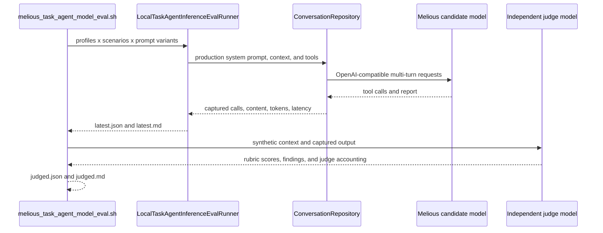

# Task-Agent Model Evaluation

This directory stores reproducible model-comparison artifacts for Lotti's Task
Agent. The harness evaluates behavior that users see: proposed task mutations,
checklist extraction, and the report shown on task and project surfaces.

## Runtime Flow



Candidate calls use Lotti's production `ConversationRepository`, continuation
strategy, and complete enabled task-agent tool registry. The provider is shaped
as generic OpenAI-compatible traffic in the live Flutter test because Flutter's
unit-test HTTP override blocks the `dart:io` client used by the dedicated
Melious adapter. The model IDs and endpoint are still Melious values.

The independent judge uses non-streaming HTTP outside Flutter's test process,
so its token, credit, and environmental accounting is retained. This accounting
describes judge calls only; candidate artifacts currently record tokens and
latency but not Melious energy metadata.

## Scenarios

- `metadata_explicit`: four explicit task-field changes plus a first report.
- `german_voice_plan`: German voice-note extraction into four distinct checklist
  actions while preserving owners, sequence, and deadline context.
- `progress_update`: checklist completion, deadline movement, and a legal-review
  blocker that must remain pending and visible.
- `no_op_background_refresh`: unchanged task data must not churn a prior report.
- `duplicate_checklist_reconciliation`: add only missing work without duplicating
  two existing checklist items.
- `stale_deadline_user_override`: preserve the user's newest manual deadline
  when an older log entry conflicts.
- `messy_german_transcript`: extract three committed actions while excluding a
  speculative, explicitly deferred idea.
- `user_completed_item_resurfaced`: surface renewed risk without undoing a
  checklist item the user checked.
- `spanish_mixed_context`: follow the task's Spanish language despite English
  parent-project context.
- `external_link_and_completion`: retain a real pull-request URL, complete one
  item, and leave deployment pending.
- `latest_deadline_wins`: resolve a long timeline using the newest explicit
  decision.

The default run uses the `production` prompt only. `compactModel` adds an
explicit extract, mutate, verify, and report sequence. `qualityFocused` adds a
strict report-quality gate that forbids tool-log achievements, H1 titles, empty
sections, untranslated headings, and deferred ideas. Both are experiments, not
production defaults. Missing initial reports receive the same forced,
report-only retry as the real task workflow; artifacts record this separately
from native one-pass success.

## Running

```bash
./tool/melious_task_agent_model_eval.sh
```

By default the script reads the sibling Greifswald `service/.env` when present.
Set `LOTTI_MELIOUS_ENV_FILE` or `MELIOUS_API_KEY` for another environment. Use
`LOCAL_TASK_AGENT_EVAL_JUDGE=0` to skip independent judging and
`LOCAL_TASK_AGENT_EVAL_STRICT=1` only when a known-good matrix should gate.
Set `LOCAL_TASK_AGENT_EVAL_EXECUTION_MODE=twoPass` to reproduce the rejected
two-pass orchestration experiment described below. The default is
`singlePass`.

## Findings from 2026-07-10

The corrected production-prompt run contains one sample per scenario at
temperature 0:

| Model | Passing scenarios | Deterministic quality | Judge overall | Summary quality | Checklist quality |
| --- | ---: | ---: | ---: | ---: | ---: |
| Mistral Small 4 119B | 10/11 | 99% | 89% | 93% | 95% |
| GLM 5.2 | 6/11 | 89% | 86% | 86% | 89% |

The largest improvement did not come from prompting. The initial realistic run
exposed that assistant messages containing tool calls were serialized without a
`content` field. Melious rejected subsequent continuation/report requests with
HTTP 400. `ConversationManager.getMessagesForRequest()` now retains the
internal null representation but sends `content: ""` for assistant tool-call
history. After that correction, Mistral completed 10 scenarios without forced
report recovery.

Mistral's remaining deterministic failure is report quality: in the noisy
German transcript it correctly excludes a deferred newsletter idea from the
checklist but repeats that idea in the public Learnings section. The independent
judge also catches softer issues such as agent-work descriptions, untranslated
section headings, empty sections, and redundant summary content.

The `qualityFocused` prompt was tested on the five hardest Mistral cases after
the transport fix. Compared with the production prompt on the same cases:

| Prompt | Deterministic quality | Judge overall | Summary quality |
| --- | ---: | ---: | ---: |
| Production | 98% | 90% | 95% |
| Quality focused | 88% | 90% | 85% |

The added quality gate is therefore not suitable for promotion. It caused the
model to write checklist-shaped prose without calling the checklist tool and
omitted required facts in another case. A cleaner next experiment is a
two-stage workflow with mutation tools first and a dedicated report-only pass,
not more instructions in the shared system prompt.

### Two-pass orchestration experiment

That two-stage workflow was evaluated before any production integration. The
experiment kept the production prompt and temperature at 0, removed
`update_report` from the advertised first-pass tools, and followed it with a
forced report-only pass over the same conversation.

| Mistral execution | Passing scenarios | Deterministic quality | Judge overall | Summary quality | Tokens | Latency |
| --- | ---: | ---: | ---: | ---: | ---: | ---: |
| Single pass | 10/11 | 99% | 89% | 93% | 88,860 | 31.0 s |
| Two pass | 8/11 | 97% | 81% | 82% | 113,661 | 45.3 s |

The two-pass design is rejected in this form. It used 28% more tokens and took
46% longer while reducing report quality. Mistral sometimes emitted
`update_report` even though that tool was not advertised in the mutation pass,
then emitted it again in the forced pass. Other regressions omitted required
owners, blockers, or dates and increased agent-process narration. The raw and
judged outputs are preserved under `two_pass/`.

The synthetic matrix now exposes a more important limitation: it scores the
single-pass Mistral summaries at 93%, which does not match the observed product
experience that motivated this work. Further report-quality tuning therefore
needs an anonymized corpus of unsatisfactory real task-agent reports and their
source context. Adding more orchestration based only on this synthetic corpus
would optimize the wrong target.

### Concise report-contract experiment

The production report directive itself was then isolated as a likely quality
problem. It asks for motivational emojis, a fixed multi-section template,
checkbox repetition, and optional extra sections. A `conciseReport` variant
replaces that directive with a shorter current-state contract: no title, no
emoji, no empty sections, no agent-process achievements, and only material
progress, next actions, blockers, decisions, and links.

| Mistral prompt | Passing scenarios | Deterministic quality | Judge overall | Summary quality | Format compliance | Tokens | Latency |
| --- | ---: | ---: | ---: | ---: | ---: | ---: | ---: |
| Production | 10/11 | 99% | 89% | 93% | 84% | 88,860 | 31.0 s |
| Concise report | 10/11 | 96% | 93% | 95% | 98% | 73,448 | 25.2 s |

This is the first experiment that materially improves report quality and
efficiency: 17% fewer tokens and 19% lower latency, with better overall,
summary, and format scores. It is not promoted directly because its one
deterministic failure was a missed checklist mutation. A second run with an
extra mutation reminder produced different tool errors despite temperature 0,
confirming that report-prompt changes can perturb task mutations and that the
backend/model output is not fully deterministic.

The implemented follow-up architecture is therefore draft-and-polish, not a
modified main wake: the opt-in `enable_task_agent_report_polishing` flag keeps
the current mutation workflow and its draft report unchanged. A local policy
skips clean drafts. When it detects an objective warning, an isolated
report-only request receives the draft, language code, and warning list rather
than the full task context. The editor performs a minimal copy-edit while
preserving free-form Markdown; validation retains the original draft whenever
the edit is unsafe. This preserves task mutation behavior while applying the
measured concise-report findings only where they address a concrete defect.

These numbers are directional rather than release thresholds. They are based on
one deterministic sample per case and synthetic replay data. Repeated runs and
sanitized real task histories are still required before changing the default
model.
