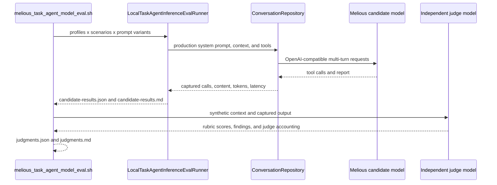

# Task-Agent Model Evaluation

This directory documents Lotti's reproducible Task Agent model evaluation. The
harness evaluates behavior that users see: proposed task mutations, checklist
extraction, and the report shown on task and project surfaces. Generated run
outputs are intentionally not committed to the application repository;
maintainers archive durable runs in the private
[`matthiasn/lotti-ai-evals`](https://github.com/matthiasn/lotti-ai-evals)
repository.

## Runtime Flow


```mermaid
sequenceDiagram
  participant Script as melious_task_agent_model_eval.sh
  participant Eval as LocalTaskAgentInferenceEvalRunner
  participant Conversation as ConversationRepository
  participant Candidate as Melious candidate model
  participant Judge as Independent judge model

  Script->>Eval: profiles x scenarios x prompt variants
  Eval->>Conversation: production system prompt, context, and tools
  Conversation->>Candidate: OpenAI-compatible multi-turn requests
  Candidate-->>Conversation: tool calls and report
  Conversation-->>Eval: captured calls, content, tokens, latency
  Eval-->>Script: candidate-results.json and candidate-results.md
  Script->>Judge: synthetic context and captured output
  Judge-->>Script: rubric scores, findings, and judge accounting
  Script-->>Script: judgments.json and judgments.md
```

Candidate calls use Lotti's production `ConversationRepository`, continuation
strategy, and complete enabled task-agent tool registry. The provider is shaped
as generic OpenAI-compatible traffic in the live Flutter test because Flutter's
unit-test HTTP override blocks the `dart:io` client used by the dedicated
Melious adapter. The model IDs and endpoint are still Melious values.

The independent judge uses non-streaming HTTP outside Flutter's test process,
so its token, credit, and environmental accounting is retained. This accounting
describes judge calls only; archived candidate artifacts currently record tokens
and latency but not Melious energy metadata.

## Scenarios

The default suite contains 14 scenario IDs. The twelve core scenarios are:

- `metadata_explicit`: four explicit task-field changes plus a first report.
- `implicit_workflow_plan`: turn a committed six-action implementation-to-release
  sequence into checklist work without requiring the words "create a
  checklist".
- `german_voice_plan`: German voice-note extraction into four distinct checklist
  actions while preserving owners, sequence, and deadline context.
- `progress_update`: checklist completion, deadline movement, and a legal-review
  blocker that must remain pending and visible.
- `no_op_background_refresh`: unchanged task data must not churn a prior report.
- `duplicate_checklist_reconciliation`: add only missing work without duplicating
  two existing checklist items.
- `stale_deadline_user_override`: preserve the user's newest manual deadline
  when an older log entry conflicts.
- `messy_german_transcript`: extract three committed actions while excluding a
  speculative, explicitly deferred idea.
- `user_completed_item_resurfaced`: surface renewed risk without undoing a
  checklist item the user checked.
- `spanish_mixed_context`: follow the task's Spanish language despite English
  parent-project context.
- `external_link_and_completion`: retain a real pull-request URL, complete one
  item, and leave deployment pending.
- `latest_deadline_wins`: resolve a long timeline using the newest explicit
  decision.

The two additional held-out constraint scenarios are:

- `deferred_scope_filter`: exclude a specifically deferred idea from both task
  mutations and the public report.
- `active_deployment_constraint`: keep deployment pending and its active
  external constraint visible.

### Demo-world scenario

`LOCAL_TASK_AGENT_EVAL_PENGUIN_LANGUAGES=1` replaces the suite with
`penguin_scrubber_production`, which is built from the shipped demo world
(`lib/features/demo/seed/demo_world.dart`) rather than from fixtures written
for the eval. The wake context carries the air-scrubber task's enriched
description, its full four-item checklist with real completion state, and a
log entry reporting one item done and a deadline move. It therefore measures
the model against the same material a user meets on their first run: complete
exactly one checklist item, move the due date, leave the pending cartridge
return untouched, and keep internal IDs out of the report.

The suite is English-only. The demo world carries reviewed copy in all eleven
supported languages, so a localized suite is possible — but the wake
instruction has to come from that translated demo content, not from
translations authored in the eval directory.

The default run uses the `production` prompt only. `compactModel` adds an
explicit extract, mutate, verify, and report sequence. `qualityFocused` adds a
strict report-quality gate that forbids tool-log achievements, H1 titles, empty
sections, untranslated headings, and deferred ideas. Both are experiments, not
production defaults. Missing initial reports receive the same forced,
report-only retry as the real task workflow; artifacts record this separately
from native one-pass success.

Some archived early artifacts use the synthetic task title “Validate local
Gemma fallback.” That wording referred only to the candidate in the fixture; it
never represented a runtime model fallback or routing path. The current fixture
uses model-neutral candidate/reference wording, while historical model outputs
remain verbatim.

## Running

```bash
./tool/melious_task_agent_model_eval.sh
```

By default the script reads the sibling Greifswald `service/.env` when present.
Set `LOTTI_MELIOUS_ENV_FILE` or `MELIOUS_API_KEY` for another environment. Use
`LOCAL_TASK_AGENT_EVAL_JUDGE=0` to skip independent judging and
`LOCAL_TASK_AGENT_EVAL_STRICT=1` only when a known-good matrix should gate.
Set `LOCAL_TASK_AGENT_EVAL_EXECUTION_MODE=twoPass` to reproduce the rejected
two-pass orchestration experiment described below. The default is
`singlePass`. A full matrix can exceed the test's ten-minute default budget —
raise it with `LOCAL_TASK_AGENT_EVAL_TIMEOUT_MINUTES`, since a run that trips
the timeout writes no artifacts at all.

Set `LOCAL_TASK_AGENT_EVAL_EVOLVED_DIRECTIVES=1` to replace the default suite
with seven synthetic evolved-report cases. They exercise decision-memo,
delivery-coach, risk-brief, plain-language, localized Spanish, and
release-evidence contracts across English, German, and Spanish. Each case keeps
the original mutation and grounding checks and adds directive-specific format
checks. Use `productionRouting` with the evidence-synthesis prompt to reproduce
the shipped Melious routes: Mistral always uses the isolated Qwen editor, while
direct Qwen receives a second Qwen call only when the known-regression detector
matches its draft. This mode resolves the production Qwen model and
three-attempt bound automatically and carries each scenario's current material
task anchors into report validation. `reportEditing` remains an always-edit
orchestration control for historical experiments.

Run the two selectable efficient routes together with:

```bash
LOCAL_TASK_AGENT_EVAL_PROFILES='mistral=mistral-small-4-119b-instruct,qwen=qwen3.5-122b-a10b' \
LOCAL_TASK_AGENT_EVAL_PROMPT_VARIANTS=evidenceSynthesis \
LOCAL_TASK_AGENT_EVAL_EXECUTION_MODE=productionRouting \
LOCAL_TASK_AGENT_EVAL_JUDGE=0 \
  ./tool/melious_task_agent_model_eval.sh
```

This comparison intentionally disables the model judge. Candidate acceptance
comes from deterministic checks plus direct report review.

The judge accepts only HTTP(S) endpoints on `api.melious.ai` by default. When a
deliberate proxy or alternate endpoint is configured with `MELIOUS_BASE_URL` or
`UP_UPSTREAM_BASE_URL`, add its exact hostname to the comma-separated
`TASK_AGENT_EVAL_ALLOWED_JUDGE_HOSTS` allowlist.

Each invocation writes to a unique
`build/task_agent_model_eval/<UTC timestamp>_<Lotti commit>/` directory by
default. To write directly into a local clone of the private archive, set the
output root rather than reusing a mutable directory:

```bash
LOCAL_TASK_AGENT_EVAL_OUTPUT_ROOT=../lotti-ai-evals/task-agent/runs \
  ./tool/melious_task_agent_model_eval.sh
```

`LOCAL_TASK_AGENT_EVAL_OUTPUT_DIR` remains available when an exact run directory
is required. Durable archived runs must be synthetic or reviewed and sanitized,
and must include a provenance manifest before they are committed.

## Findings from 2026-07-10

The corrected production-prompt run contains one sample per scenario at
temperature 0:

| Model | Passing scenarios | Deterministic quality | Judge overall | Summary quality | Checklist quality |
| --- | ---: | ---: | ---: | ---: | ---: |
| Mistral Small 4 119B | 10/11 | 99% | 89% | 93% | 95% |
| GLM 5.2 | 6/11 | 89% | 86% | 86% | 89% |

This table is not accepted as a model ranking. Its single synthetic sample
conflicts with repeated in-app observation that GLM 5.2 is materially more
reliable for both reports and tool use. It therefore does not establish that
Mistral outperforms GLM; the matrix is useful for reproducing failure modes and
testing interventions, not for selecting a default model by aggregate score.

The largest improvement did not come from prompting. The initial realistic run
exposed that assistant messages containing tool calls were serialized without a
`content` field. Melious rejected subsequent continuation/report requests with
HTTP 400. `ConversationManager.getMessagesForRequest()` now retains the
internal null representation but sends `content: ""` for assistant tool-call
history. After that correction, Mistral completed 10 scenarios without forced
report recovery.

Mistral's remaining deterministic failure is report quality: in the noisy
German transcript it correctly excludes a deferred newsletter idea from the
checklist but repeats that idea in the public Learnings section. The independent
judge also catches softer issues such as agent-work descriptions, untranslated
section headings, empty sections, and redundant summary content.

The `qualityFocused` prompt was tested on the five hardest Mistral cases after
the transport fix. Compared with the production prompt on the same cases:

| Prompt | Deterministic quality | Judge overall | Summary quality |
| --- | ---: | ---: | ---: |
| Production | 98% | 90% | 95% |
| Quality focused | 88% | 90% | 85% |

The added quality gate is therefore not suitable for promotion. It caused the
model to write checklist-shaped prose without calling the checklist tool and
omitted required facts in another case. That result prompted the two-stage
workflow experiment below: mutation tools first, followed by a dedicated
report-only pass.

### Two-pass orchestration experiment

That two-stage workflow was evaluated before any production integration. The
experiment kept the production prompt and temperature at 0, removed
`update_report` from the advertised first-pass tools, and followed it with a
forced report-only pass over the same conversation.

| Mistral execution | Passing scenarios | Deterministic quality | Judge overall | Summary quality | Tokens | Latency |
| --- | ---: | ---: | ---: | ---: | ---: | ---: |
| Single pass | 10/11 | 99% | 89% | 93% | 88,860 | 31.0 s |
| Two pass | 8/11 | 96% | 90% | 98% | 135,147 | 39.6 s |

The two-pass design is rejected in this form. The corrected temperature-0 rerun
used 52% more tokens and took 28% longer than the single-pass baseline. Its
judge-rated prose improved, but deterministic task completion fell from 10/11
to 8/11: required owners, blockers, or dates were omitted. Mistral also emitted
`update_report` even though that tool was not advertised in the mutation pass,
then emitted it again in the forced pass. The raw and judged outputs are
preserved in the private archive under
`task-agent/runs/2026-07-10_pr-3439/two-pass/`.

The synthetic matrix now exposes a more important limitation: it scores the
single-pass Mistral summaries at 93%, which does not match the observed product
experience that motivated this work. Further report-quality tuning therefore
needs an anonymized corpus of unsatisfactory real task-agent reports and their
source context. Adding more orchestration based only on this synthetic corpus
would optimize the wrong target.

### Concise report-contract experiment

The production report directive itself was then isolated as a likely quality
problem. It asks for motivational emojis, a fixed multi-section template,
checkbox repetition, and optional extra sections. A `conciseReport` variant
replaces that directive with a shorter current-state contract: no title, no
emoji, no empty sections, no agent-process achievements, and only material
progress, next actions, blockers, decisions, and links.

| Mistral prompt | Passing scenarios | Deterministic quality | Judge overall | Summary quality | Format compliance | Tokens | Latency |
| --- | ---: | ---: | ---: | ---: | ---: | ---: | ---: |
| Production | 10/11 | 99% | 89% | 93% | 84% | 88,860 | 31.0 s |
| Concise report | 10/11 | 96% | 93% | 95% | 98% | 73,448 | 25.2 s |

This is the first experiment that materially improves report quality and
efficiency: 17% fewer tokens and 19% lower latency, with better overall,
summary, and format scores. It is not promoted directly because its one
deterministic failure was a missed checklist mutation. A second run with an
extra mutation reminder produced different tool errors despite temperature 0,
confirming that report-prompt changes can perturb task mutations and that the
backend/model output is not fully deterministic.

A draft-and-polish follow-up was prototyped after this result: an isolated
report-only request received the draft and objective warning list without task
or checklist mutation tools. Focused Mistral probes on the two German scenarios
still returned reports with process narration, so both rewrites were rejected.
That same-model rewrite was not evidence of a quality improvement and is not
shipped as a generic polisher. Later experiments below use a different model in
an isolated, deterministically validated report editor.

These numbers are directional rather than release thresholds. They are based on
one deterministic sample per case and synthetic replay data. Repeated runs and
sanitized real task histories are still required before changing the default
model.

## Findings from 2026-08-07

DeepSeek V4 Flash 0731 was screened as a candidate task-agent executor against
GLM 5.2 and Kimi K3. One sample per scenario at temperature 0, the production
prompt, `singlePass`, model judge disabled; each scenario ran as its own
invocation so a stall costs one case rather than the matrix.

The first run scored GLM 10/14, Kimi 9/14 and DeepSeek 7/14. Investigating the
failures found nine defects in the suite itself, all of which penalised correct
behaviour; they are listed below and are fixed. Re-measured afterwards:

| Model | Passing scenarios | Before the suite fixes |
| --- | ---: | ---: |
| GLM 5.2 | 14 / 14 | 10 / 14 |
| Kimi K3 | 14 / 14 | 9 / 14 |
| DeepSeek V4 Flash 0731 | 10 / 14 | 7 / 14 |

Two of the three candidates now pass every scenario. Treat the earlier column
as a measurement of the suite, not of the models.

Latency separates them further: on the clean matrix GLM completed the suite in
38 s with a 5.9 s worst case and Kimi in 159 s with an 18.9 s worst case, while
DeepSeek needed 760 s and stalled for 360 s on one scenario. Those stalls are
intermittent — the same scenario later finished in 7.5 s — so they are not a
stable model property and may be provider congestion.

**DeepSeek V4 Flash 0731 is not viable for task-agent work**, and its four
remaining failures survived every suite correction.

It invents tool names. On `metadata_explicit` it called `set_task_estimate`,
which does not exist, with `{"estimate": "2.5"}` where the real
`update_task_estimate` takes integer minutes — three times in five
observations. On `progress_update` it called `update_task_status`, where the
real name is `set_task_status`. It guesses the prefix in both directions,
which the registry invites by mixing `set_task_title`, `set_task_language` and
`set_task_status` with `update_task_estimate`, `update_task_due_date` and
`update_task_priority`. GLM and Kimi absorb that inconsistency; DeepSeek does
not.

Critically, it does not recover. Once the harness began returning the
dispatcher's real `Unknown tool` error, DeepSeek received it, did not retry
with the correct name, and published a report describing the task as
configured while the user's requested estimate was never set.

It also mutates what nobody asked for: `update_task_priority` twice on
`progress_update`, and on `latest_deadline_wins` only `record_observations`
and `update_report`, never setting the due date the scenario requires. Its
fourth failure, `no_op_background_refresh`, was an `inferenceFailed` after
195 s — infrastructure rather than judgement.

### The suite's own defects

Seven checks were penalising correct behaviour. They are listed here because
each one silently lowered every model's score, and two of them contradicted
directives the same prompt gives the agent.

1. **Forbidden terms ignored negation.** "The fix is *not yet* validated"
   scored identically to a claim that it was validated. All three models
   failed `user_completed_item_resurfaced` for this alone. Terms a correct
   report may name in order to rule out now live in `forbiddenReportClaims`,
   matched only in affirmative context, with a negation window on both sides —
   English negates before the claim, German after.
2. **`spanish_mixed_context` banned a correct status change**, described
   below.
3. **`metadata_explicit` required the report to echo "P1"** while the report
   directive forbids narrating metadata changes. The mutation is already
   asserted through `expectedToolCalls`.
4. **`implicit_workflow_plan` demanded the literal verb "implement"**, which
   passed only because an earlier fixture happened to contain
   "implementation"; "fix the seeding so empty profiles are no longer
   selectable" is the same step.
5. **`deferred_scope_filter` forbade "underway"** on a task whose status is
   `IN PROGRESS` and whose log calls the certificate work active. The word was
   accurate.
6. **The harness confirmed fabricated tools.** `processToolCalls` answered
   every call with "Eval harness accepted <name>", including names that do not
   exist, where `TaskToolDispatcher` returns an error the model can recover
   from. The harness now mirrors the dispatcher.
7. **`HttpOverrides.global` was never cleared**, so the test binding failed
   every request with a synthetic HTTP 400 in under 100 ms and scored 0%. A
   run that trips the test timeout also discarded all artifacts; the timeout is
   now configurable and runs are executed per scenario.

`spanish_mixed_context` is a broken expectation, not a model failure. All three
models produced the identical sequence — `add_multiple_checklist_items`,
`set_task_status`, `update_report` — at 100% content quality, and all three
failed only because `set_task_status` is absent from `allowedExtraToolNames`.
The task's log says *"Seguimos bloqueados porque el proveedor no ha enviado las
credenciales"* while its status still reads `IN PROGRESS`, so marking it
blocked with a grounded reason is correct behaviour. Correcting this scenario
raises every model by one: GLM 11, Kimi 10, DeepSeek 8.

`user_completed_item_resurfaced` failed for all three models, and
`deferred_scope_filter` for two of three, both on report content. The report
directive never states that an idea the user explicitly deferred must stay out
of the public report — `deferred` appears in `seeded_directive_content.dart`
only in reference to deferred *tools* and the deferred-proposal mechanism —
yet the suite asserts `forbiddenReportTerms: ['newsletter']` against exactly
that unwritten rule. Kimi passes `messy_german_transcript`, so the rule is
inferable, but a rule only the strongest model infers belongs in the contract.

### What the failures taught us about the suite

Five of the nine defects share one root cause: **substring matching standing in
for semantic judgement.** It cannot see negation, cannot see paraphrase, and
fails precisely when a model expresses the right thing in unexpected words —
which capable models do more often, not less.

The other four have separate causes worth naming, because they will not be
caught by better matching. Two are scenario contracts that contradicted
directives the same system prompt issues, so a model was penalised for obeying
its instructions. One is harness fidelity: the runner accepted tools the
dispatcher rejects. Two are test infrastructure: leaked `HttpOverrides` and a
timeout that discarded results.

The practical rule for new scenarios: assert mutations through
`expectedToolCalls`, where the contract is exact, and keep report assertions
to facts that must appear rather than phrasings that must match. Use
`forbiddenReportClaims` for anything a correct report may legitimately mention
in order to rule out, and reserve `forbiddenReportTerms` for strings that must
never appear at all, such as internal identifiers.

### Recommended changes

- Normalise the task-field tool names onto one prefix. This is now evidence-
  backed rather than speculative: DeepSeek fabricated names in both directions,
  and the registry's mixed `set_*`/`update_*` scheme is what invites it.
- Leave the report directive alone. The deferred-scope rule looked like a
  prompt gap when three models failed those scenarios, but all three pass them
  once the checks stop matching negated mentions. There is no prompt change to
  make here.

Retaining GLM 5.2 as the high-end thinking model is supported by this run.
Nothing here re-opens the shipped Qwen/Mistral routing, which these scenarios
did not exercise.

### Does the payload hold models back?

A 27B dense model ought to be able to help with a task, and on-device
assistants of that size are shipping. So the suite was used to ask whether the
request we send is what stops small models being useful.

The task agent receives about **21,000 characters of system prompt** to act on
a task context of **under 900 characters**, and is offered **20 tools**:

| Component | Chars | Share |
| --- | ---: | ---: |
| Tool Usage Guidelines | 8,880 | 42% |
| Report scaffold | 3,739 | 18% |
| Report directive | 3,684 | 18% |
| Suggestion Hygiene | 2,237 | 11% |
| Scaffold core | 1,628 | 8% |
| General directive | 1,508 | 7% |
| Soul and voice | ~500 | 2% |

`LocalTaskAgentEvalPromptVariant.lean` keeps every rule a correct wake depends
on — end with a report or nothing, stay grounded in the context, do not undo
the user's work, do not narrate your own process, write in the task's
language — and drops the tool-etiquette prose, most of which teaches the model
to avoid calls `TaskToolDispatcher` already rejects with an error. It also
advertises nine tools rather than twenty, chosen as what a wake generally
needs rather than what each scenario expects, so no scenario is handed its own
answer. The result is 1,216 characters and 9 tools.

Both variants, one sample per scenario at temperature 0:

| Model | Production payload | Lean payload |
| --- | ---: | ---: |
| Qwen3.6 27B (dense) | 10 / 14 | **13 / 14** |
| Qwen3.6 35B A3B (~3B active) | 8 / 14 | 8 / 14 |

**Two different bottlenecks.** The dense model gains three scenarios from the
payload alone, reaching 13/14 — ahead of DeepSeek V4 Flash 0731 and one
scenario behind GLM 5.2. Capacity was not its limit; headroom was.

The mixture-of-experts model gains nothing, and four of its six failures are
`argumentMismatch`: it selects the right tool and fills the arguments wrong.
Shrinking the prompt cannot fix that, because argument precision is a capability
floor rather than an attention budget. If on-device ever becomes a target, that
is the wall, and it argues for narrower tools with simpler schemas rather than
shorter prose.

The lean variant changes prompt size, tool count and report contract together,
so it does not isolate which one carries the gain. Given the earlier
`conciseReport` result, both the tool-etiquette bulk and the report contract
plausibly contribute.

This measures scenario pass rates, not whether a model is pleasant to work with
over weeks. Maintainers report small models being poor in daily use while this
suite scores them near GLM, so the gap between the two remains the suite's main
blind spot.

### Caveats

One sample per scenario on a backend that is not deterministic even at
temperature 0. Run-to-run variance is real and was observed repeatedly: a
fabricated tool call, a 305 s stall, and two of Kimi's failures all failed to
reproduce on a second sample. Treat single-scenario differences as noise and
only repeated, inspected failures as signal.

## Findings from 2026-07-12

The production evidence-first contract was replicated with Qwen3.5 122B A10B
as the direct executor three times across the then-current 13-scenario suite:

| Measure | Result |
| --- | ---: |
| Scenario runs | 38 / 39 |
| Deterministic checks | 257 / 258 |
| Required mutations | 42 / 42 |
| Unauthorized mutations | 0 |
| Input tokens | 604,857 |
| Output tokens | 29,699 |
| Average latency | 5.792 s |

The one failure omitted the deadline from a German report; the required task
mutations still succeeded. At that checkpoint, direct product, reliability, and
editorial review found the mutation behavior suitable for a default-off
experiment, while report prose remained more mechanical and occasionally less
conservative than the larger-model baseline. Qwen used its model or profile
reasoning default.

The final Mistral route kept Mistral as the only task-mutation executor and sent
new built-in reports to an isolated Qwen editor with compact, ID-free successful
mutation facts. The retained full run produced:

| Measure | Result |
| --- | ---: |
| Scenarios | 13 / 13 |
| Deterministic checks | 94 / 94 |
| Report cases | 11 |
| No-op cases | 2 |
| Editor calls on no-op cases | 0 |
| Input tokens | 168,653 |
| Output tokens | 10,341 |
| Total latency | 89.618 s |

This establishes two explicit experimental selections rather than a silent
model substitution:

- Qwen3.5 122B A10B directly executes task mutations and writes its report.
- Mistral Small 4 119B executes task mutations; an isolated Qwen pass may
  replace its draft only after the known-regression checks accept it.

Both models are present in the curated Melious catalog and are selected through
the normal inference profile. The config flag supplies the evaluated prompt,
tool contract, and temperature-zero path. It preserves custom report directives
and does not claim parity on unsanitized real user histories. Full artifacts and
the GPT-5.6 Sol simulated expert review are kept
in the private evaluation archive under `2026-07-12_qwen35` and
`2026-07-12_qwen-gated-editor-v31`.

### Release-candidate reproduction

The exact tree at commit `8413b6320` was rerun after Qwen became selectable in
the curated Melious catalog:

| Route | Scenarios | Checks | Input tokens | Output tokens | Latency |
| --- | ---: | ---: | ---: | ---: | ---: |
| Qwen direct | 10 / 13 | 90 / 94 | 164,822 | 11,862 | 86.714 s |
| Mistral executor + Qwen editor | 13 / 13 | 94 / 94 | 172,443 | 12,923 | 96.801 s |

Qwen still made every required mutation and no unauthorized mutation. Its three
failures were public-report grounding defects: a deferred newsletter remained
visible, an untouched certificate rotation was called underway, and a
resurfaced issue acquired unsupported deployment history. A focused prompt
addition passed 0/3 and was removed. Isolated Qwen and Mistral edits of Qwen's
drafts passed 1/3 and 2/3 respectively, so neither route was promoted.

The Mistral route again passed the full suite. Eleven scenarios produced
reports, two no-op scenarios made no editor call, and three reports required
one bounded repair. Direct GPT-5.6 Sol review through simulated product,
reliability, and editorial roles found the final reports concise, actionable,
and materially clearer than the Mistral drafts. The prose is intentionally
operational and still somewhat formulaic; the result establishes a viable
default-off release candidate, not parity with GLM 5.2 or proof on unsanitized
real task histories. Raw artifacts and the review are archived under
`2026-07-12_release-candidate-8413b6320` in the private evaluation repository.

### Evolved directives and implicit-plan reproduction

The directive-aware route was subsequently rerun on commit `f9ee86f37` with
seven synthetic report contracts representative of evolution output. All seven
cases passed all 78 deterministic checks. The Mistral executor used 108,132
input and 9,038 output tokens; the isolated Qwen editor needed eight attempts
across seven reports. A same-commit regression of the original suite passed all
13 cases and all 94 checks with 175,229 input and 12,379 output tokens.

Live product testing then exposed a missing scenario: the user stated a
committed six-step workflow without saying "create a checklist". The original
agent required an explicit follow-up request. A focused held-out reproduction
now uses that natural wording and requires one batch containing implementation,
pull request, Gemini review, code review, merge, and multi-platform release.
The Mistral executor created all six actions on the first wake; Qwen replaced
its process-oriented draft with a grounded action report. The case passed all
15 checks using 16,044 input and 1,628 output tokens in 13.912 seconds. Its
artifact is archived locally under
`2026-07-12_live-repro-implicit-workflow-r2` pending final release archival.

This focused result proves first-wake behavior for the reproduced wording. It
does not by itself establish convergence across arbitrary real histories. The
production workflow therefore also enforces report freshness after successful
mutations and persists the editor-route outcome in agent internals, while AI
consumption tests require distinct per-model events under the shared wake key.

### Production-workflow reproduction

The inference-only fixture still did not cover production orchestration,
deferred checklist persistence, agent-internals routing, or AI Impact records.
The real `TaskAgentWorkflow` harness was therefore generalized for Melious and
changed to replay the screenshot-derived task text verbatim. It holds the
Riverpod inference repositories alive, captures persisted agent entities, and
records each `AiConsumptionEvent` generated at the conversation boundary.

Prompt-only Qwen iterations removed unsupported root-cause, reviewer-type, and
deployment claims but continued to emit process narration and absent-metadata
filler. Further prompt accretion was stopped. Direct Qwen reports now receive a
local known-regression preflight; clean drafts stay single-pass, while drafts
matching captured harmful patterns receive an isolated Qwen repair with exact
correction codes. This is not model self-rating, but it is also not general
semantic validation of arbitrary prose.

The final held-out app-path runs both created the six requested actions without
an explicit checklist request and passed content checks that reject checklist
or workflow narration, unsupported readiness, invented explanations, and empty
metadata commentary:

| Route | Result | Calls | Input | Output | Latency |
| --- | ---: | --- | ---: | ---: | ---: |
| Mistral executor + Qwen editor | pass | 2 Mistral + 2 Qwen | 17,786 | 2,337 | 28.370 s |
| Qwen direct + conditional Qwen repair | pass | 3 Qwen | 16,806 | 1,621 | 12.018 s |

Every call has a distinct consumption UUID with its own provider model ID,
tokens, credits, and energy. The persisted route outcomes were
`qwen_report_editor_accepted` and
`qwen_report_editor_direct_qwen_repaired`. Final reports named the concrete
seeding fix, pull request, both review passes, merge, and all-platform release
without claiming that work had started. The retained artifacts are
`2026-07-12_app-path-implicit-workflow-mistral-final3` and
`2026-07-12_app-path-implicit-workflow-qwen-r4` in the private archive clone.

### Final production-routing matrix

The exact production route at commit `8d34a3088` was rerun across the expanded
14-scenario suite for both selectable executors:

| Route | Scenarios | Checks | Total tokens | Latency | Editor attempts |
| --- | ---: | ---: | ---: | ---: | ---: |
| Mistral executor + Qwen editor | 14 / 14 | 112 / 112 | 232,322 | 145.458 s | 16 |
| Qwen direct + conditional repair | 14 / 14 | 112 / 112 | 233,490 | 157.180 s | 9 |

Five of twelve direct-Qwen report cases passed preflight without another model
call; seven triggered repair, and one used the full three-attempt bound. Direct
GPT-5.6 Sol review found Qwen's final reports richer and more natural, while the
Mistral route was more compact and conservative. The default Melious profile
therefore uses Qwen for thinking and retains Mistral as a selectable task-agent
executor and as the profile's multimodal vision model. Full generated outputs,
the manifest, and the direct review are archived privately under
`2026-07-12_production-routing-8d34a3088-full-r4`.

## 2026-08-08: the real-wake suite

Every result above was produced against a hand-written context. The harness
declared the task as a JSON blob — `_taskDetailsJson` carried an empty checklist
and a single log line restating the description — so the suite never measured
what the app actually asks a model to read.

`penguin_wake_workflow_eval_live_test.dart` runs the real `TaskAgentWorkflow`
over real in-memory databases and asserts on rows read back out: pending
proposals, the persisted report, the task itself. `AiInputRepository` assembles
the context exactly as the app does. The seeded wake carries fourteen checklist
items across three lists, six weeks of linked notes, logged time, a blocked
status, a due date and an estimate, and measures **9,004 characters** against
the 921–2,207 the synthetic scenarios carried.

### Scenario 1 — `requalification`

Unblocked overnight. Complete the one item the notes support, clear the blocked
status, and leave alone a deadline an older note asks to move and a newer one
keeps.

| Model | Passed | Failure seen |
| --- | ---: | --- |
| Kimi K3 | 3 / 3 | — |
| Qwen3.6 27B | 3 / 3 | — |
| DeepSeek V4 Flash 0731 | 3 / 3 | — |
| GLM 5.2 | 2 / 3 | left the task blocked after the note clearing it |
| Qwen3.5 397B | 2 / 3 | completed an item with no supporting evidence |
| Qwen3.6 35B A3B | 1 / 3 | provider rejected the request as malformed (×2) |

Run-to-run variance is large: GLM and 397B each passed and failed the identical
input across sessions. **Do not rank models on this scenario.** It separates
broken from working, not good from better.

### Scenario 2 — `noOp`

Nothing report-worthy changed. The prior report is accurate, no request is
outstanding, and the newest note adds no fact. A correct wake proposes nothing
and finishes with a short plain-text note, leaving the report standing.

| Model | Passed | Failure seen |
| --- | ---: | --- |
| Qwen3.6 27B | 3 / 3 | — |
| GLM 5.2 | 1 / 3 | rewrote an accurate report |
| Kimi K3 | 0 / 3 | rewrote an accurate report |
| Qwen3.5 397B | 0 / 3 | rewrote an accurate report |
| DeepSeek V4 Flash 0731 | 0 / 3 | rewrote an accurate report |

No model proposed a data change, so the restraint failure is narrow and
specific: four of five cannot leave a correct report alone. Their rewrites were
paraphrases — every one of the five produced a one-liner saying "blocked on Ross
Station customs". In the app that is a task summary that changes under the user
for no reason.

This is the first scenario in the suite that discriminates, and it puts the
dense 27B ahead of every frontier model tested.

### Scenario 3 — `pendingProposal` (withdrawn, not a result)

This scenario was written to catch a model re-proposing a change already queued
and awaiting the user. It reported ten failures out of ten across five models.
**That number was wrong and is retracted.** It was measurement error twice over:

1. The proposals were read from `getPendingChangeSets` after the wake, which
   still contains the change set the fixture seeded. Every run counted the
   fixture's own item as a model proposal. Filtering by the wake's run key
   removed that.
2. The number did not move after the filter, because `ChangeSetBuilder.build`
   **consolidates** pre-wake pending sets into the set the wake creates and
   retires the originals. The seeded item is therefore carried into the wake's
   own change set legitimately, and an identical model proposal would have been
   dropped by `deduplicateItems` before it was ever persisted.

The second point is the substantive one: **the app already prevents duplicate
proposals structurally**, through dedup against still-open items plus
consolidation. There was never a behaviour here for models to fail.

It also means the persisted change set cannot answer the question. Whether a
model *called* a redundant tool is only visible in its tool calls, not in what
survived the builder. The scenario now reads the action messages the wake
records — each carries `metadata.toolName` and `metadata.runKey` — which is the
model's actual behaviour rather than the builder's output.

On that instrument the scenario does discriminate:

| Model | Called `set_task_status` again |
| --- | --- |
| Kimi K3 | no |
| Qwen3.6 27B | yes |
| Qwen3.5 397B | yes |
| DeepSeek V4 Flash 0731 | yes |
| GLM 5.2 | inconclusive (build race, see below) |

Read it narrowly. Because dedup and consolidation already absorb the duplicate,
the user never sees it twice — so this measures wasted turns and payload, not a
user-visible defect. It is a reason to withhold the tool, not evidence of harm.

**Runner note.** Concurrent `flutter test` processes contend on
`build/unit_test_assets`, which surfaces as `PathNotFoundException` on
`NativeAssetsManifest.json` and is not a model failure.
`scripts/penguin_wake_eval_matrix.sh` warms the build once before fanning out
for this reason; ad-hoc parallel loops must do the same.

### Narrowing the tool surface does not fix report churn

`narrowToolSurface` gates tools on what the wake knows and withholds
`update_report` from the opening turn, so a wake has to do its work before it
can report. The hope was that a model with nothing to do would finish the first
turn with a plain-text note instead of rewriting the report.

Measured on `noOp`, three samples per model:

| Model | Flag off | Flag on |
| --- | ---: | ---: |
| GLM 5.2 | 1 / 3 | 0 / 3 |
| Kimi K3 | 0 / 3 | 0 / 3 |
| Qwen3.5 397B | 0 / 3 | 0 / 3 |
| Qwen3.6 27B | 2 / 3 | 3 / 3 |
| DeepSeek V4 Flash 0731 | 0 / 3 | 1 / 3 |
| **Total** | **3 / 15** | **4 / 15** |

Within noise. Withholding the tool for one turn does not produce restraint — the
model waits and publishes on the next turn instead. A single earlier sample
showed GLM flipping to a pass, which is exactly the kind of n=1 signal this
table exists to refuse.

`requalification` showed no regression across GLM, Kimi and 27B at one sample
each, so the narrower surface does not appear to cost the wake real work. That
is the weaker claim and needs more samples before it can be relied on.

The flag stays off. What survives on its own merits is the per-turn tool hook
(`ConversationStrategy.toolsForTurn`) and the precondition gates, which remove
hallucination invitations — offering `update_running_timer` with no timer
running gives a model no real id to pass — rather than buying restraint.

### The fixture was wrong first

The first `noOp` run failed on all five models, each proposing exactly
`update_task_due_date: 2026-08-14`. They were right. The variant had dropped the
note that supersedes the 07-24 extension request while leaving the due date
unmoved, so one genuine unfulfilled request remained in the context. The models
found it; the fixture was corrected to grant the extension in the prior wake.

Worth recording as method: a scenario every model fails deserves the same
suspicion as one every model passes. Read what they proposed before believing
the score.
