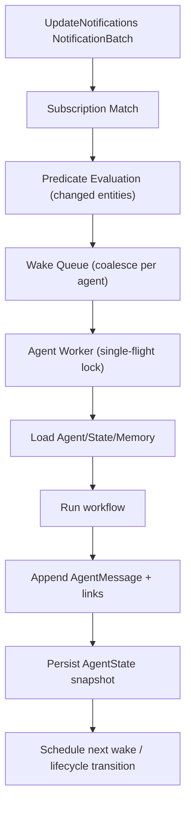
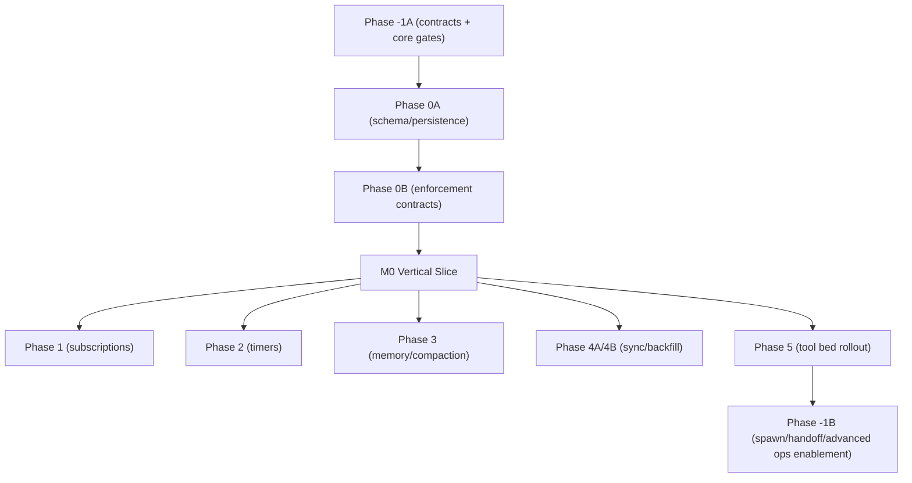

# Explicit Agents Foundation Layer Plan

Date: 2026-02-17
Status: Approved for implementation; Phase 0A complete (see `2026-02-20_minimum_agentic_layer.md` for implementation progress)
Scope: Foundation layer for explicit local-first agents (lifecycle, state, memory, wake/alertness, sync-safe storage)

## Objective

Introduce explicit agents (Gym Coach, Strategy Agent, Planner, etc.) with:

1. Lifecycle management (create, active, dormant, destroy)
2. Persisted state (local-first, multi-device sync)
3. Decaying memory (recent raw context + summarized long-term context)
4. Alertness mechanism (wake on data changes and wall-clock schedule)

Constraints:

- Reuse existing update notification stream and sync/outbox infrastructure patterns, but define agent graph edges with a dedicated `AgentLink` model in agent-domain storage (`agent.sqlite`).
- Do not model history as a single growing list/blob.
- Keep sync payload incremental and bandwidth efficient.
- Keep human-authored journal content and AI-derived agent state in separate persistence domains.
- Enforce `NEED_TO_KNOW` data minimization across all cross-boundary transfers (handoff, spawn, provider calls): share only the minimum required fields.

## Current System Findings (from code exploration)

1. Notifications are debounced `Set<String>` updates.
   - `lib/services/db_notification.dart`
   - Local updates: 100ms batch window.
   - Sync-origin updates: 1s batch window.

2. Notifications already include both semantic keys and entity IDs.
   - `lib/classes/journal_entities.dart`
   - `JournalEntity.affectedIds` mixes IDs with keys like `TASK`, `AI_RESPONSE`, etc.

3. Journal entry links are first-class, typed, and syncable (reference architecture only; agent links are forked into an agent-native model).
   - `lib/classes/entry_link.dart`
   - `lib/database/database.drift`
   - `lib/features/sync/model/sync_message.dart`

4. Vector-clock-style monotonic counters already exist (hostId -> counter map).
   - `lib/features/sync/vector_clock.dart`
   - `lib/services/vector_clock_service.dart`

5. Sequence-log-based gap/backfill and idempotent sync tracking already exist.
   - `lib/features/sync/sequence/sync_sequence_log_service.dart`
   - `lib/database/sync_db.dart`

6. Timed AI refresh patterns exist, but are currently in-memory timers only.
   - `lib/features/ai/state/direct_task_summary_refresh_controller.dart`

7. Local vector-database proof of concept is integrated (sqlite-vec + raw sqlite3), demonstrating on-device embedding storage and KNN retrieval as derived, rebuildable data.
   - Commit: `3e23d79543f4ad8512a06ad83a63fc6d8c1d1be6`
   - `lib/features/ai/database/embeddings_db.dart`
   - `test/features/ai/database/embeddings_db_test.dart`
   - `docs/implementation_plans/2026-02-19_sqlite_vec_integration.md`

## Architectural Decisions

## 0) Domain split: journal vs agent persistence

Decision:

- Introduce a dedicated `agent.sqlite` database for all agent-domain records.
- Keep `db.sqlite` (journal domain) as canonical human-authored/observed content.
- Do not write new agent internal state, memory traces, or agent reports as `JournalEntity` records.
- Define a dedicated `AgentLink` type model/serializer set for agent-domain relationships (forked from journal link approach; no shared union coupling).
- Persist agent-internal link graph edges (`agent_state`, `agent_head`, `message_prev`, summary span edges, payload edges, tool-effect edges) only in `agent.sqlite` (`agent_links`).
- Do not store agent-internal links in journal-domain `EntryLink` rows.
- Optional cross-domain linkage in journal domain is allowlisted to minimal user-facing report navigation only (for example a pointer to latest `AgentReportHead`), never internal memory/state topology.
- Use ID-based cross-domain references (`taskId`, `journalEntryId`, etc.) from agent records to journal records.
- Agent-domain data may be pruned/reset independently without affecting journal-domain data integrity.

Why this works:

- protects the "sacred log" role of the journal domain.
- enables aggressive retention/compaction policies for verbose AI-generated state.
- reduces churn and index pressure in journal persistence paths.

### 0.1) Derived local semantic-index store (vector DB)

Decision:

- Keep semantic embeddings in a dedicated local derived store (`embeddings.sqlite`), separate from both `db.sqlite` and `agent.sqlite`.
- Treat vector rows as rebuildable acceleration artifacts, not source-of-truth records.
- Do not sync vector rows across devices in foundation scope; rebuild from local canonical content (`db.sqlite` + synced `agent.sqlite` records) when needed.
- Keep provider/model provenance on embedding metadata (`modelId`, `contentHash`) to support invalidation and re-embedding.

Implementation status signal:

- local sqlite-vec integration proof-of-concept exists via commit
  `3e23d79543f4ad8512a06ad83a63fc6d8c1d1be6`
  (`EmbeddingsDb`, tests, CI build hook).

## 1) Alertness via workflow subscriptions

Use existing `UpdateNotifications.updateStream` as primary wake signal.

Add persisted agent subscriptions and timers:

- `AgentSubscription`: event-driven wake rules
- `AgentTimer`: persisted wall-clock wake schedule

Subscription examples:

- `notify when TASK changed AND categoryId == gym`
- `notify when AI_RESPONSE linked to task X`
- `wake every day at 07:00 local timezone`

Runtime behavior:

1. Listen to `UpdateNotifications` once in an `AgentWakeOrchestrator`.
2. Consume `NotificationBatch` envelopes (`localBatchId`, `logicalChangeKey`, `changeUnitKeys`, `typedTokens`, optional legacy `affectedTokens`, optional cursor snapshot) instead of raw token sets.
3. Classify incoming tokens into three classes using structured token fields (no heuristics on free-form strings):
   - semantic notification keys
   - subtype tokens
   - concrete entity IDs
4. Match subscriptions using all matchable token classes (keys + subtype tokens + explicit ID subscriptions).
5. Evaluate predicates against changed entities (bulk fetch only for real IDs).
6. Queue wake jobs with per-agent coalescing, deterministic `runKey`, and deterministic `threadId`.
7. Run agent workflow through single-flight lock per `agentId` and `runKey` dedupe.

Why this works:

- Reuses existing notification semantics and debounce behavior.
- Avoids direct coupling to specific feature controllers.
- Keeps wake logic deterministic and testable.

### Subscription token strategy (IDs + semantic types)

Decision:

- subscriptions match against the full token set emitted by `UpdateNotifications`, not only entity IDs.
- token prefiltering is used first, then entity predicates are evaluated for precision (for example `categoryId == gym`).

Token classes used by subscription matching:

- concrete entity IDs
- notification keys (`TASK`, `WORKOUT`, `DAY_PLAN`, `RATING`, etc.)
- domain subtype tokens already emitted by entities (for example `workout.data.workoutType`)

Subscription indexing contract:

- index supports all three classes explicitly (`semanticKey`, `subtypeToken`, `entityId`)
- implementation materializes tokens into `agent_subscription_tokens` with `token_class` + optional `token_namespace` + `token_value`
- `index.match(...)` receives combined matchable tokens, not only known notification keys
- non-ID tokens are never sent to entity lookup, avoiding wasted DB fetches

Examples:

- Gym Coach: key `TASK` + predicate `task.categoryId == gymCategoryId`
- Gym Coach: key `WORKOUT` (+ optional subtype token predicate for workout type)

### Notification token representation contract (explicit decision)

Decision:

- `NotificationBatch` carries canonical structured tokens in `typedTokens`:
  - `tokenClass`: `semanticKey | subtypeToken | entityId`
  - `tokenValue`: string
  - `tokenNamespace`: optional string, required when `tokenClass == subtypeToken`
- Classification and matching use `typedTokens` as the canonical source; no heuristic classification from arbitrary raw strings.
- Canonical token identity for dedupe/index/debug is:
  - `tokenKey = "{tokenClass}|{tokenNamespace ?? '-'}|{tokenValue}"`
- Legacy compatibility during migration:
  - `affectedTokens` remains optional legacy mirror only.
  - if fallback parsing is needed, only v1-prefixed encodings are valid:
    - `k:{semanticKey}`
    - `id:{entityId}`
    - `sub:{namespace}:{value}`
  - malformed legacy tokens are rejected with diagnostics (never silently reclassified).
- Foundation steady state is typed-token-first; remove legacy-string dependence after migration window.

### Notification batch identity contract (explicit decision)

`UpdateNotifications` currently emits token sets only; foundation requires explicit batch identity.

Decision:

- extend notification stream contract to emit `NotificationBatch`:
  - `localBatchId` (stable unique ID for the emitted batch on a device/process)
  - `logicalChangeKey` (cross-device-stable key derived from source cursor/mutation identity)
  - `changeUnitKeys` (sorted canonical provenance unit keys used to derive `logicalChangeKey`)
  - `typedTokens` (canonical structured token list with `tokenClass`/`tokenNamespace`/`tokenValue`)
  - optional legacy `affectedTokens` mirror during migration
  - optional `sourceCursor` snapshot for diagnostics/replay
- this explicitly closes the current gap where `UpdateNotifications` emits raw token sets without batch identity.
- `localBatchId` is assigned by notifier infrastructure before fan-out and is preserved for local diagnostics/migration only.
- subscription run keys must use `logicalChangeKey`; cross-device dedupe must not depend on device-local batch IDs.
- wake rehydration/replay must persist and reuse the original `logicalChangeKey`.

Deterministic derivation contract (`logicalChangeKey`):

- Define canonical change units (`ChangeUnit`) as the source of truth for notification identity.
- Each `ChangeUnit` must include:
  - `origin`: `sync` | `local`
  - `hostId`
  - `counter` (monotonic per host)
  - `payloadType` (`journalEntity` | `entryLink` | agent payload type)
  - `payloadId`
- Source of truth by origin:
  - `sync`: derive from applied sync payload provenance (`originatingHostId` + vector-clock counter for origin host) and persisted sequence-log tuple `(hostId, counter, payloadType, entryId/payloadId)`.
  - `local`: derive from committed local write provenance (entity/link vector clock written in the same commit) and payload identity.
- Canonical `ChangeUnit` string format (v1):
  - `v1|{origin}|{hostId}|{counter}|{payloadType}|{payloadId}`
- Canonical `changeUnitKey`:
  - `changeUnitKey = hex(sha256(canonicalChangeUnitString))`
- Canonical `logicalChangeKey`:
  - collect all `changeUnitKey`s for the batch, remove duplicates, sort lexicographically.
  - `logicalChangeKey = hex(sha256("v1|" + join(sortedChangeUnitKeys, ",")))`
- Collision resistance:
  - use SHA-256 digest space; treat collisions as practically impossible.
  - persist sorted `changeUnitKey` list in batch provenance for replay/debug assertions.

Coalescing contract:

- Notification coalescing must be key-preserving: only merge token sets for records with the same `logicalChangeKey`.
- Different `logicalChangeKey` values must emit separate `NotificationBatch` envelopes (even if emitted in the same debounce tick).
- This prevents time-window-dependent key drift and keeps cross-device dedupe stable.
- Agent wake queue may still coalesce downstream per agent, but wake `runKey` derivation remains anchored to each `logicalChangeKey`.

Failure policy:

- If notifier cannot derive `ChangeUnit` provenance for a would-be subscription wake, fail closed for agent wake enqueue (`missing_change_provenance`) and emit diagnostics; do not substitute `localBatchId` as dedupe identity.

Migration safety:

- keep legacy token stream available during migration window to avoid breaking existing consumers.
- introduce parallel batch stream API and migrate consumers incrementally.
- once all consumers are migrated, deprecate and remove legacy raw-token stream.

### Agent-emitted notification tokens (explicit decision)

Because agents are not `JournalEntity` subtypes, they do not participate in `JournalEntity.affectedIds`.

Decision:

- Add agent notification keys (for example `agentChangedNotification`, `agentStateChangedNotification`, `agentMessageAppendedNotification`).
- Agent repositories/services must call `UpdateNotifications.notify({...})` for agent mutations.
- Emit both semantic keys and concrete IDs.

Examples:

- `notify({agentChangedNotification, agentId})`
- `notify({agentStateChangedNotification, agentId, stateId})`
- `notify({agentMessageAppendedNotification, agentId, messageId})`

## 2) Storage model (linked entries, no growing array)

Use granular persisted records:

- `Agent` (identity + lifecycle + config)
- `AgentState` (durable state snapshot)
- `AgentRuntimeState` (in-memory only, never persisted — lost on crash and reconstructed at next startup from `AgentState`)
- `AgentMessage` (immutable log entry, one record per message)
- `AgentMessagePayload` (normalized large content object referenced by `AgentMessage.contentEntryId`)
- `AgentReport` (immutable user-facing snapshot)
- `AgentReportHead` (latest pointer per report scope, for example `current` / `daily` / `weekly` / `monthly`)

Link records chain them:

- `agent -> currentState`
- `agent -> headMessage`
- `message -> prevMessage`
- `message -> payloadEntry` (optional large content object)
- `summaryMessage -> startMessage`
- `summaryMessage -> endMessage`
- `agent -> currentReportHead`
- `report -> sourceSpan` (optional range metadata via links/refs)

This guarantees append-only growth and sync incrementality.

Avoid:

- any parent object that contains `List<messages>` and is rewritten per append.

## 3) Agent state and memory decay

State carries:

- lifecycle and scheduling policy
- wake scheduling (`nextWakeAt`, `sleepUntil`)
- cursor/watermark for processed events (vector-clock map)
- memory pointers (`recentHeadMessageId`, `latestSummaryMessageId`)
- slots (goals/preferences/open loops)

Runtime state (in-memory only, never persisted) carries:

- run status and active run/session IDs
- failure streak and other operational counters
- Reconstructed from `AgentState` on startup; lost on crash with no recovery needed

Memory policy:

- hot memory: recent raw messages (count and token bounded)
- warm memory: summary messages that compress old ranges
- optional cold memory: summary-of-summaries for very long history

Compaction:

- summarize oldest raw span into one summary message
- keep raw immutable entries (optionally archived flag)
- update state pointers to include new summary

### Compaction producer, ordering, and failure handling

Decision:

- summaries are produced by an asynchronous `AgentMemoryCompactionService`.
- primary compaction path uses an LLM summarization call with a fixed prompt contract.
- fallback path uses deterministic rule-based extraction when LLM summarization is unavailable (rate limit, budget gate, provider outage).
- compaction is best-effort and non-blocking for foreground agent runs.

Ordering and durability:

- compaction candidates are persisted as jobs (`agentId`, `threadId`, `startMessageId`, `endMessageId`, `status`, `attemptCount`, `nextAttemptAt`).
- worker is single-flight per `(agentId, threadId)` to keep span ordering deterministic.
- summary message ID is deterministic from compaction span identity + summarizer contract version
  (prompt/fallback extractor version) to avoid duplicate summaries within a contract and avoid version-drift collisions.
- summary content carries `summaryContentHash`; if same deterministic summary ID arrives with divergent content, first committed summary is kept and conflicting variants are recorded as diagnostics (no pointer rollback).
- `AgentState` memory pointers are advanced only after summary message + links commit transactionally.

Failure behavior:

- on compaction failure, raw messages remain source of truth and pointers do not move.
- failures retry with bounded exponential backoff.
- fallback summarizer may run after configurable retry threshold or budget/rate-limit rejection.
- after max attempts, job is marked `failed_terminal` and can be retried manually/maintenance-triggered later.

## 4) Agent tool bed and function-call surface

Goal:

- expose UI-equivalent operations as explicit, capability-gated tools so agents can perform real work without bespoke feature coupling.

### 4.1 Tool execution architecture

Add a dedicated execution layer:

- `AgentToolRegistry`: declarative catalog (`name`, schema, capability, risk level, handler)
- `AgentCapabilityProfile`: per-agent-kind allowlist (`gym_coach`, `planner`, `strategy`, ...)
- `AgentToolExecutor`: validates schema, enforces capabilities, executes handlers, emits notifications, records results
- `AgentModelAccessResolver`: resolves allowed provider/model tuples by (`agentKind`/`agentId`, `categoryId`)
- `AgentEgressPolicyGuard`: deny-by-default network gate; only provider-gateway egress is permitted
- `AgentToolResult`: normalized success/error payload for memory and retry logic
- `AgentToolContractSpec` (companion artifact): source-of-truth tool I/O, permissions, and side effects

### 4.1.1 AgentToolContractSpec artifact definition

Canonical artifact and format:

- source file: `docs/agent_tools/agent_tool_contract_spec.yaml`
- validation schema: `docs/agent_tools/agent_tool_contract_spec.schema.json`
- optional generated human-readable view: `docs/agent_tools/agent_tool_contract_spec.md`

Why YAML as source-of-truth:

- easy review diffs for tool additions/permission changes
- schema-validated structure for machine checks
- can generate runtime/docs views without duplicating contracts

Required fields per tool entry (minimum):

- `name`
- `version`
- `capabilitiesRequired`
- `allowedWakeReasons`
- `inputSchemaRef`
- `outputSchemaRef`
- `idempotencyStrategy`
- `scopeRules` (category enforcement)
- `sideEffects` (entity types + notification tokens)
- `riskLevel`
- `dataMinimizationPolicyRef` (outbound field allowlist/redaction policy)

Validation requirements:

- spec validates against JSON Schema in CI
- one-to-one parity test between `AgentToolRegistry` and `AgentToolContractSpec`
- capability/risk/scope metadata must match between registry and spec

Draft contracts:

```dart
enum AgentCapability {
  categoryRead,
  taskRead,
  taskWrite,
  checklistWrite,
  timeWrite,
  dayPlanRead,
  dayPlanWrite,
  ratingRead,
  ratingWrite,
}

enum AgentWakeReason {
  subscription,
  timer,
  userInitiated,
  recoveryCatchup,
  manual,
}

final class AgentAccessScope {
  const AgentAccessScope({
    required this.allowedCategoryIds,
  });

  final Set<String> allowedCategoryIds;
}

final class AgentToolCall {
  const AgentToolCall({
    required this.agentId,
    required this.threadId,
    required this.toolName,
    required this.operationId,
    required this.wakeReason,
    required this.scope,
    required this.arguments,
    this.previewOnly = false,
  });

  final String agentId;
  final String threadId;
  final String toolName;
  final String operationId; // idempotency key
  final AgentWakeReason wakeReason;
  final AgentAccessScope scope;
  final JsonMap arguments;
  final bool previewOnly;
}

final class AgentToolResult {
  const AgentToolResult({
    required this.success,
    required this.toolActionId,
    required this.toolName,
    required this.operationId,
    this.changedEntityIds = const [],
    this.changedTokens = const [],
    this.payload = const {},
    this.errorCode,
    this.errorMessage,
  });

  final bool success;
  final String toolActionId;
  final String toolName;
  final String operationId;
  final List<String> changedEntityIds;
  final List<String> changedTokens;
  final JsonMap payload;
  final String? errorCode;
  final String? errorMessage;
}
```

### 4.1.2 Category boundary enforcement hook

Core rule: every read/write tool execution is scoped by `Agent.allowedCategoryIds`.

- reads must include category filters derived from the scope
- writes must validate target entity category membership before mutation
- cross-category move/copy actions are blocked unless source and destination are both in scope
- scope violations return structured tool errors (`errorCode: "out_of_scope"`) and append a `toolResult` message

This avoids retrofitting every query path later and makes category safety a foundation concern.

### 4.1.3 Provider/model access and network egress policy

Core rule: agents have no arbitrary network capability.

- all outbound network calls from agent runs must go through a single provider gateway path.
- gateway enforces deny-by-default egress: if destination is not a configured model-provider endpoint, request is blocked.
- each model-inference request must carry `agentId`, `agentKind`, and effective `categoryId`.
- policy resolver must allow the tuple (`agent`, `category`, `provider`, `model`) before execution.
- missing/denied policy returns structured errors (`model_not_allowed`, `provider_not_allowed`, `network_denied`) and appends `toolResult`.
- provider/model selection is user-controlled; system must not auto-switch providers/models without user action.
- UI must present provider privacy implications before activation (for example training/retention/jurisdiction metadata, as available from configured provider policy data).
- explicit user confirmation is required per (`provider`, `model`, `policyVersion`) before first inference and again when policy metadata/version changes.
- missing confirmation fails closed with structured error (`privacy_confirmation_required`) and no outbound request.
- outbound provider payload must be produced by a tool-specific `NEED_TO_KNOW` projection; full thread/journal/memory dumps are forbidden by default.
- foundation scope explicitly excludes arbitrary HTTP/fetch tools and arbitrary host access.
- provider credentials/secrets are never stored in `agent.sqlite`, `db.sqlite`, sync payloads, or agent message content.
- provider credentials are resolved via OS secure credential storage (host keychain/secure store) through a dedicated `SecretProvider`.
- runtime only stores stable secret references (for example `secretRefId`), not raw secret material.
- if secure store is unavailable or locked, provider calls fail closed with structured error (`secret_unavailable`).

Why this matters:

- enforces least-privilege model usage by domain/category.
- prevents accidental or prompt-induced network exfiltration through ungoverned endpoints.
- prevents credential leakage through persistence, sync, and trace surfaces.

### 4.1.4 NEED_TO_KNOW boundary policy (handoff/spawn/provider)

Guiding principle: every boundary crossing uses explicit minimal payload projection.

- boundary types covered: `agent_to_agent_handoff`, `agent_spawn_input`, `provider_inference_request`.
- each boundary type must define an allowlist schema of permitted fields; non-allowlisted fields are dropped.
- projections are built from references (`inputRefs`) and explicit user-selected attachments, not implicit full-context expansion.
- for cross-provider tools (for example image generation), request payload includes only required generation arguments and explicitly attached assets; unrelated task history, journals, open loops, and reports are excluded.
- policy violations fail closed (`overshared_payload_blocked`) and are recorded in local run traces.

### 4.2 Tool catalog (current vs planned)

Already available and should be reused:

- `set_task_language`
- `update_task_estimate`
- `update_task_due_date`
- `update_task_priority`
- `add_multiple_checklist_items`
- `update_checklist_items`
- `assign_task_labels`

New tools for UI parity:

- Category/context reads:
  `list_allowed_categories`, `list_tasks_in_scope`, `resolve_task_reference`
- Task lifecycle:
  `create_task`, `update_task_fields`, `create_follow_up_task`, `conclude_task_with_rollover`
- Checklist lifecycle:
  `create_checklist`, `move_checklist_items`, `move_checklist_items_to_new_task`
- Time capture:
  `create_retrospective_time_entry`, `start_task_timer`, `stop_task_timer`, `annotate_time_entry`
- Day planning:
  `get_or_create_day_plan`, `upsert_day_plan_blocks`, `pin_day_plan_tasks`, `replan_day_blocks`
- Ratings and productivity:
  `get_ratings_summary`, `get_rating_for_target`, `create_or_update_rating`

This directly covers:

- creating follow-up tasks from a finished task
- carrying remaining checklist items into a new task
- logging retrospective work sessions from dictated time ranges
- scheduling and revising day-plan time blocks
- reading productivity/session rating signals

### 4.3 Core tool contracts (high-value examples)

`create_follow_up_task`:

```json
{
  "operationId": "uuid",
  "sourceTaskId": "task-id",
  "newTaskTitle": "Next iteration",
  "carryOverOpenChecklistItems": true,
  "closeSourceTaskAs": "DONE",
  "preserveCategoryAndLabels": true
}
```

`create_retrospective_time_entry`:

```json
{
  "operationId": "uuid",
  "taskId": "task-id",
  "startedAt": "2026-02-17T16:00:00-05:00",
  "endedAt": "2026-02-17T18:00:00-05:00",
  "description": "Implemented migration + fixed failing test",
  "sourceEntryId": "audio-entry-id"
}
```

`move_checklist_items`:

```json
{
  "operationId": "uuid",
  "itemIds": ["item-1", "item-2"],
  "fromChecklistId": "checklist-a",
  "toChecklistId": "checklist-b",
  "preserveCheckedState": true
}
```

`upsert_day_plan_blocks`:

```json
{
  "operationId": "uuid",
  "planDate": "2026-02-18",
  "upserts": [
    {
      "id": "block-1",
      "categoryId": "cat-focus",
      "startTime": "2026-02-18T09:00:00-05:00",
      "endTime": "2026-02-18T11:00:00-05:00",
      "note": "Deep work"
    }
  ],
  "deletes": ["block-2"]
}
```

### 4.3.1 Action/toolResult payload model (non-black-box)

`AgentMessage.kind == action` must carry a typed action envelope:

- `actionType`: `tool_call | propose_plan | ask_user | lifecycle_transition`
- `toolName` (for `tool_call`)
- `operationId`
- `argumentsHash` (stable audit/replay guard)
- `scopeSnapshot` (`allowedCategoryIds` at execution time)

`AgentMessage.kind == toolResult` must carry:

- `actionRefId` (links result to action message)
- `status`: `success | error | partial`
- `changedEntityIds`
- `changedTokens`
- `errorCode/errorMessage` when failed
- fields above are persisted in typed message metadata (not only ephemeral tool executor result objects)

Foundation implication:

- `workflow.run(context)` emits explicit action + toolResult pairs, not opaque text-only thoughts.

### 4.4 Safety and determinism policy

- Every mutating tool requires `operationId` for idempotent retries/replays.
- `operationId` generation is deterministic from wake/run identity + stable action identity:
  `operationId = hash(runKey, actionStableId)`.
- `actionStableId` is derived from canonical tool intent
  (`toolName`, canonical args hash, scope snapshot, resolved target refs) and is persisted before execution.
- retries/replays must reuse persisted planned actions for a `runKey` instead of regenerating execution order.
- High-risk tools (`conclude_task_with_rollover`, bulk moves, destructive updates) support `previewOnly` and explicit apply.
- Ambiguous target resolution never auto-writes:
  `resolve_task_reference` returns ranked candidates; caller must pass explicit `taskId` for writes.
- Mutations execute transactionally within a domain via repositories/persistence logic; cross-domain workflows use the `operationId` saga contract, then emit notification tokens (`ids + semantic keys`).
- Tool execution is logged as agent messages (`action` and `toolResult`) to keep memory/audit local-first and sync-safe.

### 4.5 Tool bed and sync/memory integration

- Each call appends immutable `AgentMessage` records.
- Tool-result messages link to affected entities through `AgentLink` relation metadata (`relation: tool_effect`).
- Sync remains incremental:
  one message append + changed domain entities/links; no parent blob rewrite.
- Alertness can subscribe to domain notifications generated by tool side effects, enabling chained workflows.

### 4.6 Cross-domain write consistency contract (`db.sqlite` + `agent.sqlite`)

Because journal and agent domains are in separate SQLite files, cross-domain writes are not atomic by default.

Decision:

- execute mutating tool side effects under a cross-domain saga keyed by `operationId`.
- source-of-truth mutation (journal domain) commits first with idempotent `operationId`.
- agent-domain action/toolResult/state writes commit second and include the same `operationId`.
- if second phase fails, recovery worker reconciles using operation log + idempotent handlers until both domains converge.
- replay and dedupe are defined by `operationId`; recovery must be safe to run repeatedly.
- keep implementation minimal: single recovery table/state machine
  (`operationId`, `phase`, `status`, `lastError`, `updatedAt`) plus linear startup scan/retry.

This avoids false assumptions of two-database atomic commits while preserving deterministic outcomes.

## Data Models (Dart draft)

```dart
typedef JsonMap = Map<String, Object?>;

enum AgentLifecycle { created, active, dormant, destroyed }
enum AgentInteractionMode { autonomous, interactive, hybrid }
enum AgentRunStatus { idle, queued, running, failed }
enum AgentMessageKind {
  observation, user, thought, action, toolResult, summary, system
}
enum AgentPersonaStatus { draft, active, archived }
enum AgentPromptItemState { open, answered, expired }
enum AgentInteractionType { yesNo, multiChoice, freeText, audio }
enum AttentionDecisionAction {
  defer, notify, escalate, runNow, pauseCandidate
}
enum CreativeArtifactMediaType { image, video }
enum AgentRebuildMode { dryRun, execute }
enum AgentRebuildJobStatus { queued, running, completed, failed, canceled }

final class AgentConfig {
  const AgentConfig({
    required this.schemaVersion,
    this.modelId,
    this.promptId,
    this.extension = const {},
  });

  final int schemaVersion;
  final String? modelId;
  final String? promptId;
  final JsonMap extension; // namespaced extension fields only
}

final class AgentSlots {
  const AgentSlots({
    this.primaryGoal,
    this.primaryGoalVersion = 0,
    this.activeTaskId,
    this.activeTaskIdVersion = 0,
    this.openLoopIds = const [],
    this.openLoopIdsVersion = 0,
    this.preferenceByKey = const {},
    this.preferenceByKeyVersion = 0,
    this.extension = const {},
    this.extensionVersion = 0,
  });

  final String? primaryGoal;
  final int primaryGoalVersion; // Merge rule #6 slotVersion metadata
  final String? activeTaskId;
  final int activeTaskIdVersion; // Merge rule #6 slotVersion metadata
  final List<String> openLoopIds;
  final int openLoopIdsVersion; // Merge rule #6 slotVersion metadata
  final Map<String, String> preferenceByKey;
  final int preferenceByKeyVersion; // Merge rule #6 slotVersion metadata
  final JsonMap extension; // namespaced extension fields only
  final int extensionVersion; // Merge rule #6 slotVersion metadata
}

final class AgentMessageMetadata {
  const AgentMessageMetadata({
    this.actionRefId,
    this.operationId,
    this.promptId,
    this.promptVersion,
    this.modelId,
    this.changedEntityIds = const [],
    this.changedTokens = const [],
    this.status,
    this.errorCode,
    this.errorMessage,
    this.extension = const {},
  });

  final String? actionRefId;
  final String? operationId;
  final String? promptId;
  final String? promptVersion;
  final String? modelId;
  final List<String> changedEntityIds;
  final List<String> changedTokens;
  final String? status;
  final String? errorCode;
  final String? errorMessage;
  final JsonMap extension; // namespaced extension fields only
}

final class Agent {
  const Agent({
    required this.id,
    required this.kind,
    required this.displayName,
    required this.lifecycle,
    required this.mode,
    required this.allowedCategoryIds,
    required this.currentStateId,
    required this.createdAt,
    required this.updatedAt,
    this.destroyedAt,
    required this.config,
  });

  final String id;
  final String kind;
  final String displayName;
  final AgentLifecycle lifecycle;
  final AgentInteractionMode mode;
  final Set<String> allowedCategoryIds;
  final String currentStateId;
  final DateTime createdAt;
  final DateTime updatedAt;
  final DateTime? destroyedAt;
  final AgentConfig config;
}

final class AgentState {
  const AgentState({
    required this.id,
    required this.agentId,
    required this.revision,
    required this.updatedAt,
    this.lastWakeAt,
    this.nextWakeAt,
    this.sleepUntil,
    this.recentHeadMessageId,
    this.latestSummaryMessageId,
    this.consecutiveFailureCount = 0,
    this.processedCounterByHost = const {},
    required this.slots,
  });

  final String id;
  final String agentId;
  final int revision;
  final DateTime updatedAt;
  final DateTime? lastWakeAt;
  final DateTime? nextWakeAt;
  final DateTime? sleepUntil;
  final String? recentHeadMessageId;
  final String? latestSummaryMessageId;
  final int consecutiveFailureCount;
  final Map<String, int> processedCounterByHost;
  final AgentSlots slots;
}

/// In-memory only — never persisted; lost on crash and reconstructed from
/// AgentState at next startup.
final class AgentRuntimeState {
  const AgentRuntimeState({
    required this.agentId,
    required this.runStatus,
    this.activeRunId,
    this.activeSessionId,
    this.lastRunStartedAt,
    this.failureStreak = 0,
    this.hotMessageCount = 0,
  });

  final String agentId;
  final AgentRunStatus runStatus;
  final String? activeRunId;
  final String? activeSessionId;
  final DateTime? lastRunStartedAt;
  final int failureStreak;
  final int hotMessageCount;
}

final class AgentMessage {
  const AgentMessage({
    required this.id,
    required this.agentId,
    required this.threadId,
    required this.kind,
    required this.createdAt,
    this.prevMessageId,
    this.contentEntryId,
    this.triggerSourceId,
    this.summaryStartMessageId,
    this.summaryEndMessageId,
    this.summaryDepth = 0,
    this.tokensApprox = 0,
    required this.metadata,
  });

  final String id;
  final String agentId;
  final String threadId;
  final AgentMessageKind kind;
  final DateTime createdAt;
  final String? prevMessageId;
  final String? contentEntryId;
  final String? triggerSourceId;
  final String? summaryStartMessageId;
  final String? summaryEndMessageId;
  final int summaryDepth;
  final int tokensApprox;
  final AgentMessageMetadata metadata;
}

final class AgentMessagePayload {
  const AgentMessagePayload({
    required this.id,
    required this.agentId,
    required this.createdAt,
    required this.content,
    this.contentType = 'application/json',
  });

  final String id;
  final String agentId;
  final DateTime createdAt;
  final JsonMap content;
  final String contentType;
}

final class AgentReport {
  const AgentReport({
    required this.id,
    required this.agentId,
    required this.scope, // current|daily|weekly|monthly
    required this.createdAt,
    required this.content,
    this.confidence,
    this.provenance = const {},
  });

  final String id;
  final String agentId;
  final String scope;
  final DateTime createdAt;
  final JsonMap content;
  final double? confidence;
  final JsonMap provenance;
}

final class AgentReportHead {
  const AgentReportHead({
    required this.id,
    required this.agentId,
    required this.scope, // current|daily|weekly|monthly
    required this.reportId,
    required this.updatedAt,
  });

  final String id;
  final String agentId;
  final String scope;
  final String reportId;
  final DateTime updatedAt;
}

final class AgentPersonaVersion {
  const AgentPersonaVersion({
    required this.id,
    required this.agentId,
    required this.version,
    required this.status,
    this.voiceDirectives = const {},
    this.toneBounds = const {},
    this.coachingStyle,
    this.antiSycophancyPolicy,
    this.diffFromVersionId,
    required this.authoredBy,
    this.approvedBy,
    this.approvedAt,
    this.sourceSessionId,
    required this.createdAt,
  });

  final String id;
  final String agentId;
  final int version;
  final AgentPersonaStatus status;
  final JsonMap voiceDirectives;
  final JsonMap toneBounds;
  final String? coachingStyle;
  final String? antiSycophancyPolicy;
  final String? diffFromVersionId;
  final String authoredBy; // user|agent|system
  final String? approvedBy;
  final DateTime? approvedAt;
  final String? sourceSessionId;
  final DateTime createdAt;
}

final class AgentPersonaHead {
  const AgentPersonaHead({
    required this.id,
    required this.agentId,
    required this.personaVersionId,
    required this.updatedAt,
  });

  final String id;
  final String agentId;
  final String personaVersionId;
  final DateTime updatedAt;
}

final class ReportSourceRef {
  const ReportSourceRef({
    required this.id,
    required this.agentId,
    required this.reportId,
    required this.sectionId,
    required this.claimId,
    required this.sourceType, // journal|agent|web|tool_output
    required this.sourceLocator,
    required this.capturedAt,
    required this.freshnessAt,
    this.confidence,
    required this.inferenceFlag, // observed|inferred
  });

  final String id;
  final String agentId;
  final String reportId;
  final String sectionId;
  final String claimId;
  final String sourceType;
  final String sourceLocator;
  final DateTime capturedAt;
  final DateTime freshnessAt;
  final double? confidence;
  final String inferenceFlag;
}

final class AgentPromptItem {
  const AgentPromptItem({
    required this.id,
    required this.agentId,
    required this.runKey,
    required this.interactionType,
    required this.promptText,
    this.options = const [],
    this.requiredBy,
    required this.state,
    required this.createdAt,
    this.resolvedAt,
  });

  final String id;
  final String agentId;
  final String runKey;
  final AgentInteractionType interactionType;
  final String promptText;
  final List<String> options;
  final DateTime? requiredBy;
  final AgentPromptItemState state;
  final DateTime createdAt;
  final DateTime? resolvedAt;
}

final class AgentPromptResponse {
  const AgentPromptResponse({
    required this.id,
    required this.promptItemId,
    required this.agentId,
    required this.runKey,
    required this.response,
    this.responseEntryRef,
    this.supersedesResponseId,
    required this.respondedAt,
  });

  final String id;
  final String promptItemId;
  final String agentId;
  final String runKey;
  final JsonMap response;
  final String? responseEntryRef;
  final String? supersedesResponseId;
  final DateTime respondedAt;
}

final class AttentionSignal {
  const AttentionSignal({
    required this.id,
    required this.agentId,
    required this.sourceType,
    required this.sourceRefId,
    this.runKey,
    this.scoreHint,
    this.evidenceRefs = const [],
    required this.createdAt,
  });

  final String id;
  final String agentId;
  final String sourceType;
  final String sourceRefId;
  final String? runKey;
  final double? scoreHint;
  final List<String> evidenceRefs;
  final DateTime createdAt;
}

final class AttentionDecision {
  const AttentionDecision({
    required this.id,
    required this.orchestratorAgentId,
    required this.targetAgentId,
    required this.signalId,
    required this.priorityScore,
    required this.action,
    this.reasonCodes = const [],
    this.evidenceRefs = const [],
    this.budgetImpact = const {},
    this.expiresAt,
    required this.createdAt,
  });

  final String id;
  final String orchestratorAgentId;
  final String targetAgentId;
  final String signalId;
  final double priorityScore;
  final AttentionDecisionAction action;
  final List<String> reasonCodes;
  final List<String> evidenceRefs;
  final JsonMap budgetImpact;
  final DateTime? expiresAt;
  final DateTime createdAt;
}

final class AgentCreativeArtifact {
  const AgentCreativeArtifact({
    required this.id,
    required this.agentId,
    required this.mediaType,
    required this.intent,
    this.derivedFromReportId,
    required this.promptRef,
    this.inputAssetRefs = const [],
    required this.provider,
    required this.model,
    this.cost,
    this.tokenUsage,
    required this.safetyPolicyVersion,
    required this.retentionClass,
    required this.createdAt,
  });

  final String id;
  final String agentId;
  final CreativeArtifactMediaType mediaType;
  final String intent;
  final String? derivedFromReportId;
  final String promptRef;
  final List<String> inputAssetRefs;
  final String provider;
  final String model;
  final double? cost;
  final int? tokenUsage;
  final String safetyPolicyVersion;
  final String retentionClass;
  final DateTime createdAt;
}

final class CreativeFeedbackEvent {
  const CreativeFeedbackEvent({
    required this.id,
    required this.agentId,
    required this.artifactId,
    required this.feedback,
    required this.createdAt,
  });

  final String id;
  final String agentId;
  final String artifactId;
  final JsonMap feedback;
  final DateTime createdAt;
}

final class RuntimeSchedulerPolicy {
  const RuntimeSchedulerPolicy({
    required this.id,
    required this.policyVersion,
    required this.globalMaxConcurrentRuns,
    required this.perAgentWakeRatePerHour,
    required this.queueDiscipline,
    required this.cooldownSeconds,
    required this.fairnessStrategy,
    required this.classBudgetByKind,
    required this.createdAt,
  });

  final String id;
  final String policyVersion;
  final int globalMaxConcurrentRuns;
  final int perAgentWakeRatePerHour;
  final String queueDiscipline;
  final int cooldownSeconds;
  final String fairnessStrategy;
  final JsonMap classBudgetByKind;
  final DateTime createdAt;
}

final class RuntimeQuotaSnapshot {
  const RuntimeQuotaSnapshot({
    required this.id,
    required this.capturedAt,
    required this.globalRunningCount,
    this.perAgentQueued = const {},
    this.spentCostByWindow = const {},
    this.spentTokensByWindow = const {},
  });

  final String id;
  final DateTime capturedAt;
  final int globalRunningCount;
  final JsonMap perAgentQueued;
  final JsonMap spentCostByWindow;
  final JsonMap spentTokensByWindow;
}

final class AgentRebuildJob {
  const AgentRebuildJob({
    required this.id,
    required this.scopeType, // all|agentId|agentKind
    this.scopeRefId,
    required this.mode,
    required this.status,
    this.sourceCursorStart,
    this.sourceCursorEnd,
    this.progress = const {},
    this.unresolvedRefs = const [],
    required this.createdAt,
    required this.updatedAt,
  });

  final String id;
  final String scopeType;
  final String? scopeRefId;
  final AgentRebuildMode mode;
  final AgentRebuildJobStatus status;
  final String? sourceCursorStart;
  final String? sourceCursorEnd;
  final JsonMap progress;
  final List<String> unresolvedRefs;
  final DateTime createdAt;
  final DateTime updatedAt;
}

final class AgentRebuildCheckpoint {
  const AgentRebuildCheckpoint({
    required this.id,
    required this.jobId,
    required this.stepKey,
    required this.cursorRef,
    required this.createdAt,
  });

  final String id;
  final String jobId;
  final String stepKey;
  final String cursorRef;
  final DateTime createdAt;
}
```

### Data model clarifications

- `threadId` boundaries are explicit:
  autonomous runs use `agentId:run:<wakeId>`, interactive sessions use `agentId:session:<sessionId>`.
- `Agent.allowedCategoryIds` is the strict allow-list boundary enforced by tool/query execution.
- `AgentRuntimeState` is in-memory only (never persisted, never synced). Reconstructed from `AgentState` on startup.
- `revision` is a local optimistic-write guard and debugging aid. Cross-device ordering/conflict handling is vector-clock based.
- `Agent`, `AgentState`, and `AgentMessage` use typed wrappers (`AgentConfig`, `AgentSlots`, `AgentMessageMetadata`) in Phase 0A.
- raw `JsonMap` is restricted to tool-call I/O and explicitly namespaced `extension` maps to prevent schema drift.
- `JsonMap` is declared in this draft for readability; implementation must define/import the alias from a shared model utility location.
- extension maps are reserved for forward-compatibility but remain empty in Phase 0A unless a namespaced key is explicitly registered in schema validation rules.
- extension fields must never participate in merge-critical semantics or policy decisions until promoted to typed fields.
- `AgentState.consecutiveFailureCount` is synced and used for cross-device retry/backoff safety; `AgentRuntimeState.failureStreak` is in-memory-only operational telemetry (lost on crash, reconstructed on startup).
- `AgentMessage.contentEntryId` references `AgentMessagePayload.id` in `agent_message_payloads`; large payloads are normalized, linkable, and independently synced/pruned.
- prompt/model provenance is captured per message via `AgentMessageMetadata.promptId/promptVersion/modelId` for replay/eval attribution.
- `AgentPersonaHead` is a single-pointer record per agent; concurrent pointer updates must resolve deterministically to the higher persona version, then tie-break by (`hostId`, `personaVersionId`).
- `RuntimeQuotaSnapshot` and `AgentRebuildCheckpoint` are local operational telemetry/checkpoints and are excluded from sync payloads.
- `ReportSourceRef` is the typed claim/source artifact behind report provenance (can persist in existing `agent_source_refs` table with claim/section fields in Phase 0B migration).

Thread policy implications:

- memory assembly is thread-first: load hot raw messages from the active thread, then include summary messages from prior threads.
- compaction is primarily per-thread; cross-thread summaries are only created as second-order compaction artifacts.

## Persistence and Sync Shape

Recommended persistence approach:

1. Persist all agent-domain entities in dedicated `agent.sqlite` storage.
2. `AgentRuntimeState` is in-memory only (never persisted). Compaction-job execution state is persisted locally in `agent.sqlite` (not part of synced payloads).
3. Persist agent-domain relationships as typed `AgentLink` records/references in `agent.sqlite`.
4. Keep `db.sqlite` journal persistence unchanged as the canonical human-authored/observed domain.
5. Model cross-domain relationships via ID references (`taskId`, `journalEntryId`, etc.), not journal-owned agent records.
6. Sync each new/updated shared agent-domain record independently.
7. Use `operationId`-keyed cross-domain saga/recovery for workflows touching both domains (no assumption of atomic commits across both SQLite files).

### Sync payload strategy (explicit decision)

To limit sequence-log/backfill complexity, do not add one payload type per agent table.

Decision:

- Add one agent-domain sync payload category (for example `agentEntity`) with subtype discriminator in payload body (`agent`, `agentState`, `agentMessage`, `agentMessagePayload`, `agentSubscription`, `agentTimer`, `agentReport`, `agentReportHead`, `agentSourceRef`, `agentPersonaVersion`, `agentPersonaHead`, `agentPromptItem`, `agentPromptResponse`, `attentionSignal`, `attentionDecision`, `agentCreativeArtifact`, `creativeFeedbackEvent`, `agentRebuildJob`, `runtimeSchedulerPolicy`).
- not persisted (in-memory only): `agentRuntimeState`.
- local-only subtype exclusions (persisted but not synced): `runtimeQuotaSnapshot`, `agentRebuildCheckpoint`, `agentCompactionJob`.
- `agentSourceRef` payload subtype is the transport envelope for typed `ReportSourceRef` rows (claim/section/source linkage fields).
- Agent payload bodies originate from `agent.sqlite`, not journal JSON paths.

Rationale:

- keeps `SyncSequencePayloadType` growth small
- avoids multiplying populate/backfill code paths
- preserves one sequence/backfill contract for all agent-domain records

Expected sync units per appended message:

- one new `AgentMessage`
- optional payload entry
- one or more new links
- one small `AgentState` update

This is bounded by new work, not by total history length.

## Lifecycle and Wake Flow

Interaction modes:

- autonomous: trigger-driven run (`subscription` / `timer`) then idle
- interactive: user-initiated conversational session (for example Pomodoro coach voice interaction)
- hybrid: autonomous monitoring plus ad-hoc interactive sessions

Foundation support required now:

- `userInitiated` wake reason in wake queue/jobs
- per-session thread IDs for interactive runs
- explicit action/toolResult message pairs in both autonomous and interactive modes
- interactive session inactivity TTL and deterministic session-close behavior (including automatic transition back to autonomous/hybrid baseline).



Temporal wake flow:

1. App startup loads persisted agent timers.
2. Scheduler sets nearest timer based on wall-clock.
3. Due timers enqueue wake jobs.
4. Timer row is advanced (next occurrence) transactionally.

Pseudo-code:

```text
onNotifications(batch):
  classified = tokenClassifier.classify(
    batch.typedTokens,
    legacyFallback=batch.affectedTokens,
  )
  changed = db.getJournalEntitiesForIds(classified.entityIds)
  for sub in index.match(classified.matchTokens):
    if sub.matchesTokens(classified) and
       sub.matchesEntities(changed) and
       isEligible(sub, now):
      runKey = runKeyFactory.subscription(
        agentId=sub.agentId,
        subscriptionId=sub.id,
        logicalChangeKey=batch.logicalChangeKey,
      )
      threadId = threadPolicy.autonomous(agentId=sub.agentId, wakeId=runKey)
      wakeQueue.enqueueOrCoalesce(
        agentId=sub.agentId,
        reason="subscription",
        reasonId=sub.id,
        runKey=runKey,
        threadId=threadId,
      )

onTimerDue(timer, scheduledAt):
  runKey = runKeyFactory.timer(
    agentId=timer.agentId,
    timerId=timer.id,
    scheduledAt=scheduledAt,
  )
  threadId = threadPolicy.autonomous(agentId=timer.agentId, wakeId=runKey)
  wakeQueue.enqueueOrCoalesce(
    agentId=timer.agentId,
    reason="timer",
    reasonId=timer.id,
    runKey=runKey,
    threadId=threadId,
  )
  timerRepo.advance(timer)

onUserInitiated(agentId, sessionId, userInput):
  runKey = runKeyFactory.userInitiated(
    agentId=agentId,
    sessionId=sessionId,
    turnId=userInput.id,
  )
  threadId = threadPolicy.interactive(agentId=agentId, sessionId=sessionId)
  wakeQueue.enqueueOrCoalesce(
    agentId=agentId,
    reason="userInitiated",
    runKey=runKey,
    threadId=threadId,
    sessionId=sessionId,
    seedInput=userInput,
  )

worker(job):
  agentId = job.agentId
  if wakeRunLog.existsTerminal(job.runKey):
    return
  lock(agentId):
    wakeRunLog.markStarted(job.runKey)
    try:
      load agent/state
      if destroyed:
        wakeRunLog.markSkipped(job.runKey, reason="agent_destroyed")
        return
      if sleeping:
        wakeRunLog.markSkipped(job.runKey, reason="sleeping")
        return
      mark running
      context = memoryAssembler.build(agentId, threadId=job.threadId)
      if job.reason == userInitiated:
        result = interactiveWorkflow.runSession(context, seedInput=job.seedInput)
      else:
        result = workflow.run(context)
      append action/toolResult messages + links // tool operationIds derive from job.runKey + persisted actionStableId
      memoryCompactor.maybeCompact(agentId, threadId=job.threadId)
      state = reducer.apply(state, result)
      runtimeState = runtimeReducer.apply(runtimeState, result) // in-memory only
      save state
      wakeRunLog.markCompleted(job.runKey)
      notify({agentStateChangedNotification, agentId, state.id})
    catch (error):
      wakeRunLog.markFailed(job.runKey, errorCode=error.code)
      rethrow
```

## Timer recovery semantics (explicit policy)

Missed timers and wall-clock changes must be deterministic.

1. App offline for long periods with missed firings:
   - coalesce to one catch-up wake on recovery (not one wake per missed interval)
   - wake reason is `recoveryCatchup` with metadata `cause: timer`
2. Clock jumps (NTP/manual correction):
   - recompute `nextRunAt` from persisted schedule intent
   - if overdue after recompute, enqueue one catch-up wake and advance
3. Timezone changes:
   - preserve wall-clock intent (for example “07:00 local” stays local)
   - recompute next run in new timezone
4. Multi-device duplicate firing of same schedule:
   - allow duplicate attempts
   - dedupe side effects via idempotent run key: `agentId + timerId + scheduledAt`

## Agent destruction semantics

When lifecycle transitions to `destroyed`, destruction is deterministic and sync-safe:

1. immediately block new wake enqueue for the agent (`subscription`, `timer`, `userInitiated`, `recoveryCatchup`).
2. cancel/disable active subscriptions and timers (soft-delete/tombstone records for sync convergence).
3. terminate active local runtime sessions and discard in-memory runtime state.
4. preserve historical messages/reports by default as soft-deleted/tombstoned records for sync safety and auditability.
5. apply retention policy to eventually prune tombstoned artifacts where allowed.
6. writes from stale in-flight runs after destruction must fail closed (`agent_destroyed`) with no side effects.

## Wake-run idempotency and event cursor strategy

There is no global event ID yet, but vector clocks already provide a robust cursor.

Wake-run idempotency contract:

- every wake job must carry a persisted `runKey` (not only timer wakes)
- `runKey` is deterministic by reason:
  - subscription: `hash(agentId, subscriptionId, notificationBatch.logicalChangeKey)`
  - timer: `hash(agentId, timerId, scheduledAt)`
  - user initiated: `hash(agentId, sessionId, turnId)`
- worker records `wakeRunLog(runKey, status)` with terminal states
  (`completed`, `skipped_sleeping`, `skipped_destroyed`, `failed_terminal`) and short-circuits terminal runs
- tool `operationId`s are derived from `runKey` + `actionStableId`, so crash/retry replays do not create new side effects

Extended idempotency contract for new product-level artifacts:

- `attentionDecisionId` must be deterministic from
  `hash(orchestratorAgentId, targetAgentId, signalId, policyVersion, action)`.
- `agentPromptResponse.id` must be deterministic from
  `hash(promptItemId, responseEntryRef | canonicalResponseHash)`.
- `creativeFeedbackEvent.id` must be deterministic from
  `hash(agentId, artifactId, feedbackSourceRef)`.
- `agentRebuildCheckpoint.id` must be deterministic from
  `hash(jobId, stepKey, cursorRef)`.
- deterministic IDs above are used as upsert/dedupe keys during replay and sync backfill re-application.

Use `AgentState.processedCounterByHost`:

- merged on every successful run (`max` per host)
- used to skip stale/replayed triggers
- persisted and synced with state
- stale host counters are pruned deterministically (for example hosts inactive for >180 days) under retention policy to prevent unbounded map growth.

This directly fits existing host-keyed monotonic counter semantics.

## AgentState merge semantics (Phase 0B required decision)

Shared/synced fields:

- lifecycle
- sleep/timer policy fields
- memory pointers (`recentHeadMessageId`, `latestSummaryMessageId`)
- `consecutiveFailureCount` (cross-device safety/backoff counter)
- `slots`
- `processedCounterByHost`

Runtime fields (`runStatus`, `failureStreak`, `hotMessageCount`, active run/session IDs) live in
`AgentRuntimeState` which is in-memory only (never persisted, never synced). Reconstructed from `AgentState` on startup.

Deterministic merge rules for shared `AgentState`:

1. If one vector clock dominates the other, choose the dominant snapshot.
   Field-level merge rules 2-7 apply only when vector clocks are concurrent.
2. `processedCounterByHost`: merge with per-host `max`.
3. lifecycle precedence on concurrent clocks:
   `destroyed > dormant > active > created`.
4. pointers (`recentHeadMessageId`, `latestSummaryMessageId`):
   prefer descendant pointer when ancestry is known; otherwise use vector-clock-derived tie-break
   from referenced message/state metadata; if still concurrent/equal, tie-break by (`hostId`, `messageOrStateId`).
5. `consecutiveFailureCount`: merge by `max` and decay/reset only on explicit successful-run transition recorded in synced state reducer.
6. `slots`: per-slot merge using embedded logical slot version metadata (`slotVersion`, not wall clock), then deterministic tie-break by hostId and slot key.
7. scheduling (`sleepUntil`, `nextWakeAt`):
   keep the earliest future wake and the latest sleep barrier; this prevents “sleep lost” races while still waking promptly.

No wall-clock (`updatedAt`) tie-break is used for merge-critical conflict resolution.

Consequence:

- two devices can run the same agent concurrently and still converge on shared state without oscillation.
- runtime execution details remain device-local and do not create cross-device merge churn.

## Database and Index Plan

Dedicated persistence boundary:

- new `AgentDb` (`agent.sqlite`) for agent-domain records
- existing `JournalDb` (`db.sqlite`) remains journal/domain data only

New persisted entities/tables (or equivalent serialized records):

- `agents`
- `agent_states`
- ~~`agent_runtime_states`~~ removed — `AgentRuntimeState` is in-memory only
- `agent_subscriptions`
- `agent_subscription_tokens` (materialized tokens: `subscription_id`, `token_class`, optional `token_namespace`, `token_value`, `active`)
- `agent_timers`
- `agent_messages`
- `agent_message_payloads`
- `agent_reports`
- `agent_report_heads`
- `agent_source_refs`
- `agent_persona_versions`
- `agent_persona_heads`
- `agent_prompt_items`
- `agent_prompt_responses`
- `attention_signals`
- `attention_decisions`
- `agent_creative_artifacts`
- `creative_feedback_events`
- `runtime_scheduler_policies`
- `runtime_quota_snapshots` (local-only)
- `agent_rebuild_jobs`
- `agent_rebuild_checkpoints` (local-only)
- `agent_links`
- `agent_compaction_jobs` (local-only)

Derived semantic-index store (local-only, rebuildable):

- `embeddings.sqlite` (separate local DB file)
- `embedding_metadata` + `vec_embeddings` (sqlite-vec virtual table)
- no sync payloads in foundation scope; embeddings are rebuilt from canonical content as needed

Agent link model:

- define a dedicated `AgentLink` model for agent graph edges (`relation`, `fromId`, `toId`, typed metadata), with agent-domain serializer/converter wiring independent from journal `EntryLink`.
- persist agent-internal relation instances only in `agent_links` (`agent.sqlite`), not in journal-domain link tables.
- if journal-domain links are used at all, allowlist only minimal report-level cross-domain pointers (no internal agent graph edges).

Index additions:

- `idx_agent_subscriptions_agent_active (agent_id, active)`
- `idx_agent_subscriptions_key_active (notification_key, active)`
- `idx_agent_subscription_tokens_class_namespace_value_active (token_class, token_namespace, token_value, active)`
- `idx_agent_subscription_tokens_subscription_active (subscription_id, active)`
- `idx_agent_timers_due (active, next_run_at)`
- `idx_agent_messages_agent_created (agent_id, created_at DESC)`
- `idx_agent_message_payloads_agent_created (agent_id, created_at DESC)`
- `idx_agent_reports_agent_scope_created (agent_id, scope, created_at DESC)`
- `idx_agent_report_heads_agent_scope (agent_id, scope)`
- `idx_agent_persona_versions_agent_version (agent_id, version DESC)`
- `idx_agent_persona_heads_agent (agent_id)`
- `idx_agent_prompt_items_agent_state_due (agent_id, state, required_by)`
- `idx_agent_prompt_responses_prompt_responded (prompt_item_id, responded_at DESC)`
- `idx_attention_signals_agent_created (agent_id, created_at DESC)`
- `idx_attention_decisions_target_created (target_agent_id, created_at DESC)`
- `idx_agent_creative_artifacts_agent_created (agent_id, created_at DESC)`
- `idx_creative_feedback_events_artifact_created (artifact_id, created_at DESC)`
- `idx_runtime_scheduler_policies_version (policy_version)`
- `idx_runtime_quota_snapshots_captured (captured_at DESC)`
- `idx_agent_rebuild_jobs_status_updated (status, updated_at DESC)`
- `idx_agent_rebuild_checkpoints_job_step (job_id, step_key, created_at DESC)`
- `idx_agent_compaction_jobs_ready (status, next_attempt_at)`
- `idx_agent_compaction_jobs_thread_status (agent_id, thread_id, status)`
- `idx_agent_source_refs_agent_source (agent_id, source_type, source_id)`
- `idx_agent_links_type_from_hidden_created (type, from_id, hidden, created_at DESC)`
- `idx_agent_links_type_to_hidden_created (type, to_id, hidden, created_at DESC)`

## Phased Implementation

## Execution Order (locked)

1. `Phase -1A` core safety/policy/eval contracts and gates
2. `Phase 0A` schema and persistence primitives
3. `Phase 0B` contracts and enforcement
4. Continue remaining baseline phases in order (`1 -> 5`)
5. `Phase -1B` advanced multi-agent/operations contracts (contract-first; required before spawn/handoff production enablement)

Immediate next step:

- start with `Phase -1A`.

## Delivery Milestone M0 (vertical slice before full foundation completion)

Goal: ship one meaningful single-agent flow early, while keeping spawn/handoff disabled.

- one agent kind only (for example planner).
- one trigger path (`subscription` only) with deterministic runKey.
- one mutating tool path (for example `create_follow_up_task`) with idempotent `operationId`.
- one user-facing `current` report with freshness marker.
- basic user controls: pause/resume, global kill switch, approval prompt for high-risk action.
- no spawn/handoff runtime enablement (`Phase -1B` remains deferred/feature-flagged).
- compaction can run in MVP-safe deterministic mode (count/token bounded truncation) before full LLM summarization rollout.

M0 exit criteria:

- end-to-end flow works on-device and survives restart/replay.
- safety gates are active for scope/egress/privacy confirmation.
- targeted tests for the single tool path and wake/replay pass.

## Phase Dependency Graph



## Phase -1 - Operating excellence and trust layer

Delivery split (to avoid Phase -1 bottleneck while preserving safety posture):

- `Phase -1A` (must complete before Phase 0A runtime rollout):
  - evaluation harness + benchmark datasets + CI regression gates
  - core policy/safety contracts, category/egress/provider controls, secret-management contracts
  - kill switch + human approval controls + user-local observability/replay contracts
  - provider privacy confirmation and `NEED_TO_KNOW` boundary contracts
- `Phase -1B` (contract-first definitions in this foundation; runtime enablement remains feature-flagged):
  - multi-agent handoff + spawn contracts and arbitration semantics
  - retention governance refinements, incident runbooks, advanced ops/reliability playbooks
  - advanced long-horizon report freshness calibration and operational SLO hardening
  - can progress in parallel with baseline Phases `0A -> 5`, but must be complete before spawn/handoff production enablement.
  - may be deferred entirely until after M0/M1 single-agent releases if spawn/handoff remain disabled.

- Define an evaluation scorecard per agent kind (`gym_coach`, `planner`, `strategy`, task-lifetime agent).
- Establish benchmark datasets:
  - seed dataset for M0 (single-agent, single-tool, single-report path) is required first.
  - richer suites are expanded incrementally as each phase adds new runtime capabilities.
  - golden-path scenarios with expected tool call sequences and report outputs.
  - adversarial scenarios (prompt injection, ambiguous references, out-of-scope requests, replay duplicates).
  - long-horizon drift scenarios (weekly/monthly trend interpretation and memory decay correctness).
- Build an offline replay/eval harness:
  - deterministic run replay from persisted wake/run inputs.
  - mock/fake tool adapters for deterministic assertions.
  - regression comparison on action/toolResult/report outputs.
- Add CI quality gates:
  - phase-scoped progressive gating: smoke gates first, then expanded thresholds as capability surface grows.
  - block merge on scorecard regressions beyond agreed thresholds.
  - require pass on high-risk policy tests before enabling new tool handlers.
- Define runtime observability contract:
  - per-run trace model (`runKey`, wake reason, tool calls, policy decisions, retries, costs, latency).
  - user-local diagnostics for failed/partial runs and replay attempts (no operator/developer access path).
  - observability artifacts remain in the user data realm and are never streamed to remote telemetry endpoints by default.
- Define policy/safety enforcement layer:
  - risk-tiered tool execution policy (`low`, `medium`, `high`) with confirmation requirements.
  - per-agent/day budget limits (token/cost/runtime/tool-call caps).
  - budget accounting is windowed by local user day (`agentId`, `windowStartLocalDate`) and persisted for restart safety.
  - cross-device budget usage merges via host-scoped additive counters; enforcement uses aggregated total for the active window.
  - hard-limit behavior is fail-closed (`budget_exceeded`); optional soft-limit warning path is user-visible.
  - standardized denial/error codes (`out_of_scope`, `confirmation_required`, `budget_exceeded`, `unsafe_target`).
  - input hardening pipeline for prompt-injection and untrusted content boundaries.
  - provider/model access policy by (`agent`, `category`) with explicit allowlists.
  - deny-by-default network egress policy: only configured model-provider gateway endpoints allowed.
- Define secret-management contract:
  - secrets for model providers are stored in host secure credential storage (for example iOS/macOS Keychain) via `SecretProvider`.
  - agent-domain persistence/sync/logging must store only secret references, never raw secret values.
  - secret lifecycle supports create/update/revoke, and provider execution fails closed when secret access is unavailable.
  - platform capability matrix must be explicit (iOS/macOS sandbox+keychain baseline; fallback behavior on other platforms is deny-by-default).
- Define provider privacy disclosure + consent contract:
  - provider/model choice remains user-controlled; no automatic provider/model switching.
  - UI must disclose provider privacy implications before enablement and capture explicit user confirmation.
  - consent receipts are local records keyed by (`provider`, `model`, `policyVersion`, `confirmedAt`).
  - inference is blocked until confirmation exists for the active provider/model policy version.
- Define `NEED_TO_KNOW` outbound data-minimization contract:
  - handoff/spawn/provider boundary payloads must use typed projection allowlists.
  - boundary projections are capability- and category-aware, and may include only fields required for the requested operation.
  - high-risk/cross-provider calls (for example image generation on a different provider) require strict minimal payload projection and explicit attachment-based expansion only.
  - oversharing attempts are blocked with structured error (`overshared_payload_blocked`).
- Define human control primitives:
  - pause/resume agent, cancel run, replay run, re-run with explicit user override.
  - explicit approval workflow for high-risk writes.
- Define report contract and freshness policy:
  - typed report schema (`current`, `daily`, `weekly`, `monthly`) with confidence/provenance fields.
  - freshness SLA and stale-report markers.
  - freshness is dual-trigger: time-based max age per scope plus event-based invalidation when newer relevant source events exist.
  - stale detection compares report source cursor vs latest relevant processed cursor and report age.
- Define memory governance and retention classes:
  - explicit artifact classes (`trace`, `action/toolResult`, `summary`, `report`) with per-class TTL and pruning policy.
  - extend artifact classes to include
    (`persona_version`, `attention_signal/decision`, `prompt_item/response`, `creative_artifact`, `creative_feedback`, `rebuild_job/checkpoint`, `quota_snapshot`, `vector_embedding`).
  - retention defaults must distinguish durable-vs-ephemeral:
    - durable by default (no auto TTL): `persona_version`, active `report_head`.
    - medium retention: `attention_signal/decision`, resolved `prompt_item/response`, `creative_feedback`, `rebuild_job`.
    - short retention/local-only: `quota_snapshot`, `rebuild_checkpoint`. (`runtime_state` is in-memory only, not persisted.)
    - budget-driven derived retention: `vector_embedding` and rendered creative binaries (metadata may outlive binary payload).
  - legal/privacy deletion behavior for user-requested erasure and retention overrides.
  - storage-budget enforcement and deterministic pruning order when limits are exceeded.
  - bounded retention policy for host-index maps (for example `processedCounterByHost`) to prevent unbounded per-host growth.
- Define versioning/rollout rules:
  - versioned prompts/tool contracts and compatibility guarantees.
  - prompt/model provenance must be attached to run traces and action/toolResult messages (`promptId`, `promptVersion`, `modelId`).
  - canary rollout + rollback criteria for policy/tool/prompt changes.
- Define multi-agent handoff protocol:
  - typed handoff artifact (for example attention request / planning request), not free-form negotiation by default.
  - deterministic arbitration policy when agents disagree.
  - handoff payload follows `NEED_TO_KNOW` projection rules; no full-thread/memory transfer by default.
- Define agent spawn protocol (orchestrator-mediated, not free-form):
  - agents can only emit typed `SpawnRequest`; only the orchestrator can admit/reject and instantiate child runs.
  - `SpawnRequest` contract includes at least: `spawnRequestId`, `parentAgentId`, `parentRunKey`, `requestedAgentKind`, `goal`, `inputRefs`, `allowedCategoryIds`, `allowedTools`, `riskTier`, `priority`, `ttl`, `maxRuntime`, `maxSteps`, `costBudget`, `tokenBudget`, `requiredApprovals`, `successCriteria`, and `onComplete` strategy.
  - `onComplete` strategy is an explicit enum; initial values:
    `report_result_to_parent`, `destroy_child_on_success`, `handoff_on_failure`, `keep_child_active`.
  - admission policy is deny-by-default and enforces depth limits, per-parent and global concurrency limits, per-day budget limits, cooldown windows, and kill-switch state.
  - child runs always execute under their own policy envelope; parent agents cannot bypass child tool/risk constraints.
  - child input context is projected under `NEED_TO_KNOW`; spawn does not inherit parent full memory/transcript implicitly.
  - parent/child lineage and spawn decisions (`approved`/`denied` + reason) are persisted and visible in run traces/replay.
  - rollout remains staged: handoff-only first; spawn enabled later per agent kind behind explicit feature flags.
- Define reliability SLOs and operations:
  - SLOs for success rate, side-effect correctness, latency, and cost.
  - dead-letter queue semantics and recovery playbooks.
- Define incident control and emergency stop:
  - global agent kill switch (all agents), prominently surfaced in-app (top-level quick action + settings), plus per-agent and high-risk-tool-class kill switches.
  - kill-switch semantics are explicit: immediate stop for new wake/job enqueue, immediate block on mutating tool execution, and deterministic handling of in-flight runs.
  - local incident-severity playbook with containment, rollback, replay, and postmortem requirements.
- Document explicit platform-security baseline and deferred encryption gap:
  - current foundation does not introduce app-managed at-rest encryption for `agent.sqlite`.
  - temporary trust assumption: host/device security baseline is required (for example full-disk encryption enabled by user).
  - platform note: iOS/macOS app sandbox boundaries are part of current containment assumptions.
  - follow-up backlog must define app-managed encryption/key lifecycle if threat model requires protection against local disk extraction beyond host guarantees.

Exit criteria:

- agent scorecards and benchmark datasets exist and are executable in CI.
- regression gates are active for tool correctness, safety policy, and report quality.
- run-trace observability is sufficient to explain any mutation-producing run end-to-end.
- policy layer blocks unsafe/out-of-scope/high-risk writes without explicit approval.
- human control primitives are implemented for pause/cancel/replay/approve.
- report schema + freshness contract is finalized and validated in tests.
- retention classes and TTL/pruning policies are codified and validated in policy/integration tests.
- emergency-stop controls (`global`, `per-agent`, `tool-class`) are tested, prominently accessible, and operationally documented.
- spawn protocol contract and admission-policy tests are in place; recursive/unbounded spawning is blocked.
- spawn lineage is queryable in observability traces and deterministic replay.
- destruction semantics are codified and validated (`destroyed` blocks wakes/writes, schedules are tombstoned).
- provider/model access policy and egress guard are enforced and covered by policy tests.
- platform-security assumptions and deferred at-rest encryption gap are documented and visible in implementation notes.
- secret-management contract is defined and validated (no raw secrets persisted/synced/logged; secure-store access required for provider calls).
- provider privacy implications are shown in UI and explicit confirmation gates are enforced for provider/model usage.
- observability storage/diagnostics remain user-local with no remote telemetry upload path by default.
- `NEED_TO_KNOW` boundary projection rules are enforced for handoff/spawn/provider payloads and validated in tests.
- interactive session inactivity TTL/cleanup semantics are codified and validated.
- prompt/model provenance is present in run traces and message metadata for replay attribution.
- rollout/rollback runbooks exist and are validated in dry runs.

## Phase 0A - Schema and persistence primitives

- Finalize model classes and repository interfaces.
- Create `AgentDb` (`agent.sqlite`) drift schema/module and repository wiring.
- Replace raw persistent `JsonMap` fields in agent entities with typed wrappers:
  `AgentConfig`, `AgentSlots`, `AgentMessageMetadata`.
- Add migration(s) / schema bootstrap for new agent-domain tables/indexes and the dedicated `AgentLink` model in `AgentDb`.
- Add serializers and conversion helpers.
- `AgentRuntimeState` is in-memory only (never persisted); `AgentState` is the sole durable state.
- Define and codify `threadId` and `revision` semantics.
- Land persistence for `Agent.allowedCategoryIds` and interaction mode fields.
- Add persistence for `AgentReport` and `AgentReportHead`.
- Add persistence for `AgentMessagePayload` (`agent_message_payloads`) and enforce `AgentMessage.contentEntryId` referential integrity.
- Add cross-domain source-reference model (`agent_source_refs`) for journal/task IDs.
- Add persistence for materialized subscription tokens (`agent_subscription_tokens`) to support semantic/subtype/entity token indexes.
- Add schema-versioned wrapper serialization and extension-field validation rules.
- Add guardrails so new agent internals/reports are not persisted through `JournalEntity` paths.
- Add persistence for provider/model access policy mappings
  (agent-kind/agent-id + category -> allowed provider/model tuples).
- Add persistence for provider credential references (for example `secretRefId` per provider/account context), with explicit prohibition on storing raw secret material.
- Add persistence for provider privacy policy metadata and local user confirmation receipts
  (`provider`, `model`, `policyVersion`, `confirmedAt`).
- Add persistence/config for boundary projection policies
  (`boundaryType`, `operationKey`, `allowedFields`, `redactionRules`, `policyVersion`).
- Add persistence for cross-domain operation/saga log keyed by `operationId` for recovery across `db.sqlite` and `agent.sqlite`.
- Add persistence for notification batch provenance
  (`localBatchId` for diagnostics, `logicalChangeKey` for dedupe provenance, sorted `changeUnitKeys` as derivation evidence on subscription-triggered wakes).
- Add wake-run log schema/status enum with explicit terminal states (`completed`, `skipped_sleeping`, `skipped_destroyed`, `failed_terminal`).
- Add persistence for budget windows/counters (`agent_budget_windows`, host-scoped usage counters) used by policy enforcement.

Exit criteria:

- data can be created/loaded locally without runtime errors.
- migrations are stable across upgrade paths and preserve existing data.
- synced vs local-only state split is implemented in persistence layer.
- no untyped persistent `JsonMap` fields remain in `Agent`, `AgentState`, or `AgentMessage` (except wrapper `extension` maps).
- agent-domain persistence runs through `agent.sqlite` and does not depend on journal-table storage for agent internals/reports.
- new agent internal/report artifacts are not created as `JournalEntity` records.
- provider credential persistence stores only `secretRefId` metadata; raw secrets are absent from DB rows and sync payload serializers.
- large message payload storage is normalized and referentially consistent (`AgentMessage.contentEntryId` -> `agent_message_payloads`).
- subscription token materialization (`agent_subscription_tokens`) exists and supports semantic/subtype/entity token storage.
- cross-domain operation/saga log exists with stable `operationId` indexing.
- extension maps are empty by default and only allow explicitly registered namespaced keys.

## Phase 0B - Contracts and enforcement

- Finalize `AgentState` concurrent merge semantics.
- Define token classification contract (`semanticKey`, `subtypeToken`, `entityId`) and subscription index behavior.
- Define `NotificationBatch` contract for `UpdateNotifications`
  (`localBatchId`, `logicalChangeKey`, `changeUnitKeys`, `typedTokens`, optional legacy `affectedTokens`, optional cursor snapshot).
- Define deterministic `logicalChangeKey` derivation algorithm from canonical `ChangeUnit` provenance
  (sync sequence tuple or local committed vector-clock tuple) and key-preserving notifier coalescing behavior.
- Define and test per-slot logical version metadata (`slotVersion`) for `slots` merge.
- Define and test stale-host pruning contract for `processedCounterByHost` retention.
- Add `Agent.allowedCategoryIds` enforcement in tool/query execution paths.
- Define and test provider/model access contract and network-egress guard behavior.
- Define and test secret-management contract (`SecretProvider` integration, `secretRefId` handling, fail-closed behavior when secrets unavailable).
- Define and test provider privacy-confirmation contract (`privacy_confirmation_required`, policy-version re-confirmation).
- Define and test `NEED_TO_KNOW` projection contract for handoff/spawn/provider boundaries.
- Define interaction mode contracts (`autonomous`, `interactive`, `hybrid`) and `userInitiated` wake job schema.
- Define interactive-session lifecycle contract (inactivity TTL, explicit close markers, and post-timeout mode transition).
- Define destruction contract (`destroyed` lifecycle, wake blocking, timer/subscription tombstones, stale-run fail-closed behavior).
- Define wake-run log status contract (terminal states for completed/skipped/failed and dedupe semantics).
- Define deterministic enqueue-time `runKey`/`threadId` generation for all wake reasons.
- Add persisted wake-run log contract and replay behavior.
- Define deterministic action planning contract (`actionStableId` generation and persisted action plan reuse on retries).
- Define budget-window contract (daily reset boundary, host-counter merge semantics, hard/soft limit behavior).
- Define action/toolResult envelope schema used by `AgentMessage.kind`.
- Align typed message metadata schema with toolResult envelope (`changedEntityIds`, `changedTokens`) for persisted queryability.
- Define prompt/model provenance contract on message and trace artifacts (`promptId`, `promptVersion`, `modelId`).
- Define report freshness contract with explicit time-based + event-based staleness rules.
- Define and codify explicit agent notification token emission contract.
- Define cross-domain saga/recovery contract for journal+agent writes (operation log, replay/idempotent recovery).
- Define deterministic summary ID derivation to include summarizer contract version.
- Publish companion `AgentToolContractSpec` at `docs/agent_tools/agent_tool_contract_spec.yaml`
  with schema `docs/agent_tools/agent_tool_contract_spec.schema.json`.

Exit criteria:

- merge rules are codified and covered by unit tests before runtime integration.
- category-scope enforcement is wired and deny-by-default tests pass.
- action/toolResult envelope contract is validated in unit/integration tests.
- wake-run replay idempotency is validated for subscription/timer/user-initiated paths.
- notification batch contract validates both local diagnostic identity and cross-device dedupe identity (`logicalChangeKey`).
- notification derivation invariants are validated (`changeUnitKeys` sorted/unique, deterministic `logicalChangeKey` hash, and no cross-key batch merge).
- wake-run terminal status semantics are validated for completed/skipped/failed paths.
- `AgentToolContractSpec` exists, validates against schema, and covers initial tool set with I/O and permission scopes.
- parity test enforces one-to-one alignment between registry tools and spec entries.
- wrapper schema invariants (`AgentConfig`/`AgentSlots`/`AgentMessageMetadata`) are validated with migration and round-trip tests.
- secret-management invariants are validated (`secretRefId` only in persistence, no raw secrets in payloads/logs, fail-closed on secure-store lookup failures).
- provider privacy-confirmation invariants are validated (inference blocked until confirmation receipt exists for active `policyVersion`).
- logical slot-merge invariants (`slotVersion`) are validated under concurrent-device tests.
- destruction lifecycle invariants are validated (`destroyed` blocks wakes/writes and tombstones schedules/subscriptions).
- report freshness invariants are validated with both age-based and event-cursor staleness tests.
- `processedCounterByHost` retention/pruning invariants are validated without replay regressions.
- toolResult persisted metadata invariants are validated (`changedEntityIds` + `changedTokens` present and queryable).
- cross-domain saga/recovery invariants are validated under crash-between-db-commit scenarios.
- deterministic action planning invariants are validated (`actionStableId` and persisted action-plan reuse on retry).

## Phase 1 - Alertness foundation

- Implement `AgentSubscriptionRepository`.
- Implement `NotificationBatch` emission in notifier integration and propagate
  (`localBatchId`, `logicalChangeKey`, `changeUnitKeys`, `typedTokens`, optional legacy `affectedTokens`) to wake enqueue.
- Implement key-preserving notifier coalescing (merge only within identical `logicalChangeKey` groups).
- Run compatibility mode with both legacy token stream and `NotificationBatch` stream during consumer migration.
- Implement `AgentWakeOrchestrator` subscribed to `UpdateNotifications`.
- Implement token classifier and subscription matching over all token classes.
- Implement materialized token index/read path using `agent_subscription_tokens` across `semanticKey`/`subtypeToken`/`entityId`.
- Implement `AgentWakeQueue` with coalescing, enqueue-time `threadId` assignment, per-agent lock, and `runKey` dedupe hooks.

Exit criteria:

- subscription-triggered wakes occur exactly once per coalesced batch.
- subtype-token subscriptions trigger correctly without non-ID fetch overhead.
- subscription run keys are deterministic from persisted `logicalChangeKey` and survive replay/recovery.
- typed-token classification is canonical (`tokenClass`/`tokenNamespace`/`tokenValue`); legacy-string parsing is migration-only.
- no legacy `UpdateNotifications` consumer regressions during dual-stream migration window.

## Phase 2 - Timer persistence

- Implement persisted wall-clock timers for agents.
- Implement scheduler bootstrap and due-job processing.
- Handle app restart/recovery and timezone-safe schedule recompute.
- Implement catch-up coalescing (single wake after downtime).
- Implement timer run keys under shared wake-run idempotency contract.

Exit criteria:

- due timers survive restart, reuse deterministic `runKey`/`threadId`, and fire once logically.

## Phase 3 - Memory and compaction

- Implement message append chain and state pointers.
- Implement memory assembler (hot + summary context).
- Implement persisted compaction job queue and worker.
- Implement LLM summarizer contract with deterministic fallback summarizer.
- Implement ordered per-thread compaction and transactional pointer advance.
- Implement retry/backoff and terminal-failure states for compaction jobs.
- Implement deterministic summary message IDs by compaction span identity + summarizer contract version.
- Implement deterministic handling for divergent summary content under same summary ID (first-commit keep + conflict diagnostics).

Exit criteria:

- long history does not inflate context unboundedly.
- compaction failures never block agent runs or mutate pointers incorrectly.
- repeated/replayed compaction attempts do not create duplicate summary messages.

## Phase 4A - Agent payload sync plumbing

- Ensure all new agent-domain entities/links from `agent.sqlite` flow through outbox/sync.
- Introduce one agent-domain sync payload type with subtype discriminator.
- Add sequence-log capture and population support for agent-domain records.

Exit criteria:

- agent-domain records sync end-to-end and sequence-log entries are complete.

## Phase 4B - Backfill and conflict hardening

- Add backfill request/response handling for agent-domain payloads.
- Add two-phase backfill confirmation for agent-domain subtype records.
- Validate concurrent edits and multi-device consistency against merge rules.

Exit criteria:

- incremental sync only sends new/changed records and links.
- backfill and conflict reconciliation pass targeted integration tests.

## Phase 5 - Tool bed rollout (UI parity)

- Implement `AgentToolRegistry`, `AgentCapabilityProfile`, and `AgentToolExecutor`.
- Reuse existing handlers/tools where possible and bridge them into registry execution.
- Add first new handlers:
  `create_follow_up_task`, `conclude_task_with_rollover`,
  `move_checklist_items`, `create_retrospective_time_entry`,
  `upsert_day_plan_blocks`, `get_ratings_summary`.
- Enforce `operationId` idempotency and `previewOnly` on high-risk handlers.
- Enforce `allowedCategoryIds` scope on every tool read/write path.
- Enforce provider/model access policy in inference path for every run context (`agent`, `category`).
- Resolve provider credentials through `SecretProvider` (host secure store) at call time; never read secrets from persisted agent/journal records.
- Enforce provider privacy-confirmation gate (`provider`, `model`, `policyVersion`) before any inference call.
- Enforce boundary projection policy (`NEED_TO_KNOW`) for handoff/spawn/provider payload assembly.
- Enforce deny-by-default network egress guard so no arbitrary host access is possible.
- Support interactive `userInitiated` runs in tool execution path (Pomodoro-style conversational sessions).
- Emit explicit `UpdateNotifications` tokens from all new agent-invoked mutations.

Exit criteria:

- Gym Coach can resolve task + log retrospective work session in one workflow.
- Planner can conclude task and carry open checklist items to a follow-up task.
- Strategy/Planner agents can read ratings/day-plan state and produce actionable updates.
- Pomodoro agent can run user-initiated interactive sessions using the same action/toolResult model.
- replaying the same `operationId` is side-effect free.

## UI/UX Integration Plan (required for usable MVP)

- Agent management surfaces:
  - create/configure agent (`kind`, categories, schedule, provider/model choice)
  - pause/resume/destroy controls and global kill switch entry point
- Provider privacy + consent UX:
  - provider/model picker with privacy implications disclosure
  - explicit confirmation flow and re-confirmation prompts on `policyVersion` changes
- Report UX:
  - agent report view (`current` first) with freshness/stale marker and last-updated metadata
- Approval UX:
  - high-risk action approval sheet with preview/apply, operation context, and deny path
- Observability UX (user-local):
  - per-run trace viewer for local debug/replay context
  - no remote telemetry/export by default
- Budget + health UX:
  - current window budget usage indicator (tokens/cost/runtime/tool calls)
  - status/health badges (running, paused, sleeping, failure/backoff)

UI readiness criteria:

- every blocking policy (`privacy_confirmation_required`, `budget_exceeded`, `out_of_scope`, `agent_destroyed`) has a clear user-facing explanation path.
- every user-facing state in this plan is backed by at least one explicit UI surface.

## Testing Strategy

Unit:

- subscription predicate matching and coalescing
- token classification and matching across semantic key, subtype token (with namespace), and entity ID classes
- notification batch identity tests (`localBatchId` local stability + `logicalChangeKey` cross-device stability semantics)
- typed-token contract tests verify canonical token structure and namespace requirements:
  - `semanticKey` tokens must omit `tokenNamespace`
  - `subtypeToken` tokens must include `tokenNamespace`
  - `entityId` tokens must omit `tokenNamespace`
- `logicalChangeKey` derivation tests cover:
  - sync-origin provenance (`originatingHostId`, origin counter, payload type/id) -> stable key across devices
  - local-origin provenance (committed vector clock + payload type/id) -> deterministic key
  - order-independence of sorted `changeUnitKey` aggregation
- coalescing tests verify notifier never merges batches with different `logicalChangeKey` values.
- missing-provenance tests verify fail-closed behavior (`missing_change_provenance`) for subscription-triggered wakes.
- legacy-token fallback tests verify only prefixed v1 forms are accepted and malformed tokens are rejected with diagnostics.
- subscription token index coverage tests (`semanticKey`/`subtypeToken`/`entityId`) against materialized index.
- cursor/watermark merge rules
- slot merge correctness using logical `slotVersion` under concurrent updates/skewed clocks
- compaction span correctness
- compaction job state machine (`pending -> running -> done/failed_terminal`) and retry backoff
- tool schema validation, capability gating, and idempotency (`operationId`) behavior
- task-resolution confidence thresholds and disambiguation responses
- category-scope enforcement tests (`allowedCategoryIds`) for reads and writes
- provider/model policy enforcement tests by (`agent`, `category`) tuple
- network-egress deny-by-default tests (non-provider hosts blocked deterministically)
- secret-management tests: raw provider secrets are never persisted in DB/sync payloads/run traces; only `secretRefId` appears.
- provider privacy-confirmation tests: inference is blocked until user confirmation exists for active provider/model policy version.
- `NEED_TO_KNOW` projection tests: boundary payloads include only allowlisted fields and block overshared fields.
- action/toolResult envelope validation for every tool invocation
- toolResult persisted metadata tests verify `changedEntityIds` and `changedTokens` are stored/queryable.
- prompt/model provenance tests: `promptId`/`promptVersion`/`modelId` are present and stable for replay attribution.
- deterministic `operationId` derivation from `runKey` + `actionStableId`
- retry tests verify persisted action-plan reuse prevents ordinal drift on re-execution.
- observability-path tests verify run traces are not uploaded to remote telemetry by default.
- stale-host counter pruning tests ensure `processedCounterByHost` stays bounded without replay regressions.
- report freshness tests cover both time-based and event-based staleness triggers.
- budget-window tests verify daily reset boundaries and host-counter aggregation behavior.

Integration:

- create -> wake -> run -> append -> summarize
- restart recovery for timers and queued wakes
- sync replay/idempotency behavior
- conclude-with-rollover workflow preserves/moves checklist items correctly
- retrospective time entry creation links to task and optional source audio entry
- interactive `userInitiated` run path produces conversational action/toolResult sequence
- crash/retry replay of the same subscription wake preserves `runKey` and does not duplicate side effects
- cross-device subscription replay tests verify shared `logicalChangeKey` convergence for dedupe/runKey derivation.
- wake-run terminal-state tests verify `skipped_sleeping`/`skipped_destroyed`/`failed_terminal` prevent ambiguous re-execution.
- LLM summarizer failure path preserves raw history and retries/falls back without pointer corruption
- inference call with disallowed (`provider`, `model`) for category fails with policy error and no outbound request
- inference call with missing/locked secure-store secret fails closed (`secret_unavailable`) with no outbound request
- inference call with missing privacy confirmation fails closed (`privacy_confirmation_required`) with no outbound request
- policy-version change invalidates prior confirmation and requires re-confirmation before next inference
- cross-provider image-generation call emits minimal payload only (prompt + explicit attachments/params), with no unrelated task/journal/memory fields.
- interactive session inactivity TTL closes session deterministically and returns agent to baseline autonomous/hybrid behavior.
- destroying an agent disables new wakes immediately and stale in-flight writes fail closed (`agent_destroyed`).
- message payload normalization works end-to-end (`AgentMessage.contentEntryId` resolves to synced `AgentMessagePayload`).
- cross-domain saga recovery converges after simulated crash between `db.sqlite` and `agent.sqlite` commits.
- budget enforcement blocks writes deterministically at hard limit across restart and multi-device merge scenarios.

Multi-device sync:

- append messages on device A, receive on B
- concurrent runs from A and B converge under the defined field-level merge semantics
- duplicate tool execution attempts with same `operationId` converge to one logical mutation
- concurrent state updates with conflicting slots/schedule fields converge deterministically
- pointer conflicts converge using vector-clock-derived tie-break under skewed wall clocks
- concurrent compaction on two devices converges via deterministic summary ID and idempotent summary span links
- divergent summary text for same deterministic compaction span follows first-commit keep policy with conflict diagnostics preserved.

Performance:

- append 10k+ message entries and verify read path bounded by context window
- verify sync payload size remains proportional to new messages only

Evaluation and trust gates:

- golden benchmark suite validates tool action sequences and report outputs for each agent kind
- adversarial benchmark suite validates prompt-injection resistance and scope-policy enforcement
- adversarial suite validates attempts to induce arbitrary network egress are denied
- adversarial suite validates model-call attempts bypassing privacy-confirmation UX are denied
- adversarial suite validates prompt-induced oversharing attempts across handoff/spawn/provider boundaries are blocked.
- deterministic replay tests verify run trace reproducibility from persisted wake inputs
- budget/rate-limit policy tests verify deterministic `budget_exceeded` / retry behavior
- human approval-flow tests verify high-risk actions are blocked until approved

## Risks and Mitigations

Risk: notification stream only provides keys/IDs, not full change payload.

Mitigation:

- fetch changed entities in bulk by ID for predicate evaluation.

Risk: subscription idempotency drifts if dedupe key is tied to device-local batch identity instead of cross-device change identity.

Mitigation:

- require `NotificationBatch.logicalChangeKey` for subscription dedupe, keep `localBatchId` diagnostic-only, persist sorted `changeUnitKeys`, and derive subscription `runKey` from `logicalChangeKey`.
- enforce key-preserving coalescing in notifier (never merge different `logicalChangeKey` values into one batch).

Risk: duplicate wake executions during bursts.

Mitigation:

- per-agent lock and coalesced queue keys.

Risk: migrating `UpdateNotifications` to batch envelopes breaks existing token-stream consumers.

Mitigation:

- run dual-stream migration (legacy token stream + new `NotificationBatch` stream), migrate consumers incrementally, then deprecate legacy path.

Risk: action/toolResult contract diverges from persisted schema (missing `changedEntityIds`/`changedTokens`).

Mitigation:

- align `AgentMessageMetadata` with toolResult envelope and enforce schema-parity tests.

Risk: non-deterministic workflow planning changes action ordering on retry and breaks idempotent operation ID mapping.

Mitigation:

- persist deterministic action plans (`actionStableId` per action) before execution and derive `operationId` from (`runKey`, `actionStableId`) rather than ordinal position.

Risk: wake-run log entries remain non-terminal on early return, causing ambiguous retry/dedupe behavior.

Mitigation:

- enforce terminal wake statuses (`completed`, `skipped_sleeping`, `skipped_destroyed`, `failed_terminal`) for every started run.

Risk: timer drift/timezone issues.

Mitigation:

- store timezone and schedule intent; recompute `nextRunAt` from wall-clock policy.

Risk: payload/backfill complexity from too many sync payload types.

Mitigation:

- use one agent-domain sync payload category with subtype discriminator.

Risk: cross-database crash window leaves journal and agent domains inconsistent.

Mitigation:

- use `operationId`-keyed cross-domain saga/recovery log; reconcile idempotently until both `db.sqlite` and `agent.sqlite` converge.

Risk: ambiguous concurrent state merges.

Mitigation:

- Phase 0B field-level merge contract + dedicated tests before runtime wiring.

Risk: `processedCounterByHost` grows unbounded as historical devices accumulate.

Mitigation:

- enforce deterministic stale-host pruning policy and validate replay safety in retention tests.

Risk: link traversal query cost at scale.

Mitigation:

- add type-aware indexes and dedicated typed link queries.

Risk: subscription token index contract and index implementation drift.

Mitigation:

- materialize subscription tokens by class (`semanticKey`/`subtypeToken`/`entityId`) and enforce index-coverage tests.

Risk: wrong task selected for retrospective time logging.

Mitigation:

- require explicit `taskId` on mutating time tools; keep resolution as separate ranked read tool.

Risk: tool surface area grows faster than quality controls.

Mitigation:

- capability-gated registry, phased rollout, schema tests, and high-risk preview/apply policy.

Risk: category boundary leaks from unconstrained query paths.

Mitigation:

- enforce `allowedCategoryIds` centrally in `AgentToolExecutor` + repository adapters; add deny-by-default tests.

Risk: interactive agent sessions diverge from autonomous workflow implementation.

Mitigation:

- share one action/toolResult execution contract and one memory model across `autonomous` and `userInitiated` runs.

Risk: slot merge ordering bugs from mixing logical/vector ordering with wall-clock-like metadata.

Mitigation:

- use explicit logical `slotVersion` (not wall clock), codify tie-break rules, and test under concurrent/skewed scenarios.

Risk: subscription token semantics drift from runtime matcher implementation.

Mitigation:

- central token classifier + three-class index contract + tests for subtype-token trigger coverage.

Risk: wake retries after crash re-run with new ids and duplicate side effects.

Mitigation:

- persisted wake-run log keyed by deterministic `runKey` for every wake reason; derive tool operation IDs from (`runKey`, `actionStableId`).

Risk: device-local failure streak resets allow repeated failing runs across devices without shared backoff pressure.

Mitigation:

- maintain synced `consecutiveFailureCount` in `AgentState` for cross-device safety/backoff decisions while keeping local runtime streak as telemetry.

Risk: compaction depends on LLM availability/cost and can stall under rate limits.

Mitigation:

- persisted compaction job queue, bounded retries/backoff, budget-aware gating, and deterministic fallback summarizer.

Risk: asynchronous compaction races can advance pointers incorrectly.

Mitigation:

- single-flight per thread and transactional pointer advance only after summary + links commit succeeds.

Risk: concurrent devices generate different summary text for the same deterministic compaction span ID.

Mitigation:

- keep first committed summary content for that ID, record conflict diagnostics, and never roll back pointers on conflicting duplicate attempts.

Risk: deterministic summary IDs collide across summarizer/prompt version changes for the same span.

Mitigation:

- include summarizer contract version in summary ID derivation and test replay behavior across version upgrades.

Risk: evaluation blind spots allow quality regressions to ship.

Mitigation:

- maintain benchmark datasets per agent kind and enforce CI regression gates tied to scorecards.

Risk: report freshness semantics are ambiguous and produce stale or noisy status signals.

Mitigation:

- define dual-trigger freshness contract (time + event cursor), plus explicit stale markers and tests.

Risk: backend policy states are not intelligible to users due to missing UX surfaces.

Mitigation:

- require UI readiness criteria for agent config/report/approval/status views and explicit denial explanations before feature enablement.

Risk: insufficient run observability makes failures hard to diagnose.

Mitigation:

- require end-to-end run traces (wake -> action -> toolResult -> state/report write) and replay tooling.

Risk: observability plumbing accidentally introduces remote trace exposure outside user control.

Mitigation:

- keep observability artifacts user-local by default, prohibit automatic remote telemetry export, and require explicit user action for any export/share flow.

Risk: prompt-injection or untrusted content leads to unsafe tool calls.

Mitigation:

- enforce input-hardening and policy checks before tool execution; default deny on uncertain targets.

Risk: high-risk actions execute without user intent.

Mitigation:

- risk-tiered confirmation policy with explicit approve/apply path for high-risk tools.

Risk: retention policy mistakes either keep sensitive traces too long or prune critical artifacts too early.

Mitigation:

- codify retention classes with explicit TTLs, legal overrides, and deterministic pruning order; validate with policy and migration tests.

Risk: no fast containment path during incidents causes cascading bad writes/cost blowups.

Mitigation:

- implement tested global/per-agent/tool-class kill switches plus incident runbooks with rollback and controlled replay.

Risk: runaway spawn cascades create unbounded cost/latency and uncontrolled side effects.

Mitigation:

- enforce orchestrator-only spawn admission with strict depth/concurrency/budget/cooldown limits, deny-by-default policy gates, and kill-switch integration.

Risk: ungoverned provider/model selection or arbitrary network egress leaks sensitive data.

Mitigation:

- enforce (`agent`, `category`, `provider`, `model`) allowlist checks on every inference request and deny-by-default network egress through a single provider gateway.

Risk: provider credentials leak via local persistence, sync payloads, or diagnostic traces.

Mitigation:

- keep provider secrets exclusively in host secure credential storage (keychain/secure store), persist only `secretRefId`, redact traces, and fail closed when secure-store lookup fails.

Risk: user selects a provider/model without understanding privacy implications.

Mitigation:

- require explicit in-app disclosure of provider implications and explicit user confirmation per (`provider`, `model`, `policyVersion`) before inference; require re-confirmation on policy-version change.

Risk: handoff/spawn/cross-provider calls leak unnecessary context.

Mitigation:

- enforce `NEED_TO_KNOW` projection allowlists for every boundary payload and block non-required fields with `overshared_payload_blocked`.

Risk: local disk extraction/host compromise can expose agent-domain data because app-managed at-rest encryption is deferred in foundation phase.

Mitigation:

- explicitly accept host-security baseline for now (user-enabled full-disk encryption, OS protections, iOS/macOS sandboxing) and track app-managed encryption/key lifecycle as a follow-up hardening backlog item.

Risk: incomplete destruction flow leaves active timers/subscriptions or allows stale in-flight writes after agent is destroyed.

Mitigation:

- codify destruction state machine with immediate wake blocking, timer/subscription tombstones, runtime teardown, and `agent_destroyed` fail-closed write behavior.

## Finalized Decisions (2026-02-17)

1. Agent records will be persisted as dedicated entities/tables immediately (not as temporary `JournalEntity` subtypes).
2. Agent-domain persistence is split into dedicated `agent.sqlite`; journal `db.sqlite` remains canonical human-authored/observed content.
3. Tombstone strategy will use soft-delete semantics retained for sync safety; hard-delete may happen later via retention policy/backlog work.
4. Agent graph edges use a dedicated `AgentLink` model (no shared `EntryLink` union coupling), with agent-internal edges persisted only in `agent.sqlite` (`agent_links`) and never in journal-domain link rows.
5. Agent repositories/services will emit explicit `UpdateNotifications` tokens for agent mutations.
6. Sync sequence/backfill will use a single agent-domain payload category with subtype discriminator.
7. Concurrent `AgentState` reconciliation will follow field-level deterministic merge semantics defined in Phase 0B.
8. Alertness subscriptions will match on full notification token sets (IDs + semantic keys + domain subtype tokens) and then apply entity predicates.
9. Agent tooling will use a capability-gated, idempotent function-call registry with explicit high-risk preview/apply support.
10. Strict category boundaries are first-class: `Agent.allowedCategoryIds` is mandatory and enforced on every tool read/write.
11. Agent interaction modes (`autonomous`, `interactive`, `hybrid`) are first-class; `userInitiated` wake reason is part of the foundation.
12. Runtime execution fields live in `AgentRuntimeState` which is in-memory only (never persisted, never synced). Reconstructed from `AgentState` on startup.
13. `AgentMessage.kind` values `action` and `toolResult` follow a typed envelope contract (`actionRefId`, `operationId`, status/error fields).
14. Subscription matching is defined over three token classes (`semanticKey`, `subtypeToken`, `entityId`) with explicit classifier/index support, using structured notification tokens (`tokenClass`, optional `tokenNamespace`, `tokenValue`) as the canonical representation.
15. Wake jobs for all reasons carry deterministic enqueue-time `runKey` and `threadId`; replay idempotency uses persisted wake-run log.
16. Pointer conflict resolution uses vector-clock-derived tie-breaks (no wall-clock tie-break).
17. Persistent agent domain fields must use typed wrappers (`AgentConfig`, `AgentSlots`, `AgentMessageMetadata`); raw maps are extension-only.
18. Memory compaction is asynchronous with LLM-first summarization plus deterministic fallback; failures are non-destructive and retryable.
19. Agent spawning is orchestrator-mediated via typed `SpawnRequest`; direct agent-to-agent process creation is disallowed.
20. Spawn admission is deny-by-default and must enforce hard caps (depth, concurrency, budgets, cooldowns) plus approval/kill-switch checks.
21. Parent/child lineage and spawn admission decisions are first-class persisted and observable artifacts.
22. Provider/model access is policy-gated by (`agent`, `category`) allowlists; disallowed tuples must fail closed.
23. Agent network egress is deny-by-default; only configured model-provider gateway endpoints are permitted in foundation scope.
24. Application-managed at-rest encryption for `agent.sqlite` is an explicit deferred gap in foundation; current baseline relies on host/device protections (for example full-disk encryption and iOS/macOS sandboxing).
25. Provider credentials are managed via host secure credential storage (for example iOS/macOS Keychain); foundation persistence/sync/logging may store only stable secret references, never raw secret values.
26. Observability traces/diagnostics are user-realm artifacts; by default there is no remote operator/developer access path or automatic telemetry export of trace content.
27. Provider/model choice is user-controlled, but privacy implications must be shown in UI and explicitly confirmed by user before first use and after policy-version changes.
28. `NEED_TO_KNOW` is a hard boundary principle: handoff, spawn, and provider payloads must use minimal allowlisted projections; oversharing is blocked by policy.
29. Phase -1 is delivered as `-1A` (core safety/eval gates) and `-1B` (advanced multi-agent/ops contracts), with `-1B` runtime enablement feature-flagged where needed.
30. Cross-device retry safety uses synced `AgentState.consecutiveFailureCount`; `AgentRuntimeState.failureStreak` is in-memory-only telemetry (never persisted).
31. Slot conflict merge uses logical `slotVersion` metadata, not wall-clock timestamps.
32. Large message bodies are normalized in `agent_message_payloads` and referenced by `AgentMessage.contentEntryId`.
33. Agent destruction is deterministic: destroyed agents block new wakes immediately, tombstone timers/subscriptions, and stale in-flight writes fail with `agent_destroyed`.
34. Subscription wake idempotency is anchored on `NotificationBatch.logicalChangeKey` (cross-device stable, derived from sorted canonical `changeUnitKeys`); `localBatchId` is diagnostic-only, and notifier coalescing is key-preserving.
35. Wake-run logs must always transition to a terminal state after `markStarted`, including skip paths.
36. ToolResult envelope fields `changedEntityIds` and `changedTokens` are persisted in typed message metadata.
37. Cross-domain journal/agent mutations follow an `operationId`-keyed saga/recovery contract (no implicit two-DB atomicity assumption).
38. Deterministic summary IDs include summarizer contract version in addition to span identity.
39. Subscription token indexing is materialized and indexed for all token classes (`semanticKey`, `subtypeToken`, `entityId`).
40. Delivery includes an explicit M0 single-agent vertical slice before full multi-agent capability enablement.
41. `UpdateNotifications` migration to `NotificationBatch` uses dual-stream compatibility during transition.
42. Mutating action idempotency uses persisted `actionStableId` planning; `operationId` must not depend on non-deterministic action ordinals.
43. Notification token semantics are explicit and unambiguous: `typedTokens` are canonical, subtype tokens are namespaced, and legacy raw-string token parsing is migration-only.
44. Persona is a first-class versioned runtime contract (`AgentPersonaVersion` + `AgentPersonaHead`), and each run trace must capture the `personaVersionId` used.
45. Orchestrator attention triage is a typed, explainable contract (`AttentionSignal` -> `AttentionDecision`) including reason codes, evidence refs, and budget impact.
46. Research/report outputs use explicit claim provenance contracts (`ReportSourceRef`) with required source linkage and inferred-claim labeling semantics.
47. Agent-user clarification loops use typed durable interaction contracts (`AgentPromptItem` + `AgentPromptResponse`) with gating semantics for risk-approval dependencies.
48. Creative outputs are governed by typed artifact contracts (`AgentCreativeArtifact` + `CreativeFeedbackEvent`) with `NEED_TO_KNOW` projection and provider/model/cost provenance.
49. Fleet-scale runtime scheduling requires explicit quota/fairness policy contracts (`RuntimeSchedulerPolicy` + `RuntimeQuotaSnapshot`) to support large sleeping-agent populations safely.
50. Agent-domain recovery requires typed rebuild contracts (`AgentRebuildJob` + `AgentRebuildCheckpoint`) with idempotent checkpointed replay and user-visible status.

### Consequences for implementation

- Phase -1A must land evaluation scorecards, benchmark datasets, and CI regression gates before agent feature expansion.
- Phase -1A must land policy/safety contracts and human approval control paths for high-risk actions.
- Phase -1A must land run-trace observability sufficient for replay/debug of mutation-producing runs.
- Phase -1A must land provider/model policy, deny-by-default egress, secret-management, and privacy-confirmation contracts before agent inference enablement.
- Phase -1A must enforce user-local observability boundaries (no default remote telemetry export of trace content).
- Phase -1A must define and enforce `NEED_TO_KNOW` projection policy contracts for handoff, spawn, and provider boundaries.
- Phase -1A must define `NotificationBatch` identity contract and wake terminal-status semantics before subscription wake rollout.
- Phase -1A evaluation assets are incremental: seed M0 datasets/gates first, expand suites as new runtime capabilities ship.
- M0 single-agent vertical slice should ship before enabling spawn/handoff and before full `Phase -1B` runtime work.
- Phase -1B must land retention-class governance (TTL/pruning/legal overrides), advanced incident runbooks, and reliability hardening contracts.
- Phase -1B must define `SpawnRequest` schema, spawn admission policy gates, and parent/child lineage trace semantics before enabling spawn in production.
- Phase -1B must document platform-security assumptions and deferred app-managed at-rest encryption backlog with explicit threat-model boundaries.
- Phase 0A must include new persistence schema/migrations for dedicated agent entities.
- Phase 0A must introduce `AgentDb` (`agent.sqlite`) and repository boundaries that prevent new agent internals/reports from leaking into journal persistence paths.
- Phase 0A must enforce link-domain boundaries: agent-internal `AgentLink` records persist only to `agent_links`; journal-domain link persistence may only carry allowlisted user-facing report pointers.
- Phase 0A must enforce typed wrapper models (`AgentConfig`, `AgentSlots`, `AgentMessageMetadata`) for persistent agent fields.
- Phase 0A must include schema and repositories for `agent_persona_versions`/`agent_persona_heads`, `agent_prompt_items`/`agent_prompt_responses`, `attention_signals`/`attention_decisions`, `agent_creative_artifacts`/`creative_feedback_events`, and `agent_rebuild_jobs`.
- Phase 0A must include a local derived semantic-index store contract (`embeddings.sqlite` with sqlite-vec tables) marked non-authoritative and non-synced.
- Phase 0A must persist toolResult metadata fields (`changedEntityIds`, `changedTokens`) and cross-domain saga operation logs.
- Sync payload contracts must treat these entities as first-class and preserve tombstone semantics.
- Sync/outbox/backfill implementations must load/store agent payload bodies from agent-domain storage.
- Phase 0B must include category-scope enforcement in tool/query execution paths.
- Phase 0B must include interactive wake-job schema and thread/session conventions.
- Phase 0B must codify materialized subscription token indexing for all token classes.
- Phase 0B must codify typed notification-token contract (`typedTokens`, subtype namespace rules, legacy fallback parsing constraints) and forbid heuristic classification.
- Phase 0B must codify summary-ID derivation including summarizer contract version.
- Phase 0B must codify deterministic ID derivation for `AttentionDecision`, `AgentPromptResponse`, `CreativeFeedbackEvent`, and `AgentRebuildCheckpoint` replay dedupe.
- Phase 0B must codify deterministic concurrent pointer merge semantics for `AgentPersonaHead`.
- Phase 0B must publish `AgentToolContractSpec` as
  `docs/agent_tools/agent_tool_contract_spec.yaml` plus schema
  `docs/agent_tools/agent_tool_contract_spec.schema.json`.
- Phase 0B must define/publish persona versioning contracts (`AgentPersonaVersion`, `AgentPersonaHead`) and enforce run-trace capture of `personaVersionId`.
- Phase 0B must define/publish report claim provenance contracts (`ReportSourceRef`) with validation rules for source-linked claims and inferred-claim markers.
- Phase 0B must define/publish structured interaction contracts (`AgentPromptItem`, `AgentPromptResponse`) including gating semantics for required prompts.
- Phase -1B must define/publish orchestrator attention contracts (`AttentionSignal`, `AttentionDecision`) with explainability and budget-impact fields.
- Phase -1B must define/publish fleet-scale scheduler/quota contracts (`RuntimeSchedulerPolicy`, `RuntimeQuotaSnapshot`) and fairness/starvation test obligations.
- Phase -1B must define/publish creative artifact contracts (`AgentCreativeArtifact`, `CreativeFeedbackEvent`) including feature-gate and privacy/budget policy hooks for video generation.
- Phase -1B must define/publish agent-domain rebuild contracts (`AgentRebuildJob`, `AgentRebuildCheckpoint`) and checkpointed crash-resume semantics.
- Phase 5 (or equivalent UI track) must implement user-facing surfaces for agent configuration, reports, approvals, status/health, budget visibility, and policy-denial explanations.
- Phase 5 (or equivalent UI track) must include user-facing surfaces for persona version history/approval, report provenance inspection, pending prompt-response queues, creative artifact feedback, and rebuild status.
- `AgentLink` should define a dedicated agent-domain relation model with metadata fields sufficient for:
  - relation kind (`agent_state`, `agent_head`, `message_prev`, `summary_start`, `summary_end`, `message_payload`, etc.)
  - optional thread/message context
  - future-proofing for additional agent edge semantics without coupling to journal-domain link unions.
- agent-internal uses of `AgentLink` must be persisted only in `agent_links` (`agent.sqlite`), never as journal-domain `EntryLink` rows.
- journal-domain usage, if any, is restricted to allowlisted report-level cross-domain pointers and must exclude internal state/memory edges.

## Definition of Done for Foundation Layer

- Evaluation scorecards and adversarial benchmark suites are active in CI with enforced regression thresholds.
- Policy/safety and approval controls are active for high-risk mutations.
- User-local run traces support deterministic replay/debug of mutation-producing runs.
- Retention classes (TTL/pruning/legal overrides) are active and verified for all agent artifact classes.
- Derived semantic-index contract is active: local `embeddings.sqlite` (sqlite-vec) remains non-authoritative/non-synced and can be fully rebuilt from canonical stores.
- Emergency-stop controls (`global`, `per-agent`, `tool-class`) are implemented, tested, documented, and globally prominent in the local app UI.
- Spawn behavior is orchestrator-only via typed `SpawnRequest`, with tested depth/concurrency/budget/cooldown enforcement and deny-by-default admission.
- Parent/child spawn lineage and decisions are queryable in run traces and replay tooling.
- Provider/model policy enforcement and deny-by-default network egress controls are active and validated in tests.
- Subscription wakes use stable `NotificationBatch.logicalChangeKey` (derived from canonical provenance `changeUnitKeys`) and deterministic `runKey` derivation.
- Notifier batch coalescing is key-preserving (no merge across distinct `logicalChangeKey` values).
- Wake-run logs always reach terminal statuses (including skip/error paths) with deterministic dedupe behavior.
- Deferred at-rest encryption gap and host-security assumptions are explicitly documented for foundation scope.
- Secret-management controls are active: secrets resolve via host secure store, only `secretRefId` persists, and secure-store failures block provider calls.
- Observability traces remain in the user realm by default (no automatic remote telemetry export path).
- Provider/model usage is user-confirmed with visible privacy implications; missing/outdated confirmations block inference.
- `NEED_TO_KNOW` boundary policy is active: cross-boundary payloads are minimal/allowlisted and overshared payloads are blocked.
- Budget controls are persisted and enforced with deterministic window semantics across restart and multi-device merge.
- Core UX surfaces exist for agent config, reports, approvals, status/health, and policy-denial explanations.
- Agent lifecycle persisted and synced.
- Subscription-driven and timer-driven wakes both functional.
- User-initiated interactive wakes functional.
- Interactive session inactivity TTL/cleanup is enforced with deterministic mode transition.
- Destroyed-agent semantics are enforced: wake blocking, timer/subscription tombstones, and `agent_destroyed` fail-closed writes.
- Message history stored as linked immutable entries, not growing arrays.
- Message payload normalization is active (`agent_message_payloads` + `contentEntryId` references).
- Memory compaction active with summary spans.
- Compaction conflict policy for divergent same-span summaries is implemented with diagnostics.
- Summary ID derivation includes summarizer contract version for replay/version safety.
- Deterministic replay IDs are active for `AttentionDecision`, `AgentPromptResponse`, `CreativeFeedbackEvent`, and `AgentRebuildCheckpoint`.
- Report freshness contract is active with time-based and event-cursor staleness detection.
- ToolResult metadata (`changedEntityIds`, `changedTokens`) is persisted and queryable from typed message metadata.
- Cross-domain saga/recovery for journal+agent writes is active and crash-tested.
- Subscription token indexing is materialized across `semanticKey`, `subtypeToken`, and `entityId`.
- Persona contract is active: `AgentPersonaVersion`/`AgentPersonaHead` persist and each mutation-producing run trace records `personaVersionId`.
- Report provenance contract is active: source-linked claims are validated and inferred claims are explicitly marked.
- Structured interaction contract is active: required prompt/response gates block dependent actions until resolved.
- Orchestrator decision contract is active: attention decisions are explainable (`reasonCodes`, `evidenceRefs`, `budgetImpact`) and queryable.
- Fleet-scale scheduler contract is active: quota/fairness policies are enforced and starvation-regression tests pass.
- Creative artifact contract is active for enabled media classes with provider/model/cost provenance and `NEED_TO_KNOW` projection tests.
- Agent-domain rebuild contract is active: checkpointed rebuild jobs resume after crash and expose user-visible progress/status.
- Notification token representation is typed and unambiguous (`typedTokens` canonical, namespaced subtype tokens, no heuristic parsing in steady state).
- Prompt/model provenance (`promptId`, `promptVersion`, `modelId`) is captured in message/trace artifacts.
- `processedCounterByHost` pruning policy is active and bounded under retention controls.
- Sync cost per new message remains incremental.
- MVP tool bed covers follow-up rollover, retrospective time logging, and day-plan block updates.
- Tool reads/writes obey `allowedCategoryIds` boundaries with deny-by-default behavior.
- Human-authored journal persistence remains unpolluted by agent-generated internal state/report churn.
- Link-domain boundaries are enforced: agent-internal graph links live only in `agent.sqlite` (`agent_links`), while journal-domain links (if any) are limited to minimal user-facing report pointers.
- Analyzer and targeted tests pass for touched modules.
