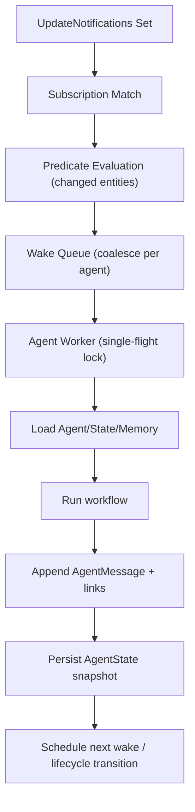

# Explicit Agents Foundation Layer Plan

Date: 2026-02-17
Status: Approved for implementation; execution order locked (no production code changes yet)
Scope: Foundation layer for explicit local-first agents (lifecycle, state, memory, wake/alertness, sync-safe storage)

## Objective

Introduce explicit agents (Gym Coach, Strategy Agent, Planner, etc.) with:

1. Lifecycle management (create, active, dormant, destroy)
2. Persisted state (local-first, multi-device sync)
3. Decaying memory (recent raw context + summarized long-term context)
4. Alertness mechanism (wake on data changes and wall-clock schedule)

Constraints:

- Reuse existing update notification stream and entry-link infrastructure.
- Do not model history as a single growing list/blob.
- Keep sync payload incremental and bandwidth efficient.

## Current System Findings (from code exploration)

1. Notifications are debounced `Set<String>` updates.
   - `lib/services/db_notification.dart`
   - Local updates: 100ms batch window.
   - Sync-origin updates: 1s batch window.

2. Notifications already include both semantic keys and entity IDs.
   - `lib/classes/journal_entities.dart`
   - `JournalEntity.affectedIds` mixes IDs with keys like `TASK`, `AI_RESPONSE`, etc.

3. Entry links are first-class, typed, and syncable.
   - `lib/classes/entry_link.dart`
   - `lib/database/database.drift`
   - `lib/features/sync/model/sync_message.dart`

4. Vector-clock style monotonic counters already exist (hostId -> counter map).
   - `lib/features/sync/vector_clock.dart`
   - `lib/services/vector_clock_service.dart`

5. Sequence-log based gap/backfill and idempotent sync tracking already exist.
   - `lib/features/sync/sequence/sync_sequence_log_service.dart`
   - `lib/database/sync_db.dart`

6. Timed AI refresh patterns exist, but are currently in-memory timers only.
   - `lib/features/ai/state/direct_task_summary_refresh_controller.dart`

## Architectural Decisions

## 1) Alertness via workflow subscriptions

Use existing `UpdateNotifications.updateStream` as primary wake signal.

Add persisted agent subscriptions and timers:

- `AgentSubscription`: event-driven wake rules
- `AgentTimer`: persisted wall-clock wake schedule

Subscription examples:

- `notify when TASK changed AND categoryId == gym`
- `notify when AI_RESPONSE linked to task X`
- `wake every day at 07:00 local timezone`

Runtime behavior:

1. Listen to `UpdateNotifications` once in an `AgentWakeOrchestrator`.
2. Classify incoming tokens into three classes:
   - semantic notification keys
   - subtype tokens
   - concrete entity IDs
3. Match subscriptions using all matchable token classes (keys + subtype tokens + explicit ID subscriptions).
4. Evaluate predicates against changed entities (bulk fetch only for real IDs).
5. Queue wake jobs with per-agent coalescing, deterministic `runKey`, and deterministic `threadId`.
6. Run agent workflow through single-flight lock per `agentId` and `runKey` dedupe.

Why this works:

- Reuses existing notification semantics and debounce behavior.
- Avoids direct coupling to specific feature controllers.
- Keeps wake logic deterministic and testable.

### Subscription token strategy (IDs + semantic types)

Decision:

- subscriptions match against the full token set emitted by `UpdateNotifications`, not only entity IDs.
- token prefiltering is used first, then entity predicates are evaluated for precision (for example `categoryId == gym`).

Token classes used by subscription matching:

- concrete entity IDs
- notification keys (`TASK`, `WORKOUT`, `DAY_PLAN`, `RATING`, etc.)
- domain subtype tokens already emitted by entities (for example `workout.data.workoutType`)

Subscription indexing contract:

- index supports all three classes explicitly (`semanticKey`, `subtypeToken`, `entityId`)
- `index.match(...)` receives combined matchable tokens, not only known notification keys
- non-ID tokens are never sent to entity lookup, avoiding wasted DB fetches

Examples:

- Gym Coach: key `TASK` + predicate `task.categoryId == gymCategoryId`
- Gym Coach: key `WORKOUT` (+ optional subtype token predicate for workout type)

### Agent-emitted notification tokens (explicit decision)

Because agents are not `JournalEntity` subtypes, they do not participate in `JournalEntity.affectedIds`.

Decision:

- Add agent notification keys (for example `agentChangedNotification`, `agentStateChangedNotification`, `agentMessageAppendedNotification`).
- Agent repositories/services must call `UpdateNotifications.notify({...})` for agent mutations.
- Emit both semantic keys and concrete IDs.

Examples:

- `notify({agentChangedNotification, agentId})`
- `notify({agentStateChangedNotification, agentId, stateId})`
- `notify({agentMessageAppendedNotification, agentId, messageId})`

## 2) Storage model (linked entries, no growing array)

Use granular persisted records:

- `Agent` (identity + lifecycle + config)
- `AgentState` (synced durable state snapshot)
- `AgentRuntimeState` (local-only runtime snapshot)
- `AgentMessage` (immutable log entry, one record per message)

Link records chain them:

- `agent -> currentState`
- `agent -> headMessage`
- `message -> prevMessage`
- `message -> payloadEntry` (optional large content object)
- `summaryMessage -> startMessage`
- `summaryMessage -> endMessage`

This guarantees append-only growth and sync incrementality.

Avoid:

- any parent object that contains `List<messages>` and is rewritten per append.

## 3) Agent state and memory decay

State carries:

- lifecycle and scheduling policy
- wake scheduling (`nextWakeAt`, `sleepUntil`)
- cursor/watermark for processed events (vector-clock map)
- memory pointers (`recentHeadMessageId`, `latestSummaryMessageId`)
- slots (goals/preferences/open loops)

Runtime state (local-only) carries:

- run status and active run/session IDs
- failure streak and other operational counters

Memory policy:

- hot memory: recent raw messages (count and token bounded)
- warm memory: summary messages that compress old ranges
- optional cold memory: summary-of-summaries for very long history

Compaction:

- summarize oldest raw span into one summary message
- keep raw immutable entries (optionally archived flag)
- update state pointers to include new summary

### Compaction producer, ordering, and failure handling

Decision:

- summaries are produced by an asynchronous `AgentMemoryCompactionService`.
- primary compaction path uses an LLM summarization call with a fixed prompt contract.
- fallback path uses deterministic rule-based extraction when LLM summarization is unavailable (rate limit, budget gate, provider outage).
- compaction is best-effort and non-blocking for foreground agent runs.

Ordering and durability:

- compaction candidates are persisted as jobs (`agentId`, `threadId`, `startMessageId`, `endMessageId`, `status`, `attemptCount`, `nextAttemptAt`).
- worker is single-flight per `(agentId, threadId)` to keep span ordering deterministic.
- summary message ID is deterministic from compaction span identity to avoid duplicate summaries on replay/concurrent devices.
- `AgentState` memory pointers are advanced only after summary message + links commit transactionally.

Failure behavior:

- on compaction failure, raw messages remain source of truth and pointers do not move.
- failures retry with bounded exponential backoff.
- fallback summarizer may run after configurable retry threshold or budget/rate-limit rejection.
- after max attempts, job is marked `failed_terminal` and can be retried manually/maintenance-triggered later.

## 4) Agent tool bed and function-call surface

Goal:

- expose UI-equivalent operations as explicit, capability-gated tools so agents can perform real work without bespoke feature coupling.

### 4.1 Tool execution architecture

Add a dedicated execution layer:

- `AgentToolRegistry`: declarative catalog (`name`, schema, capability, risk level, handler)
- `AgentCapabilityProfile`: per-agent-kind allowlist (`gym_coach`, `planner`, `strategy`, ...)
- `AgentToolExecutor`: validates schema, enforces capabilities, executes handlers, emits notifications, records results
- `AgentToolResult`: normalized success/error payload for memory and retry logic
- `AgentToolContractSpec` (companion artifact): source-of-truth tool I/O, permissions, and side effects

### 4.1.2 AgentToolContractSpec artifact definition

Canonical artifact and format:

- source file: `docs/agent_tools/agent_tool_contract_spec.yaml`
- validation schema: `docs/agent_tools/agent_tool_contract_spec.schema.json`
- optional generated human-readable view: `docs/agent_tools/agent_tool_contract_spec.md`

Why YAML as source-of-truth:

- easy review diffs for tool additions/permission changes
- schema-validated structure for machine checks
- can generate runtime/docs views without duplicating contracts

Required fields per tool entry (minimum):

- `name`
- `version`
- `capabilitiesRequired`
- `allowedWakeReasons`
- `inputSchemaRef`
- `outputSchemaRef`
- `idempotencyStrategy`
- `scopeRules` (category enforcement)
- `sideEffects` (entity types + notification tokens)
- `riskLevel`

Validation requirements:

- spec validates against JSON Schema in CI
- one-to-one parity test between `AgentToolRegistry` and `AgentToolContractSpec`
- capability/risk/scope metadata must match between registry and spec

Draft contracts:

```dart
enum AgentCapability {
  categoryRead,
  taskRead,
  taskWrite,
  checklistWrite,
  timeWrite,
  dayPlanRead,
  dayPlanWrite,
  ratingRead,
  ratingWrite,
}

enum AgentWakeReason {
  subscription,
  timer,
  userInitiated,
  recoveryCatchup,
  manual,
}

final class AgentAccessScope {
  const AgentAccessScope({
    required this.allowedCategoryIds,
  });

  final Set<String> allowedCategoryIds;
}

final class AgentToolCall {
  const AgentToolCall({
    required this.agentId,
    required this.threadId,
    required this.toolName,
    required this.operationId,
    required this.wakeReason,
    required this.scope,
    required this.arguments,
    this.previewOnly = false,
  });

  final String agentId;
  final String threadId;
  final String toolName;
  final String operationId; // idempotency key
  final AgentWakeReason wakeReason;
  final AgentAccessScope scope;
  final JsonMap arguments;
  final bool previewOnly;
}

final class AgentToolResult {
  const AgentToolResult({
    required this.success,
    required this.toolActionId,
    required this.toolName,
    required this.operationId,
    this.changedEntityIds = const [],
    this.changedTokens = const [],
    this.payload = const {},
    this.errorCode,
    this.errorMessage,
  });

  final bool success;
  final String toolActionId;
  final String toolName;
  final String operationId;
  final List<String> changedEntityIds;
  final List<String> changedTokens;
  final JsonMap payload;
  final String? errorCode;
  final String? errorMessage;
}
```

### 4.1.1 Category boundary enforcement hook

Core rule: every read/write tool execution is scoped by `Agent.allowedCategoryIds`.

- reads must include category filters derived from the scope
- writes must validate target entity category membership before mutation
- cross-category move/copy actions are blocked unless source and destination are both in scope
- scope violations return structured tool errors (`errorCode: "out_of_scope"`) and append a `toolResult` message

This avoids retrofitting every query path later and makes category safety a foundation concern.

### 4.2 Tool catalog (current vs planned)

Already available and should be reused:

- `set_task_language`
- `update_task_estimate`
- `update_task_due_date`
- `update_task_priority`
- `add_multiple_checklist_items`
- `update_checklist_items`
- `assign_task_labels`

New tools for UI parity:

- Category/context reads:
  `list_allowed_categories`, `list_tasks_in_scope`, `resolve_task_reference`
- Task lifecycle:
  `create_task`, `update_task_fields`, `create_follow_up_task`, `conclude_task_with_rollover`
- Checklist lifecycle:
  `create_checklist`, `move_checklist_items`, `move_checklist_items_to_new_task`
- Time capture:
  `create_retrospective_time_entry`, `start_task_timer`, `stop_task_timer`, `annotate_time_entry`
- Day planning:
  `get_or_create_day_plan`, `upsert_day_plan_blocks`, `pin_day_plan_tasks`, `replan_day_blocks`
- Ratings and productivity:
  `get_ratings_summary`, `get_rating_for_target`, `create_or_update_rating`

This directly covers:

- creating follow-up tasks from a finished task
- carrying remaining checklist items into a new task
- logging retrospective work sessions from dictated time ranges
- scheduling and revising day-plan time blocks
- reading productivity/session rating signals

### 4.3 Core tool contracts (high-value examples)

`create_follow_up_task`:

```json
{
  "operationId": "uuid",
  "sourceTaskId": "task-id",
  "newTaskTitle": "Next iteration",
  "carryOverOpenChecklistItems": true,
  "closeSourceTaskAs": "DONE",
  "preserveCategoryAndLabels": true
}
```

`create_retrospective_time_entry`:

```json
{
  "operationId": "uuid",
  "taskId": "task-id",
  "startedAt": "2026-02-17T16:00:00-05:00",
  "endedAt": "2026-02-17T18:00:00-05:00",
  "description": "Implemented migration + fixed failing test",
  "sourceEntryId": "audio-entry-id"
}
```

`move_checklist_items`:

```json
{
  "operationId": "uuid",
  "itemIds": ["item-1", "item-2"],
  "fromChecklistId": "checklist-a",
  "toChecklistId": "checklist-b",
  "preserveCheckedState": true
}
```

`upsert_day_plan_blocks`:

```json
{
  "operationId": "uuid",
  "planDate": "2026-02-18",
  "upserts": [
    {
      "id": "block-1",
      "categoryId": "cat-focus",
      "startTime": "2026-02-18T09:00:00-05:00",
      "endTime": "2026-02-18T11:00:00-05:00",
      "note": "Deep work"
    }
  ],
  "deletes": ["block-2"]
}
```

### 4.3.1 Action/toolResult payload model (non-black-box)

`AgentMessage.kind == action` must carry a typed action envelope:

- `actionType`: `tool_call | propose_plan | ask_user | lifecycle_transition`
- `toolName` (for `tool_call`)
- `operationId`
- `argumentsHash` (stable audit/replay guard)
- `scopeSnapshot` (`allowedCategoryIds` at execution time)

`AgentMessage.kind == toolResult` must carry:

- `actionRefId` (links result to action message)
- `status`: `success | error | partial`
- `changedEntityIds`
- `changedTokens`
- `errorCode/errorMessage` when failed

Foundation implication:

- `workflow.run(context)` emits explicit action + toolResult pairs, not opaque text-only thoughts.

### 4.4 Safety and determinism policy

- Every mutating tool requires `operationId` for idempotent retries/replays.
- `operationId` generation is deterministic from wake/run identity:
  `operationId = hash(runKey, actionOrdinal, toolName)`.
- High-risk tools (`conclude_task_with_rollover`, bulk moves, destructive updates) support `previewOnly` and explicit apply.
- Ambiguous target resolution never auto-writes:
  `resolve_task_reference` returns ranked candidates; caller must pass explicit `taskId` for writes.
- Mutations execute transactionally via repositories/persistence logic, then emit notification tokens (`ids + semantic keys`).
- Tool execution is logged as agent messages (`action` and `toolResult`) to keep memory/audit local-first and sync-safe.

### 4.5 Tool bed and sync/memory integration

- Each call appends immutable `AgentMessage` records.
- Tool-result messages link to affected entities through the new agent link variant metadata (`relation: tool_effect`).
- Sync remains incremental:
  one message append + changed domain entities/links; no parent blob rewrite.
- Alertness can subscribe to domain notifications generated by tool side effects, enabling chained workflows.

## Data Models (Dart draft)

```dart
typedef JsonMap = Map<String, Object?>;

enum AgentLifecycle { created, active, dormant, destroyed }
enum AgentInteractionMode { autonomous, interactive, hybrid }
enum AgentRunStatus { idle, queued, running, failed }
enum AgentMessageKind {
  observation, user, thought, action, toolResult, summary, system
}

final class AgentConfig {
  const AgentConfig({
    required this.schemaVersion,
    this.modelId,
    this.promptId,
    this.extension = const {},
  });

  final int schemaVersion;
  final String? modelId;
  final String? promptId;
  final JsonMap extension; // namespaced extension fields only
}

final class AgentSlots {
  const AgentSlots({
    this.primaryGoal,
    this.activeTaskId,
    this.openLoopIds = const [],
    this.preferenceByKey = const {},
    this.extension = const {},
  });

  final String? primaryGoal;
  final String? activeTaskId;
  final List<String> openLoopIds;
  final Map<String, String> preferenceByKey;
  final JsonMap extension; // namespaced extension fields only
}

final class AgentMessageMetadata {
  const AgentMessageMetadata({
    this.actionRefId,
    this.operationId,
    this.status,
    this.errorCode,
    this.errorMessage,
    this.extension = const {},
  });

  final String? actionRefId;
  final String? operationId;
  final String? status;
  final String? errorCode;
  final String? errorMessage;
  final JsonMap extension; // namespaced extension fields only
}

final class Agent {
  const Agent({
    required this.id,
    required this.kind,
    required this.displayName,
    required this.lifecycle,
    required this.mode,
    required this.allowedCategoryIds,
    required this.currentStateId,
    required this.createdAt,
    required this.updatedAt,
    this.destroyedAt,
    required this.config,
  });

  final String id;
  final String kind;
  final String displayName;
  final AgentLifecycle lifecycle;
  final AgentInteractionMode mode;
  final Set<String> allowedCategoryIds;
  final String currentStateId;
  final DateTime createdAt;
  final DateTime updatedAt;
  final DateTime? destroyedAt;
  final AgentConfig config;
}

final class AgentState {
  const AgentState({
    required this.id,
    required this.agentId,
    required this.revision,
    required this.updatedAt,
    this.lastWakeAt,
    this.nextWakeAt,
    this.sleepUntil,
    this.recentHeadMessageId,
    this.latestSummaryMessageId,
    this.processedCounterByHost = const {},
    required this.slots,
  });

  final String id;
  final String agentId;
  final int revision;
  final DateTime updatedAt;
  final DateTime? lastWakeAt;
  final DateTime? nextWakeAt;
  final DateTime? sleepUntil;
  final String? recentHeadMessageId;
  final String? latestSummaryMessageId;
  final Map<String, int> processedCounterByHost;
  final AgentSlots slots;
}

final class AgentRuntimeState {
  const AgentRuntimeState({
    required this.agentId,
    required this.runStatus,
    required this.updatedAt,
    this.activeRunId,
    this.activeSessionId,
    this.lastRunStartedAt,
    this.failureStreak = 0,
    this.hotMessageCount = 0,
  });

  final String agentId;
  final AgentRunStatus runStatus;
  final DateTime updatedAt;
  final String? activeRunId;
  final String? activeSessionId;
  final DateTime? lastRunStartedAt;
  final int failureStreak;
  final int hotMessageCount;
}

final class AgentMessage {
  const AgentMessage({
    required this.id,
    required this.agentId,
    required this.threadId,
    required this.kind,
    required this.createdAt,
    this.prevMessageId,
    this.contentEntryId,
    this.triggerSourceId,
    this.summaryStartMessageId,
    this.summaryEndMessageId,
    this.summaryDepth = 0,
    this.tokensApprox = 0,
    required this.metadata,
  });

  final String id;
  final String agentId;
  final String threadId;
  final AgentMessageKind kind;
  final DateTime createdAt;
  final String? prevMessageId;
  final String? contentEntryId;
  final String? triggerSourceId;
  final String? summaryStartMessageId;
  final String? summaryEndMessageId;
  final int summaryDepth;
  final int tokensApprox;
  final AgentMessageMetadata metadata;
}
```

### Data model clarifications

- `threadId` boundaries are explicit:
  autonomous runs use `agentId:run:<wakeId>`, interactive sessions use `agentId:session:<sessionId>`.
- `Agent.allowedCategoryIds` is the strict allow-list boundary enforced by tool/query execution.
- `AgentRuntimeState` is local-only and intentionally excluded from sync conflict resolution.
- `revision` is a local optimistic-write guard and debugging aid. Cross-device ordering/conflict handling is vector-clock based.
- `Agent`, `AgentState`, and `AgentMessage` use typed wrappers (`AgentConfig`, `AgentSlots`, `AgentMessageMetadata`) in Phase 0A.
- raw `JsonMap` is restricted to tool-call I/O and explicitly namespaced `extension` maps to prevent schema drift.

Thread policy implications:

- memory assembly is thread-first: load hot raw messages from the active thread, then include summary messages from prior threads.
- compaction is primarily per-thread; cross-thread summaries are only created as second-order compaction artifacts.

## Persistence and Sync Shape

Recommended persistence approach:

1. Persist `Agent`, `AgentState`, `AgentMessage` as individual records.
2. Persist `AgentRuntimeState` locally (not part of synced agent-domain payloads).
3. Persist relationships as typed `EntryLink` records.
4. Sync each new/updated shared record independently.

### Sync payload strategy (explicit decision)

To limit sequence-log/backfill complexity, do not add one payload type per agent table.

Decision:

- Add one agent-domain sync payload category (for example `agentEntity`) with subtype discriminator in payload body (`agent`, `agentState`, `agentMessage`, `agentSubscription`, `agentTimer`).
- `agentRuntimeState` is explicitly local-only and excluded from sync payloads.

Rationale:

- keeps `SyncSequencePayloadType` growth small
- avoids multiplying populate/backfill code paths
- preserves one sequence/backfill contract for all agent-domain records

Expected sync units per appended message:

- one new `AgentMessage`
- optional payload entry
- one or more new links
- one small `AgentState` update

This is bounded by new work, not by total history length.

## Lifecycle and Wake Flow

Interaction modes:

- autonomous: trigger-driven run (`subscription` / `timer`) then idle
- interactive: user-initiated conversational session (for example Pomodoro coach voice interaction)
- hybrid: autonomous monitoring plus ad-hoc interactive sessions

Foundation support required now:

- `userInitiated` wake reason in wake queue/jobs
- per-session thread IDs for interactive runs
- explicit action/toolResult message pairs in both autonomous and interactive modes



Temporal wake flow:

1. App startup loads persisted agent timers.
2. Scheduler sets nearest timer based on wall-clock.
3. Due timers enqueue wake jobs.
4. Timer row is advanced (next occurrence) transactionally.

Pseudo-code:

```text
onNotifications(affectedTokens, notificationBatchId):
  classified = tokenClassifier.classify(affectedTokens)
  changed = db.getJournalEntitiesForIds(classified.entityIds)
  for sub in index.match(classified.matchTokens):
    if sub.matchesTokens(classified) and
       sub.matchesEntities(changed) and
       isEligible(sub, now):
      runKey = runKeyFactory.subscription(
        agentId=sub.agentId,
        subscriptionId=sub.id,
        batchId=notificationBatchId,
      )
      threadId = threadPolicy.autonomous(agentId=sub.agentId, wakeId=runKey)
      wakeQueue.enqueueOrCoalesce(
        agentId=sub.agentId,
        reason="subscription",
        reasonId=sub.id,
        runKey=runKey,
        threadId=threadId,
      )

onTimerDue(timer, scheduledAt):
  runKey = runKeyFactory.timer(
    agentId=timer.agentId,
    timerId=timer.id,
    scheduledAt=scheduledAt,
  )
  threadId = threadPolicy.autonomous(agentId=timer.agentId, wakeId=runKey)
  wakeQueue.enqueueOrCoalesce(
    agentId=timer.agentId,
    reason="timer",
    reasonId=timer.id,
    runKey=runKey,
    threadId=threadId,
  )
  timerRepo.advance(timer)

onUserInitiated(agentId, sessionId, userInput):
  runKey = runKeyFactory.userInitiated(
    agentId=agentId,
    sessionId=sessionId,
    turnId=userInput.id,
  )
  threadId = threadPolicy.interactive(agentId=agentId, sessionId=sessionId)
  wakeQueue.enqueueOrCoalesce(
    agentId=agentId,
    reason="userInitiated",
    runKey=runKey,
    threadId=threadId,
    sessionId=sessionId,
    seedInput=userInput,
  )

worker(job):
  agentId = job.agentId
  if wakeRunLog.existsCompleted(job.runKey):
    return
  lock(agentId):
    wakeRunLog.markStarted(job.runKey)
    load agent/state
    if destroyed or sleeping: return
    mark running
    context = memoryAssembler.build(agentId, threadId=job.threadId)
    if job.reason == userInitiated:
      result = interactiveWorkflow.runSession(context, seedInput=job.seedInput)
    else:
      result = workflow.run(context)
    append action/toolResult messages + links // tool operationIds derive from job.runKey
    memoryCompactor.maybeCompact(agentId, threadId=job.threadId)
    state = reducer.apply(state, result) // shared synced state only
    runtimeState = runtimeReducer.apply(runtimeState, result) // local-only
    save state
    save runtimeState
    wakeRunLog.markCompleted(job.runKey)
    notify({agentStateChangedNotification, agentId, state.id})
```

## Timer recovery semantics (explicit policy)

Missed timers and wall-clock changes must be deterministic.

1. App offline for long periods with missed firings:
   - coalesce to one catch-up wake on recovery (not one wake per missed interval)
   - wake reason carries `timer_catchup` metadata
2. Clock jumps (NTP/manual correction):
   - recompute `nextRunAt` from persisted schedule intent
   - if overdue after recompute, enqueue one catch-up wake and advance
3. Timezone changes:
   - preserve wall-clock intent (for example “07:00 local” stays local)
   - recompute next run in new timezone
4. Multi-device duplicate firing of same schedule:
   - allow duplicate attempts
   - dedupe side effects via idempotent run key: `agentId + timerId + scheduledAt`

## Wake-run idempotency and event cursor strategy

There is no global event ID yet, but vector clocks already provide a robust cursor.

Wake-run idempotency contract:

- every wake job must carry a persisted `runKey` (not only timer wakes)
- `runKey` is deterministic by reason:
  - subscription: `hash(agentId, subscriptionId, notificationBatchId)`
  - timer: `hash(agentId, timerId, scheduledAt)`
  - user initiated: `hash(agentId, sessionId, turnId)`
- worker records `wakeRunLog(runKey, status)` and short-circuits already completed runs
- tool `operationId`s are derived from `runKey` + action ordinal, so crash/retry replays do not create new side effects

Use `AgentState.processedCounterByHost`:

- merged on every successful run (`max` per host)
- used to skip stale/replayed triggers
- persisted and synced with state

This directly fits existing host-keyed monotonic counter semantics.

## AgentState merge semantics (Phase 0B required decision)

Shared/synced fields:

- lifecycle
- sleep/timer policy fields
- memory pointers (`recentHeadMessageId`, `latestSummaryMessageId`)
- `slots`
- `processedCounterByHost`

Runtime fields (`runStatus`, `failureStreak`, `hotMessageCount`, active run/session ids) are moved to
`AgentRuntimeState` and are local-only, not sync-authoritative.

Deterministic merge rules for shared `AgentState`:

1. Dominating vector clock wins the whole snapshot, then apply field-specific merges below.
2. `processedCounterByHost`: merge with per-host `max`.
3. lifecycle precedence on concurrent clocks:
   `destroyed > dormant > active > created`.
4. pointers (`recentHeadMessageId`, `latestSummaryMessageId`):
   prefer descendant pointer when ancestry is known; otherwise use vector-clock-derived tie-break
   from referenced message/state metadata; if still concurrent/equal, tie-break by (`hostId`, `messageOrStateId`).
5. `slots`: per-slot merge using embedded slot timestamp metadata (`slotUpdatedAt`), then deterministic tie-break by hostId and slot key.
6. scheduling (`sleepUntil`, `nextWakeAt`):
   keep the earliest future wake and the latest sleep barrier; this prevents “sleep lost” races while still waking promptly.

No wall-clock (`updatedAt`) tie-break is used for merge-critical conflict resolution.

Consequence:

- two devices can run the same agent concurrently and still converge on shared state without oscillation.
- runtime execution details remain device-local and do not create cross-device merge churn.

## Database and Index Plan

New persisted entities/tables (or equivalent serialized records):

- `agents`
- `agent_states`
- `agent_runtime_states` (local-only)
- `agent_subscriptions`
- `agent_timers`
- `agent_messages`
- `agent_compaction_jobs` (local-only)

Entry link additions:

- new typed link variants for agent graph edges.

Index additions:

- `idx_agent_subscriptions_agent_active (agent_id, active)`
- `idx_agent_subscriptions_key_active (notification_key, active)`
- `idx_agent_timers_due (active, next_run_at)`
- `idx_agent_messages_agent_created (agent_id, created_at DESC)`
- `idx_agent_runtime_states_agent (agent_id)`
- `idx_agent_compaction_jobs_ready (status, next_attempt_at)`
- `idx_agent_compaction_jobs_thread_status (agent_id, thread_id, status)`
- `idx_linked_entries_type_from_hidden_created (type, from_id, hidden, created_at DESC)`
- `idx_linked_entries_type_to_hidden_created (type, to_id, hidden, created_at DESC)`

## Phased Implementation

## Execution Order (locked)

1. `Phase 0A` schema and persistence primitives
2. `Phase 0B` contracts and enforcement
3. Continue remaining phases in order (`1 -> 5`)

Immediate next step:

- start with `Phase 0A`.

## Phase 0A - Schema and persistence primitives

- Finalize model classes and repository interfaces.
- Replace raw persistent `JsonMap` fields in agent entities with typed wrappers:
  `AgentConfig`, `AgentSlots`, `AgentMessageMetadata`.
- Add migration(s) for new tables/indexes and link variants.
- Add serializers and conversion helpers.
- Split synced `AgentState` from local-only `AgentRuntimeState`.
- Define and codify `threadId` and `revision` semantics.
- Land persistence for `Agent.allowedCategoryIds` and interaction mode fields.
- Add schema-versioned wrapper serialization and extension-field validation rules.

Exit criteria:

- data can be created/loaded locally without runtime errors.
- migrations are stable across upgrade paths and preserve existing data.
- synced vs local-only state split is implemented in persistence layer.
- no untyped persistent `JsonMap` fields remain in `Agent`, `AgentState`, or `AgentMessage` (except wrapper `extension` maps).

## Phase 0B - Contracts and enforcement

- Finalize `AgentState` concurrent merge semantics.
- Define token classification contract (`semanticKey`, `subtypeToken`, `entityId`) and subscription index behavior.
- Define and test per-slot timestamp metadata for `slots` merge.
- Add `Agent.allowedCategoryIds` enforcement in tool/query execution paths.
- Define interaction mode contracts (`autonomous`, `interactive`, `hybrid`) and `userInitiated` wake job schema.
- Define deterministic enqueue-time `runKey`/`threadId` generation for all wake reasons.
- Add persisted wake-run log contract and replay behavior.
- Define action/toolResult envelope schema used by `AgentMessage.kind`.
- Define and codify explicit agent notification token emission contract.
- Publish companion `AgentToolContractSpec` at `docs/agent_tools/agent_tool_contract_spec.yaml`
  with schema `docs/agent_tools/agent_tool_contract_spec.schema.json`.

Exit criteria:

- merge rules are codified and covered by unit tests before runtime integration.
- category-scope enforcement is wired and deny-by-default tests pass.
- action/toolResult envelope contract is validated in unit/integration tests.
- wake-run replay idempotency is validated for subscription/timer/user-initiated paths.
- `AgentToolContractSpec` exists, validates against schema, and covers initial tool set with I/O and permission scopes.
- parity test enforces one-to-one alignment between registry tools and spec entries.
- wrapper schema invariants (`AgentConfig`/`AgentSlots`/`AgentMessageMetadata`) are validated with migration and round-trip tests.

## Phase 1 - Alertness foundation

- Implement `AgentSubscriptionRepository`.
- Implement `AgentWakeOrchestrator` subscribed to `UpdateNotifications`.
- Implement token classifier and subscription matching over all token classes.
- Implement `AgentWakeQueue` with coalescing, enqueue-time `threadId` assignment, per-agent lock, and `runKey` dedupe hooks.

Exit criteria:

- subscription-triggered wakes occur exactly once per coalesced batch.
- subtype-token subscriptions trigger correctly without non-ID fetch overhead.

## Phase 2 - Timer persistence

- Implement persisted wall-clock timers for agents.
- Implement scheduler bootstrap and due-job processing.
- Handle app restart/recovery and timezone-safe schedule recompute.
- Implement catch-up coalescing (single wake after downtime).
- Implement timer run keys under shared wake-run idempotency contract.

Exit criteria:

- due timers survive restart, reuse deterministic `runKey`/`threadId`, and fire once logically.

## Phase 3 - Memory and compaction

- Implement message append chain and state pointers.
- Implement memory assembler (hot + summary context).
- Implement persisted compaction job queue and worker.
- Implement LLM summarizer contract with deterministic fallback summarizer.
- Implement ordered per-thread compaction and transactional pointer advance.
- Implement retry/backoff and terminal-failure states for compaction jobs.
- Implement deterministic summary message IDs by compaction span identity.

Exit criteria:

- long history does not inflate context unboundedly.
- compaction failures never block agent runs or mutate pointers incorrectly.
- repeated/replayed compaction attempts do not create duplicate summary messages.

## Phase 4A - Agent payload sync plumbing

- Ensure all new entities/links flow through outbox/sync.
- Introduce one agent-domain sync payload type with subtype discriminator.
- Add sequence-log capture and population support for agent-domain records.

Exit criteria:

- agent-domain records sync end-to-end and sequence-log entries are complete.

## Phase 4B - Backfill and conflict hardening

- Add backfill request/response handling for agent-domain payloads.
- Add two-phase backfill confirmation for agent-domain subtype records.
- Validate concurrent edits and multi-device consistency against merge rules.

Exit criteria:

- incremental sync only sends new/changed records and links.
- backfill and conflict reconciliation pass targeted integration tests.

## Phase 5 - Tool bed rollout (UI parity)

- Implement `AgentToolRegistry`, `AgentCapabilityProfile`, and `AgentToolExecutor`.
- Reuse existing handlers/tools where possible and bridge them into registry execution.
- Add first new handlers:
  `create_follow_up_task`, `conclude_task_with_rollover`,
  `move_checklist_items`, `create_retrospective_time_entry`,
  `upsert_day_plan_blocks`, `get_ratings_summary`.
- Enforce `operationId` idempotency and `previewOnly` on high-risk handlers.
- Enforce `allowedCategoryIds` scope on every tool read/write path.
- Support interactive `userInitiated` runs in tool execution path (Pomodoro-style conversational sessions).
- Emit explicit `UpdateNotifications` tokens from all new agent-invoked mutations.

Exit criteria:

- Gym Coach can resolve task + log retrospective work session in one workflow.
- Planner can conclude task and carry open checklist items to a follow-up task.
- Strategy/Planner agents can read ratings/day-plan state and produce actionable updates.
- Pomodoro agent can run user-initiated interactive sessions using the same action/toolResult model.
- replaying the same `operationId` is side-effect free.

## Testing Strategy

Unit:

- subscription predicate matching and coalescing
- token classification and matching across semantic key, subtype token, and entity ID classes
- cursor/watermark merge rules
- compaction span correctness
- compaction job state machine (`pending -> running -> done/failed_terminal`) and retry backoff
- tool schema validation, capability gating, and idempotency (`operationId`) behavior
- task-resolution confidence thresholds and disambiguation responses
- category-scope enforcement tests (`allowedCategoryIds`) for reads and writes
- action/toolResult envelope validation for every tool invocation
- deterministic `operationId` derivation from `runKey` + action ordinal

Integration:

- create -> wake -> run -> append -> summarize
- restart recovery for timers and queued wakes
- sync replay/idempotency behavior
- conclude-with-rollover workflow preserves/moves checklist items correctly
- retrospective time entry creation links to task and optional source audio entry
- interactive `userInitiated` run path produces conversational action/toolResult sequence
- crash/retry replay of the same subscription wake preserves `runKey` and does not duplicate side effects
- LLM summarizer failure path preserves raw history and retries/falls back without pointer corruption

Multi-device sync:

- append messages on device A, receive on B
- concurrent runs from A and B converge under the defined field-level merge semantics
- duplicate tool execution attempts with same `operationId` converge to one logical mutation
- concurrent state updates with conflicting slots/schedule fields converge deterministically
- pointer conflicts converge using vector-clock-derived tie-break under skewed wall clocks
- concurrent compaction on two devices converges via deterministic summary ID and idempotent summary span links

Performance:

- append 10k+ message entries and verify read path bounded by context window
- verify sync payload size remains proportional to new messages only

## Risks and Mitigations

Risk: notification stream only provides keys/IDs, not full change payload.

Mitigation:

- fetch changed entities in bulk by ID for predicate evaluation.

Risk: duplicate wake executions during bursts.

Mitigation:

- per-agent lock and coalesced queue keys.

Risk: timer drift/timezone issues.

Mitigation:

- store timezone and schedule intent; recompute `nextRunAt` from wall-clock policy.

Risk: payload/backfill complexity from too many sync payload types.

Mitigation:

- use one agent-domain sync payload category with subtype discriminator.

Risk: ambiguous concurrent state merges.

Mitigation:

- Phase 0B field-level merge contract + dedicated tests before runtime wiring.

Risk: link traversal query cost at scale.

Mitigation:

- add type-aware indexes and dedicated typed link queries.

Risk: wrong task selected for retrospective time logging.

Mitigation:

- require explicit `taskId` on mutating time tools; keep resolution as separate ranked read tool.

Risk: tool surface area grows faster than quality controls.

Mitigation:

- capability-gated registry, phased rollout, schema tests, and high-risk preview/apply policy.

Risk: category boundary leaks from unconstrained query paths.

Mitigation:

- enforce `allowedCategoryIds` centrally in `AgentToolExecutor` + repository adapters; add deny-by-default tests.

Risk: interactive agent sessions diverge from autonomous workflow implementation.

Mitigation:

- share one action/toolResult execution contract and one memory model across `autonomous` and `userInitiated` runs.

Risk: subscription token semantics drift from runtime matcher implementation.

Mitigation:

- central token classifier + three-class index contract + tests for subtype-token trigger coverage.

Risk: wake retries after crash re-run with new ids and duplicate side effects.

Mitigation:

- persisted wake-run log keyed by deterministic `runKey` for every wake reason; derive tool operation IDs from `runKey`.

Risk: compaction depends on LLM availability/cost and can stall under rate limits.

Mitigation:

- persisted compaction job queue, bounded retries/backoff, budget-aware gating, and deterministic fallback summarizer.

Risk: asynchronous compaction races can advance pointers incorrectly.

Mitigation:

- single-flight per thread and transactional pointer advance only after summary + links commit succeeds.

## Finalized Decisions (2026-02-17)

1. Agent records will be persisted as dedicated entities/tables immediately (not as temporary `JournalEntity` subtypes).
2. Tombstone strategy will use soft-delete semantics retained for sync safety; hard-delete may happen later via retention policy/backlog work.
3. EntryLink modeling for agent graph edges will use a new explicit union variant with relation metadata (single variant that carries relation intent and typed metadata).
4. Agent repositories/services will emit explicit `UpdateNotifications` tokens for agent mutations.
5. Sync sequence/backfill will use a single agent-domain payload category with subtype discriminator.
6. Concurrent `AgentState` reconciliation will follow field-level deterministic merge semantics defined in Phase 0B.
7. Alertness subscriptions will match on full notification token sets (IDs + semantic keys + domain subtype tokens) and then apply entity predicates.
8. Agent tooling will use a capability-gated, idempotent function-call registry with explicit high-risk preview/apply support.
9. Strict category boundaries are first-class: `Agent.allowedCategoryIds` is mandatory and enforced on every tool read/write.
10. Agent interaction modes (`autonomous`, `interactive`, `hybrid`) are first-class; `userInitiated` wake reason is part of the foundation.
11. Runtime execution fields are split into local-only `AgentRuntimeState`, excluded from sync payloads.
12. `AgentMessage.kind` values `action` and `toolResult` follow a typed envelope contract (`actionRefId`, `operationId`, status/error fields).
13. Subscription matching is defined over three token classes (`semanticKey`, `subtypeToken`, `entityId`) with explicit classifier/index support.
14. Wake jobs for all reasons carry deterministic enqueue-time `runKey` and `threadId`; replay idempotency uses persisted wake-run log.
15. Pointer conflict resolution uses vector-clock-derived tie-breaks (no wall-clock tie-break).
16. Persistent agent domain fields must use typed wrappers (`AgentConfig`, `AgentSlots`, `AgentMessageMetadata`); raw maps are extension-only.
17. Memory compaction is asynchronous with LLM-first summarization plus deterministic fallback; failures are non-destructive and retryable.

### Consequences for implementation

- Phase 0A must include new persistence schema/migrations for dedicated agent entities.
- Phase 0A must enforce typed wrapper models (`AgentConfig`, `AgentSlots`, `AgentMessageMetadata`) for persistent agent fields.
- Sync payload contracts must treat these entities as first-class and preserve tombstone semantics.
- Phase 0B must include category-scope enforcement in tool/query execution paths.
- Phase 0B must include interactive wake-job schema and thread/session conventions.
- Phase 0B must publish `AgentToolContractSpec` as
  `docs/agent_tools/agent_tool_contract_spec.yaml` plus schema
  `docs/agent_tools/agent_tool_contract_spec.schema.json`.
- `EntryLink` extension should add one new agent-specific variant, with metadata fields sufficient for:
  - relation kind (`agent_state`, `agent_head`, `message_prev`, `summary_start`, `summary_end`, `message_payload`, etc.)
  - optional thread/message context
  - future-proofing for additional agent edge semantics without adding a new union case per edge.

## Definition of Done for Foundation Layer

- Agent lifecycle persisted and synced.
- Subscription-driven and timer-driven wakes both functional.
- User-initiated interactive wakes functional.
- Message history stored as linked immutable entries, not growing arrays.
- Memory compaction active with summary spans.
- Sync cost per new message remains incremental.
- MVP tool bed covers follow-up rollover, retrospective time logging, and day-plan block updates.
- Tool reads/writes obey `allowedCategoryIds` boundaries with deny-by-default behavior.
- Analyzer and targeted tests pass for touched modules.
