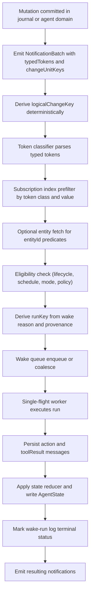
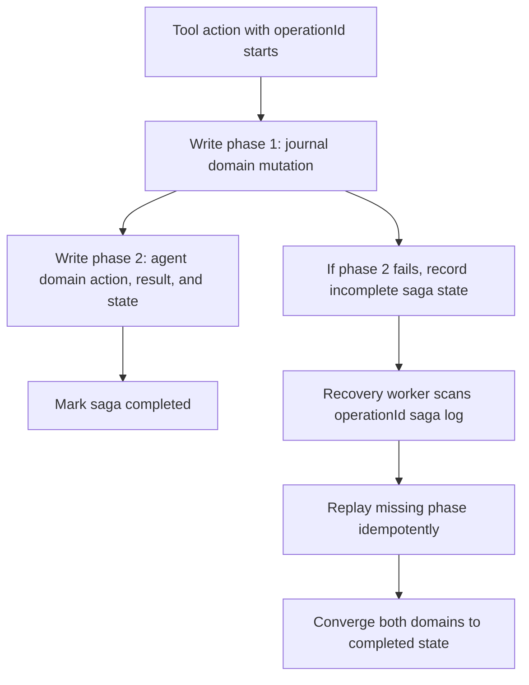

# Formal Model: Explicit Agents Foundation Layer

Date: 2026-02-18  
Status: Standalone specification (paper-grade formalization)  
Companion to: `docs/implementation_plans/2026-02-17_explicit_agents_foundation_layer.md`

## Abstract

This document formalizes the foundation-layer plan for explicit local-first agents as a deterministic distributed system over replicated state, append-only logs, typed notifications, and policy-gated side effects.

The goals are:

1. Replica convergence under concurrent device execution.
2. Idempotent replay of wake runs and mutating tool calls.
3. Deterministic wake deduplication across devices.
4. Strict boundary control (`NEED_TO_KNOW`) and fail-closed policy enforcement.
5. Separation of human source-of-truth (`db.sqlite`) from agent internals (`agent.sqlite`).

In addition to equations and invariants, this companion intentionally explains the operational mechanism in prose so implementation, review, and verification teams can share one mental model.

## Reader Guide and Glossary (Standalone)

This document is self-contained and can be read without the implementation plan.

Key terms:

- Agent: a persisted autonomous/interactive process with lifecycle, memory, and tool capabilities.
- Journal domain: human-authored/observed source-of-truth persisted in `db.sqlite`.
- Agent domain: AI-generated operational state persisted in `agent.sqlite`.
- Wake: a unit of agent execution triggered by subscription, timer, or user initiation.
- Run key: deterministic identifier for one wake execution attempt.
- Action stable ID: deterministic identity of one planned mutating action.
- Operation ID: deterministic idempotency key for one mutating tool action.
- Notification batch: typed change notification envelope used to trigger wakes.
- Change unit: canonical provenance tuple used to derive cross-device dedupe identity.
- `logicalChangeKey`: deterministic hash over sorted canonical change-unit keys.
- `NEED_TO_KNOW`: hard boundary rule that outbound payloads must be minimal and allowlisted.
- Saga: recovery protocol for cross-domain writes (`db.sqlite` and `agent.sqlite`) without assuming atomic multi-DB transactions.
- Slot version metadata: per-slot logical version counters used in concurrent merge rule #6.

## 0. End-to-End Mechanism (Narrative Walkthrough)

This section explains the whole mechanism in the same order it executes at runtime.

### 0.1 Two persistence domains with different trust roles

The architecture is anchored in a trust split.

- `db.sqlite` is the durable human source-of-truth (journal/task domain).
- `agent.sqlite` is the durable agent domain (state, messages, reports, links, wake bookkeeping).

This split is not cosmetic. It enforces that verbose AI internals can evolve, compact, or reset without contaminating human-authored records. The model treats cross-domain operations as a saga, not an atomic multi-DB transaction.

### 0.2 How a change becomes an agent wake

Any write that should be observable by agents emits notifications. The notification path does not rely on free-form strings in the steady state. Instead, each batch carries:

1. typed tokens (`typedTokens`) for matching,
2. canonical change provenance (`changeUnitKeys`) for dedupe identity,
3. deterministic `logicalChangeKey` for replay-safe wake keys.

The orchestrator consumes batches, classifies tokens by class, filters subscriptions through indexed token lookups, optionally loads changed entities for predicate checks, then enqueues deterministic wake jobs.

In formula form:

$$
m \xrightarrow{\operatorname{emit}} B
\xrightarrow{\operatorname{classify}} C(B)
\xrightarrow{\operatorname{match}} \Sigma_B
\xrightarrow{\operatorname{enqueue}} Q
$$

where:

$$
\Sigma_B=\{\sigma \in \Sigma \mid \operatorname{matches}(\sigma,B)=1\}.
$$

### 0.3 Why wake dedupe is separate from queue coalescing

Two independent concerns are modeled separately:

- Deduplication identity: "is this the same logical change as before?" (`logicalChangeKey`).
- Operational batching: "can nearby work be processed together?" (queue coalescing policy).

The plan requires key-preserving notifier coalescing: different `logicalChangeKey` values may never collapse into one batch. This prevents debounce-window timing artifacts from changing logical identity.

$$
B_i \sim B_j \iff \operatorname{LCK}(B_i)=\operatorname{LCK}(B_j)
$$

$$
\operatorname{coalesce}(B_i,B_j)\ \text{is valid} \iff B_i \sim B_j
$$

### 0.4 How a wake run executes safely

A wake job carries a deterministic `runKey` derived from reason-specific fields (subscription/timer/user). The runtime then:

1. checks lifecycle/sleep gates,
2. assembles memory context from immutable messages and summaries,
3. executes workflow steps producing explicit `action` and `toolResult` records,
4. applies deterministic state reduction,
5. records terminal wake status.

Mutating actions are idempotent through `operationId = H(runKey, actionStableId)`. Retries must reuse persisted planned actions, so replay does not re-plan with different action order.

State transition per run:

$$
(S_t,R_t) \xrightarrow{\operatorname{run}(r)} (S_{t+1},R_{t+1})
$$

with idempotency key:

$$
\operatorname{operationId}=H(\operatorname{runKey},\operatorname{actionStableId}).
$$

### 0.5 How concurrent devices still converge

Multiple devices may run the same agent concurrently. Convergence is obtained by:

- vector-clock dominance for causally ordered snapshots,
- deterministic per-field merge for concurrent snapshots,
- slot-level logical versions for rule #6 (no wall-clock conflict resolution),
- deterministic tie-breakers where ancestry or versions are equal.

The result is deterministic eventual convergence rather than "last writer by timestamp."

$$
\forall d_i,d_j \in D:\ \lim_{k\to\infty} S_{a,d_i}^{(k)}=\lim_{k\to\infty} S_{a,d_j}^{(k)}.
$$

### 0.6 How long-running memory stays bounded

Message history is append-only and link-based. Compaction is asynchronous and non-destructive:

- summarize an old span,
- persist a deterministic summary identity keyed by span + summarizer contract version,
- advance pointers only after successful summary commit.

If two devices produce different summary text for the same deterministic ID, first commit wins and conflicts are diagnosed instead of silently rewriting memory topology.

$$
\operatorname{summaryId}=H(\operatorname{spanIdentity},\operatorname{summarizerContractVersion})
$$

### 0.7 How policy boundaries are enforced

Policy is modeled as executable predicates, not advisory text.

- category/tool/provider predicates gate operations,
- `NEED_TO_KNOW` projections enforce boundary-specific allowlists,
- secure-store and privacy-confirmation checks gate inference,
- failures are explicit and fail closed.

This ensures that privacy and scope guarantees remain valid under retries, crashes, and concurrent execution.

$$
\operatorname{allow}(req)=
\operatorname{scopeOk}(req)\land
\operatorname{providerOk}(req)\land
\operatorname{privacyConfirmed}(req)\land
\operatorname{secretAvailable}(req)\land
\operatorname{ntkProjected}(req).
$$

### 0.8 Flow charts

#### Flow A: Change to wake to run to commit



#### Flow B: Concurrent merge decision

```mermaid
flowchart TD
  A["Two AgentState snapshots S1 and S2 arrive"] --> B["Compare vector clocks vc1 and vc2"]
  B -->| "vc1 < vc2" | C["Select S2"]
  B -->| "vc2 < vc1" | D["Select S1"]
  B -->| "vc1 || vc2" | E["Run deterministic field-level concurrent merge"]
  E --> F["Merge processed counters by max"]
  E --> G["Merge lifecycle by precedence order"]
  E --> H["Merge pointers by ancestry then deterministic tie-break"]
  E --> I["Merge failure counter by max"]
  E --> J["Merge slots by per-slot logical versions"]
  E --> K["Merge schedule by earliest wake and latest sleep barrier"]
  F --> L["Construct merged state S"]
  G --> L
  H --> L
  I --> L
  J --> L
  K --> L
```

#### Flow C: Cross-domain saga and recovery



#### Flow D: Boundary and provider gate checks

```mermaid
flowchart TD
  A["Requested tool or model operation"] --> B["Check category and capability scope"]
  B -->| "fail" | X["Reject: out_of_scope"]
  B -->| "pass" | C["If inference, check provider and model allowlist"]
  C -->| "fail" | Y["Reject: disallowed_provider_model"]
  C -->| "pass" | D["Check privacy confirmation receipt for current policyVersion"]
  D -->| "fail" | Z["Reject: privacy_confirmation_required"]
  D -->| "pass" | E["Resolve secretRefId from secure store"]
  E -->| "fail" | W["Reject: secret_unavailable"]
  E -->| "pass" | F["Apply NEED_TO_KNOW payload projection"]
  F -->| "overshared" | V["Reject: overshared_payload_blocked"]
  F -->| "valid" | G["Execute operation and persist result"]
```

## 1. System Model

### 1.1 Entities and replicas

Let:

- `D` be the finite set of devices (replicas), indexed by `d`.
- `A` be the set of agents, indexed by `a`.
- `T` be the set of threads, indexed by `t`.
- `M` be the set of immutable agent messages.
- `L` be the set of agent links (`AgentLink`) persisted in `agent.sqlite`.

Each device stores:

- journal domain database `J_d` (`db.sqlite`),
- agent domain database `G_d` (`agent.sqlite`),
- local runtime-only state `R_d` (in-memory only, never persisted; reconstructed on agent wake).

### 1.2 Time and causality

Causality is tracked by vector clocks.

- A vector clock is a map `vc: HostId -> N`.
- Partial order: `vc1 <= vc2` iff `forall h: vc1[h] <= vc2[h]`.
- Strict dominance: `vc1 < vc2` iff `vc1 <= vc2` and `exists h: vc1[h] < vc2[h]`.
- Concurrency: `vc1 || vc2` iff `not(vc1 <= vc2)` and `not(vc2 <= vc1)`.

Displayed form:

$$
vc_1 \preceq vc_2 \iff \forall h \in H,\ vc_1(h)\le vc_2(h)
$$

$$
vc_1 \prec vc_2 \iff \big(vc_1 \preceq vc_2\big)\land \exists h \in H:\ vc_1(h)<vc_2(h)
$$

$$
vc_1 \parallel vc_2 \iff \neg(vc_1 \preceq vc_2)\land \neg(vc_2 \preceq vc_1)
$$

No merge-critical rule may use wall-clock timestamps as primary conflict resolution.

Interpretation: wall-clock is useful for UX and scheduling, but unsafe as a conflict authority in a distributed local-first system. Causality and deterministic tie-breaks must dominate.

## 2. Typed State Definitions

### 2.1 Agent durable state

For each agent `a`, synced durable state is:

`S_a = (lifecycle, schedule, pointers, slots, processedCounterByHost, consecutiveFailureCount, vc)`

$$
S_a=\big(
\ell_a,\ \sigma_a,\ \pi_a,\ \operatorname{slots}_a,\ pc_a,\ f_a,\ vc_a
\big)
$$

where:

- `lifecycle in {created, active, dormant, destroyed}`,
- `schedule = (sleepUntil, nextWakeAt, timerPolicy...)`,
- `pointers = (recentHeadMessageId, latestSummaryMessageId, ...)`,
- `processedCounterByHost: HostId -> N`,
- `consecutiveFailureCount in N`,
- `vc` is the state vector clock.

### 2.2 Slot state with embedded logical versions (merge rule #6)

`slots` is:

`slots = (primaryGoal, activeTaskId, openLoopIds, preferenceByKey, extension, V_slots)`

$$
\operatorname{slots}_a=
\Big(
g_a,\ t_a,\ o_a,\ p_a,\ x_a,\ V_a
\Big)
$$

$$
V_a=\big(
v^{goal}_a,\ v^{task}_a,\ v^{open}_a,\ v^{pref}_a,\ v^{ext}_a
\big),\quad
v^{*}_a\in\mathbb{N}
$$

with per-slot logical versions:

- `primaryGoalVersion in N`,
- `activeTaskIdVersion in N`,
- `openLoopIdsVersion in N`,
- `preferenceByKeyVersion in N`,
- `extensionVersion in N`.

These fields are embedded slot-version metadata and are mandatory for deterministic slot merge.

Interpretation: slot values by themselves are insufficient for deterministic concurrent merge. The version fields make each slot an explicit logical register.

### 2.3 Runtime local state

Runtime local state `R_a,d` includes:

- `runStatus`, `failureStreak`, `hotMessageCount`, active run/session IDs.

`R_a,d` is in-memory only — never persisted, never synced. It is reconstructed from `S_a` on each agent wake.

Interpretation: transient operational counters exist only during a wake's execution. On crash, device loss, or normal wake completion, runtime state is simply discarded. The next wake reconstructs it from durable `AgentState`.

## 3. Notification and Wake Formalization

### 3.1 Typed token model

A typed notification token is:

`tau = (tokenClass, tokenNamespace?, tokenValue)`

$$
\tau=\big(c,\ n,\ v\big),\quad
c\in\{\text{semanticKey},\text{subtypeToken},\text{entityId}\}
$$

with:

- `tokenClass in {semanticKey, subtypeToken, entityId}`,
- `tokenNamespace` required iff `tokenClass = subtypeToken`.

Canonical token identity:

`tokenKey(tau) = tokenClass + "|" + (tokenNamespace or "-") + "|" + tokenValue`

$$
\operatorname{tokenKey}(\tau)=c \parallel \text{"|"} \parallel (n\ \text{or}\ \text{"-"}) \parallel \text{"|"} \parallel v
$$

Interpretation: matching/indexing behavior is defined by structure, not by ad hoc string parsing.

### 3.2 Change units

A canonical change unit is:

`c = (origin, hostId, counter, payloadType, payloadId)`

$$
u=\big(o,\ h,\ k,\ p_t,\ p_i\big),
\quad o\in\{\text{sync},\text{local}\},\ k\in\mathbb{N}
$$

where:

- `origin in {sync, local}`,
- `counter in N` is monotonic per host.

Source of truth:

- `sync` origin from applied sync provenance + sequence-log tuple.
- `local` origin from committed local-write vector-clock provenance.

Canonical change-unit string:

`canon(c) = "v1|" + origin + "|" + hostId + "|" + counter + "|" + payloadType + "|" + payloadId`

Change-unit key:

`cuk(c) = SHA256_HEX(canon(c))`

$$
\operatorname{canon}(u)=
\text{"v1|"}\parallel o\parallel \text{"|"}\parallel h\parallel \text{"|"}\parallel k\parallel \text{"|"}\parallel p_t\parallel \text{"|"}\parallel p_i
$$

$$
\operatorname{cuk}(u)=\operatorname{SHA256}_{hex}\!\big(\operatorname{canon}(u)\big)
$$

### 3.3 NotificationBatch identity

A notification batch is:

`B = (localBatchId, logicalChangeKey, changeUnitKeys, typedTokens, affectedTokens?, sourceCursor?)`

$$
B=\big(b_{local},\ lck,\ K_B,\ T_B,\ A_B,\ cur_B\big)
$$

where:

- `changeUnitKeys` is sorted and unique,
- `affectedTokens` is legacy migration-only mirror.

Deterministic `logicalChangeKey`:

`logicalChangeKey(B) = SHA256_HEX("v1|" + join(changeUnitKeys, ","))`

$$
\operatorname{LCK}(B)=
\operatorname{SHA256}_{hex}\!\left(
\text{"v1|"}\parallel
\operatorname{join}\!\big(\operatorname{sort}(\operatorname{unique}(K_B)),\text{","}\big)
\right)
$$

Interpretation: two replicas that observe the same logical change provenance compute the same wake identity even if local batching timing differs.

### 3.4 Coalescing rule

Notifier coalescing is key-preserving:

- only batches with equal `logicalChangeKey` may be merged,
- batches with different `logicalChangeKey` must remain distinct.

This yields an equivalence relation over pending notifications:

`B_i ~ B_j` iff `logicalChangeKey(B_i) = logicalChangeKey(B_j)`.

$$
B_i \sim B_j \iff \operatorname{LCK}(B_i)=\operatorname{LCK}(B_j)
$$

### 3.5 Subscription matching

A subscription `sigma` is:

`sigma = (TokenPred, EntityPred, EligibilityPred, scope)`

$$
\sigma=\big(P_T,\ P_E,\ P_{elig},\ scope\big)
$$

A batch `B` matches `sigma` iff:

1. `TokenPred(B.typedTokens)` is true,
2. `EntityPred(changedEntities(entityIds(B.typedTokens)))` is true,
3. `EligibilityPred(now, agentState)` is true.

$$
\operatorname{matches}(\sigma,B)=
P_T(T_B)\land
P_E\!\big(\operatorname{changedEntities}(\operatorname{entityIds}(T_B))\big)\land
P_{elig}(now,S)
$$

Only `entityId` tokens trigger entity fetches.

Interpretation: semantic/subtype matching stays index-first and cheap; expensive fetches are reserved for predicates that truly need entities.

## 4. Deterministic Merge Operator for `AgentState`

Define merged state:

`S = merge(S1, S2)`

$$
S=\operatorname{merge}(S_1,S_2)
$$

### 4.1 Dominance case

If `vc1 < vc2`, return `S2`.  
If `vc2 < vc1`, return `S1`.

$$
\operatorname{merge}(S_1,S_2)=
\begin{cases}
S_2,& vc_1\prec vc_2\\
S_1,& vc_2\prec vc_1\\
\operatorname{merge}_{\parallel}(S_1,S_2),& vc_1\parallel vc_2
\end{cases}
$$

### 4.2 Concurrent case (`vc1 || vc2`)

Field-wise deterministic merge:

1. `processedCounterByHost[h] = max(S1[h], S2[h])`.
2. `lifecycle` by precedence:
   `destroyed > dormant > active > created`.
3. pointers:
   prefer descendant pointer if ancestry known;
   else deterministic tie-break by referenced metadata;
   final tie-break by `(hostId, pointerId)`.
4. `consecutiveFailureCount = max(c1, c2)`.
5. `slots`: per-slot comparison by slot version fields
   (`primaryGoalVersion`, `activeTaskIdVersion`, `openLoopIdsVersion`,
   `preferenceByKeyVersion`, `extensionVersion`);
   ties broken deterministically by `(hostId, slotKey)`.
6. schedule:
   earliest future wake for wake promptness,
   latest sleep barrier for sleep safety.

Concurrent-field equations:

$$
pc[h]=\max\{pc_1[h],pc_2[h]\}
$$

$$
f=\max\{f_1,f_2\}
$$

$$
\ell=\max_{\succ}\{\ell_1,\ell_2\},\quad
\text{where } \text{destroyed}\succ\text{dormant}\succ\text{active}\succ\text{created}
$$

$$
nextWakeAt=\min\{nextWakeAt_1,nextWakeAt_2\}_{future},\quad
sleepUntil=\max\{sleepUntil_1,sleepUntil_2\}
$$

No wall-clock tie-breaks are permitted in merge-critical decisions.

Interpretation: convergence depends on deterministic logic over causal metadata, not on clock quality.

## 5. Convergence Theorem (Replica Level)

### Theorem 1 (Deterministic convergence)

Assume:

1. all synced updates are eventually delivered to all online replicas,
2. each replica applies `merge` exactly as specified,
3. tie-break keys are globally deterministic.

Then all replicas converge to the same `AgentState` for each agent.

$$
\forall a\in A,\ \forall d_i,d_j\in D:\ 
\operatorname{deliverAll}(a)\Rightarrow
\lim_{k\to\infty} S_{a,d_i}^{(k)}=\lim_{k\to\infty} S_{a,d_j}^{(k)}
$$

### Proof sketch

In dominance cases, result is unique by partial order.  
In concurrent cases, each field rule is deterministic and symmetric over inputs:

- `max` rules are commutative/associative/idempotent,
- precedence and tie-break rules define total deterministic selections,
- per-slot version comparison is deterministic with deterministic tie-break.

Thus repeated/reshuffled application yields a unique fixed point per update set.

Practical implication: device order, retry order, and message interleavings may differ, but final merged state does not.

## 6. Wake and Side-Effect Idempotency

### 6.1 Run keys

For wake reason `r`, deterministic run key:

- subscription: `runKey = H(agentId, subscriptionId, logicalChangeKey)`,
- timer: `runKey = H(agentId, timerId, scheduledAt)`,
- user initiated: `runKey = H(agentId, sessionId, turnId)`.

$$
\operatorname{runKey}(a,r)=
\begin{cases}
H(a,\operatorname{subId},\operatorname{LCK}) & r=\text{subscription}\\
H(a,\operatorname{timerId},t_{sched}) & r=\text{timer}\\
H(a,\operatorname{sessionId},\operatorname{turnId}) & r=\text{userInitiated}
\end{cases}
$$

Wake run log stores terminal status in:

`{completed, skipped_sleeping, skipped_destroyed, failed_terminal}`.

### 6.2 Action idempotency

Each planned mutating action has stable identity:

`actionStableId = H(toolName, canonicalArgsHash, scopeSnapshot, targetRefs)`

Tool operation identity:

`operationId = H(runKey, actionStableId)`

$$
\operatorname{actionStableId}=
H(\operatorname{toolName},\operatorname{canonicalArgsHash},\operatorname{scopeSnapshot},\operatorname{targetRefs})
$$

$$
\operatorname{operationId}=H(\operatorname{runKey},\operatorname{actionStableId})
$$

Replays must reuse persisted action plans for the same `runKey`.

Interpretation: determinism is guaranteed by persisting intent before side effects, then replaying the same intent.

### Theorem 2 (No duplicate logical mutation under replay)

Given idempotent handlers keyed by `operationId` and persisted action-plan reuse,
crash/retry replay cannot create a second logical mutation for the same action.

$$
\forall r,\alpha:\ 
\operatorname{replay}(r,\alpha)\Rightarrow
\left|\operatorname{logicalMutations}\big(\operatorname{operationId}(r,\alpha)\big)\right|=1
$$

Operationally, this is the core anti-duplication guarantee for tool writes.

## 7. Cross-Domain Saga Correctness (`db.sqlite` + `agent.sqlite`)

For mutating workflows crossing domains:

1. journal mutation commits first (idempotent by `operationId`),
2. agent-domain action/result/state commits second with same `operationId`,
3. recovery scanner retries incomplete operations until terminal.

Saga record:

`(operationId, phase, status, lastError, updatedAt)`.

$$
\operatorname{sagaRow}=
\big(\operatorname{operationId},\operatorname{phase},\operatorname{status},\operatorname{lastError},\operatorname{updatedAt}\big)
$$

Interpretation: this is the minimal state machine needed to recover partial cross-domain writes without pretending two SQLite files are one atomic transaction.

### Theorem 3 (Eventual cross-domain consistency)

If journal and agent mutations are individually idempotent by `operationId`
and recovery retries continue, both domains converge to a consistent post-state.

$$
\forall op:\ 
\operatorname{idempotent}_J(op)\land
\operatorname{idempotent}_G(op)\land
\operatorname{recoveryEventuallyRuns}(op)
\Rightarrow
\operatorname{consistentAcrossDomains}(op)
$$

The system therefore prioritizes recoverable determinism over strict distributed atomicity.

## 8. Memory Compaction Formalization

Compaction job:

`job = (agentId, threadId, startMessageId, endMessageId, status, attemptCount, nextAttemptAt)`

Deterministic summary ID:

`summaryId = H(spanIdentity, summarizerContractVersion)`

$$
job=\big(a,t,m_{start},m_{end},status,attempts,nextAttemptAt\big)
$$

$$
\operatorname{summaryId}=H(\operatorname{spanIdentity},\operatorname{summarizerContractVersion})
$$

If same `summaryId` appears with divergent content:

- keep first committed summary content,
- record conflict diagnostics,
- do not roll back pointers.

This preserves monotonic pointer evolution and idempotent compaction replay.

Interpretation: compaction is never allowed to destabilize lineage or pointer consistency.

## 9. Policy and Boundary Semantics

### 9.1 NEED_TO_KNOW projection

For boundary type `b` and operation `o`, define allowlist projection:

`pi_(b,o): Payload -> Payload`

with guarantee:

`fields(pi_(b,o)(x)) subseteq allowlist(b,o,policyVersion)`.

$$
\pi_{b,o}: \mathcal{P}\rightarrow\mathcal{P}
$$

$$
\operatorname{fields}\!\big(\pi_{b,o}(x)\big)\subseteq \operatorname{allowlist}(b,o,\operatorname{policyVersion})
$$

Any non-allowlisted field causes fail-closed rejection (`overshared_payload_blocked`).

Interpretation: privacy boundaries are machine-enforced and testable at payload construction time.

### 9.2 Provider and secret constraints

Inference call allowed iff all predicates hold:

1. provider/model tuple allowed by (`agent`, `category`) policy,
2. valid privacy confirmation receipt exists for current policy version,
3. secret lookup by `secretRefId` succeeds in host secure store.

Otherwise fail closed (`out_of_scope`, `privacy_confirmation_required`, `secret_unavailable`).

Interpretation: uncertainty and missing prerequisites block execution by design, rather than degrading into permissive behavior.

## 10. Safety Invariants

For all executions:

1. Agent internals are persisted only in `agent.sqlite`; journal remains human source-of-truth.
2. Agent internal links are represented only as `AgentLink` records in agent domain.
3. Notification classification is canonical from `typedTokens` (legacy parsing is migration-only).
4. Wake dedupe identity is `logicalChangeKey`, never `localBatchId`.
5. Every run reaching `markStarted` reaches a terminal wake-run status.
6. Mutating side effects are keyed by deterministic `operationId`.
7. Boundary payloads obey `NEED_TO_KNOW` allowlists.

Together, these invariants define the safety envelope for correctness, privacy, and replay behavior.

Compact invariant form:

$$
\forall \text{exec } e:\ 
\Big(
\operatorname{agentInternalsInAgentDb}(e)\land
\operatorname{agentLinksOnlyInAgentDomain}(e)\land
\operatorname{typedTokenCanonical}(e)\land
\operatorname{dedupeKeyIsLCK}(e)\land
\operatorname{startedRunsReachTerminal}(e)\land
\operatorname{mutationsKeyedByOperationId}(e)\land
\operatorname{ntkAllowlistRespected}(e)
\Big).
$$

## 11. Test Obligations (Formal)

Implementation is compliant only if tests witness:

1. deterministic `logicalChangeKey` from canonical change units,
2. key-preserving coalescing (no cross-key merge),
3. typed-token namespace validity and rejection of malformed legacy tokens,
4. per-slot version merge determinism under concurrent updates,
5. replay idempotency for `runKey` and `operationId`,
6. crash-between-domain-commit saga recovery convergence,
7. fail-closed policy outcomes for all boundary and provider gates.

These obligations make the model falsifiable: each guarantee corresponds to concrete tests that can fail if implementation drifts.

Formal compliance predicate:

$$
\operatorname{Compliant} \iff
\bigwedge_{i=1}^{7}\operatorname{TestObligation}_i=\text{pass}
$$

## 12. Scope Notes

This specification is standalone for mechanism comprehension and verification.
It defines correctness, replay, convergence, and boundary guarantees in full.

What it does not attempt to optimize:

- UI ergonomics and interaction design details,
- product-level prioritization and rollout sequencing,
- non-functional optimization choices beyond required correctness/safety contracts.

The companion implementation plan remains useful for delivery sequencing, but not required to understand the mechanism defined here.
