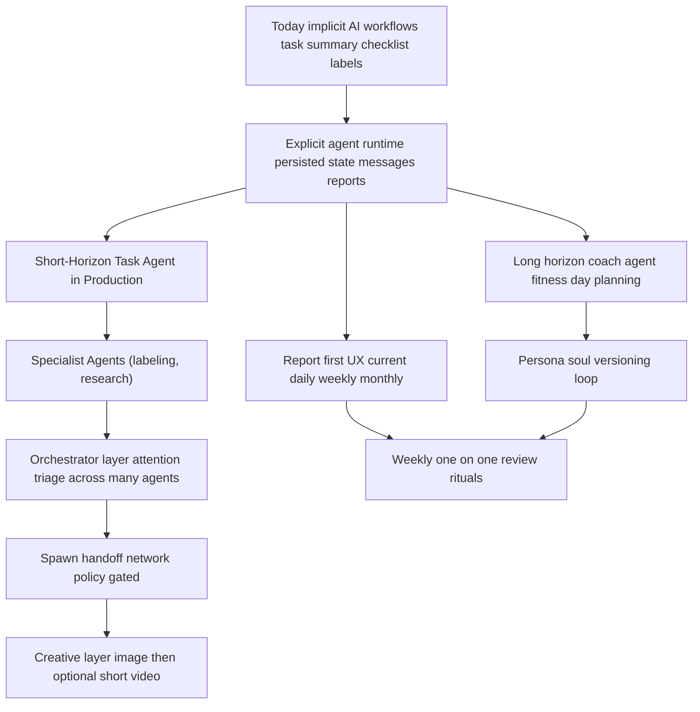

# Agentic Product Direction: Privacy-First Personal Assistant

Status: Draft for product alignment
Date: 2026-02-19
Companion docs:
- `docs/implementation_plans/2026-02-17_explicit_agents_foundation_layer.md`
- `docs/implementation_plans/2026-02-17_explicit_agents_foundation_layer_formal_model.md`

## 1. Outcome

Define the product direction for explicit, persistent agents in Lotti, then check whether the foundation-layer architecture can support that direction without compromising privacy, local-first operation, and user control.

This document is intentionally standalone and readable without the foundation plan open.

## 2. Product Thesis

Lotti should evolve from prompt-triggered automations into a system of explicit agents that:

1. are goal-directed,
2. keep durable state across wake/sleep cycles,
3. act on triggers with bounded autonomy,
4. converge across devices,
5. maintain a continuously available user-facing report,
6. preserve strict separation between human-authored source-of-truth and AI-generated internal artifacts.

The product should feel personal and alive (agent personality, character, tone), while remaining privacy-first and policy-constrained.

## 3. Core Principles

1. Human data is sacred.
2. AI internals are useful but disposable.
3. Every agent wake must produce durable progress (state/report update, action, or explicit no-op rationale).
4. Reports are first-class artifacts, not transient responses.
5. Any cross-boundary transfer follows `NEED_TO_KNOW`.
6. Agents are mostly asleep; they wake on signals, work, persist, and sleep again.
7. The system must scale to many agents without requiring all of them in memory.
8. User control always dominates automation (approval gates, pause/resume, kill switch).

## 4. Current State ("Is")

From current code and feature docs:

1. AI-assisted task workflows exist today:
   - smart task-summary triggers,
   - checklist creation/suggestion function-calling,
   - language updates,
   - image analysis hooks tied to tasks.
2. Label assignment already has a specialized AI flow with category guardrails and telemetry.
3. Multi-device sync is strong (vector clocks, sequence/backfill, ordered processing, self-healing patterns).
4. AI chat exists, but persistence is still described as a high-priority future enhancement.
5. Current agent-like behavior is mostly implicit and workflow-specific, not represented as explicit persistent agent entities with independent lifecycle and policy.

Net: the building blocks are strong, but orchestration and persistence are currently automation-centric rather than explicit-agent-centric.

Evidence anchors:
- `lib/features/ai/README.md`
- `lib/features/tasks/README.md`
- `lib/features/labels/README.md`
- `lib/features/sync/README.md`
- `lib/features/speech/README.md`
- `lib/features/ai_chat/README.md`

## 5. Target Product Direction ("To Be")

### 5.1 Agent classes

1. Task Execution Agent (short horizon, minutes to weeks)
   - Owns one task's progress state.
   - Reacts to new recordings/images/text updates.
   - Performs checklist/task-management tool actions.
   - Maintains latest task report.
2. Long-Running Coach Agents (fitness, day planning)
   - Persist over months/years.
   - Maintain decaying memory and longitudinal trend summaries.
   - Run weekly one-on-one reviews and adapt coaching style.
3. Labeling Specialist Agent
   - Curates labeling quality and consistency per category.
   - Serves as a callable specialist tool for other agents.
4. Research/Briefing Agent
   - Collects local evidence, optionally uses model-grounded web research, and produces citable reports.
   - Runs iterative Q&A/questionnaire loops with the user.
5. Orchestrator Agent(s)
   - Triage attention across many sleeping/active agents.
   - Prioritize, defer, escalate, or request user attention.
6. Creative/Art Director Agent
   - Produces visual reflections (images; later short video) aligned with user taste and feedback.

### 5.2 Agent experience requirements

1. Each agent has an always-available latest report (no LLM recompute required to view current state).
2. Agents can hand off or spawn bounded child work under strict policy.
3. Personality is explicit and evolvable over time.
4. "Soul" profile should be versioned (`soul.md`-like artifact model) and reviewable.
5. Agent feedback loops (for example weekly one-on-ones) can tune goal interpretation and communication tone.

### 5.3 Data ownership boundary

1. Human-authored journal remains authoritative and durable.
2. Agent internal artifacts (reasoning traces, interim memory, internal links) stay in agent domain only.
3. Cross-domain linking is minimal and user-facing (for example jump from task/journal to latest agent report).

## 6. Formal Product Model (Readable Math)

Let an agent instance be:

`A_i(t) := <id_i, kind_i, goal_i(t), persona_i(v,t), policy_i, state_i(t), memory_i(t), reportHead_i(t), caps_i, budget_i(t)>`

Where:

1. `goal_i(t)` can be rewritten over time with user feedback.
2. `persona_i(v,t)` is versioned identity/communication profile (candidate home for `soul.md` semantics).
3. `reportHead_i(t)` points to latest report artifact for scope `current|daily|weekly|monthly`.

Wake semantics:

`wake(A_i, e_k) -> run r_k -> {actions, toolResults, state', report'} -> persist -> sleep`

Memory decay (conceptual):

`memory_i(t+1) = Decay(memory_i(t), lambda_i, compactionPolicy_i) + NewEvidence_i(t+1)`

Orchestration objective (conceptual):

`selectAttention(U, Agents) = argmax_i Priority_i(impact, urgency, risk, userGoals, fatigue, confidence)`

Boundary projection:

`payload_B = Project_NEED_TO_KNOW(context, boundary=B, allowlist_B)`

for `B in {handoff, spawn, provider}`.

## 7. Capability Roadmap (No Dates)

### 7.1 Runtime lifecycle shape

### 7.2 Transformation roadmap

## 8. Foundation Alignment Check

Assessment baseline: `docs/implementation_plans/2026-02-17_explicit_agents_foundation_layer.md`

| Direction requirement | Foundation support | Assessment |
|---|---|---|
| Separate human vs AI domains | `agent.sqlite` split + "no internal agent state in journal domain" + dedicated `AgentLink` | Supported |
| Multi-device convergent agent state | vector-clock-style merge model + sync payload strategy + backfill/conflict hardening phases | Supported |
| Wake/rehydrate/sleep at scale | alertness subscriptions + timer wakes + persistent runtime/state model | Supported |
| Always-available latest report | `AgentReport` + `AgentReportHead` contract + freshness rules | Supported |
| NEED_TO_KNOW boundary minimization | explicit boundary policy for handoff/spawn/provider payloads | Supported |
| Provider/model restrictions and no random egress | provider/model access policy, deny-by-default network egress, category tool contracts | Supported |
| Human control and safety | approval engine, kill switches (global/per-agent/tool-class), policy denials | Supported |
| Spawn/handoff protocol | orchestrator-mediated typed `SpawnRequest` with budget and policy gates | Supported (contract-first, staged enablement) |
| Labeling specialist as callable capability | tool bed + category enforcement + existing labels guardrails | Supported |
| Many agents with orchestrated attention | primitives exist (runtime, spawn, reports), but orchestrator decision policy is not yet fully specified | Partial |
| Persona as durable versioned identity (`soul.md`) | prompt/model references exist; no first-class versioned persona artifact model yet | Gap |
| Weekly one-on-one style calibration loops | interactive wake and report primitives exist; explicit coaching-review workflow contract not yet specified | Partial |
| Research-grade report workflow with citations/questionnaires | report primitives exist; citation/provenance strictness and structured questionnaire UI contracts are not yet explicit | Partial |
| Creative media progression (image -> video) with feedback memory | generic tool framework exists; media-specific policy, artifact schema, and budget controls need explicit product contracts | Partial |
| Rebuildability of agent domain from human source-of-truth | domain separation enables this; explicit rehydration/reconstruction strategy is not yet specified | Partial |

## 9. Gaps to Add (Product-Level Contracts)

To fully support this direction, add these contracts on top of the foundation.

### 9.1 Persona/Soul Artifact Contract

Purpose: make personality a first-class, versioned runtime input instead of prompt-only convention.

1. Contract surface
   - `AgentPersonaVersion` (append-only)
   - `AgentPersonaHead` (current active version pointer per agent)
2. Required fields
   - `personaVersionId`, `agentId`, `version`, `status` (`draft|active|archived`)
   - `voiceDirectives`, `toneBounds`, `coachingStyle`, `antiSycophancyPolicy`
   - `diffFromVersion`, `authoredBy` (`user|agent|system`), `approvedBy`, `approvedAt`
   - `sourceSessionId` (optional), `createdAt`
3. Invariants
   - only one `active` persona version per agent,
   - every run trace records `personaVersionId` used,
   - persona change does not rewrite historical messages/reports.
4. Acceptance criteria
   - persona rollback is deterministic (`head` pointer move only),
   - import/export roundtrip to `soul.md` is lossless for contract fields.

### 9.2 Orchestrator Decision Contract

Purpose: make cross-agent attention triage explainable and auditable.

1. Contract surface
   - `AttentionSignal` (input from agent/report/wake)
   - `AttentionDecision` (output action with rationale)
2. Required fields
   - `decisionId`, `orchestratorAgentId`, `targetAgentId`, `runKey`
   - `priorityScore` (normalized), `action` (`defer|notify|escalate|run_now|pause_candidate`)
   - `reasonCodes[]`, `evidenceRefs[]`, `budgetImpact`, `expiresAt`
3. Invariants
   - orchestrator cannot bypass kill switches, approvals, or policy denials,
   - every non-noop decision has at least one reason code and evidence ref.
4. Acceptance criteria
   - decision traces are queryable by `targetAgentId` and `reasonCode`,
   - backlog simulation demonstrates no starvation under configured fairness policy.

### 9.3 Report Provenance and Citation Contract

Purpose: support research/briefing agents with trustworthy, inspectable outputs.

1. Contract surface
   - `AgentReport` claim model extension
   - `ReportSourceRef` records linked to claims/sections
2. Required fields
   - `claimId`, `sectionId`, `sourceRefId`, `sourceType` (`journal|agent|web|tool_output`)
   - `sourceLocator` (entry/message/url id), `capturedAt`, `freshnessAt`
   - `confidence`, `inferenceFlag` (`observed|inferred`)
3. Invariants
   - non-trivial claims require at least one source ref,
   - inferred claims must be labeled and distinguishable in UI/export.
4. Acceptance criteria
   - report validation fails on orphan claims (no source refs),
   - stale-source marker appears when freshness policy is violated.

### 9.4 Structured Interaction Contract

Purpose: support iterative clarification loops (questionnaires, yes/no, multiple choice, audio follow-ups).

1. Contract surface
   - `AgentPromptItem` (question/tasking prompt)
   - `AgentPromptResponse` (durable user response)
2. Required fields
   - `promptItemId`, `agentId`, `runKey`, `interactionType` (`yes_no|multi_choice|free_text|audio`)
   - `promptText`, `options[]` (if applicable), `requiredBy`, `state` (`open|answered|expired`)
   - response payload + `respondedAt`, `responseEntryRef` (for linked audio/text entries)
3. Invariants
   - response records are append-only; edits create superseding response records,
   - prompts that gate risky actions must be resolved before execution.
4. Acceptance criteria
   - pending required prompt blocks gated action with explicit denial reason,
   - response lineage is preserved across devices and replays.

### 9.5 Creative Artifact Contract

Purpose: formalize image/video outputs as governed artifacts, not ad hoc blobs.

1. Contract surface
   - `AgentCreativeArtifact`
   - `CreativeFeedbackEvent`
2. Required fields
   - `artifactId`, `agentId`, `mediaType` (`image|video`)
   - `intent`, `derivedFromReportId`, `promptRef`, `inputAssetRefs[]`
   - `provider`, `model`, `cost`, `tokenUsage`, `safetyPolicyVersion`
   - `retentionClass`, `createdAt`
3. Invariants
   - provider payloads obey `NEED_TO_KNOW` allowlists,
   - video generation remains feature-gated until explicit policy/budget approval.
4. Acceptance criteria
   - payload projection tests prove unrelated context is excluded,
   - feedback events can update future generation parameters without mutating past artifacts.

### 9.6 Fleet-Scale Runtime Control Contract

Purpose: operate hundreds of mostly sleeping agents safely and predictably.

1. Contract surface
   - `RuntimeSchedulerPolicy`
   - `RuntimeQuotaSnapshot`
2. Required fields
   - per-agent wake caps, global concurrent run cap, queue discipline, cooldown policy
   - per-class budgets (tokens/cost/runtime), breach action (`defer|deny|ask_user`)
3. Invariants
   - scheduler enforces global caps before run start,
   - no agent class can monopolize runtime indefinitely.
4. Acceptance criteria
   - stress tests with large synthetic fleets validate throughput and fairness bounds,
   - clear denial/defer reasons are recorded when quotas trigger.

### 9.7 Agent-Domain Rebuild Contract

Purpose: make agent-domain loss recoverable from human source-of-truth + bounded reprocessing.

1. Contract surface
   - `AgentRebuildJob`
   - `AgentRebuildCheckpoint`
2. Required fields
   - `jobId`, scope (`all|agentId|agentKind`), `sourceCursorStart`, `sourceCursorEnd`
   - `mode` (`dry_run|execute`), `status`, `progress`, `unresolvedRefs[]`
3. Invariants
   - rebuild never mutates human journal source data,
   - rebuild is idempotent and restart-safe from checkpoints.
4. Acceptance criteria
   - crash/restart resumes from last checkpoint,
   - user-facing status clearly reports confidence and unresolved artifacts.

### 9.8 Delivery sequence suggestion (no dates)

1. Persona/Soul + Report Provenance + Structured Interaction (unblocks core long-running coach and research quality).
2. Orchestrator Decision + Fleet-Scale Controls (unblocks many-agent operation).
3. Creative Artifact + Rebuild contracts (unblocks experiential layer and operational recovery hardening).

## 10. Privacy and Trust Positioning

The product direction remains privacy-first if the following remain non-negotiable:

1. user chooses provider/model and explicitly confirms privacy implications in UI,
2. no silent random network egress,
3. secrets stay in host secure store (keychain/OS secure enclave wrappers),
4. observability remains user-local by default,
5. app-managed at-rest encryption remains a transparent gap until explicitly implemented (host security assumptions documented).

## 11. "Does the Foundation Support the Vision?"

Short answer: yes, for the core architecture.

The foundation design is sufficient for:

1. explicit persistent agents,
2. multi-device convergent state,
3. report-first interaction,
4. spawn/handoff under policy,
5. strict human-vs-agent data separation.

What is still needed is not a new base architecture, but product contracts on top of it:

1. persona/soul versioning,
2. orchestrator attention logic,
3. richer provenance for research outputs,
4. structured user-interaction primitives,
5. creative artifact policy/schema,
6. explicit rebuild strategy.

If those are added, the foundation should support the intended agentic product direction without a structural rewrite.
